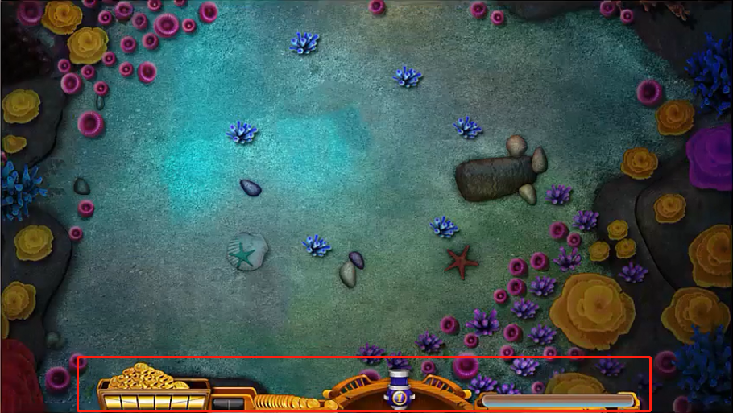

# 背景属性

## 背景颜色`background-color`

1. `background-color: 颜色值;`专门设置标签的背景色。

2. 取值和color属性一致。

## 背景图片`background-image: url();`

1. 图片地址放在url()中，图片可以是本地的图片，也可以是网络图片。

3. 默认在垂直和水平方向上平铺。

## 背景平铺`background-repeat: repeat | no-repeat | repeat-x | repeat-y`

1. 属性值：
    - `repeat`：在水平方向和垂直方向上平铺；
    - `no-repeat`：水平方向和垂直方向都不平铺；
    - `repeat-x`：只在水平方向上平铺；
    - `repeat-y`：只在垂直方向上平铺；
    
2. 背景平铺应用场景：
    - 客户端向服务器发送请求的时候，收到响应报文进行解析，如果有背景图片，会再次向服务器发送请求获取图片。如果图片很大，就会影响性能。此时如果可以设置一张较小的、特殊的图片，再结合背景平铺，视觉上就看不出来是一张图片重复得到的。
    - 很多地方的背景图片都是重复的，这时候只需要提供一张很小的图片，让它自动平铺，就可以在视觉上形成一张完整的背景图片。
    
## 背景图片定位`background-position: left top;`

1. 取值
    - 第一个值为水平方向的位置，可以为left、center、right，或设置为像素值。
    - 第二个值为垂直方向上的位置，可以设置为top、center、bottom，也可设置为像素值。默认为center。
    
## 背景图片尺寸 `background-size: xxpx xxpx;`

1. 可以设置背景图片显示的大小，第一个为宽度，第二个值为高度。

2.可以只设置一个值，另一个等比缩放。

- 注意：
    - 同一个标签可以同时设置背景颜色和背景图片，但是背景图片会覆盖背景颜色。
    
## 背景图片关联和缩写

1. 背景图片关联： `background-attachment: fixed | scroll;` 设置背景图片固定或者滚动。

2. 背景图片缩写： `baockground: [color] url(...) [repeat/no-repeat/repeat-x/repeat-y] [x-position y-postion] / [x-size y-size]`
    - 示例：`background: red url("../00-images/01-html5-css3精讲/背景图片应用.png") no-repeat left center/ 800px 400px`

3. 背景图片的关联在企业开发中使用很少。

## 背景图片和插入图片的区别

1. 背景图片不占页面空间，而插入图片会占页面空间。最明显的就是背景图片上面可以有字，而插入图片是把字排挤在周围的。

2. 背景图片有定位属性，可以很方便地控制背景图片的位置，而插入图片没有定位属性，控制图片的位置没那么方便。

3. 插入图片的语义比背景图片的语义要强。如果在企业开发中，想要图片被搜索引擎收录，那么推荐使用插入图片。

## 背景图片应用

1. 有的网站顶部中间展示一个图片，不论拉宽或者缩窄浏览器的宽度，中间部分总是优先展示。

2. 
   
3. 某张图片是由多张图片拼接而成的，那么优先考虑到div的嵌套。
   - 大的背景图片作为父盒子，在其中嵌入小的背景图片。
   - 小背景图片宽高设置和父盒子一样大，然后通过定位属性让小背景图片处于合适的位置。

4. 

# 精灵图

1. CSS精灵图是一种图像合成技术，可以减少请求的次数，降低服务器处理请求的压力。

2. 精灵图需要配合背景图片和背景图片定位属性使用。