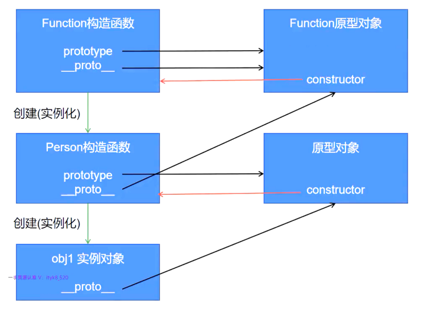

# Function函数

1. `JavaScript`中函数是引用类型(对象类型)，既然是对象，所以也是通过构造函数创建出来的，“所有函数”都是通过`Function`构造函数创建出来的实例化对象。

2. `Function`构造函数的`prototype`属性指向`Function`原型对象。

3. `JavaScript`中只要是“函数”就有`prototype`属性，也都有 `__proto__` 属性。

4. `Function`函数的`__proto__`指向它自己的原型对象，即`Function`函数的 `__proto__`等于`prototype`。

5. `Object`函数也是`Function`函数的实例化构造对象。

6. `Object`的原型对象也有`__proto__`属性，但是指向`NULL`。

7. 总结：
    - `Function`函数是所有函数(包括Object)的祖先函数。
    - 所有构造函数都有 `prototype` 属性，指向它自己的原型对象。
    - 所有原型属性都有 `constructor` 属性，指向该原型属性对应的构造函数。
    - 所有函数都是对象。
    - 所有对象(全部函数、`Object`的原型属性、所有对象的实例化对象)都有 `__proto__` 属性，`Object`的原型属性中的`__proto__`指向`NULL`，`Function`函数的`__proto__`指向自己的原型属性，即`Function.__proto__ === Function.prototype`。而其它全部函数、实例化对象的`__proto__`都指向该函数或对象的构造函数对应的原型对象。
    - 所有原型对象中的 `__proto__` 都指向`Object`的原型对象。
   
8. 全部关系图：

9. `prototype`、`constructor`、`__proto__`关系总结：
   - 所有构造函数都有 `prototype` ，它指向该构造函数的原型对象(原型属性)。
   - 所有的原型属性(原型对象)都有 `constructor` 属性，它指向对应构造函数。
   - 所有的构造函数、原型属性(原型对象)、实例化对象都有 `__proto__` 属性，指向分为以下4种情况：
      - `Function`函数的 `__proto__` 指向自己的原型对象(原型属性)，即 `Function.prototype === Function.__proto__`。
      - `Object`构造函数的原型对象中的 `__proto__` 指向 `NULL`。
      - 其它原型对象(原型属性，包括Function)中的 `__proto__` 指向`Object` 原型对象。
      - 其它构造函数、实例化对象中的 `__proto__` 指向创建该构造函数或对象的原型对象。

