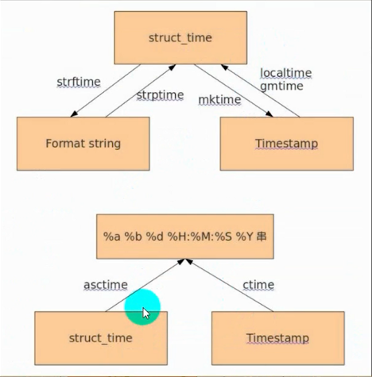

# `time`模块

1. `UTC`：世界标准时间，在中国是`UTC+8`

2. `DST`：夏令时，是一种节约能源而认为规定的时间制度，在夏季调快一个小时

3. 时间的表现形式
> 1. 时间戳：以整型或浮点型表示时间的一个以秒为单位的时间间隔，`19700101`为起始时间
>
> 2. 元组：有`9`个整型内容，`year`,`month`,`day`,`hours`,`minutes`,`seconds`,`weekday`,`Julia day`,`flag(-1,1,0判断是否为夏令时，0表示正常格式，1表示夏令时，-1自行判断)`
> 
> 3. 格式化字符串：`%Y`之类的一些格式化输出，自行百度即可

4. `time`模块使用
```python
1. 引入时间模块：import time

2. 返回当前时间的时间戳，浮点数形式，不需要参数
# c即为当前时间的时间戳
c = time.time()

3. 时间戳转为世界标准时
# 将当前时间戳c转为UTC时间，返回一个元组
t = time.gmtime(c)

4. 获取当前时间
# 将当前时间戳c转换为当前时区的时间，返回一个元组
b = time.localtime(c)

5. 将本地时间元组转成时间戳
# 时间戳的小数部分会省略
m = time.mktime(c)

6.将时间元组转成字符串
# 将时间元组转换为格式化后的时间输出
s = time.asctime(b)

7. 将时间戳转换为字符串
# 将时间戳c转换为格式化后的时间输出
p = time.ctime(c)

8.自定义格式化输出时间
# %Y等格式化符具体百度，b为指定的时间元组，省略则默认为当前时间
p = time.strftime("%Y-%m-%d %H:%M:%S", b)

9.将时间字符串转为时间元组
w = time.strptime(q, "%Y-%m-%d %X")
```

5. 时间戳、格式化时间、时间元组之间的转换


6. `time.sleep(n)`：延迟一个时间，整型或者浮点型

7. `time.clock()`：返回当前程序的`cpu`执行时间

