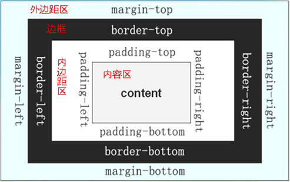

# 一、盒子模型

## 1. 概念

1. `css`盒子模型是一个形象的比喻，`HTML`中所有的标签都是一个盒子。
2. 一个盒子包括外边距、边框、内边距、内容区。

3. 内容的宽高：
    - `box-sizing: content-box;`表示`width`/`height`为内容区的宽高。
    - `box-sizing: border-box;`表示`width`/`height`包含了边框及以内的区域的宽高。
4. 盒子的宽高：
    - `外边距 + 边框 + 内边距 + 内容区` 是盒子的宽高。 
    - 盒子所占宽：`margin-left` + `border-left` + `padding-left` + `width` + `padding-right` + `border-right` + `margin-right`
    - 盒子所占高：`margin-top` + `border-top` + `padding-top` + `height` + `padding-bottom` + `border-bottom` + `margin-bottom`
5. 除了这两个基本宽高属性，还有以下`4`个范围限定性宽高属性，有时候也会用一用：
    - `min-width`：  设定最小宽度
    - `max-width`： 设定最大宽度
    - `min-height`： 设定最小高度
    - `max-height`：设定最大高度
6. 注意：
    - 一般情况下，一个盒子中放置内容或其他元素（元素也是盒子），实际是放在内容区的。
    - 平常我们看不到内边距，边框和外边距，是因为他们默认都是0（宽度，或厚度）。

## 2. 边框

1. 边框是盒子的属性。

2. `border-top/right/bottom/left-color/style/width;`
    - `border-top: 1px red solid;`
    - `border-width: 1px 2px 3px 4px;`赋值顺序为上右下左
    
## 3. 内边距

1. `padding-top/right/bottom/left`：可以设置`1-4`个值

2. 给标签设置内边距后，盒子大小会变化。

3. 给标签设置内边距后，内边距也会有背景颜色。

## 4. 外边距

1. `margin-top/right/bottom/left`：可以设置`1-4`个值

2. 外边距部分没有颜色

3. 外边距存在合并现象
    - 垂直方向上，上下盒子设置外边距后，两个盒子之间的距离不是两个外边距相叠加，而是外边距大的那个，因为外边距存在合并现象。
    - 父盒子包裹一个子盒子，而且父盒子没有边框，则子盒子的`margin`会融合到外面的父盒子上，表现为`content`左上角重叠，而`margin`为父子盒子中最大的那个。
    - 水平方向不会合并外边距。

# 二、盒子阴影

1. 作用：用于设定一个盒子的阴影效果。
2. 格式：`box-shadow`：水平偏移值  垂直偏移值  [模糊值]  [外延值]  [颜色]  [`inset`]；
3. 说明：

> - 至少设置两个长度值，分别表示阴影的水平偏移量和垂直偏移量，可以为负；
> - 模糊值是设定阴影的模糊效果的宽度，可以不设置，则默认为`0`；
> - 外延值是设定阴影再“扩大”的宽度，可以不设置，则默认为`0`；
> - 阴影颜色：可以指定为某个颜色，默认和盒子内部文字颜色一致。
> - `inset`表示设置“内阴影”，可以不设置，则默认为外阴影。

# 三、水平居中

1. `text-align: center;`是让盒子内部的文字和图片水平居中的。不会让子盒子水平居中。

2. `margin: 0 auto;`是让盒子自身在父盒子中水平居中的。

# 四、垂直居中

1. 文字在行高中默认是垂直居中的。

2. 在企业开发中，我们经常将盒子的高度和行高设置为一样，那么这样就可以保证一行文字在盒子的高度中是垂直居中的。

3. 如果一个盒子中有多行文字，那么我们就不能使用设置行高等于盒子高来实现让文字垂直居中，只能通过设置`padding`来让文字垂直居中。

# 五、清空默认边距

1. 如何清空默认边距：
   [清空默认边距](http://yui.yahooapis.com/3.18.1/build/cssreset/cssreset-min.css)
