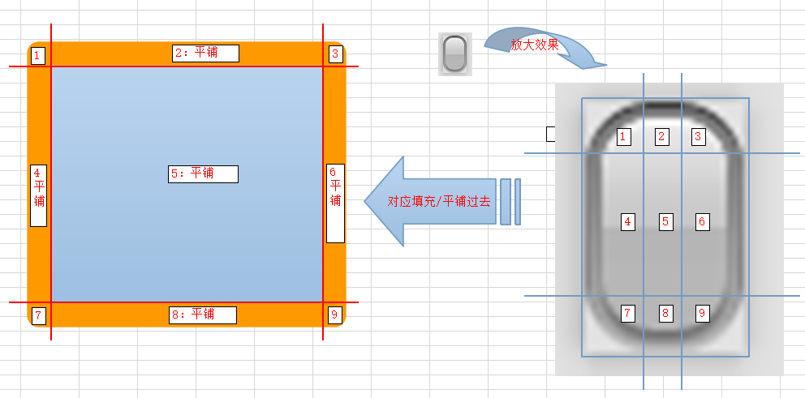

# 一、圆角边框border-radius

1. 作用：用于设定一个盒子的圆角特性。

2. 格式：`border-radius`: 水平圆角半径 [/ 垂直圆角半径]；(斜线之前的表示水平圆角，之后表示垂直圆角)。

3. 说明：
> - 垂直半径可以省略，则其同水平半径的值。
> - 半径设置可以提供`1~4`个值，具体如下。
> 	- 提供`1`个：`4`个角都为该值；
> 	- 提供`2`个：第`1`个表示上左和下右，第`2`个表示上右和下左；
> 	- 提供`3`个：第`1`个表示上左，第`2`个表示上右和下左；第`3`个表示下右；
> 	- 提供`4`个：分别代表`4`个角上的半径（依次上左，上右，下右，下左）。

4. 当边框圆角的值 > 边框宽度的时候，外边框和内边框都会变成圆角。当边框圆角的值 <= 边框宽度的时候，外边框是圆角，内边框是直角。

5. 可以通过 `border-xxx-xx-radius` 的方式单独设置某一个角的值。
    - `border-xxx-xx-radius`接收两个参数，第一个表示水平方向，第二个表示垂直方向。
    - 如果只传递了一个参数，那么垂直方向和水平方向的值一样。
    - 示例： `border-top-left-radius: 100px 10px;`

# 二、边框图像`boder-image`

1. 图像边框是指使用一张图片来作为一个盒子的边框。其实就是将图片作为背景图铺上到“边框区域”上去。但这个铺设到边框的图片，并非像常规背景图那样简单直接地铺设上去，而是有其特定的规则。

2. **原理**：将要作为背景的图片，按照上右下左的顺序分割四次，分割为`9`个部分（如下图所示），然后`4`个角`4`个边分别铺设对应部分，中间区域就铺设背景图片的中间部分(图中`5`，但是该块区域默认被舍弃)，并且`4`个边和中间区域默认都会像常规背景一样进行平铺，设置不平铺的属性，则会进行拉伸，从而达到整个盒子的完美背景呈现。

   
2. 边框属性：
   - `border-image-source: url();`指定边框图片位置。
      - 指定了边框图片，那么就不会显示边框颜色，边框图片的优先级高于边框颜色。
   - `border-image-slice: x y z w fill;`指定对边框图片的切割方式。注意不带单位，默认为px。
      - `fill` 表示中间图片也填充。
      - 其中`x y z w`可以取`1-4`个值，分别代表上右下左`4`个方向的“切割厚度”。
   - `border-image-width: npx`指定边框图片的显示宽度为`n`像素。
      - 这里视觉上显示为`n`个像素，但是边框实际宽度还是`border-width`属性所指定的宽度。
      - 通常设定为`auto`（自动），此时就会使用`border-image-slice`所设定的切割厚度。
   - `border-image-repeat: stretch | repeat | round;`边框图片是否显示方式。
      - `stretch`表示不重复但是拉伸。
      - `repeat`表示重复平铺，但不拉伸。
      - `round`表示重复平铺，并且适当拉伸。
      - `space`： 指定用平铺方式来填充边框背景图。图片会根据边框的尺寸动态调整图片的之间的间距直至正好可以铺满整个边框。
   - `border-iamge-outset: 10px 20px 30px 40px;`表示边框图片上边向上移动10px，右边向右移动20px，下边向下移动30px，左边向左移动40px。
