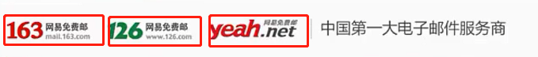

# 一、背景图片和插入图片的区别

1. 背景图片不占页面空间，而插入图片会占页面空间。最明显的就是背景图片上面可以有字，而插入图片是把字排挤在周围的。
2. 背景图片有定位属性，可以很方便地控制背景图片的位置，而插入图片没有定位属性，控制图片的位置没那么方便。
3. 插入图片的语义比背景图片的语义要强。如果在企业开发中，想要图片被搜索引擎收录，那么推荐使用插入图片。

# 二、背景属性

## 1. 背景颜色`background-color`

1. `background-color: 颜色值;`专门设置标签的背景色。

2. 取值和`color`属性一致。

## 2. 背景图片`background-image: url();`

1. 图片地址放在`url()`中，图片可以是本地的图片，也可以是网络图片。

3. 默认在垂直和水平方向上平铺。

## 3. 背景平铺`background-repeat: repeat | no-repeat | repeat-x | repeat-y`

1. 属性值：
    - `repeat`：在水平方向和垂直方向上平铺；
    - `no-repeat`：水平方向和垂直方向都不平铺；
    - `repeat-x`：只在水平方向上平铺；
    - `repeat-y`：只在垂直方向上平铺；
    
2. 背景平铺应用场景：
    - 客户端向服务器发送请求的时候，收到响应报文进行解析，如果有背景图片，会再次向服务器发送请求获取图片。如果图片很大，就会影响性能。此时如果可以设置一张较小的、特殊的图片，再结合背景平铺，视觉上就看不出来是一张图片重复得到的。
    - 很多地方的背景图片都是重复的，这时候只需要提供一张很小的图片，让它自动平铺，就可以在视觉上形成一张完整的背景图片。
    - 某些背景图片其实很小，但是平铺后视觉效果就像一张完整的大图片。可以降低网路资源消耗，提升网页访问速度。
    
## 4. 背景图片定位`background-position: left top;`

1. 取值
    - 如果不设置该属性，默认值为`0, 0`，即在盒子的左上角。
    - 第一个值为水平方向的位置，可以为`left`、`center`、`right`，或设置为像素值，或百分比。
    - 第二个值为垂直方向上的位置，可以设置为`top`、`center`、`bottom`，也可设置为像素值，或百分比。默认为`center`。
    - 可以设置`1`个值或`2`个值；设置`1`个值的时候，第二个默认为`center`（居中）。
    
## 5. 背景缩写

1. 背景图片缩写： `baockground: [color] url(...) [repeat/no-repeat/repeat-x/repeat-y] [x-position y-postion] / [x-size y-size]`
    - 示例：`background: red url("../00-images/01-html5-css3精讲/背景图片应用.png") no-repeat left center/ 800px 400px`

# 三、背景高级属性（新属性）

## 1. `background-size: 值1 [, 值2]`

1. 设置背景图片大小，可设置2个值，分别表示横向和纵向的大小。
2. 可以只设置一个值，另一个设置为`auto`等比缩放。
3. 取值
   - `width`/`height`：设置宽高。
   - 百分比。
   - `auto`： 背景图像的真实大小。
   - `contain`：拉伸或者缩小图片的宽或高等于父盒子的宽或高，不超过父盒子。
   - `cover`：拉伸或者缩小图片完全覆盖父盒子。
4. **注意**：同一个标签可以同时设置背景颜色和背景图片，但是背景图片会覆盖背景颜色。

# 2. `background-origin`

1. 设定图片的起始位置。
2. 取值：

   - `border-box`：从边框开始就显示图片。
   - `padding-box`：从内边距开始显示图片。
   - `content-box`：从内容区开始展示图片。
3. 此属性主要是跟`background-position`的位置计算有关。 
4. `background-origin`设置的是图片从哪里开始展示，而`background-clip`则是表示整个背景部分展示哪些区域的内容。

# 3. `background-clip`

1. 设定背景的展示部分。即背景图像向外裁剪的区域，裁剪范围以外就被裁剪了(不显示)。
2. 取值
   - `border-box`：从边框部分就展示背景。
   - `padding-box`：从内边距开始展示背景。
   - `content-box`：从内容区开始展示背景。
3. `background-origin`设置的是图片从哪里开始展示，而`background-clip`则是表示整个背景部分展示哪些区域的内容。

# 4. `background-attachment: fixed | local | scroll;`

1. 设置背景图像的滚动特性（固定或者滚动）。
2. 可用值有：
3. 取值
   - scroll：相对于当前盒子固定（盒子滚动，则背景图也会滚动），这是默认值。	
   - local：相对于当前盒子的内容固定（内容滚动，则背景图也会滚动）。
   - fixed：相对于当前浏览器窗体固定（类似固定定位，即它会始终在窗口的某个位置）
4. 背景图片的关联在企业开发中使用很少。

## 5. `background-repeat`

1. 背景重复性的值在`C3`中多两个可用的值：`round`、`space`
2. 取值：
   - `round`： 将图片经过尽可能小的变换，重复铺满整个盒子，并且每个图片都完整显示(一般拉伸或者压缩了，主要看哪种变化小就会产生哪种效果)。
   - `space`： 图片大小不变，均匀铺满整个盒子，空白处均匀留空。

# 四、多重背景

1. 多重背景之间用逗号隔开即可。
   - `background: url(...) repeat, url(...) no-repeat...;`
2. 先添加的图片会覆盖后添加的背景图片。
3. 建议在写多重背景时，拆分开写，不要写一个简写。

# 五、背景渐变

1. 渐变背景其实是设置`background-image`属性的值，设置的不是一个单一颜色，而是多个颜色，并按给定方式进行渐变。

## 1. 线性渐变(`linear-gradient`)

1. 线性渐变：`background: linear-gradient(to top right, red, blue);`
   - 线性渐变是让背景颜色按照某个方向（角度）的方式来进行过渡变化。
   - 至少要指定两个颜色，最多无上限。
   - 默认情况下自动计算纯色和渐变色的范围，但是也可以手动指定。
     - `background: linear-gradient(45deg, blue 100px, green 200px, red 300px);`
   - 只有第一个颜色的范围是纯色的范围，其余都是渐变色的范围。上面的例子中，`blue`为纯色占`100`个像素，然后是从`blue`渐变到`green`，占`(200-100)`个像素，最后从`green`渐变到`red`，占`(300-200)`个像素。
   - 渐变方位可以指定为像素，也可以指定为百分比。
   - 渐变方向从下往上为`0deg`，默认是`180deg`(即从上往下)，顺时针为正。
   - 角度还可以使用`to` + `left`、`right`、`top`、`bottom`这几个关键字，这几个方向关键词还可以自由组合，如`to top right`。
2. 背景的线性渐变本质就是一个图片，可以用 `background-image`代替 `background` 也不会报错。

## 2. 径向渐变(`radial-gradient`)

1. 径向渐变是让背景颜色从某个中心点以圆或椭圆向外扩散的方式来进行过渡变化。
2. 结构：`background-image：radial-gradient( [形状]  [大小]  [at 位置，] 颜色1，颜色2 [，颜色n...])`
3. 说明：
   - 形状可以是`circle`（圆）或`ellipse`（椭圆），默认是跟随盒子（可能是圆，也可能是椭圆）；
   - 大小是指渐变从圆心开始向外进行过渡变化的距离（半径），圆用一个值，椭圆用`2`个值（空格隔开）；
   - 大小还可以使用如下`4`个关键字：
     - `farthest-corner`：最远角，表示从圆心开始，渐变到最远的角的位置。下面也类似；
     - `farthest-side`：最远边；
     - `closest-corner`：最近角；
     - `closest-side`：最近边；
4. 位置可以是一个值（表示横坐标，纵坐标默认居中），或`2`个值（横纵坐标，空格隔开）；位置还可以使用`top`，`right`，`bottom`，`left`，`center`这`5`个关键字；
5. 颜色至少包含`2`个，每个颜色还可以设定“截止位置”；

# 六、背景图片应用

1. 有的网站顶部中间展示一个图片，不论拉宽或者缩窄浏览器的宽度，中间部分总是优先展示（顶部`banner`栏一般都是切一个很宽很大的图片，通过`background-position: center top;`定位，如英雄联盟顶部的`banner`宣传横幅；）。

2. 
   
3. 某张图片是由多张图片拼接而成的，那么优先考虑到`div`的嵌套。
   - 大的背景图片作为父盒子，在其中嵌入小的背景图片。
   - 小背景图片宽高设置和父盒子一样大，然后通过定位属性让小背景图片处于合适的位置。
- 如捕鱼游戏背景图片嵌套，可以用多个`div`嵌套，子`div`大小设置和父`div`一致。(第100课时)
  
4. 

# 六、精灵图

1. `CSS`精灵图是一种图像合成技术，可以减少请求的次数，降低服务器处理请求的压力。
2. 精灵图需要配合背景图片和背景图片定位属性使用。
3. 当网页上有若干的具有不同背景图的“小盒子”，按常规的做法就是，每个小盒子的背景图，都是一张独立的图片。
4. 如果将这些小图片“整合”到一张图上（成为一张相对大的图片），则这些小盒子的背景图，都可以只用这一张大图，只要做背景的时候，进行适当的定位就可以了。
5. 假设网页上不同位置需要使用到大图中的各个小图，此时这些小盒子的背景图都可以用上面一张大图。这样做的好处就是：该大图只要从服务器下载一次，则该网页的多个地方都可以使用了。这样的做法可以大大减少从服务器下载多个图片文件所需要的性能开销，也就是提升了服务器的效率。
6. 精灵图应用：第139课时给顶部用一个精灵图做背景显示，然后在精灵图的不同部分添加`a`标签，设定`a`标签的宽高。

