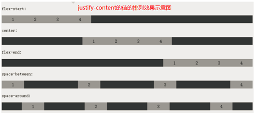
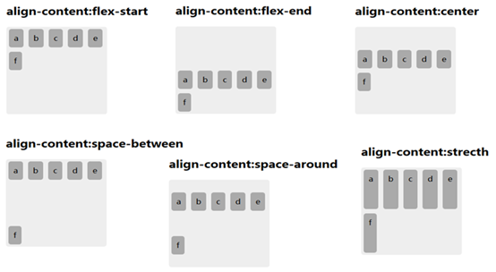

## 弹性布局

1. 概念
	- 弹性布局是指，可以设定一个容器盒子中的若干个（数量可变的）子盒子，在父盒子中的横向或纵向有序整齐排列。其典型应用就是页面中的导航布局的实现，如淘宝顶部的导航栏。
	- 弹性布局的实现，主要是在父盒子（容器盒子）上定义相应的属性，则其内部的子盒子就能够按照所定义的样式进行显示。

2. 主要属性
	- `display: flex`
		
		- 说明：设置父盒子的显示模式为弹性盒模型，即该盒子成为了弹性盒模式的容器盒子。
	- `flex-direction`
		- 说明：设置弹性盒子的子盒子的排列方式，写在父盒子中，有如下`4`个属性值：
		- `row`：横向排列，
		- `row-reverse`：横向排列，但顺序反向
		- `column`：纵向排列
		- `column-reverse`：纵向排列，但顺序反响
	- `flex-wrap`
		- 说明：设置弹性盒模式的子盒子超出时的换行特性，常用属性值有：
		- `nowrap`：不换行，尽量在一行显示，这是默认值。此时有可能会超出父盒子（当子盒子有最小宽度设置时）。
		- `wrap`：自动换行。
		- `wrap-reverse`：换行，但反向显示（即从倒数第一行到最上一行去了）
	- `justify-content`
		- 说明：设置子盒子的主轴方向的一行中的排布方式(其实每行都同样排列)。
		- 所谓主轴就是由`flex-direction`所决定的方向为主轴，对应另一个方向为辅轴。
		- 假如`flex-direction`为`row`或`row-reverse`，则横向为主轴，纵向为辅轴。
		- 假如`flex-direction`为`column`或`column-reverse`，则纵向为主轴，横向为辅轴。
		- 常用属性值有：
		> - `flex-start`：子盒子从所设定的起始位置开始排列出来，空隙留后面；
		> - `flex-end`：子盒子从所设定的终止位置开始排列出来，空隙留前面；
		> - `center`：子盒子完全从居中的位置开始排列出来，空隙留两边；
		> - `space-between`：子盒子两边紧靠父盒子，空隙留在相互的中间且均等；
		> - `space-around`：子盒子均衡布置，分布给每个盒子的空隙都一样。
		- **注意**：从下面可以看出，`justify-content`属性只是改变了从什么位置开始排列，但是各个子盒子之间的先后顺序没有改变，它由`flex-direction`已经指定了。
		- 该属性效果示例如下：
		
	
	- `align-content`
		- 说明：设置子盒子在辅轴方向的排布方式，大于一行且辅轴有多余空间时时才有效。常用的属性值有：
		- `flex-start`：子盒子从所设定的起始位置开始排列出来，空隙留后面；
		- `flex-end`：子盒子从所设定的终止位置开始排列出来，空隙留前面；
		- `center`：子盒子完全从居中的位置开始排列出来，空隙留两边；
		- `space-between`：子盒子两边仅靠父盒子，空隙留在相互的中间；
		- `space-around`：子盒子均衡布置，空隙均衡出现；
		- 效果如下所示：
		
		- **注意**：由上示意图可知，`flex-direction`指定了主轴方向，间接指定了辅轴方向，所以各子盒子之间的先后顺序仍然是不变的，`align-content`只是改变辅轴方向上，从哪里开始排列的问题。

	- `align-items`
		- 说明：设置子盒子在当前行中辅轴方向的对齐方式（一行中多个子盒子在辅轴方向的排布方式）。
		- `flex-start`：子盒子定位于所设定的起始位置，空隙留后面；
		- `flex-end`：子盒子定位于设定的终止位置，空隙留前面；
		- `center`：子盒子定位于居中的位置，空隙留两边；
		- `baseline`：子盒子定位于基准位置；
		- `stretch`：子盒子进行拉伸（充满纵轴）；
		