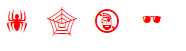

# 一、补充内容

## 1. 光标形状设置

1. 含义：设置鼠标在某个盒子上的时候的光标形状，如手型、箭头型等。

2. 形式： `cursor：光标形状名;`

3. 常用的光标形状名有：`default`（默认），`pointer`（手形）`，`text`（文本编辑形），`help`（帮助），`wait`（等待）。 
4. 更多形状参考开发手册

## 2. 盒子缩放

1. 含义：用于设置某个盒子在其本来的大小基础上进行一定的大小缩放。

2. 形式：`zoom: 缩放比例;`  // 缩放比例可以是数字或百分比。

3. 说明：
	- 它是对整个盒子进行整体缩放，无法做到横向纵向单独控制的缩放。
	- 对比：`transform:scale()`可以实现横向纵向单独控制的缩放。
	- `zoom`实现的缩放是“实质上”的改变，因而也会影响其它相关元素的外观表现。
	- 对比：`transfor:scale()`实现的缩放是视觉上的改变，不会影响其他元素的外观表现。

## 3. 自定义字体
1. 使用外部字体
	- 一般的网页中，通常使用浏览器内部具有的字体——浏览器也通常从操作系统获取可用字体。
	- 但是我们也可以给浏览器提供额外的字体（就类似提供图片一样），然后我们在网页中就可以引入并使用该字体！。
	- **注**：网上有很多字体，有些免费，有些收费。
	- 具体做法：
```css
<style>
	@font-face{
		font-family: "自己给某字体取的名字XXFont";
		src :  url(./某字体文件路径)；		/*跟引入图片一样道理*/
	}
	某某选择器{
		font-family: XXFont, 微软雅黑，宋体.....；
	}
</style>
```

## 4. 使用图标字体
1. 先看看`Webdings`字体：一种传统的图标字体：

2. 代码如下：
```css
.web1{
	font-family:webdings;
	font-size:30px;
	color:red;
}
<div class=”web1”>&#33;  &#34;  &#35;  &#36;</div>
```

3. 结果：


4. 图标字体，其实就是类似前面`Webdings`字体一样！

5. 某个图标有一个“形状”，然后使用的时候，就可以当做一个“字符”来用。

6. 具体的做法类似这样：`<span  class=”iconfont  XX图标的class名” ></span>`

7. 具体详细的使用制作过程如下：

   - 方法`a`(图标类方式)：
     - 到图标网站`iconfont.cn`上找到自己需要的图标，加入“购物车”。
     - 第二步：到购物车中，并点击“下载代码”：
     - 第三步：下载解压后，找到其中的文件：`iconfont.css`，放入项目文件夹相关的位置（其他文件其实也建议放入）。并引入该文件：`<link rel="stylesheet" href="fonts/iconfont.css">`
     - 第四步：在网页中使用一个空的行内元素（比如`span`，`i`，`em`等），加上如下`class`：`<span  class=”iconfont 对应图标的class名”><span>`。其中，对应图标的`class`可以从下载的压缩包中的文件`demo_fontclass.html`中查看到。

   - 方法`b`(`unicode`方式)：
     - 还是使用刚才下载的图标字体文件，解压。
     - 还是引入刚才的`iconfont.css`文件： `<link rel="stylesheet" href="fonts/iconfont.css">`
     - 网页中使用一个行内标签（比如`span`），其中内容为对应图标的`unicode`编码，并`class`为`iconfont`
     - 如下所示：`<span  class="iconfont" >&#xe601;</span>`
     - 具体图标的`unicode`编码从下载的文件`demo_unicode.html`中可以找到。


