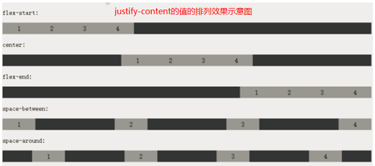
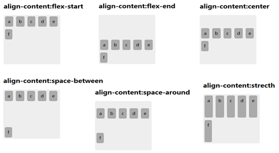
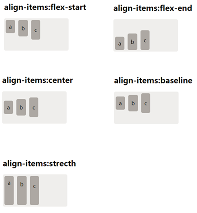

# 布局思想

## 表格布局思想

1. 已舍弃，略。

## div+浮动布局思想

1. 纵向：使用`div`，自然上下排列出来。

2. 横向：使用浮动`div`，并做好清除浮动工作（使浮动元素不影响后续元素）。

3. 层层分割：每个区块只考虑是“横向”还是“纵向”。

4. 经典应用：

> - 经典的两栏或者三栏布局中，经常要求某些部分固定不动，其余部分随浏览器大小而改变。如左侧为`200px`，右侧随浏览器大小而变。思路就是：
> - 左边设置`width:200px;`，右侧`margin-left:200px;`即可，三栏布局增加右侧即可。
> - 左边设置`width:200px;`，然后左浮，中间块也左浮，宽度为`100%`，右边设置右浮，宽度`width:200px;`。

## 定位布局

1. 【与background-position属性对比】：定位就是通过有关定位的属性来明确设定一个盒子的在以下两个方面的位置：

> 在`(x, y)`平面上所处位置。
> 在高度（`z`轴）方向的位置（层次）

2. 这是相对于一个盒子的“自然位置”和“浮动位置”而言的。
> 自然位置就是所谓的正常的文档流所确定的位置。
> 浮动位置就是由于浮动的特性而确定的位置。

### a. 定位方式属性`position`

1. `position`用于设定一个元素的位置按什么方式来确定。通俗说就是设定元素“放在哪个位置”（可由`4`个定位属性确定：`top`，`left`，`right`，`bottom`）。

2. 有如下`4`个值可用：
> - static：   静态定位（其实就是没有定位），是一个元素的默认定位方式，也就是一个文档中元素的**正常文档流**所确定的定位。对其给定定位位置（`top`，`left`，`right`，`bottom`）的值无效。
> - `relative`：相对定位相对于其本来应该所处的位置而设定一个相对性定位。需给定位置（`top`，`left`，`right`，`bottom`）。
> - `absolute`：绝对定位，相对于其上层最近的一个非`static`定位元素而设定的一个绝对性定位。需给定位置（`top`，`left`，`right`，`bottom`）。
> - **而如果其所有上级都没有非static定位元素，就相对于窗口来定位**——手册上说的相对于`body`，是不准确的！
> - `fixed`：固定定位，相对于当前网页窗口而设定的一个绝对性定位。

**注意：**
1. `relative`定位虽然会改变元素的位置，但不影响上级盒子和相邻盒子该有的正常宽高和位置(可理解为不产生浮动)。
2. `absolute`定位和`fixed`定位的元素脱离了文档流，也就是上级盒子中不会计算其宽高（像没有一样，可理解为产生了浮动）

### b. 定位位置属性：`top`，`left`，`right`，`bottom`

1. 就是对于`3`种定位方式（`relative`，`absolute`，`fixed`），所给定的具体位置值。

2. 可以是使用距离“上”，“左”，“下”，“右”各多少来定

3. **注意**：`top`和`bottom`不能同时用；`left`和`right`不能同时用！

### c. 层叠属性`z-index`

1. 就是将一个元素（盒子）默认情况下所展示在的那个平面（就是屏幕所在面）的垂直线当做z轴方向（就是眼睛盯屏幕时的那个“视线”方向），朝眼睛方向为z轴的正方向。则`z-index`可以设定一个元素（盒子）在`z`轴方向的“叠放层次”的高低，用整数表示。越大值表示越高，也就是离眼睛越近，自然就会覆盖住比它低的其他盒子。

## 多栏布局

1. 概念
	- 所谓多栏布局，就是一个盒子设置栏宽属性或栏数量属性，就构成多栏布局，则其中的内容，会先在第一栏展示，第一栏展示满后，再展示到第二栏，以此类推。
	- 多栏布局最常见的就是杂志或报纸上常见的“分栏版面”。
	- 多栏布局通常用于盒子内部主要以文字（行内元素）为主的情形。
	- 给一个盒子设定栏宽属性或栏数量属性（二选一），就可以实现多栏布局效果。

2. 主要特性：
	- 栏宽度属性`column-width`：设定分栏布局中一个栏的宽度值；实际宽度会根据外层盒子的宽度有所调整（可能变大，可能变小，看哪种变化最小就采取哪种，类似背景图属性中的`around`）。
	- 栏数量属性`column-count`：设定分栏布局中的总栏数。
	- `columns`属性：上述`column-width`和`column-count`的综合属性；
		- 结构：`columns: 栏宽值  栏目数;`
		- 实际表现上，当总宽度大于等于“栏宽x栏目数”时，栏目数固定，栏宽可能会有所调整（变大）。
		- 当总宽度小于“栏宽x栏目数”时，栏目数会减少（保证栏宽不小于设定的栏宽）。
	- 栏间隙属性`column-gap`：设定栏与栏之间的宽度值，默认是`font-size`大小（比如`14px`）
	- 栏分割线属性`column-rule`：栏分割线属性，就是两栏之间的线，如果不设定默认就是“空的”，就没有分割线，只有间隙（`gap`）。
	- 栏分割线属性类似边框线（但只是一条线），可以设定：线宽，线型，线色。
	- 有如下几个属性：
		- `column-rule-width`：设定线宽，比如`1px`，`5px`；
		- `column-rule-style`：设定线型，比如`solid`，`dashed`，`dotted`；
		- `column-rule-color`：设定线色，比如`red`，`#ff9966`，`rgb(200,100,0)`
		- `column-rule`：上述`3`个属性的综合属性。

## 弹性布局

1. 概念
	- 弹性布局是指，可以设定一个容器盒子中的若干个（数量可变的）子盒子，在父盒子中的横向或纵向有序整齐排列。其典型应用就是页面中的导航布局的实现，如淘宝顶部的导航栏。
	- 弹性布局的实现，主要是在父盒子（容器盒子）上定义相应的属性，则其内部的子盒子就能够按照所定义的样式进行显示。

2. 主要属性
	- `display: flex`
		
		- 说明：设置父盒子的显示模式为弹性盒模型，即该盒子成为了弹性盒模式的容器盒子。
	- `flex-direction`
		- 说明：设置弹性盒子的子盒子的排列方式，写在父盒子中，有如下`4`个属性值：
		- `row`：横向排列，
		- `row-reverse`：横向排列，但顺序反向
		- `column`：纵向排列
		- `column-reverse`：纵向排列，但顺序反响
	- `flex-wrap`
		- 说明：设置弹性盒模式的子盒子超出时的换行特性，常用属性值有：
		- `nowrap`：不换行，尽量在一行显示，这是默认值。此时有可能会超出父盒子（当子盒子有最小宽度设置时）。
		- `wrap`：自动换行。
		- `wrap-reverse`：换行，但反向显示（即从倒数第一行到最上一行去了）
	- `justify-content`
		- 说明：设置子盒子的主轴方向的一行中的排布方式(其实每行都同样排列)。
		- 所谓主轴就是由`flex-direction`所决定的方向为主轴，对应另一个方向为辅轴。
		- 假如`flex-direction`为`row`或`row-reverse`，则横向为主轴，纵向为辅轴。
		- 假如`flex-direction`为`column`或`column-reverse`，则纵向为主轴，横向为辅轴。
		- 常用属性值有：
		> - `flex-start`：子盒子从所设定的起始位置开始排列出来，空隙留后面；
		> - `flex-end`：子盒子从所设定的终止位置开始排列出来，空隙留前面；
		> - `center`：子盒子完全从居中的位置开始排列出来，空隙留两边；
		> - `space-between`：子盒子两边紧靠父盒子，空隙留在相互的中间且均等；
		> - `space-around`：子盒子均衡布置，分布给每个盒子的空隙都一样。
		- **注意**：从下面可以看出，`justify-content`属性只是改变了从什么位置开始排列，但是各个子盒子之间的先后顺序没有改变，它由`flex-direction`已经指定了。
		- 该属性效果示例如下：
		
	
	- `align-content`
		- 说明：设置子盒子在辅轴方向的排布方式，大于一行且辅轴有多余空间时时才有效。常用的属性值有：
		- `flex-start`：子盒子从所设定的起始位置开始排列出来，空隙留后面；
		- `flex-end`：子盒子从所设定的终止位置开始排列出来，空隙留前面；
		- `center`：子盒子完全从居中的位置开始排列出来，空隙留两边；
		- `space-between`：子盒子两边仅靠父盒子，空隙留在相互的中间；
		- `space-around`：子盒子均衡布置，空隙均衡出现；
		- 效果如下所示：
		
		- **注意**：由上示意图可知，`flex-direction`指定了主轴方向，间接指定了辅轴方向，所以各子盒子之间的先后顺序仍然是不变的，`align-content`只是改变辅轴方向上，从哪里开始排列的问题。

	- `align-items`
		- 说明：设置子盒子在当前行中辅轴方向的对齐方式（一行中多个子盒子在辅轴方向的排布方式）。
		- `flex-start`：子盒子定位于所设定的起始位置，空隙留后面；
		- `flex-end`：子盒子定位于设定的终止位置，空隙留前面；
		- `center`：子盒子定位于居中的位置，空隙留两边；
		- `baseline`：子盒子定位于基准位置；
		- `stretch`：子盒子进行拉伸（充满纵轴）；
		

