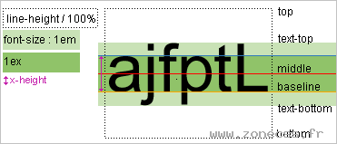

# vetical-align

1. 六根线条:
    - `top`表示盒子的顶部；
    - `bottom`表示盒子的底部；
    - `text-top`表示盒子内文字的顶部；
    - `text-bottom`表示盒子内文字的底部；
    - `baseline`表示盒子内最小文字的底部；
    - `middle`表示中线。

2. 默认情况下，图片和一行文字的基线对齐，基线就是一行文字最短那个字(可以以x为参照)的底部。
    - `vertical-align: baseline | middle | top | bottom | text-top | text-bottom;`