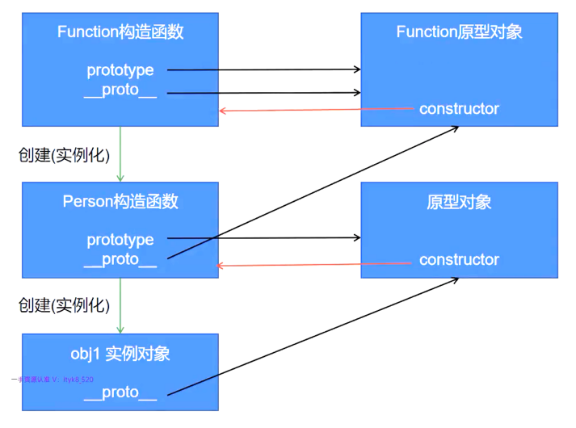
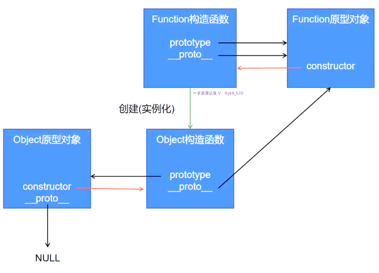
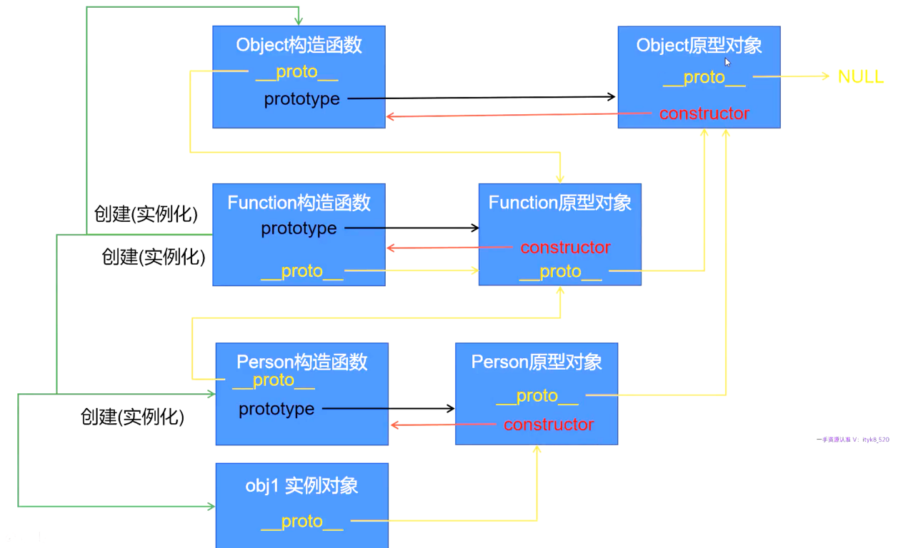

# 一、创建对象三种方式

1. 方式一：利用`Object`对象创建
```javascript
let obj = new Object();
obj.name = 'kobe';
obj.age = 22;
obj.say = function () {
    console.log('hello world');
}
console.log(obj.name);
console.log(obj.age);
obj.say();
```

2. 方式二：用对象字面量创建对象
```javascript
let obj = {};
obj.name = 'Kobe';
obj.age = 20;
obj.say = function () {
    console.log('hello world');
}
// console.log(obj['name']);
console.log(obj.name);
console.log(obj.age);
obj.say();
```

3. 方式三：利用字面量直接创建对象
```javascript
let obj = {
    name: 'Mike',
    age: 28,
    say: function () {
        console.log('hello world');
    }
}
console.log(obj.name);
console.log(obj['name']);
console.log(obj.age);
console.log(obj['age']);
obj.say();
```

# 二、函数与方法中的`this`

## 1. 函数中的`this`

```javascript
function demo() {
    console.log(this);
}
// window.demo();
demo();
```

## 2. 方法中的`this`

```javascript
let obj = {
    name: 'nicola',
    say: function () {
        console.log(this);
    }
}
obj.say();
```


## 3. 总结：

- 无论谁调用了当前的函数或方法，那么当前的`this`就是谁。上面例子中:
	- 第一个`this`表示调用该函数的对象，这里省略了默认的全局`window`对象，所以该`this`指的就是`window`。
	- 第二个`this`指的就是`obj`对象。

# 三、工厂函数

1. 什么是工厂函数？
    - 工厂函数就是专门用于创建对象的函数，
    
2. 工厂函数示例
```javascript
function createPerson (name, age) {
   // 1. 先创建一个空对象
   let obj = {};
   
   // 2. 给新对象赋值
   obj.name = name;
   obj.age = age;
   obj.say = function () {
       console.log(obj.name, obj.age);
   }

   // 3. 返回当前对象
   return obj;
}

let person1 = createPerson('mike', 20);
let person2 = createPerson('kobe', 22);

console.log(person1);
console.log(person2);

person1.say();
person2.say();
```

# 四、构造函数

1. 构造函数特点：
    - 构造函数的函数名称首字母通常大写。
    - 构造函数只能通过`new`来调用。
    
2. 构造函数本质上是工厂函数的简写
```javascript
function Person(name, age) {
    this.name = name;
    this.age = age;
    this.say = function () {
        console.log(this.name, this.age);
    }
}
let person1 = new Person('Mike', 22);
let person2 = new Person('Kobe', 20);

console.log(person1);
console.log(person2);

person1.say();
person2.say();
```

3. 构造函数运行过程：
    - 通过`new`调用构造函数的时候，系统自动创建一个对象，相当于在构造函数前面添加了 `let obj = new Object();`
    - 将刚才创建的对象赋值给this: `let this = obj;` 。
    - 在构造函数最后面自动添加 `return this`，返回当前的对象。
    

# 五、构造函数优化

1. 构造函数存在性能问题，因为每个对象中的方法都是单独开辟一个存储空间，都是独立的。

2. 构造函数优化方式一：
    - 该方法也存在缺陷：
        - 阅读性差。
        - 污染了全局命名空间，即全局函数命名后，其它地方不能有和该函数重名的变量或方法。
```javascript
// 1. 声明一个函数，将该函数赋值给对象中的方法，这样不同的对象中的方法都是指向这个函数，节省了存储空间，提升了性能
function mySay() {
    console.log(this.name, this.age);
}

function Person(name, age) {
    this.name = name;
    this.age = age;
    // 2. 将全局函数赋值给构造函数中的方法，这样可以提升性能
    this.say = mySay;
}

let person1 = new Person('Mike', 22);
let person2 = new Person('Kobe', 20);

person1.say();
person2.say();
```

3. 构造函数优化方式二：
    - 因为优化方式一存在全局命名污染的问题，所以这里将方法放入一个新对象中，然后将该对象通过新对象调用该方法的方式赋值给构造函数的方法。
```javascript
let fns = {
    say: function () {
        console.log(this.name, this.age);
    }
}

function Person(name, age) {
    this.name = name;
    this.age = age;
    this.say = fns.say;
}

let person1 = new Person('Mike', 23);
let person2 = new Person('Kobe', 33);

person1.say();
person2.say();
```

4. 构造方法优化三(最常用)：

```javascript
function Person(name, age, sex) {
    this.name = name;
    this.age = age;
    this.sex = sex;
}

Person.prototype = {
    say: function () {
        console.log(this.name, this.age, this.sex);
    }
}

let person1 = new Person('Mike', 20, 'm');
let person2 = new Person('Kobe', 22, 'w');

person1.say();
person2.say();
```

5. `prototype`是构造函数默认的属性，该属性就是用于保存公有的属性、方法。

6. 企业开发中常使用 `prototype` 的方式，既可以解决性能(不重复开辟内存空间)问题，也可以解决全局命名污染的问题。

7. `prototype`的特点
    - `prototype`中除了可以存储方法以外，还可以存储属性。
    - `prototype`中如果出现了和构造函数中同名的属性或者方法，对象在访问这些同名的方法或属性时，访问到的是构造函数中的数据。
    
8. `prototype`应用场景：
    - `prototype`中一般情况下，用于存储所有对象都相同的一些属性和方法。
    - 如果是不同对象特有的属性或者方法，我们会存储到构造函数中。
    
9. `prototype`三角关系解析：
    - 每个构造函数中都有一个默认的属性，叫做 `prototype`，该属性保存一个对象，称之为“原型对象”。
    - 每个“原型对象”中都有一个默认的属性，叫做 `constructor`， `constructor`指向当前原型对象对应着的那个“构造函数”。
    - 通过构造函数创建出来的对象，我们称之为“实例对象”，每个“实例对象”中都有一个都有一个默认的属性值，叫做 `__proto__`， `__proto__` 指向创建它的那个构造函数的“原型对象”。

# 六、`Function`函数

1. `JavaScript`中函数是引用类型(对象类型)，既然是对象，所以也是通过构造函数创建出来的，“所有函数”都是通过`Function`构造函数创建出来的实例化对象。

2. `Function`构造函数的`prototype`属性指向`Function`原型对象。

3. `JavaScript`中只要是“函数”就有`prototype`属性，也都有 `__proto__` 属性。

4. `Function`函数的`__proto__`指向它自己的原型对象，即`Function`函数的 `__proto__`等于`prototype`。



5. `Object`函数也是`Function`函数的实例化构造对象。



6. `Object`的原型对象也有`__proto__`属性，但是指向`NULL`。

7. 总结：
    - `Function`函数是所有函数(包括`Object`)的祖先函数。
    - 所有构造函数都有 `prototype` 属性，指向它自己的原型对象。
    - 所有原型属性都有 `constructor` 属性，指向该原型属性对应的构造函数。
    - 所有函数都是对象。
    - 所有对象(全部函数、`Object`的原型属性、所有对象的实例化对象)都有 `__proto__` 属性，`Object`的原型属性中的`__proto__`指向`NULL`，`Function`函数的`__proto__`指向自己的原型属性，即`Function.__proto__ === Function.prototype`。而其它全部函数、实例化对象的`__proto__`都指向该函数或对象的构造函数对应的原型对象。
    - 所有原型对象中的 `__proto__` 都指向`Object`的原型对象。
   
8. 全部关系图：



9. `prototype`、`constructor`、`__proto__`关系总结：
   - 所有构造函数都有 `prototype` ，它指向该构造函数的原型对象(原型属性)。
   - 所有的原型属性(原型对象)都有 `constructor` 属性，它指向对应构造函数。
   - 所有的构造函数、原型属性(原型对象)、实例化对象都有 `__proto__` 属性，指向分为以下4种情况：
      - `Function`函数的 `__proto__` 指向自己的原型对象(原型属性)，即 `Function.prototype === Function.__proto__`。
      - `Object`构造函数的原型对象中的 `__proto__` 指向 `NULL`。
      - 其它原型对象(原型属性，包括`Function`)中的 `__proto__` 指向`Object` 原型对象。
      - 其它构造函数、实例化对象中的 `__proto__` 指向创建该构造函数或对象的原型对象。

# 七、原型链

1. 在通过 `prototype` 优化对象的时候，通过 `Person.prototype` 会覆盖掉默认的 `Person` 原型对象，此时需要手动添加 `constructor` ，来指定 `prototype` 所指向的对象。
```javascript
function Person(name, age) {
    this.name = name;
    this.age = age;
}
Person.prototype = {
    // 手动指定原型对象中的constructor指向其对应的构造函数
    construtctor: Person,
    say: sunction () {
        console.log(this.name, this.age);
    }
}
let person = new Person('Mike', 22);
```

2. 对象中方法的查找流程：
    - 先看自己的构造方法中是否存在，能找到就用。
    - 如果自己的构造方法中不存在，那么就去自己的原型对象中查找，找到即调用。 
    - 如果自己的原型对象中没有找到，则去父级的原型对象中查找，找到就用。
    - 如果父级的原型对象中没有，就再往上一级查找，找到就调用。
    - 如果一直到Object原型对象都没有找到，则报错。
    
3. 原型属性注意点：
    - 如果原型属性中存在和构造方法中同名的属性或者方法，那么对象优先调用构造函数中的数据。 `obj.varName` 会输出构造函数中的 `varName` 属性。如果要访问原型对象中的属性，可以通过 `obj.__proto__.varName`。
    - 如果给一个对象中的构造函数中不存在的属性、但却在原型对象中存在的属性赋值的时候，并不会去原型中查找，而是直接给构造函数新增一个属性。则构造函数中的属性和原型对象中的属性同时存在。
```javascript
function Person(name, age) {
    this.name = name;
    this.age = age;
}
Person.prototype = {
    constructor: Person,
    currentValue: 'oldValue',
}
let person = new Person('Mike', 22);
// 1. 给对象不存在的属性赋值，不会查找原型对象中书否存在该属性，而是给对象直接新增一个属性并赋值。
person.currentValue = 'newValue';
// 2. 对象访问属性的时候，优先访问构造方法中的属性，然后再使用原型对象中的属性。
console.log(person.currentValue);
// 3. 当构造函数和原型属性中的属性或者方法同名时，可以通过下面的方式访问原型属性中的属性或方法。
console.log(person.__proto__.currentValue);
```

# 八、封装性

1. 默认情况下，对象的属性和方法都是公开的，只要拿到对象就可以操作对象的属性和方法。

2. 由于构造函数也是一个函数，所以也会开启一个新的作用域。当在构造函数中通过`var`/`let`定义的变量也是局部变量，定义的函数也是局部函数。
```javascript
function Person(name) {
    // 1. 默认属性和方法都是公开的
    this.name = name;
    // 2. 通过let/var声明的变量则是局部变量，外界无法访问
    let age = 18;
    this.setAge = function (age) {
        if (age >= 0 && age < 180) {
            this.age = age;
        }
    }
    this.getAge = function () {
        return this.age;
    }
}

let person = new Person('Mike');
// 3. 通过暴露出来的公有方法操作私有属性
person.setAge(40);
console.log(person.getAge());
```

3. 这里的私有属性本质是一个局部变量，外部无法访问到。通过共有的方法对该私有属性进行设置与取值。如果不通过暴露出来的公有方法对私有属性进行操作，而直接对私有属性进行赋值，其实是给对象中新增一个不存在的公有属性(全局属性)，赋值和取值操作都是针对这个新的属性，不是针对原来的局部变量(私有属性)。
```javascript
function Person(name) {
    // 1. 默认属性和方法都是公开的
    this.name = name;
    // 2. 通过let/var声明的变量则是局部变量，外界无法访问
    let age = 18;
    this.setAge = function (age) {
        if (age >= 0 && age < 180) {
            this.age = age;
        }
    }
    this.getAge = function () {
        return this.age;
    }
}

let person = new Person('Mike');
// 3. 不通过暴露出来的公有方法操作私有属性，本质上是新增全局属性
// 所有的赋值和取值操作都是针对这个新增的全局属性，和原本想要操作的局部属性无关。
person.age = 20;
console.log(person.age);
```

# 九、实例属性/实例方法

1. 在企业开发中，通过实例化的对象访问的属性称之为实例属性，通过实例化的对象访问方法称之为实例方法。

## 1. 静态属性/静态方法

1. 在企业开发中，不仅可以给对象动态地增加属性或方法，也可以给构造函数动态地添加属性和方法。

2. 通过构造函数访问的属性，称之为静态属性。通过构造函数访问的方法，称之为静态方法。
```javascript
function Person (name, age) {
    this.name = name;
    this.age = age;
    this.say = function () {
        console.log(this.name, this.age);
    }
}

// 1. 通过实例化的对象person访问的对象或者方法都是实例属性/方法。
let person = new Person('Mike', 22);
person.say();
// 2. 可以通过实例化的对象动态添加属性或方法。
person.sex = 'm';
person.output = function () {
    console.log(this.sex);
}
person.output();

// 3. 通过构造函数调用的属性/方法称之为静态属性/方法
Person.weight = 50;
Person.loseWeight = function () {
    console.log(Person.weight, '----');
}
console.log(Person.weight);
Person.loseWeight();
```

# 十、继承性

1. 继承方式一通过将子类的原型对象指向父类的实例化对象实现。
```javascript
function Person (name, age) {
    this.name = name;
    this.age = age;
    this.say = function () {
        console.log(this.name, this.age);
    }
}

function Student (school, score) {
    this.school = school;
    this.score = score;
    this.study = function () {
        console.log(this.school, this.score);
    }
}
// 1. 将学生类的原型指向Person类对象，这样Person类中有的学生类都可以继承。
// 2. 本质上不是继承，而是将学生类的原型指向Person类后，按照函数的查找规则，先在学生类实例对象中查找，找不到就依照原型链依次往上查找。
Student.prototype = new Person();
Student.prototype.constructor = Student;

let stu = new Student('xtu', 99);
stu.study();

stu.say();
```
2. 总结：
    - 把子类的原型对象改为父类的实例化对象。
    - 弊端：无法向继承的父类属性、方法初始化赋值。

# 十一、默认`this`指向

1. 函数(方法)或者对象中的`this`默认指向该方法的全局对象(window)，或普通对象(调用该方法的当前对象)。

2. `bind`、`call`、`apply`可以将函数或对象的`this`从默认指向改为手动指向特定的对象。

## 1. `bind`
1. 将原函数中的 `this` 指向新对象，然后返回这个新函数，对原函数不影响。 
2. 如果原函数可以传参，那么 `bind` 绑定新函数后也可以传参。
```javascript
let obj = {
    name: 'zhangsan',
}
function test(a, b) {
    console.log(a, b);
    console.log(this);
}
test(10, 20);  // 默认this为调用test()的全局对象window
// 将this的默认指向改为obj对象，返回接收后的新函数
let fn = test.bind(obj, 30, 40);
fn();  //  修改后的函数this指向obj
test(11, 22);  // 原函数仍然指向window
```

## 2. `call`

1. 和 `call` 功能类似，修改默认的 `this` 指向新对象，然后立即调用新函数，对原函数不影响。
2. 和 `call` 类似，也可以传参。
```javascript
let obj = {
    name: 'lisi',
}
function test(a, b) {
    console.log(a, b);
    console.log(this);
}
test(10, 20);
// 和 call 功能类似，只是不返回新函数，而是直接调用该新函数
test.call(obj, 30, 40);
test(11, 22);
```

## 3. `apply`
1. 和 `call` 类似，也是把默认的 `this` 指向新的对象，并调用新函数。也不影响原函数。
2. 传递参数时，必须要用数组形式。
```javascript
let obj = {
    name: 'wangwu',
}
function test(a, b) {
    console.log(a, b);
    console.log(this);
}
test(10, 20);
test.apply(obj, [30, 40]);
test();
```

# 十二、继承方式二

```javascript
function Person (myName, myAge) {
    this.name = myName;
    this.age = myAge;
    console.log(this.name, this.age);
}
function Student (myName, myAge, myScore) {
    /**
     * Person.call(this, myName, myAge); 是重点
     * 将Person构造方法中的this指向为Student中的this，并调用Perosn方法
     * 效果等于给Student对象增加了name、age属性。
     */
    Person.call(this, myName, myAge);
    this.score = myScore;
    console.log(myScore);
}
let stu = new Student('zhangsan', 18, 99);
```

1. 总结：
    - 在子类中通过`bind`、`call`、`apply`调用父类的构造方法。
    - 弊端：无法调用父类的原型对象中的属性和方法。

# 十三、继承方式三

1. 继承方式二只能够保证子类使用父类构造方法中的属性和方法，如果给父类的原型属性添加属性和方法，子类无法调用。

2. 如果要让子类调用父类原型属性中的方法和属性，那么必须让子类的原型属性指向父类的原型属性。

3. 让子类的原型属性指向父类的原型属性后，子类确实可以调用父类的原型属性中的属性和方法，但是也存在污染问题。因为给子类的原型属性中添加属性或者方法，父类都可以访问到，而原本父类的原型属性中是不存在这些新增的属性或方法的。

```javascript
function Person (myName, myAge) {
    this.name = myName;
    this.age = myAge;
}
function Student (myName, myAge, myScore) {
    Person.call(this, myName, myAge);
    this.score = myScore;
    this.out = function () {
        console.log(this.score);
    }
}
// 1. 继承方式二不能让子类继承父类中的原型属性
Person.prototype.say = function () {
    console.log(this.name, this.age);
}
// stu.say();  //  没有继承到父类中的原型属性，所以不具备say方法，
// 2. 修改子类的原型为父类的原型
Student.prototype = Person.prototype;
Student.prototype.constructor = Student;
// 3. 子类集成了父类的原型，可以调用say方法
let stu = new Student('zhangsan', 18, 99);
stu.out();
stu.say();
// 4. 弊端：给子类的原型属性添加属性或方法，父类中也能调用，污染了父类
Student.prototype.printit = function () {
    console.log('污染父类');
}
let person = new Person('lisi', 20);
person.printit();
```

4. 总结：
    - 在子类中通过`bind`、`call`、`apply`调用父类的构造函数。
    - 把子类的原型对象指向父类的原型对象，可以使子类调用父类原型对象中的方法和属性。
    - 弊端：存在污染父类原型对象的情况，子类原型对象新增的属性和方法，父类也能调用。

# 十四、继承方式四（掌握）

1. 为了避免父类的原型属性或者方法被子类污染，可以让子类的原型属性指向父类的实例对象。这样根据方法的查找原则，如果子类调用了一个方法，在自身的构造函数中没有找到，就会去本构造函数对应的原型属性中查找，即父类的对象中查找，如果在父类的对象中没有找到，就回去原型属性的上一级原型属性(即父类构造函数对应的原型属性)中查找，如果父类中存在该原型属性，那么就调用。

2. 这样，父类的原型属性添加方法，子类可以根据函数原型链查找原则调用到。如果子类的原型属性添加新的属性或者方法，本质只添加到父类的实例化对象中，并没有污染到父类的原型属性。

```javascript
function Person (myName, myAge) {
    this.name = myName;
    this.age = myAge;
}
function Student (myName, myAge, myScore) {
    Person.call(this, myName, myAge);
    this.score = myScore;
    this.out = function () {
        console.log(this.score);
    }
}
Person.prototype.say = function () {
    console.log(this.name, this.age);
}
/**
 * @type {Person}
 * 1. 将子类的原型指向父类的实例化对象
 * 这样不会污染父类的原型对象，而父类中添加任何原型属性或者原型方法，子类都可以调用到
 */
Student.prototype = new Person();
Student.prototype.constructor = Student;
let stu = new Student('zs', 18, 99);
stu.out();
stu.say();
```

3. 总结：
    - 在子类的构造函数中通过`bind`、`call`、`apply`调用父类的构造函数。
    - 把子类的原型对象改为父类的实例化对象。
    