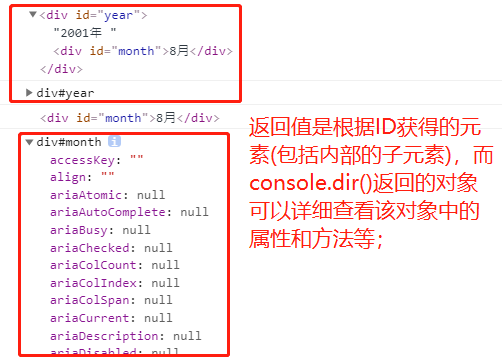
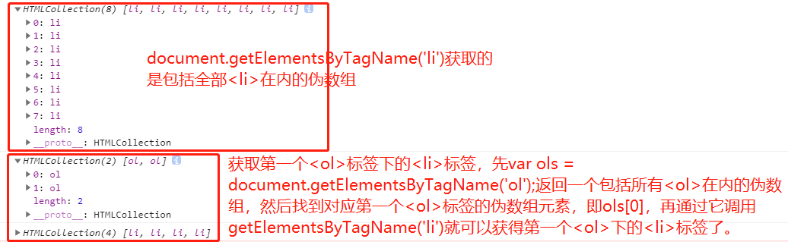
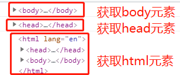
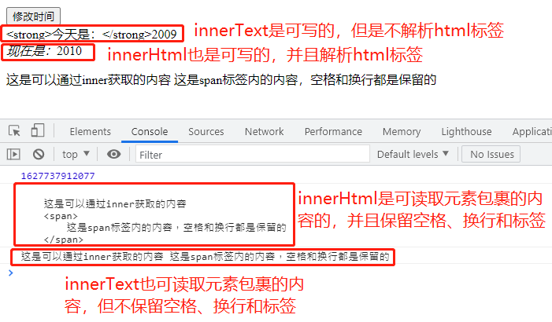
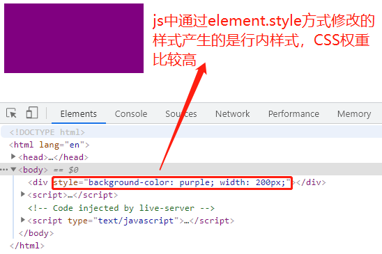

# 一、`API`

## 1. `JavaScript`基础阶段和`Web APIs`阶段：

- `JS`基础阶段
	- 学习的是`ECMAScript`标准规定的基本语法。
	- 要掌握基本语法。
	- 只学习基本语法，做不了常用的网页交互效果。
	- 目的是为了`JS`后面的课程打基础、做铺垫。

- `Web APIs`阶段
  - `Web APIs`是`W3C`组织的标准。
  - `Web APIs`主要学习`DOM`和`BOM`。
  - `Web APIs`是`JS`所独有的部分。
  - 主要学习页面交互功能。
  - 需要使用`JS`基础的课程内容做基础。

## 2. `API`

- `API(Application Programming Interface，应用程序编程接口)`，是一些预先定义的函数，目的是提供应用程序与开发人员基于某软件或硬件得以访问一组例程的能力，而又无需访问源码，或理解内部工作机制的细节。

- 简单理解：`API`是给程序员提供的一种工具，以便能更轻松地实现想要完成的功能。

## 3. `Web API`

- `Web API`是浏览器提供的一套操作**浏览器功能**和**页面元素**的`API`（`DOM`、`BOM`）。
- `Web API`就是就是浏览器提供的一些功能接口函数，程序员借助这些函数能实现交互效果，比如`alert()`。

- **`MDN详细API`：https://developer.mozilla.org/zh-CN/docs/Web/API**

## 4. 总结

- **API是为我们程序员提供的一个接口，帮助我们实现某种功能，我们会使用就可以了，不必纠结内部如何实现。**
- **Web API主要是针对浏览器提供的接口，主要针对于浏览器做交互效果。**
- **Web API一般都有输入和输出（函数的传参和返回值），Web API很多都是方法（函数）。**
- **学习API：知道某个API是干什么的、是否需要参数、返回值是什么、撸代码验证。**

# 二、`DOM`

## 1. `DOM`

- 文档对象模型，`Document Object Model`，简称`DOM`，是`W3C`组织推荐的处理可扩展标记语言的标准编程接口。
- `W3C`已经定义了一系列的`DOM`接口，通过这些`DOM`接口可以改变网页的内容、结构和样式。
- 节点：网页中的所有内容都是节点(标签、属性、文本、注释等)，`DOM`中用`node`表示。

## 2. 获取元素

1. `DOM`在实际开发中主要用来操作元素，而操作元素首先就要获取元素，获取页面中的元素常用以下几种方式：

2. 根据`ID`获取：

	- 使用**`getElementById()`**方法可以获取带有指定`ID`的元素对象，未找到则返回`null`。
	- 要通过`document`调用，即**`var el = document.getElementById('time');`**这样的方式，参数为大小写敏感的字符串。

```html
<div id="year">2001年
	<div id="month">8月</div>
</div>
<script>
	var year = document.getElementById('year');
	console.log(year);
	console.dir(year);
	var month = document.getElementById('month');
	console.log(month);
	console.dir(month);
</script>
```




3. 根据标签名获取：

	- 使用`getElementsByTagName()`方法可以返回带有指定标签名的**对象的集合**，通过`document`调用，**var els = document.getElementsByTagName();**。
	- 返回值是获取过来的元素对象的集合，以伪数组的形式存储，未找到元素则返回一个空的伪数组。
	- 因为得到的是一个对象的集合，所以我们想要操作里面的元素就需要遍历；
	- 可以通过指定父元素来获取该父元素下面的所有指定标签名的子元素，但是父元素必须是单个对象(必须指明是哪一个元素对象)，获取的时候不包括父元素自己（通过`getElementsByTagName()`方法获取某标签下面的子标签的时候，先通过`document.getElementsByTagName()`获取该标签，然后返回一个包括所有该类标签的伪数组，在伪数组中找到对应该标签的数组元素，然后通过它再调用`getElementsByTagName()`方法获取子标签）。

```html
<div>
	<ol>
		<li>今天天气真好11！</li>
		<li>今天天气真好22！</li>
		<li>今天天气真好33！</li>
		<li>今天天气真好44！</li>
	</ol>
	<ol>
		<li>每天都是一个好日子11</li>
		<li>每天都是一个好日子22</li>
		<li>每天都是一个好日子33</li>
		<li>每天都是一个好日子44</li>
	</ol>
</div>
<script>
	// 1. 通过document.getElementsByTagName()方法来获取元素，返回的是一个元素对象的伪数组；
	// 1.1 下面获取的是document中全部的<li>元素;
	var lis = document.getElementsByTagName('li');
	console.log(lis);
	// 2. 可以通过父元素来获取该元素下的子元素，返回的也是一个元素对象的伪数组；
	var olLis = document.getElementsByTagName('ol')  // 返回由全部ol元素组成的伪数组
	console.log(olLis);
	// console.log(ol.getElementsByTagName('li'));  // 报错，必须由返回的对象中的具体某一个对象来调用，如下
	console.log(olLis[0].getElementsByTagName('li'));  // 这样才是正确的，但是不常用，一般用document.getElementById()方法
</script>
```




4. 通过HTML5新增的方法获取：

```html
<div class="box">盒子</div>
<div class="box">盒子</div>
<div id="nav">
	<ul>
		<li>产品</li>
		<li>首页</li>
	</ul>
</div>
<script>
	// HTML5中新增的方法获取元素
	// 1. getElementsByClassName()根据类名获取某些元素的集合；
	var boxs = document.getElementsByClassName('box');
	console.log(boxs);
	// 2. querySelector('选择器');根据指定选择器返回第一个元素对象；
	var firstBox = document.querySelector('.box');
	console.log(firstBox);
	// 2.1 选择器需要加符号，类加.、id加#、元素不加
	var nav = document.querySelector('#nav');
	console.log(nav);
	// 3. querySelectorAll('选择器');根据指定选择器返回所有元素对象组成的伪数组；
	var boxes = document.querySelectorAll('.box');
	console.log(boxes);
</script>
```

5. 特殊元素获取：

```html
<div>test</div>
<script>
	// 1. 获取body元素
	var bodyEl = document.body;
	console.log(bodyEl);
	// 2. 获取head元素
	var headEl = document.head;
	console.log(headEl);
	// 3. 获取html元素
	var htmlEl = document.documentElement;
	console.log(htmlEl);
</script>
```




# 三、事件


## 1. 概述

1. `JavaScript`使我们有能力创建动态页面，而事件是可以被`JavaScript`侦测到的行为。
2. 简单理解：事件就是“触发——响应”机制。
3. 网页中的每个元素都可以产生某些触发`JavaScript`的事件，例如，我们可以在用户点击某个按钮的时候产生一个事件，然后去执行某些操作。

## 2. **事件三要素：事件都是由三部分组成的，事件源、事件类型、事件处理程序**

1. 假设点击一个按钮：
	- 事件源：事件被触发的对象，那么事件源就是按钮。首先要获取事件源。
	- 事件类型：事件如何触发，比如鼠标点击触发（`onclick`）、鼠标经过触发、键盘按下触发等。
	- 事件处理程序：通过一个函数赋值的方式完成。

```html
<button id="btn">按钮</button>
<script>
	// 1. 事件三要素：事件源、事件类型、事件处理程序；
	// 2. 获取事件源(即被触发的元素)；
	var btn = document.getElementById('btn');
	// 3. 设置事件类型，注册事件，也就是绑定事件到事件源上(即如何被触发的，点击、悬浮、按键)；
	// 4. 添加事件处理程序(即采取函数赋值形式，定义一个函数处理触发后想要完成的事件)；
	btn.onclick = function () {
		alert('弹出一个对话框')
	}
</script>
```

2. 常见的鼠标事件

|    鼠标事件     |     触发条件     |
| :-------------: | :--------------: |
|   `onclick()`   | 鼠标点击左键触发 |
| `onmouseover()` |   鼠标经过触发   |
| `onmouseout()`  |   鼠标离开触发   |
|   `onfocus()`   | 获得鼠标焦点触发 |
|   `onblur()`    | 失去鼠标焦点触发 |
| `onmousemove()` |   鼠标移动触发   |
|  `onmouseup()`  |   鼠标弹起触发   |
| `onmousedown()` |   鼠标按下触发   |

## 3. 操作元素

1. `JavaScript`的`DOM`操作可以改变网页的内容、结构和样式，我们可以利用`DOM`操作元素来改变元素里面的内容、属性等。以下都是属性。

2. 修改元素里面的内容：

```html
<button>修改时间</button>
<div>某个时间
	<div>test</div>
</div>
<p>
	这是可以通过inner获取的内容
	<span>
		这是span标签内的内容，空格和换行都是保留的
	</span>
</p>
<script>
	var btn = document.getElementsByTagName('button');
	var div = document.getElementsByTagName('div');
	btn[0].onclick = function () {
		var date = new Date();
		console.log(Date.now());
		// 找到第一个div，然后调用innerText()把里面全部的内容换成Date.now()返回的时间
		// innerText从起始位置到终止位置的内容全部替换成后面的内容，包括空格和换行符，但不换标签
		// innerText不识别html标签，非W3C标准
		div[0].innerText = '<strong>今天是：</strong>2009';
		// innerHTML从起始位置到终止位置的全部内容替换为后面指定的内容，包括空格和换行，也包括标签
		// innerHTML识别html标签。W3C标准
		div[0].innerHTML = '<i>现在是：</i>2010'
		// innerText和innerHTML都是可以读写的，只是innerText不保留空格和换行，而innerHTML保留
		var p = document.getElementsByTagName('p');
		console.log(p[0].innerHTML);
		console.log(p[0].innerText);
	}
</script>
```



3. **修改元素里面的属性：`src`、`href`、`id`、`alt`、`title`等属性都是先获取属性所在的元素，然后通过获取到的元素来调用修改属性值**。

```html
<button id="ldh">刘德华</button>
<button id="zxy">张学友</button> <br />

<script>
	// 修改元素的属性
	// 1. 获取元素
	var ldh = document.getElementById('ldh');
	var zxy = document.getElementById('zxy');
	// 1.1 获取要修改属性的元素
	var imgTag = document.querySelector('img');
	// 2. 绑定事件，实现处理程序
	ldh.onclick = function () {
		// 3. 通过要修改的元素来调用其属性
		imgTag.src = 'images/ldh.jpg';
		imgTag.alt = '刘德华'
	}
	zxy.onclick = function () {
		imgTag.src = 'images/zxy.jpg';
		imgTag.alt = '张学友';
	}
</script>
```

4. 表单元素的属性操作：利用`DOM`可以操作表单的属性如`type`、`value`、`checked`、`selected`、`disabled`等。

```html
// 仿京东密码输入框(密文/明文切换)
<head>
	<meta charset="UTF-8">
	<meta http-equiv="X-UA-Compatible" content="IE=edge">
	<meta name="viewport" content="width=device-width, initial-scale=1.0">
	<title>Document</title>
	<style>
		.box {
			position: relative;
			width: 200px;
			margin: 50px auto;
			border-bottom: 1px solid blue;
		}
		.box input {
			width: 170px;
			height: 20px;
			/* 设置输入框的默认边框，如果要去掉，设置border为0，outline为none */
			border: 0;
			outline: none;
		}
		.box img {
			position: absolute;
			top: 2px;
			right: 5px;
			width: 20px;
		}
	</style>
</head>
<body>
	<div class="box">
		<label for="pass"></label>
		<input type="password" name="pass" value="" placeholder="">
		
	</div>
	<script>
		var eye = document.querySelector('img');
		var input = document.querySelector('input');
		var flag = 0;
		eye.onclick = function () {
			if (flag == 0) {
				eye.src = './images/open.png';
				input.type = 'text';
				flag = 1;
			} else if (flag == 1) {
				eye.src = './images/close.png';
				input.type = 'password';
				flag = 0;
			}
		}
	</script>
</body>
```

5. 样式属性操作：我们可以通过`JS`修改元素的大小、颜色、位置等样式。
	- `Element.style`(行内样式操作)，`element.calssName`(类名样式操作)。

```html
<head>
	<meta charset="UTF-8">
	<meta http-equiv="X-UA-Compatible" content="IE=edge">
	<meta name="viewport" content="width=device-width, initial-scale=1.0">
	<title>Document</title>
	<style>
		div {
			width: 100px;
			height: 100px;
			background-color: blue;
		}
	</style>
</head>
<body>
	<div></div>
	<script>
		var div = document.querySelector('div');
		div.onclick = function () {
			// 处理程序中，用事件源或者this都可以
			// 事件源就是指定了具体事件，而this就是指向当前调用处理程序的对象
			// JS里面的样式采用驼峰命名法则，如backgroundColor
			// JS里面修改Style样式，产生的是行内样式，CSS权重比较高
			div.style.backgroundColor = 'purple';
			this.style.width = '200px';
			// 设置元素的class必须用className，而id可以直接用id
			div.className = 'tagOn';
			div.id = 'idName';
		}
	</script>
</body>
```




```html
<head>
	<meta charset="UTF-8">
	<meta http-equiv="X-UA-Compatible" content="IE=edge">
	<meta name="viewport" content="width=device-width, initial-scale=1.0">
	<title>Document</title>
	<style>
		div {
			width: 100px;
			height: 100px;
			background-color: brown;
		}
		.change {
			width: 150px;
			height: 150px;
			margin: 150px;
			background-color: #999;
		}
	</style>
</head>
<body>
	<div></div>
	<script>
		// 通过className的方式修改样式，先把目标样式定义好，放在一个类名中，如上面的change类所定义的样式
		// 然后把目标元素的className改为定义好的类名
		var div = document.querySelector('div');
		div.onclick = function () {
			// this.className = 'change';
			div.className = 'change';
		}
	</script>
</body>
```


6. 总结：`element.style.属性名`的方式修改样式，一般只在样式比较少或者功能比较简单的情况下使用。我们可以通过`className`更改元素的样式，适合于样式较多或者功能复杂的情况。`className`会直接更改元素的类名，会覆盖原先的类名。`className`也是可读可写的，如果想要保留原来的类名，就可以用`元素名.className + ' ' + '想要添加的新类名'`，就是把原来的类名和新类名拼接起来。


# 四、操作元素总结


## 1. 操作元素是`DOM`的核心

| 含义             | 属性                                  |
| ---------------- | ------------------------------------- |
| 操作元素内容     | `innerText`、`innerHtml`              |
| 操作常见元素属性 | `src`、`href`、`title`、`alt`、`id`等 |
| 操作表单元素属性 | `type`、`value`、`disabled`等         |
| 操作元素样式属性 | `element.style`、`element.className`  |

1. 获取属性值：有两种方法，一是通过**element.属性**来获得内置属性值(元素本身自带的属性)，二是通过**element.getAttribute('属性');**主要获得自定义的属性。属性时刻以自定义的。
2. 设置属性值：也是两种方式，一是通过 **element.属性 = 属性值;** 的方式设置。二是通过 **element.setAttribute('属性', '属性值');**前一种方式设置元素自带属性，后一种方式可以设置所有属性。其中class较为特殊，可以用className设置，也可以通过setAttribute的方式设置。
3. 移除属性：可以通过 **element.removeAttribute('属性名');** 的方式移除属性。

```html
<body>
	<div id="demo" customize_attr="customize_attr_value"></div>
	<script>
		var div = document.querySelector('div');
		// 获取属性值的两种方法
		// 1. 通过element.attrName获取；
		console.log(div.id);
		// 2. 通过element.getAttribute('属性名');的方式获取
		console.log(div.getAttribute('customize_attr'));
		// 设置属性值
		// 1. 通过 element.attributeName=属性值 设置；
		// 2. 类可以通过className设置
		div.id = 'newDemo';
		div.className = 'className';
		// 3. 自定义属性要通过element.setAttribute('属性名', '属性值');来设置
		// 4. 类也可以通过element.setAttribute('class', '类名值');的方式设置
		div.setAttribute('customize_attr', 'new_customize_attr_value');
		div.setAttribute('class', 'set_class_name');
		// 移出属性
		// 5. 通过 element.removeAttribute('属性名'); 的方式
		div.removeAttribute('id');
	</script>
</body>
```

# 五、自定义属性

1. 自定义属性的目的：是为了保存并使用数据。有些数据可以保存到页面中而不用保存到数据库中。此时直接用自定义的属性保存数据。

2. 但是有些自定义属性很容易引起歧义，不容易判断是元素的内置属性还是自定义属性，所以，`H5`给我们新增了自定义属性，规定自定义属性以`data-`开头，如`<div data-index='1'>`。

3. `dataset`只能获取以`data-`开头的自定义属性，到`IE11`才开始支。

```html
<body>
<div data-index="1" data-list-name="andy"></div>
<script>
	let div = document.querySelector('div');
	// set/get方法可以对自定义属性使用，全名使用
	div.setAttribute('data-time', '10');
	console.log(div.getAttribute('data-time'));
	// H5新增的获取自定义元素的方法，dataset是自定义属性集合的意思
	console.log(div.dataset.index);
	console.log(div.dataset['index']);
	// 对于多个-命名的自定义属性，需要使用驼峰命名法
	console.log(div.dataset.listName);
	console.log(div.dataset['listName']);
</script>
```


# 六、节点操作

1. 一般节点至少拥有`nodeType`(节点类型)、`nodeName`(节点名称)、`nodeValue`(节点值)这三个基本属性。其中，元素节点`nodeType`为`1`，属性节点`nodeType`为`2`，文本节点`nodeType`为`3`(包括文字、换行、空格等)。在实际开发中，节点操作主要操作的是元素节点。

2. 获取元素通常有两种方法，一是利用`DOM`提供的方法获取元素（如`document.getElemntsByTagTame()`），二是利用节点层级关系获取元素（利用父子兄弟节点关系获取元素）。

3. 利用`DOM`提供的方法获取元素，逻辑性不强，比较繁琐，而利用节点层级关系获取元素，逻辑性强，但是兼容性稍差。这两种方式都可以获取元素节点，我们后面都会使用，但是节点操作更简单。

4. 获取父元素：

```html
<body>
	<div class="box">
		<div class="inner">this is a test</div>
	</div>
	<script>
		// 通过DOM提供的方法获取元素，获取任何元素都是单独进行的
		let box = document.querySelector('.box');
		let inner = document.querySelector('.inner');
		// 通过父子兄弟节点获取元素
		// 获取父元素节点，最近的一层父节点，找不到就返回null
		console.log(inner.parentNode);
		console.log(inner.parentElement);
	</script>
</body>
```

5. 获取子元素：通过**`childNodes`**获取的子元素会返回一个数组，包括子元素节点和子文本节点，如果只需要元素节点，还需要进一步处理，所以一般不使用。而通过`children`则可以获取全部子元素节点，不包括子文本节点，但它是一个所有浏览器都支持的非标准方法，是只读属性。**实际开发中常用`children`**。

```html
<body>
	<div>我是DIV</div>
	<span>我是span</span>
	<ul>
		<li id="demo">我是li demo</li>
		<li>我是li</li>
		<li>我是li</li>
		<li>我是li</li>
		<li>我是li</li>
	</ul>
	<ol>
		<li>我是li</li>
		<li>我是li</li>
		<li>我是li</li>
		<li>我是li</li>
		<li>我是li</li>
	</ol>
	<script>
		// 通过DOM提供的方法获取ul下的li
		let ul = document.querySelector('ul');
		let lis = ul.querySelector('li');
		// 通过子节点获取元素，但是会获取所有的节点，返回一个子元素数组
		let lis2 = ul.childNodes
		console.log(lis2);
		// 子元素节点中包括空格、元素等(实际上就是获取空格+换行+元素)
		console.log(lis2[0].nodeType);
		// 通过children来获取子元素节点，其余如文本节点等不获取
		let lis3 = ul.children;
		console.log(lis3);
	</script>
</body>
```

```html
<body>
	<ol>
		<li>我是li1</li>
		<li>我是li2</li>
		<li>我是li3</li>
		<li>我是li4</li>
	</ol>
	<script>
		let ol = document.querySelector('ol');
		// firstChild获取的是第一个子节点，可能是文本节点，也可能是元素节点
		console.log(ol.firstChild);
		console.log(ol.lastChild);
		// firstElementChild获取的是第一个元素子节点，自动跳过文本文本节点，找不到返回null
		// 存在兼容性问题，IE9以上才支持
		console.log(ol.firstElementChild);
		console.log(ol.lastElementChild);
		// 实际开发中的写法，既没有兼容性问题，又能直接获取子元素节点
		console.log(ol.children[0]);
		console.log(ol.children[ol.children.length-1]);
	</script>
</body>
```


6. 获取兄弟节点操作：

```html
<body>
	<div>我是div</div>
	<span>我是span</span>
	<script>
		let div = document.querySelector('div');
		let span = document.querySelector('span');
		// 获取兄弟节点，包括文本节点和元素节点
		console.log(div.nextSibling);
		console.log(span.previousSibling);
		// 获取兄弟元素节点，存在兼容性问题，IE9以上才支持
		console.log(div.nextElementSibling);
		console.log(span.previousElementSibling);
		// 自己封装函数来获取兄弟元素，且满足兼容性
		function getNextSibling (element) {
			let el = element;
			// 1. 返回值是null就结束循环了；
			// 2. el = el.nextSibling是一种滚动思想，不能用el = element.nextSibling，无法滚动
			while (el = el.nextSibling) {
				if (el.nodeType == 1) {
					return el;
				}
				return null;
			}
		}
	</script>
</body>
```


7. 创建与添加节点：`document.createElement('tagName')`方法创建由`tagName`指定的`html`元素，因为这些元素原来不存在，是根据我们的需求动态生成的，所以我们也成为动态创建节点。创建好的节点还需要插入`html`文档中，可以通过`node.appendChild(child);`方法插入。

```html
<body>
	<ul>
		<li>123</li>
	</ul>
	<script>
		// 1. 创建节点
		let li = document.createElement('li');
		// 2. 插入节点
		// 2.1 parent.appendChild()在父元素内部的最后面插入节点
		let ul = document.querySelector('ul');
		ul.appendChild(li);
		// 2.2 parent.insertBefore('child'，指定元素);将一个节点添加到父节点中指定子节点的前面
		let li1 = document.createElement('li');
		ul.insertBefore(li1, ul.children[0]);
		// 3. 插入内容
		li.innerHTML = 'this is a test!'
	</script>
</body>
```

8. 删除节点

```html
<body>
	<button>删除</button>
	<ul>
		<li>123</li>
		<li>456</li>
		<li>789</li>
	</ul>
	<script>
		let ul = document.querySelector('ul');
		let li = document.querySelector('li');
		let btn = document.querySelector('button');
		btn.onclick = function () {
			ul.removeChild(ul.children[0]);
		}
	</script>
</body>
```


9. 复制节点

```html
<body>
	<ul>
		<li>123</li>
		<li>456</li>
		<li>789</li>
	</ul>
	<script>
		let ul = document.querySelector('ul');
		let lis = document.querySelector('li');
		// 1. node.cloneNode()方法表示复制node元素，如果括号为空或false，则是浅拷贝，即只克隆复制节点本身，不克隆里面的子节点
		let lic = ul.children[0].cloneNode();
		ul.appendChild(lic);
		// 2. 如果括号里面的参数为true或非空，则是深拷贝，就复制元素节点本身且复制全部子节点
		let licc = ul.children[0].cloneNode(true);
		ul.appendChild(licc)
	</script>
</body>
```


10. 三种动态创建元素的区别

- `document.write()`：直接将内容写入页面的内容流，但是文档流执行完毕，则它会导致页面全部重绘(相当于重新渲染了一个页面，原来的内容都没了，就剩下`document.write()`输出的部分)。

- `document.innerHtml`：如果创建多个内容来填充元素，采取数组形式拼接的话，效率相对`createElement()`更高，但是不要拼接字符串，因为拼接的时候，因为字符串的不可变性，会不断地开辟内存创建变量，从而导致效率偏低。

- `document.createElement()`：创建多个元素效率稍低一些，但是结构更清晰。

# 七、`DOM`重点核心

1. 文档对象模型（`Document Object Model`，简称`DOM`），是`W3C`组织推荐的处理可扩展标记语言（`HTML`或`XML`）的标准接口。

2. `W3C`已经定义了一系列的`DOM`接口，通过这些`DOM`接口可以改变网页的内容、结构和样式。

3. 对于`JavaScript`，为了能够使`JavaScript`操作`HTML`，`JavaScript`就有了一套自己的`DOM`编程接口。

4. 对于`HTML`，`DOM`使得`HTML`形成了一棵`DOM`树，包含文档、元素、节点。

5. 关于`DOM`操作，主要是对于元素的操作，主要有创建、增、删、改、查、属性操作、事件操作。

| 操作类型 | 方法                                                         |
| -------- | ------------------------------------------------------------ |
| 创建     | `document.write()`、`document.innerHtml`、`document.createElement()` |
| 增       | `appendChild()`、`insertBefore()`                            |
| 删       | `removeChild()`                                              |
| 改       | 主要修改`DOM`的元素属性，`DOM`元素的内容、属性，表单的值等<br />1. 修改元素的属性：`src`、`href`、`title`等；<br />2. 修改普通元素内容：`innerHtml`、`innerText`等；<br />3. 修改表单元素：`value`、`type`、`disabled`等<br />4. 修改元素样式：`style`、`className`等 |
| 查       | 主要获取查询DOM的元素<br />1. `DOM`提供的`API`方法：`getElementById()`、`getElementsByTagName()`、`getElementsByClassName()`等，古老用法不推荐；<br />2. `H5`提供的新方法：`querySelector()`、`querySelectorAll()`，推荐<br />3. 利用节点操作获取元素：父（`parentNode`）、子（`children`）、兄（`previousElementSibling`）、弟（`nextElementSibling`），推荐使用； |
| 属性操作 | 主要针对自定义属性：<br />1. `setAttribute()`：设置`DOM`的属性值；<br />2. `getAttribute()`：获取`DOM`的属性值；<br />3. `removeAttribute()`：移除属性值； |

