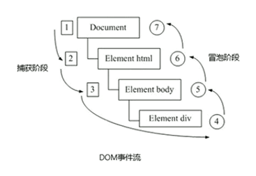

# 一、注册事件

1. 给元素添加事件，称为注册事件或者绑定事件。

2. 注册事件有两种方法：

   - 一是之前学的传统方式（`on`开头的各种事件）：特点是注册事件的唯一性，即同一个元素同一个事件只能设置一个处理函数，最后注册的处理函数会覆盖掉前面注册的处理函数。

   - 二是方法监听注册方式：`W3C`标准，推荐方式，**`addEventListener()`**，是一个方法。**IE9**以前不支持**（IE9 支持）**，可使用**`attachEvent()`**代替。同一个元素同一个事件可以注册多个监听器。

3. **`addEventListener`**事件监听方式：**`eventTarget.addEventListener(type, listenerp[, useCapture])`**方法将指定的监听器注册到`eventTarget`（目标对象）上，当该对象触发指定的事件时，就会执行事件处理函数。

	- `type`：事件类型字符串，比如`click`、`mouseover`，注意这里不要带`on`。
	- `listener`：事件处理函数，事件发生时，会调用该监听函数。
	- `useCapture`：可选参数，是一个布尔值，默认是`false`。学完`DOM`事件流后才能进一步学习。

4. **`eventTarget.attachEvent(eventNameWithOn, callback)`**方法将指定的监听器注册到`eventTarget`（目标对象）上，当该对象触发指定的事件时，指定的回调函数就会被执行。**（不推荐使用）**

	- `eventNameWithOn`：事件类型字符串，比如`onclick`、`onmouseover`，要注意须带`on`。
	- `callback`：事件处理函数，当目标触发事件时回调函数被调用。

```html
<body>
	<button>传统注册事件</button>
	<button>方法监听注册事件</button>
	<button>IE9之前的attachEvent</button>
	<script>
		let btns = document.querySelectorAll('button');
		// 1. 传统注册事件的方式，最后是弹出对话框显示“world”，因为前面的全部被覆盖了，只有最后一个会被执行
		btns[0].onclick = function () {
			alert('hello');
			console.log('hello');
		};
		btns[0].onclick = function () {
			alert('world');
			console.log('world');
		}
		// 2. 方法监听注册事件，事件名要加引号，且不带on，所有的事件都会依次执行，function函数常被称为监听器
		btns[1].addEventListener('click', function () {
			alert('first');
			console.log('first');
		});
		btns[1].addEventListener('click', function () {
			alert('second');
			console.log('second');
		});
		// 3. 兼容IE9，事件名要加on，要加引号。且只在ie9及以下浏览器中起作用，其它浏览器或者IE9以上不支持。
		btns[2].attachEvent('onclick', function () {
			alert('attachment1');
		});
		btns[2].attachEvent('onclick', function () {
			alert('attachment2');
		});
		// 4. 注册事件兼容性解决方案
		function addEventListener (element, eventName, fn) {
			// 4.1 判断当前浏览器是否支持addEventListener()方法
			if(element.addEventListener) {
				element.addEventListener(eventName, fn);
			} else if (element.addtachEvent) {
				element.attachEvent('on' + eventName, fn);
			} else {
				// 4.2 相当于element.onclick = fn;
				element['on' + eventName] = fn;
			}
		};
		addEventListener(btns[2], 'click', function () {
			alert('111');
		})
	</script>
</body>
```


# 二、删除事件(解绑事件)

1. 删除事件也有三种方式，一是`element.eventName=null`；二是`element.removeEventListener(eventName, fn)`；三是`element.detachEvent(eventName, fn)`；

```html
<body>
	<div>1</div>
	<div>2</div>
	<div>3</div>
	<script>
		let divs = document.querySelectorAll('div');
		divs[0].onclick = function () {
			console.log('点击了1');
			// 1. 传统解绑事件方式
			divs[0].onclick = null;
		};
		// 后两种解绑方式都是把事件处理函数单独声明，然后在函数内部实现解绑。
		divs[1].addEventListener('click', fn);
		function fn() {
			console.log('点击了2');
			// 2. 用removeEventListener()的方式解绑事件
			divs[1].removeEventListener('click', fn);
		}
		divs[2].attachEvent('onclick', fn1); 
		function fn1{
			console.log('打印了3');
			// 3. 对于attachEvent绑定的事件，解绑用detachEvent
			divs[2].detachEvent('onclick', fn1);
		}
		// 4. 解绑事件的兼容性解决方案
		function removeEventListener (element, eventName, fn) {
			// 4.1 先判断是否支持removerEventListener
			if (element.removeEventListener) {
				element.removeEventListener(eventName, fn);
			} else if (element.detachEvent) {
				element.detachEvent('on'+eventName, fn);
			} else {
				element['on'+eventName] = null;
			}
		};
	</script>
</body>
```

# 三、DOM事件流

1. 事件流描述的是从页面中接收事件的顺序，事件发生时会在元素节点之间按照特定的顺序传播，这个传播的过程即`DOM`事件流。

2. `DOM`事件流分为`3`各阶段：事件冒泡由`IE`最早提出，事件开始时由最具体的元素接收，然后逐级向上传播到`DOM`最顶层节点的过程。而事件捕获最早由网景提出，由`DOM`最顶层节点开始，然后逐级向下传播到最具体元素接收的过程。



3. **`JS`代码中只能执行捕获或者冒泡其中的一个阶段。**

4. 传统的`on-`事件，如`onclick`、`onmouseover`等事件，以及`attachEvent`事件，只能得到冒泡阶段。而有些事件是没有冒泡的，比如`onblur`、`onfocus`、`onmouseenter`、`onmouseleave`等。

5. `addEventListener(type, listener[, useCapture])`第三个参数如果是`true`，表示在事件捕获阶段调用事件处理程序；如果是`false`(默认值)，表示在事件冒泡阶段调用事件处理程序。

6. **在实际开发中，我们很少使用事件捕获，更多的采用事件冒泡。**

7. 事件冒泡有时候会带来麻烦，有时候又会帮助很巧妙地做某些事。

```html
<body>
	<div class="outer">
		<div class="middle">
			<div class="inner"></div>
		</div>
	</div>
	<script>
		let outer = document.querySelector('.outer');
		let middle = document.querySelector('.middle');
		let inner = document.querySelector('.inner');
		// 1. 传统事件、attachEvent事件都只能得到冒泡阶段，所以输出结果是：inner middle outer
		outer.onclick = function() {
			console.log('clicked outer');
		};
		middle.onclick = function () {
			console.log('clicked middle');
		};
		inner.onclick = function () {
			console.log('clicked inner');
		};
		// 2. addEventListener在捕获阶段调用处理函数,所以输出结果就是outer、middle、inner
		outer.addEventListener('click', function () {
			console.log('addEventListener clicked outer');
		}, true);
		middle.addEventListener('click', function () {
			console.log('addEventListener clicked middle');
		}, true);
		inner.addEventListener('click', function () {
			console.log('addEventListener clicked inner');
		}, true);
		// 3. addEventListener在冒泡阶段调用处理函数,所以输出结果就是inner、middle、outer
		// 3.1 第三个参数不写或者写false
		outer.addEventListener('click', function () {
			console.log('addEventListener clicked outer');
		}, false);
		middle.addEventListener('click', function () {
			console.log('addEventListener clicked middle');
		});
		inner.addEventListener('click', function () {
			console.log('addEventListener clicked inner');
		});
	</script>
</body>
```

# 四、事件对象

1. `event`就是一个事件对象，是写在侦听函数的小括号里面的，当形参来看。

2. 事件对象只有有了事件才会存在，它是系统给我们自动创建的，不需要我们传递参数。

3. 事件对象是当前触发事件的一系列相关数据的集合，如鼠标点击事件`event`就包含鼠标的相关信息，例如点击坐标等。

4. 这个事件的名称不一定要是`event`，可以自定义，如`evt`、`e`等。

5. 事件对象也有兼容性问题，`ie678`，通过`window.event`获取。

```html
<body>
	<div></div>
	<script>
		let div = document.querySelector('div');
		// 1. event是系统自动创建的，可以写在形参中来使用，也可以直接不用
		div.onclick = function (event) {
			console.log(event);
		};
		// 2. event是习惯用名，也可以自定义成evt、e各种合法变量名
		div.onclick = function (e) {
			console.log(e);
		};
		// 3. 兼容性问题，ie678要通过window.event来获取，形参处还是写event，但是调用的时候要用window.event
		var div = document.getElementsByTagName('div');
		div[0].onclick = function (e) {
			console.log(window.event);
		};
		// 4. 兼容性处理方案
		div.onclick = function (event) {
			event = event || window.event;
			console.log(event);
		}
	</script>
</body>
```

6. 简单理解：`event`对象代表事件的状态，比如键盘按键的状态、鼠标的位置、鼠标按钮的状态。事件发生后，跟事件相关的一系列信息数据的集合都放到这个对象里，这个对象就是事件对象`event`，它有很多属性和方法。这个`event`是个形参，系统帮我们设定为事件对象，不需要传递实参。当我们注册事件的时候，`event`对象就会被系统自动创建，并依次传递给事件监听器(事件处理函数)。
7. 事件对象常见的属性和方法：

| 事件对象属性方法          | 说明                                                         |
| ------------------------- | ------------------------------------------------------------ |
| **`e.target`**            | 返回触发事件的对象，`W3C`标准                                |
| `e.srcElement`            | 返回触发事件的对象，非标准，`ie678`使用                      |
| **`e.type`**              | 返回事件的类型，比如`click`、`mouseover`，不带`on`           |
| `e.returnValue`           | 该属性组织默认事件（默认行为），非标准，`ie678`使用，比如不让链接跳转 |
| **`e.preventDefault()`**  | 该方法阻止默认事件（默认行为），标准，比如不让链接跳转       |
| `e.cancelBubble`          | 该属性阻止冒泡，非标准，`ie678`使用                          |
| **`e.stopPropagation()`** | 阻止冒泡，标准                                               |


```html
<head>
	<style>
		.top {
			width: 100px;
			height: 100px;
			background-color: #ccc;
			margin: 0 auto;
		}
		.father {
			width: 200px;
			height: 200px;
			margin: 0 auto;
			position: relative;
			background-color: #aaa;
		}
		.son {
			width: 100px;
			height: 100px;
			background-color: #444;
			position: absolute;
			left: 50px;
			top: 50px;
		}
	</style>
</head>
<body>
	<div class="top"></div>
	<a href="https://www.baidu.com">百度一下</a>
	<br>
	<div class="father">
		<div class="son"></div>
	</div>
	<script>
		let div = document.querySelector('div');
		div.addEventListener('click', fn);
		function fn(event) {
			// 1. e.target返回出发对象的事件，this则是指向绑定事件。e.target是点击了谁就返回谁，this是绑定了谁就返回谁
			console.log(event.target);
			console.log(this);
			// 1.1 currentTarget和this指向的是同一个，但是常用this
			console.log(event.currentTarget);
			// 2. 返回事件类型，不带on
			console.log(event.type);
		};
		// 3. 阻止事件默认程序，如<a>链接不跳转
		let a = document.querySelector('a');
		a.addEventListener('click', function (e) {
			e.preventDefault();
		})
		// 4. 传统注册方式
		a.onclick = function (e) {
			// 4.1 主流浏览器
			e.preventDefault();
			// 4.2 少数浏览器，如ie678等
			e.returnValue;
			// 4.3 特殊方法，也能阻止默认行为，没有兼容性问题，但是后面任何代码都不执行了
			return false;
		};
		// 5. 阻止冒泡
		let father = document.querySelector('.father');
		let son = document.querySelector('.son');
		// 5.1 默认情况下，addEventListener第三个参数没写，默认为false，也就是在事件冒泡阶段捕获。则先输出son，后输出father
		father.addEventListener('click', function (e) {
			console.log('father');
		});
		// 5.2 给事件添加阻止冒泡程序，则father不会输出
		son.addEventListener('click', function (e) {
			console.log('son');
			e.stopPropagation();
			// 5.3 阻止事件冒泡的兼容性解决方案
			if (e && e.stopPropagation) {
				e.stopPropagation();
			} else {
				window.event.cancelBubble = true;
			}
		});
	</script>
</body>
```

8. 事件委托(代理、委派)
	- 事件冒泡本身的特性，会带来坏处，也会带来好处。
	- 原理：不是给每个子节点单独设置事件监听器，而是把事件监听器设置在其父节点上，然后利用冒泡原理影响设置每个子节点。
	- 作用：只操作了一次`DOM`，提高了程序的性能。
	- 核心：`e.target`，如果有多个子元素需要执行类似操作，如果一一绑定事件，理论上是没问题的，实际开发繁琐，且严重拖累性能。而事件委托因为只给父元素绑定了事件，所以触发子元素后，父元素肯定能在事件冒泡阶段监听到事件，但是`this`是指定绑定对象的，也就是`this`（还有`currentTarget`）永远指向父元素。但是`e.target`是指向触发事件的元素的，也就是`e.target`可能指向父元素，也可能指向每一个子元素，关键在于当时是谁触发了事件。这就正好满足事件委派的需要，**通过给父元素绑定监听事件，然后用`e.target`获取具体的子元素。**


```html
<body>
	<ul>
		<li>this is a test</li>
		<li>this is a test</li>
		<li>this is a test</li>
		<li>this is a test</li>
		<li>this is a test</li>
	</ul>
	<script>
		// 1. 事件委托的核心原理，给父节点添加侦听器，利用事件冒泡影响每一个子节点。
		let ul = document.querySelector('ul');
		ul.addEventListener('click', function (e) {
			// e.target返回的是触发事件的当前元素
			e.target.style.backgroundColor = 'pink';
		})
	</script>
</body>
```


# 五、具体事件


1. 常用鼠标事件


| 常用事件名        | 触发条件                                                     |
| ----------------- | ------------------------------------------------------------ |
| `onclick`         | 鼠标点击左键触发（`PointerEvent`）                           |
| `onmouseover`     | 鼠标经过触发（`MouseEvent`）                                 |
| `onmouseout`      | 鼠标离开触发（`MouseEvent`）                                 |
| `onfocus`         | 获得鼠标焦点触发                                             |
| `onblur`          | 失去鼠标焦点触发                                             |
| `onmousemove`     | 鼠标移动触发（`MouseEvent`）                                 |
| `onmouseup`       | 鼠标弹起触发（`MouseEvent`）                                 |
| `onmousedown`     | 鼠标按下触发（`MouseEvent`）                                 |
| **`contextmenu`** | **控制应该何时显示上下文菜单，主要用于禁止鼠标右键菜单（`PointerEvent`）** |
| **`selectstart`** | **禁止鼠标选中（`Event`）**                                  |


2. 鼠标事件对象：`event`对象代表事件的状态，跟事件相关的一系列信息的集合。现阶段我们主要是用鼠标事件对象（`MouseEvent`或`PointerEvent`）和键盘事件对象`KeyboardEvent`。

| 鼠标事件对象 | 说明                                            |
| ------------ | ----------------------------------------------- |
| `e.clientX`  | 返回鼠标相对于**浏览器窗口可视区**的`X`坐标     |
| `e.clientY`  | 返回鼠标相对于**浏览器窗口可视区**的`Y`坐标     |
| `e.pageX`    | 返回鼠标相对于**文档页面**的`X`坐标，`IE9+`支持 |
| `e.pageY`    | 返回鼠标相对于**文档页面**的`Y`坐标，`IE9+`支持 |
| `e.screenX`  | 返回鼠标相对于**电脑屏幕**的`X`坐标             |
| `e.screenY`  | 返回鼠标相对于**电脑屏幕**的`Y`坐标             |

3. 常用键盘事件

	- **如果同时写了三个事件，不论在代码中写的先后顺序，都是先执行`down`，然后`press`，然后`up`。**

	- **`keypress`和`keydown`在文本框有一个特点：他们在触发事件的时候，文字还没有落入文本框。给一个`input`绑定一个`keypress`或`keydown`事件，先执行该事件，然后才是`input`的`value`获得按下的值。**

	- **`keyup`触发事件的时候，`input`已经获得按下的键值并传给`value`了。**

| 键盘事件     | 触发条件                                                     |
| ------------ | ------------------------------------------------------------ |
| `onkeyup`    | 某个键盘按键被松开时触发                                     |
| `onkeydown`  | 某个键盘按键被按下时触发**（一直按着就一直触发）**           |
| `onkeypress` | 某个键盘按键被按下时触发，但它不识别功能键，如`ctrl`、`shift`、左右上下箭头等 |


```html
<body>
	<script>
		// 常用键盘事件
		// 1. 键盘弹起触发
		document.onkeyup = function () {
			console.log('onkeyup');
		};
		document.addEventListener('keyup', function () {
			console.log('add keyup');
		});
		// 2. 键盘按下触发
		document.onkeydown = function () {
			console.log('keydown');
		};
		document.addEventListener('keydown', function () {
			console.log('add keydown');
		})
		// 3. 某个键被按下时触发
		document.onkeypress = function () {
			console.log('keypress');
		};
		document.addEventListener('keypress', function () {
			console.log('add keypress');
		})
	</script>
</body>
```


4. 键盘事件对象
	- 键盘按下的时候事件为键盘事件`KeyboardEvent`，其中有`key`、`keyCode`都可以获得按键的`ASCII`码。


```html
<body>
	<script>
		// 1. 实际开发中常用keydown和keyup，他们能识别功能键
		// 1.1 key直接获取按键的值，包括功能键，且能识别大小写，但是存在兼容性问题。
		// 1.2 keyCode获取按键的ASCII码值，不识别大小写，都是默认获取小写。
		document.addEventListener('keydown', function (e) {
			console.log(e.key);
			console.log(e.keyCode);
		})
		document.addEventListener('keyup', function (e) {
			console.log(e.key);
			console.log(e.keyCode);
		});
		// 2. keypress不识别功能键，但是key和keyCode属性都识别大小
		// 2.1 key根据按键返回不同的键值，按f返回f，按F返回F
		// 2.2 keyCode根据按键返回对应的ASCII码值，按f返回102，按F返回70
		document.addEventListener('keypress', function (e) {
			console.log(e.key);
			console.log(e.keyCode);
		})
	</script>
```


