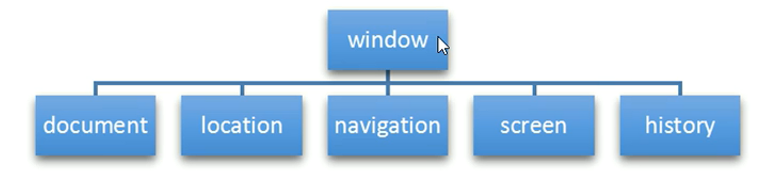
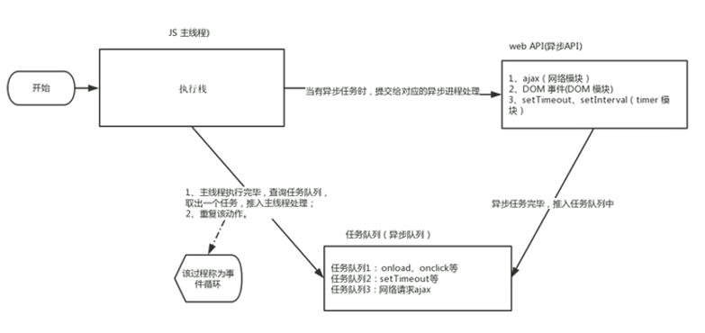

# 一、概述

1. `BOM`（`Browser Object Model`）即浏览器对象模型，它提供了对立于内容而于浏览器窗口进行交互的对象，其核心对象是`window`。

2. `BOM`是由一系列相关的对象构成，并且每个对象都提供了很多方法和属性。
3. `BOM`缺乏标准。`JavaScript`语法的标准化组织是`ECMA`，`DOM`的标准化组织是`W3C`，`BOM`最初是`Netscape`浏览器标准的一部分。

4. `DOM`和`BOM`异同：

| DOM                               | BOM                                               |
| --------------------------------- | ------------------------------------------------- |
| 文档对象模型                      | 浏览器对象模型                                    |
| `DOM`就是把文档当作一个对象来看待 | `BOM`就是把浏览器当作一个对象来看待               |
| `DOM`的顶级对象是`document`       | `BOM`的顶级对象是`window`                         |
| `DOM`主要学习的是操作页面元素     | `BOM`学习的是浏览器窗口交互的一些对象             |
| `DOM`是`W3C`标准规范              | `BOM`是浏览器厂商在各自浏览器上定义的，兼容性较差 |

5. `BOM`的构成：`BOM`比`DOM`更大，它包含`DOM`。以前的`document.querySelector()`的完整写法是`window.document.querySelector()`。



6. `window`对象是浏览器的顶级对象，它具有双重角色。

   - 它是`JS`访问浏览器窗口的一个接口。

   - **它是一个全局变量，定义在全局作用域中的变量、函数都会变成`window`对象的属性和方法**。

   - 在调用的时候可以省略`window`，前面学习的对话框都属于`window`对象方法，如`alert()`、`promp()`等。

7. `window`对象有一个特殊的属性`name`，可以通过`window.name`查看，但不会输出什么内容，主要是要注意自定义变量名的时候不要定义为`name`。

```html
<body>
	<script>
		// 这里用var声明和用let声明有一些不同
		let variable = 10;
		// 1. variable作为一个全局变量，自动转为window对象的属性
		console.log(variable);
		console.log(window.variable);
		// 2. fn作为一个全局函数，自动转为window对象的方法
		function fn () {
			console.log('this is the fn function');
		}
		fn();
		window.fn();
		// 3. alert()、prompt()等都是BOM对象的方法
		alert('不通过window调用');
		window.alert('通过window调用');
		// 4. 输出window对象
		console.dir(window);
	</script>
</body>
```

# 二、`window`对象的常见事件


1. 窗口加载事件：
	- 在之前的代码中，都是把`<script>`脚本放在`html`文件的最后面，因为要`html`元素和内容加载完成后，才能通过`js`操作，如果`js`放在最前面，而`html`文件还未加载，那就导致`js`没有操作的对象。但是有了`window.onload`窗口加载事件，就可以把`js`代码写在文件的任意地方，因为`onload`是等页面内容全部加载完毕后，再去执行处理函数的。
		- `window.onload`是窗口(页面)加载事件，当文档内容(包括图像、脚本文件、`CSS`文件)完全加载完成会触发该事件，调用处理函数。
		- `window.onload = function () {}`。
		- `window.addEventListener('load',function(){})`。

	- `window.onload`传统注册事件方式只能写一次，如果有多个，会以最后一个为准。而`window.addEventListener('load',function())`则可以监听多个事件。

	- `load`事件在以下三种情况下被触发：但是火狐有个特点，就是有个“往返缓存”，这个缓存中不仅保存着页面数据，还保存了`DOM`和`JavaScript`的状态，实际上就是将整个页面都保存在内存中，所以，此时按后退前进按钮不能刷新页面。此时可用`pageshow`事件，`pageshow`事件在页面显示时触发，无论页面是否来自缓存。再重新加载页面后，先执行`load`事件，后执行`pageshow`事件，并根据`pageshow`事件中的`persisted`来判断是否由缓存中的页面触发了`pageshow`事件，注意这个事件给`window`添加。（参考06PC端特效第五点淘宝`Flexible.js`分析）
		- `a`标签的超链接。
		- `F5`或者刷新按钮（强制刷新）。
		- 前进后退按钮。

	- `DOMContentLoaded`事件，它触发的条件是仅当`DOM`加载完成，不包括样式表、图片、`flash`等，`ie9+`才支持。

	- 如果页面的图片或其它资源很多，从用户访问到`onload`触发可能需要较长的时间，交互效果就不能实现，必然影响用户的体验，此时用`DOMContentLoaded`事件比较合适。

```html
<body>
	<button>点击</button>
	<script>
		let btn = document.querySelector('button');
		// 1. 绑定事件的对象是window对象
		// 2. DOMContentLoaded事件只需要html的DOM加载完成就触发，而onload事件则要整个document加载完才触发，所以前者比后者先执行。
		window.addEventListener('load', function () {
			console.log('执行了onload事件');
		})
		window.addEventListener('DOMContentLoaded', function () {
			console.log('执行了DOMContentLoaded事件');
		})
	</script>
</body>
```

2. 调整窗口大小事件

	- `window.onresize`是**可视窗口大小**发生了像素变化后加载的事件，当触发时就调用处理函数。
	- 经常利用这个事件完成响应式布局，**`window.innerWidth`是当前屏幕的宽度，`window.innerHeight`是当前屏幕的高度。**响应式布局中当浏览器的宽度或者高度小于某个临界值的时候就隐藏旁边某些列的布局。

```html
<head>
	<style>
		div {
			width: 500px;
			height: 500px;
			background-color: pink;
		}
	</style>
</head>
<body>
	<div></div>
	<script>
		let div = document.querySelector('div');
		window.addEventListener('resize', function () {
			if (window.innerWidth < 800) {
				div.style.display = 'none';
			} else {
				div.style.display = 'block';
			}
		})
	</script>
</body>
```


3. 定时器

	- `window`对象提供了两个定时器：一是`setTimeout()`，一是`setInterval()`。
	- `window.setTimeout(调用函数[，延迟毫秒数])`，用于设置一个定时器，该定时器在定时器到期后执行调用函数。
	- 第二个参数缺省值默认为`0`。
	- 调用的时候`window`可以省略。
	- `window.setTimeout()`和`window.setInterval()`基本上是一致的，**区别在于`setTimeout()`在时间到了后只执行一次，而`setInterval()`则在每间隔指定的时候后，就反复执行回调函数。**
	- **所以选择`setTimeout()`还是`setInterval()`取决于是循环执行还是只需要一次，比如倒计时、轮播图一般选用`setInterval`。**


```html
<body>
	<script>
		// 1. window.setTimeout()
		// 2. 语法规范：window.setTimeout(调用函数[,延时时间])
		// 3. 这个window在调用时可以省略
		// 4. 这个延时时间单位是毫秒，可以省略，默认缺省值是0
		// 5. 这个调用函数可以直接写函数，还可以写函数名，还可以写"函数名()"
		// 6. 一个页面中可能有很多的定时器，我们经常给定时器加标识符
		setTimeout(function () {
			console.log('省略window调用');
		});
		window.setTimeout(function () {
			console.log('直接写函数调用');
		});
		window.setTimeout(fn);
		window.setTimeout('fn()');
		function fn () {
			console.log('单独写函数，通过函数名调用');
		};
		let timer1 = setTimeout(fn, 5000);
		let timer2 = setTimeout(fn, 3000);
	</script>
</body>
```


```html
<body>
	<script>
		// 1. window.setInterval()
		// 2. 语法规范：window.setInterval(调用函数[,延时时间])
		// 3. 这个window在调用时可以省略
		// 4. 这个延时时间单位是毫秒，可以省略，默认缺省值是0
		// 5. 这个调用函数可以直接写函数，还可以写函数名，还可以写"函数名()"
		// 6. 一个页面中可能有很多的定时器，我们经常给定时器加标识符
		window.setInterval(function () {
			console.log('直接调用');
		}, 2000);
		window.setInterval(fn, 2000);
		function fn () {
			console.log('通过函数调用');
		};
		window.setInterval('fn()', 2000);
		// 给多个定时器添加标识符
		let timer1 = window.setInterval(fn, 3000);
		let timer2 = window.setInterval(fn, 4000);
	</script>
</body>
```


4. 停止定时器
	- `window.clearTimeout(timeoutID)`，`timeoutID`就是计时器标识符。
	- `window.clearInterval(timeoutID)`，`timeoutID`就是计时器的标识符。
	- **一般情况下，`window.setTimeout(function(){}，time)`只执行一次就自动停止执行`function`了，而`window.setInterval(function(){}，time)`则会间隔时间就执行`function`，所以一般要停止`setInterval()`计时器。**

```html
<body>
	<button>停止计时器</button>
	<script>
		let timer = setTimeout(function () {
			console.log('延迟5秒输出');
		}, 5000);
		let btn = document.querySelector('button');
		btn.addEventListener('click', function () {
			clearTimeout(timer);
		});
	</script>
</body>
```


```html
<body>
	<button class="begin">开启定时器</button>
	<button class="stop">关闭定时器</button>
	<script>
		let begin = document.querySelector('.begin');
		let stoper = document.querySelector('.stop');
		begin.addEventListener('click', function () {
			time = window.setInterval(function () {
				console.log('开始执行setInterval函数');
			}, 2000)
		});
		stoper.addEventListener('click', function () {
			window.clearInterval(time);
		})
	</script>
</body>
```


# `this`的指向


1. `this`的指向问题在函数定义阶段是确定不了的，只有函数执行的时候，才能确定`this`到底指向谁，一般情况下`this`最终指向的是那个调用它的对象。

2. 常见的`this`指向：
	- 全局作用域或者普通函数中`this`指向全局对象`window`（注意定时器里面的`this`指向`window`），因为所有全部变量和普通函数都会称为`window`的属性和方法，在调用时完整的写法应该以`window`开头，但是一般省略不写。
	- 方法调用中，谁调用了该方法，`this`就指向谁。
	- 构造函数中，`this`指向构造函数的实例。

```html
<body>
	<button>点击</button>
	<script>
		// this指向问题，一般情况下this最终指向的是那个调用它的对象
		// 1. 全局作用域或者普通函数中this指向全局对象window(注意定时器里面的this指向window)
		console.log(this);
		function fn () {
			console.log(this);
		};
		fn();
		// 2. 方法调用中谁调用this指向谁
		let obj = {
			sayHi: function () {
				console.log(this);  // this指向obj
			},
		};
		obj.sayHi();
		let btn = document.querySelector('button');
		btn.addEventListener('click', function () {
			console.log(this);  // 指向button元素
		})
		// 3. 构造函数中this指向构造函数的实例
		function Fun() {
			console.log(this);  // this指向的是fun实例对象
		};
		let fun = new Fun();
	</script>
</body>
```


# 四、JS执行队列


1. `JS`执行机制：`JS`语言的一大特点就是单线程，也就是说，同一时间只能做一件事。这是因为`JavaScript`这门脚本语言诞生的使命所致——`JavaScript`是为了处理页面中用户的交互，以及`DOM`操作而诞生的。比如我们对某个`DOM`元素进行添加和删除操作，不能同时进行。应该先进行添加，之后再删除。

2. 为了解决单线程问题，利用多核`CPU`的计算能力，`HTML5`提出`Web Worker`标准，允许`JavaScript`脚本创建多个线程，于是，`JS`中出现了同步和异步。

3. 同步：前一个任务结束后再执行后一个任务，程序的执行顺序与任务的排列顺序是一致的、同步的。比如做饭的同步做法：淘米、煮饭、切菜、炒菜。

4. 异步：在做一件事情的时候，因为这件事会花费很长时间，在做这件事的同时，还可以去处理其它事情，比如做饭的异步做法：淘米、煮饭，在把饭放进锅里煮的时候，就可以去切菜，然后炒菜。

5. 同步`VS`异步：一条同样步骤的流水线，各个流程的执行顺序不同。

6. `JS`为了防止执行的任务存在排队或等待时间过长的问题，把所有的任务分为了两大类，一类是同步任务，另一类是异步任务。同步任务都在主线程上执行，形成一个执行栈。而`JS`的异步任务是通过回调函数实现的，如`setTimeout(fn, 1000)`本身是同步任务，但是其中的回调函数`fn`就是异步任务了。异步任务相关的回调函数会被添加到任务队列中(任务队列也就是消息队列)。

7. 异步任务一般有以下三种类型：这些函数本身是同步任务，但是其中的回调函数是异步任务。
	- 普通事件：如`click`、`resize`等。
	- 资源加载：如`load`、`error`等。
	- 定时器：包括`setInterval`、`setTimeout`等。

8. **`JS`执行机制**：
	- 先执行执行栈中的同步任务。
	- 在执行栈上如果碰到了异步任务(存在回调函数)，就把该异步任务放入任务队列中。
	- 一旦执行栈中的所有同步任务执行完毕，系统就会按次序读取任务队列中的异步任务，于是被读取的异步任务结束等待状态，进入执行栈，开始执行。

```html
<body>
	<script>
		// 1. 因为js现在是多线程的，允许异步执行setTimeout()，所以输出顺序是1，2，3
		console.log(1);
		setTimeout(function () {
			console.log(3);
		}, 2000);
		console.log(2);
		// 2. 输出顺序还是1，2，3
		console.log(1);
		setTimeout(function () {
			console.log(3);
		});
		console.log(2);
	</script>
</body>
```

9. **注意**：异步任务本身是同步的，但是其中的回调函数是异步的，如`setTimeout(fn,1000)`，`setTimeout()`本身是在执行栈中的同步任务，但是`fn`这个回调函数是异步的，所以在执行到`setTimeout()`这个异步任务的时候，会直接把`setTimeout()`放入到消息队列中。

10. **异步任务一般就是包含了回调函数的任务。**

11. 由于主线程不断地重复获得任务、执行任务、再获取任务、再执行，所以这种机制被称为事件循环（`event loop`）。




# 五、location对象


1. `window`对象给我们提供了一个`location`属性用于获取或设置窗体的`URL`，并且可以用于解析`URL`。因为这个属性返回的是一个对象，所以我们将这个属性也称为`location`对象。

2. `URL(Uniform Resource Locator)`统一资源定位符，是互联网上标准资源的地址。互联网上每个文件都有一个唯一的`URL`，它包含的信息指出文件的位置以及浏览器应该怎么处理它。
	- `protocol://host[:port]/path/[?query]#fragment`
	- `https://www.baidu.com/index.html?name=andy&age=18#link`

| 组成       | 说明                                                         |
| ---------- | ------------------------------------------------------------ |
| `protocol` | 通信协议，常用的有`http`、`ftp`、`mailto`等                  |
| `host`     | 主机（域名）                                                 |
| `port`     | 端口号，可选，省略时选用方案的默认端口。如`http`的默认端口位`80` |
| `path`     | 路径，由`0`个或多个`/`符号隔开的字符，一般用来表示主机上的一个目录或文件地址 |
| `query`    | 参数，以键值对的形式，通过`&`符号分隔开来                    |
| `fragment` | 片段，`#`后面的内容，常见于链接、锚点                        |

3. `location`对象的属性**（`host = hostname + port`）**

| location对象属性    | 返回值                                    |
| ------------------- | ----------------------------------------- |
| `location.href`     | 获取或者设置整个`url`                     |
| `location.host`     | 返回主机（域名）`www.baidu.com`           |
| `location.port`     | 返回端口号，如果未写，返回空字符串        |
| `location.pathname` | 返回路径                                  |
| `location.search`   | 返回参数                                  |
| `location.hash`     | 返回片段，`#`后面的内容，常见于链接、锚点 |


```html
<body>
<button>点击</button>
<script>
	let btn = document.querySelector('button');
	btn.addEventListener('click', function () {
		// 1. 假设url为http://127.0.0.1:5500/web-front-end/practise.html?word=%22hello%22&ans=%22world%22
		// 1. 可以读取各个参数
		// 2. href为http://127.0.0.1:5500/web-front-end/practise.html?word=%22hello%22&ans=%22world%22#link
		console.log(window.location.href);
		// 3. host为127.0.0.1:5500，等于hostname + port
		console.log(window.location.host);
		// 4. hostname为127.0.0.1
		console.log(window.location.hostname);
		// 5. port为5500
		console.log(window.location.port);
		// 6. pethname为/web-front-end/practise.html
		console.log(window.location.pathname);
		// 7. search为?word=%22hello%22&ans=%22world%22
		console.log(window.location.search);
		// 8. hash为#link
		console.log(window.location.hash);
	})
</script>
</body>
```


4. `location`对象的方法

| `location`对象方法   | 返回值                                                       |
| -------------------- | ------------------------------------------------------------ |
| `location.assign()`  | 跟`href`一样，可以跳转页面（也称为重定向页面），可后退       |
| `location.replace()` | 替换当前页面，因为不记录历史，所以不能后退                   |
| `location.reload()`  | 重新加载页面，相当于刷新按钮或者`F5`，如果参数为`true`，强制刷新`ctrl` + `F5` |


```html
<body>
	<button>按钮</button>
	<script>
		let btn = document.querySelector('button');
		btn.addEventListener('click', function () {
			// 1. assign()记录历史，可以后退
			window.location.assign('https://www.baidu.com');
			
			// 2. replace()不记录历史，无法后退
			window.location.replace('https://taobao.com')
			// 3. reload等于刷新页面，如果参数为true表示强制刷新
			// 3.1 所谓强制刷新是短期内多次刷新时，可能浏览器会利用缓存而并没有真正刷新，强制刷新则不利用缓存
			window.location.reload(true);
		});
	</script>
</body>
```


# 六、navigator对象

1. `navigator`对象包含有关浏览器的信息，它有很多属性，如可以获得客户端的浏览器是什么版本、系统是什么版本等。我们最常用的是`userAgent`，该属性可以返回由客户机发送服务器的`user-agent`头部的值。

2. 通过判断`userAgent`可以打开不同的页面，如判断是`pc`端那就打开`pc`端网页，如果是移动端那就打开移动端的`H5`页面。

3. 下面的代码可以判断用户通过哪种终端打开页面，实现跳转：

```html
if ((navigator.userAgent.match(/(phone|pad|pod|iPhone|iPod|ios|iPad|Android|Mobile|BlackBerry|IEMobile|MQQBrowser|JUC|Fennec|wOSBrowser|BrowserNG|WebOS|Symbian|Windows Phone)/i))) {
	window.location.href = '';  // 设置手机端页面为首页
} else {
	window.location.href = '';  // 设置PC端页面为首页
}
```


# 七、history对象

1. `history`对象主要用于与浏览器历史记录进行交互，该对象包含用户（在浏览器窗口中）访问过的`URL`。

| `history`对象方法 | 作用                                                         |
| ----------------- | ------------------------------------------------------------ |
| `back()`          | 后退功能                                                     |
| `forward()`       | 前进功能                                                     |
| `go(参数)`        | 前进后退功能，如果参数为`1`，前进一个页面，如果是`-1`，后退一个页面 |

2. `history`对象一般在实际开发中用得比较少，但是在一些`OA`办公系统中用得多。


