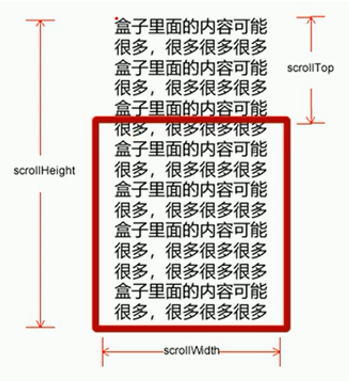
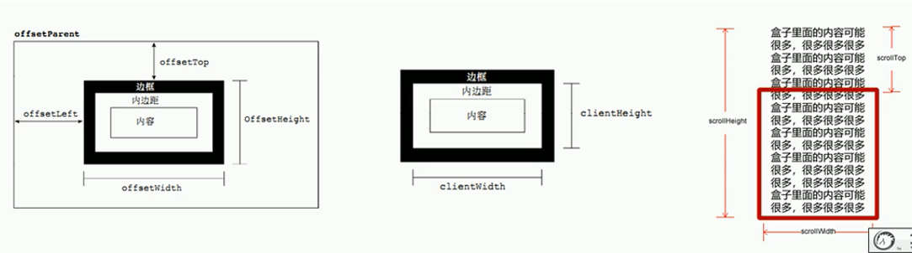
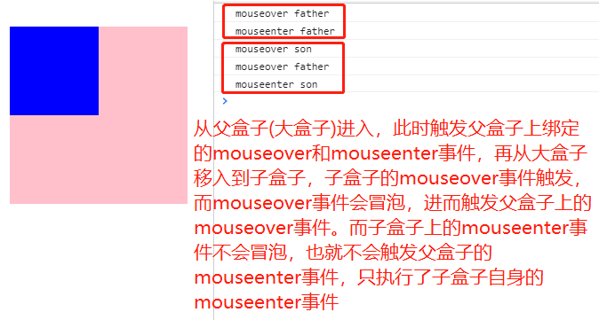

# 一、元素偏移量offset系列

1. `offset`就是偏移量，我们使用`offset`系列相关属性可以动态地得到该元素的位置（偏移）、大小等；
   - 获得元素距离**带有定位**父元素的位置。
   - 获得元素自身的大小（宽高度）。
   - 注意：返回的数值都是不带单位的（比如偏移`100px`，返回值就是`100`，无单位)

2. `offset`系列常见属性

| `offset`系列属性       | 作用                                                         |
| ---------------------- | ------------------------------------------------------------ |
| `element.offsetTop`    | 返回`element`元素相对带有定位父元素上方的偏移量              |
| `element.offsetLeft`   | 返回`element`元素相对带有定位父元素左边的偏移量              |
| `element.offsetParent` | 返回作为该元素带有定位的父级元素，如果父级元素依次都没有定位，则返回`body` |
| `element.offsetWidth`  | 返回`element`自身可见框区域（包括`padding`、`border`、内容区（`content`））的宽度，返回数值不带单位 |
| `element.offsetHeight` | 返回`element`自身可见框区域（包括`padding`、`border`、内容区（`content`））的高度，返回数值不带单位 |

3. **`offset`系列的偏移量都是相对于带有定位（非`static`定位）的父元素或最近上级元素**。

```html
<head>
	<meta charset="UTF-8">
	<meta name="viewport" content="width=device-width, initial-scale=1.0">
	<meta http-equiv="X-UA-Compatible" content="ie=edge">
	<link rel="shortcut icon" href="./images/favicon.ico">
	<title>Document</title>
	<style>
		* {
			padding: 0;
			margin: 0;
		}
		.grand {
			width: 150px;
			height: 150px;
			margin: 50px;
			background-color: orange;
			/* 如果下面的position属性开启，且father的position关闭，那么offset就是相对于grand元素的偏移 */
			/* position: absolute; */
		}
		.father {
			width: 100px;
			height: 100px;
			margin: 30px;
			background-color: green;
			/* 如果下面的position属性开启，那么offset就是son元素就是相对于father元素的偏移 */
			position: relative;
		}
		.son {
			width: 50px;
			height: 50px;
			margin: 20px;
			background-color: gray;
		}
	</style>
</head>
<body>
<div class="grand">
	<div class="father">
		<div class="son"></div>
	</div>
</div>
<script>
	let son = document.querySelector('.son');
	console.log(son.offsetLeft);
</script>
</body>
```


4. **通过`offset`可以动态地获取元素的大小，比如一个元素没有规定宽度，而调整浏览器大小后，宽度应该是随之变化的，通过`js`的`offset`就可以很方便地取到元素的大小。**

5. `offset`与`style`对比：**`offset`系列只可以读取包含`padding` + `border` + `width`在内的任意样式表中的无单位数值，而`style`系列可以读写仅行内样式表中的`width`（无`padding` + `border`）带单位字符串。**

| `offset`                                               | `style`                                               |
| ------------------------------------------------------ | ----------------------------------------------------- |
| `offset`可以得到任意样式表中的样式值                   | `style`只能得到行内样式表中的样式值                   |
| `offset`系列获得的数值是没有单位的数值                 | `style.width` / `style.height`获得的是带有单位字符串  |
| `offsetWidth`包含`padding` + `border` + `width`        | `style.width`获得不包含`padding`和`border`的值        |
| `offsetWidth`等属性是只读属性，只能获取不能赋值        | `style.width`是可读写属性，可以获取也可以赋值         |
| **所以，我们想要获取元素的大小位置，用`offset`更合适** | **所以，我们想要给元素更改值，则需要使用`style`改变** |


# 二、元素可视区`client`系列

1. `client`翻译过来就是可视区，我们使用`client`系列的相关属性来获取元素可视区的相关信息。通过`client`系列相关属性可以动态地得到该元素的边框大小、元素大小等。

| `client`系列属性       | 作用                                                         |
| ---------------------- | ------------------------------------------------------------ |
| `element.clientTop`    | 返回元素上边框的大小                                         |
| `element.clientLeft`   | 返回元素左边框的大小                                         |
| `element.clientWidth`  | 返回自身包括`padding`、内容区的宽度，不含边框，返回值不带单位 |
| `element.clientHeight` | 返回自身包括`padding`、内容区的高度，不含边框，返回值不带单位 |

2. **`element.clientWidth`、`element.clientHeight`与`element.offsetWidth`、`element.offsetHeight`的区别在于不包含边框。**


# 三、元素滚动`scroll`系列

1. 元素`scroll`翻译过来就是滚动的，可以使用`scroll`系列相关的属性动态得到该元素的大小、滚动距离等。

| `scroll`系列属性       | 作用                                                         |
| ---------------------- | ------------------------------------------------------------ |
| `element.scrollTop`    | 返回被卷去的上侧距离，返回数值不带单位                       |
| `element.scrollLeft`   | 返回被卷去的左侧距离，返回数值不带单位                       |
| `element.scrollWidth`  | 返回**`element`元素包裹内容的宽度，不含边框，返回数值不带单位** |
| `element.scrollHeight` | 返回**`element`元素包裹内容的高度，不含边框，返回数值不带单位** |

2. 用的比较多的是`element.scrollTop`和`element.scrollLeft`两个。

3. `element.scrollTop`就是子元素在超过父元素的宽度或者高度的时候，存在溢出情况，如果此时给父元素设置`overflow：scroll/auto;`，那么父元素就会显示滚动条，子元素溢出部分会被遮挡。当滚动滚动条时，上面被遮挡掉的高度就是`element.scrollTop`。`element.scrollLeft`同理。

4. 滚动条在滚动的时候会触发`onscroll`事件。




```html
<head>
	<meta charset="UTF-8">
	<meta name="viewport" content="width=device-width, initial-scale=1.0">
	<meta http-equiv="X-UA-Compatible" content="ie=edge">
	<link rel="shortcut icon" href="./images/favicon.ico">
	<title>Document</title>
	<style>
		div {
			width: 200px;
			height: 200px;
			background-color: pink;
			overflow: scroll;
		}
	</style>
</head>
<body>
	<div>这是文字这是文字这是文字这是文字这是文字这是文字这是文字这是文字这是文字这是文字这是文字这是文字这是文字这是文字这是文字这是文字这是文字这是文字这是文字这是文字这是文字这是文字这是文字这是文字这是文字这是文字这是文字这是文字这是文字这是文字这是文字这是文字这是文字这是文字这是文字这是文字这是文字这是文字这是文字这是文字这是文字这是文字这是文字这是文字这是文字这是文字这是文字这是文字这是文字这是文字这是文字这是文字这是文字这是文字这是文字这是文字这是文字这是文字这是文字这是文字这是文字</div>
	<script>
		let div = document.querySelector('div');
		console.log(div.scrollWidth);
		console.log(div.scrollHeight);
		div.addEventListener('scroll', function () {
			console.log(this.scrollLeft);
			console.log(this.scrollTop);
		})
	</script>
</body>
```


# 四、三大系列总结对比

1. `offset`、`client`、`scroll`三大系列异同


| 类型                  | 作用差异                                                     |
| --------------------- | ------------------------------------------------------------ |
| `element.offsetWidth` | 返回自身包括`content`、`padding`、`border`区域的宽度，返回数值不带单位 |
| `element.clientWidth` | 返回自身包括`padding`、`content`区域的宽度，不包含`border`，返回值不带单位 |
| `element.scrollWidth` | 返回`element`元素所包含子元素的宽度，不包含`border`，返回值不带单位 |



2. **三大系列主要用法：**

	- offset系列经常用于获得**元素位置：`element.offsetTop`、`element.offsetLeft`。**
	- `client`系列经常用于获得**元素大小：`element.clientWidth`、`element.clientHeight`。**
	- `scroll`系列经常用于获得**滚动距离：`element.scrollTop`、`element.scrollLeft`。**
	
	- **注意：页面的滚动距离是通过`window.pageXOffset`或`window.pageYOffset`获得的。**

 


# 五、立即执行函数

1. 普通函数都是先声明后调用，而立即执行函数就是声明的同时就调用。

2. 立即执行函数有两种声明方式，`(function(形参){})(实参);`和`(function(形参){}(实参));`

3. 立即执行函数也可以有形参和实参，第一个小括号里的是形参，第二个小括号里的是实参。

4. 立即执行函数最大的作用就是独立创建了一个作用域。

5. 立即执行函数可以是命名函数，也可以是匿名函数。

```html
<body>
	<script>
		// 1. 普通函数是需要先声明，后调用的
		function fn() {
			console.log(1);
		}
		fn();
		// 2. 立即执行函数不需要调用，立马能够自己执行的函数，有两种写法；
		// 2.1 (function() {})();或(function(){}());
		(function() {
			console.log(1);
		})();
		(function() {
			console.log(2);
		} ());
		// 2.3 立即执行函数也可以传递参数，第一个小括号相当于函数声明部分的括号，里面可以有形参。第二个小括号相当于函数调用部分的括号，里面可以传递实参；
		// 2.4 立即执行函数后面最好写完整分号，否则连续的立即执行函数之间没有分号，就会报错；
		(function(xingCan) {
			console.log(xingCan);
		})('shiCan');
		(function(XingCan) {
			console.log(XingCan);
		} ('ShiCan'));
		// 3. 立即执行函数最大的作用就是独立创建了一个作用域；里面所有的变量都是局部变量，不会有命名冲突的情况；
		(function(){
			let num = 10;
			console.log(num);
		})();
		(function(){
			let num = 10;
			console.log(num);
		}());
	</script>
</body>
```


# 六、淘宝`flexible.js`源码分析

1. `pageshow`事件可以保证页面在显示的时候就触发，无论是刷新还是来自内存缓存。它会在`load`事件后触发；（参考05高级（BOM部分）第二节window对象的常见事件）

2. `flexible.js`整体是一个立即执行函数，需要传入`window`和`document`这两个对象。


```javascript
(function flexible(window, document) {
	// 获取HTML文件中的根元素,rem布局主要是通过设置html的文字大小来进行的
	let docE1 = document.documentElement;
	// dpr即物理像素比，在PC端物理像素比就是1，在移动端如iphone6/7/8等为2，下面这条语句先获取当前浏览器的默认dpr，如果没有获取到，默认设置为1
	let dpr = window.devicePixelRatio || 1;
	// adjust body font size，这是body的字体大小
	function setBodyFontSize() {
		// 先判断有没有body这个元素，如果html文件已经加载完毕，那么是会有body元素的
		if (document.body) {
			document.body.style.fontSize = (12 * dpr) + 'px';
		} else {
			// 如果没有body这个元素(例如当前js文件是在head中引入的)，那么就让document监听DOMContentLoaded事件，等html加载完再调用setBodyFontSize函数
			document.addEventListener('DOMContentLoaded', setBodyFontSize)
		}
	}
	setBodyFontSize();
	// flexible.js主要是通过rem布局，而rem布局主要是跟html文字大小相关
	// set 1rem = viewWidth / 10，即设置html元素的文字大小
	function setRemUnit () {
		// docE1就是html根元素，docE1.clientWidth就是html文件的可视宽度，除以10就是均分为10等分
		let rem = docE1.clientWidth / 10;
		docE1.style.fontSize = rem + 'px';
		console.log(docE1.style.fontSize);
	}
	setRemUnit();
	// reset rem unit on page resize，即当页面尺寸大小发生变化时，要重新设置下rem的大小
	window.addEventListener('resize', setRemUnit);
	// pageshow是我们重新加载页面时触发的事件
	window.addEventListener('pageshow', function (e) {
		// e.persisted返回true表示页面是从缓存中加载的，下面的语句表示即使是从语句中加载的，也重新设置大小
		if (e.persisted) {
			setRemUnit();
		}
	})
	// detect 0.5px suppos，有些移动端的浏览器不支持0.5像素的兼容写法
	if (dpr>=2) {
		let fakeBody = document.createElement('body');
		let testElement = document.createElement('div');
		testElement.style.border = '.5px solid transparent';
		fakeBody.appendChild(testElement);
		docE1.appendChild(fakeBody);
		if (testElement.offsetHeight === 1) {
			docE1.classList.add('hairlines');
		}
		docE1.removeChild(fakeBody);
	}
})(window, document)
// flexible就是把屏幕划分成了若干等分，每一等分就是一个rem
```

# 七、`mouseenter`与`mouseover`的区别

1. 当鼠标移到元素身上时就会触发`mouseover`和`mouseenter`事件，不同的是，`mouseover`经过自身会触发绑定事件，经过子盒子时还会触发绑定事件，而`mouseenter`只会经过自身时触发。

2. **根本差别就是`mouseover`事件会冒泡，而`mouseenter`事件不冒泡。**

3. `mouseenter`常与`mouseleave`搭配，同样，**`mouseleave`也不会冒泡。**


```html
<head>
	<style>
		* {
			padding: 0;
			margin: 0;
		}
		#father {
			width: 200px;
			height: 200px;
			background-color: pink;
			margin: 80px auto;
		}
		#son {
			width: 100px;
			height: 100px;
			background-color: blue;
		}
	</style>
</head>
<body>
	<div id ="father">
		<div id="son"></div>
	</div>
	<script>
		let father = document.querySelector('#father');
		let son = document.querySelector('#son');
		father.addEventListener('mouseenter', function () {
			console.log('mouseenter father');
		});
		father.addEventListener('mouseover', function () {
			console.log('mouseover father');
		});
		son.addEventListener('mouseenter', function () {
			console.log('mouseenter son');
		});
		son.addEventListener('mouseover', function () {
			console.log('mouseover son');
		})
	</script>
</body>
```




# 八、动画

1. 动画核心原理：

	- 通过定时器`window.setInterval()`不断移动盒子位置，让盒子的`left`或`top`值不断变化（常改变`left`），这样盒子在视觉上就是在不断运动的，形成动画。

	- 实现步骤：

		- 获得盒子当前位置。
		- 让盒子在当前的位置加上`1`个步长的移动距离。
		- 利用定时器不断重复这个操作。
		- 加一个结束定时器的条件。
		- **注意：动画要移动的元素，必须要添加定位，才能使用`element.style.left`改变其位置来形成动画。**


```html
<head>
	<style>
		* {
			padding: 0;
			margin: 0;
		}
		#app {
			width: 100px;
			height: 100px;
			background-color: pink;
			/* 需要设置动画效果的元素必须添加定位 */
			position: absolute;
			top: 50px;
			left: 0;
		}
	</style>
</head>
<body>
	<div id ="app"> </div>
	<script>
		let div = document.querySelector('#app');
		// 动画的核心原理就是通过给目标定期设置位移
		let timer = window.setInterval(function () {
			// 一定要设置停止动画的条件，否则动画将无限循环下去
			if (div.offsetLeft > 500) {
				clearInterval(timer);
			}
			div.style.left = div.offsetLeft + 5 + 'px';
		}, 30);
	</script>
</body>
```

- **总结：动画的核心其实就是三点，一是动画元素添加定位，二是动画定期位移指定步长，三是两次清除动画**。

2. 动画函数封装：
   - 在一个`html`页面上，可能很多地方都存在动画，而此时最方便的就是封装一个动画函数。


```html
<head>
	<style>
		#app {
			width: 100px;
			height: 100px;
			background-color: pink;
			position: absolute;
			top: 100px;
			left: 0px;
		}
	</style>
</head>
<body>
	<div id="app"> </div>
	<script>
		let div = document.querySelector('#app');
		// 1. 封装动画函数，接受两个参数，第一个为动画元素对象，第二个为动画位移目标位置
		function animate(obj, target) {
			let timer = window.setInterval(function () {
				if (obj.offsetLeft == target) {
					clearInterval(timer);
				}
				obj.style.left = obj.offsetLeft + 5 + 'px';
			}, 30)
		}
		// 2. 调用动画函数，传入两个实参
		animate(div, 800);
	</script>
</body>
```


3. 动画函数优化：

- 上面封装的动画函数中，有两个地方可以优化，其一是每一个函数中都通过`let`定义了一个计时器`timer`，而每次调用`let`函数都是会在内存中开辟空间的，如果存在成百上千个动画，那么内存中就会开辟非常大的内存，性能有所一个影响。其二是每个动画中的计时器都是`timer`，容易混淆。

- 解决方法：利用`JS`是一门动态语言，可以很方便地给当前对象添加属性，从而给不同的元素添加不同定时器。


```html
<head>
	<style>
		#app {
			width: 100px;
			height: 100px;
			background-color: pink;
			position: absolute;
			top: 100px;
			left: 0px;
		}
		span {
			display: block;
			width: 100px;
			height: 100px;
			background-color: brown;
			position: absolute;
			top: 260px;
			left: 0px;
		}
	</style>
</head>
<body>
	<div id="app"> </div>
	<span></span>
	<script>
		let div = document.querySelector('#app');
		let span = document.querySelector('span');
		// 1. 封装动画函数，接受两个参数，第一个为动画元素对象，第二个为动画位移目标位置
		function animate(obj, target, speed) {
			// 3. 优化：给每个对象添加不同的计时器
			obj.timer = window.setInterval(function () {
				if (obj.offsetLeft == target) {
					clearInterval(obj.timer);
				}
				obj.style.left = obj.offsetLeft + 5 + 'px';
			}, speed);
		};
		// 2. 调用动画函数，传入两个实参
		animate(div, 800, 40);
		animate(span, 600, 10);
	</script>
</body>
```


4. 特定条件下的动画

	- 有些动画不是打开网页就运行的，而是在满足某些条件后才触发的，比如点击某个按钮才运行相应的动画。

	- **特定条件下的动画需要注意在执行动画前就清除原有的动画计时器，只保留当前一个定时器执行**，否则动画执行的时候将累加所有的计时器，运行速度超过预期。


```html
<head>
	<style>
		#app {
			width: 100px;
			height: 100px;
			background-color: pink;
			position: absolute;
			top: 100px;
			left: 0px;
		}
		span {
			display: block;
			width: 100px;
			height: 100px;
			background-color: brown;
			position: absolute;
			top: 260px;
			left: 0px;
		}
	</style>
</head>
<body>
	<div id="app"> </div>
	<span></span>
	<button>按钮</button>
	<script>
		let div = document.querySelector('#app');
		let span = document.querySelector('span');
		let btn = document.querySelector('button');
		// 1. 封装动画函数，接受两个参数，第一个为动画元素对象，第二个为动画位移目标位置
		function animate(obj, target, speed) {
			// 5. 必须清除以前历次计时器，否则叠加生效
			clearInterval(obj.timer);
			// 3. 优化：给每个对象添加不同的计时器
			obj.timer = window.setInterval(function () {
				if (obj.offsetLeft == target) {
					clearInterval(obj.timer);
				}
				obj.style.left = obj.offsetLeft + 5 + 'px';
			}, speed);
		};
		// 2. 调用动画函数，传入两个实参
		animate(div, 800, 40);
		// animate(span, 600, 10);
		// 4. 特殊条件下的动画：点击按钮运行动画
		btn.addEventListener('click', function () {
			animate(span, 600, 50);
		})
	</script>
</body>
```


5. 缓动动画：

	- 缓动动画就是让元素运动速度有所变化，最常见的是让速度慢慢停下来。

	- 匀速动画就是步长固定，而缓动动画就是步长变化（可能增大，也可能减小，实际开发可能减小的多）。

	- 核心思路：

		- 让盒子每次移动的距离慢慢变小，速度就会慢慢落下来。
		- 核心算法：`每次位移的步长 = (目标位置 - 现在的位置) / 10`。
		- 停止条件是：让当前盒子的位置等于目标位置就停止计时器。


```html
<head>
	<style>
		#app {
			width: 100px;
			height: 100px;
			background-color: pink;
			position: absolute;
			top: 50px;
			left: 0;
		}
	</style>
</head>
<body>
	<div id="app"> </div>
	<script>
		let div = document.querySelector('#app');
		// 1. 封装动画函数
		function animate(obj, target, speed) {
			// 2. 清理历次计时器，确保当前只有一个计时器运行
			clearInterval(obj.timer);
			obj.timer = window.setInterval(function () {
				if (obj.offsetLeft == target) {
					clearInterval(obj.timer);
				};
				// 3. 设置计时器执行时每步的步长
				obj.step = Math.ceil((target - obj.offsetLeft) / 10);
				// 3.1 设置计时器执行时每步的步长要取整
				// obj.step = (target - obj.offsetLeft) / 10;
				obj.style.left = obj.offsetLeft + obj.step + 'px';
			}, speed);
		};
		// 4. 调用函数
		animate(div, 800, 90);
	</script>
</body>
```

6. 区间移动动画

	- 区间移动动画的重点，就是在之前的匀速动画和缓动动画的基础上，要注意步长的正负，如果步长为正，那么就是向上取整，如果步长为负，那么就要向下取整，这样才能达到精准的指定位置。


```html
<head>
	<style>
		#app {
			width: 100px;
			height: 100px;
			background-color: pink;
			position: absolute;
			top: 50px;
			left: 0;
		}
	</style>
</head>
<body>
	<div id="app"> </div>
	<button class="forth">往前冲</button>
	<button class="back">往回退</button>
	<script>
		let div = document.querySelector('#app');
		let forth = document.querySelector('.forth');
		let back = document.querySelector('.back');
		// 1. 封装动画函数
		function animate(obj, target, speed) {
			// 2. 清理历次计时器，确保当前只有一个计时器运行
			clearInterval(obj.timer);
			obj.timer = window.setInterval(function () {
				if (obj.offsetLeft == target) {
					clearInterval(obj.timer);
				};
				// 3. 设置计时器执行时每步的步长
				obj.step = (target - obj.offsetLeft) / 10;
				// 3.1 步长若往前走为正，则往回退为负，此时取整要注意整数往上取整，负数向下取整
				obj.step = obj.step > 0 ? Math.ceil(obj.step) : Math.floor(obj.step);
				obj.style.left = obj.offsetLeft + obj.step + 'px';
			}, speed);
		};
		// 4. 调用函数
		forth.addEventListener('click', function () {
			animate(div, 800, 20);
		});
		back.addEventListener('click', function () {
			animate(div, 80, 20);
		})
	</script>
</body>
```


7. 动画函数添加回调函数

	- 回调函数原理：函数可以作为一个参数，将这个函数作为参数传递给另一个函数，当那个函数执行完后，再去执行传进去的这个函数，这个过程就叫做回调。
	- 实际开发中，当我们需要先执行动画，等动画执行完毕之后再执行某个操作，那么就可以把这个操作封装成一个函数，然后作为回调函数传递给动画函数。


```html
<head>
	<meta charset="UTF-8">
	<meta name="viewport" content="width=device-width, initial-scale=1.0">
	<meta http-equiv="X-UA-Compatible" content="ie=edge">
	<link rel="shortcut icon" href="./images/favicon.ico">
	<title>Document</title>
	<style>
		div {
			position: absolute;
			left: 0;
			top: 40px;
			width: 100px;
			height: 100px;
			background-color: pink;
		}
		span {
			position: absolute;
			top: 200px;
			left: 0px;
			width: 100px;
			height: 100px;
			background-color: orange;
		}
	</style>
</head>
<body>
	<div></div>
	<span></span>
	<button class="btn300">点击300</button>
	<button class="btn500">点击500</button>
	<script>
		let div = document.querySelector('div');
		let btn300 = document.querySelector('.btn300');
		let btn500 = document.querySelector('.btn500');
		let span = document.querySelector('span');
		function animate(obj, target, callback) {
			// 1. 不调用let开辟内存空间，而是给传递过来的对象添加一个属性，既节省了空间，也给不同的定时器指定了不同的定时器
			// 2. 某些情况下需要点击后再触发动画，但是当我们不断点击按钮时，这个元素的速度会越来越快，因为开启了太多的定时器
			// 3. 解决方案就是让我们的元素只有一个定时器执行
			// 4. 先清除以前的定时器，只保留当前的一个定时器执行
			clearInterval(obj.timer);
			obj.timer = setInterval(function () {
				if (obj.offsetLeft == target) {
					clearInterval(obj.timer);
					// 5. 这里先判断有无回调函数，有就调用，又因为写在if里面，先到target处，然后再调用，所以是回调函数
					// 6. 实际开发中一些需要动画执行完后再触发的动作就写在回调函数中
					if (callback) {
						callback();
					};
					// 与上面的回调函数判断语句等效
					// callback && callback();
				}
				obj.step = Math.ceil(target - obj.offsetLeft) / 10;
				obj.step = obj.step > 0 ? Math.ceil(obj.step) : Math.floor(obj.step);
				obj.style.left = obj.offsetLeft + obj.step + 'px';
			}, 15);
		};
		animate(div, 300)
		function callback() {
			span.style.backgroundColor = 'blue';
		}
		btn300.addEventListener('click', function () {
			animate(span, 500, callback);
		})
		btn500.addEventListener('click', function () {
			animate(span, 800, callback);
		})
	</script>
</body>
```


# 九、轮播图

1. 核心思路

	- 一个轮播图主要包括四大块：父盒子、左右切换键、下方圆点、轮播图片。
	- 父盒子包裹左右切换按键、下方圆点、轮播图片，一般父盒子大小和一张轮播图片等大。
	- 轮播图片一般是作为一个整体用`<ul>`包裹，然后每个图片再用一个`<li>`包裹，因为轮播图要通过动画滚动，所以必须浮动在一排上，而`<ul>`的宽度必须能包裹住全部`<li>`元素。于是，父盒子大小等于单张`<li>`包裹的轮播图片大小，`overflow`设置为`hidden`，而`<ul>`的宽度为所有`<li>`的宽度之和，且每个`<li>`浮动。
	- **移动的是`ul`而不是`li`。**

2. 功能分析

	- 鼠标经过轮播图模块，左右按钮显示，离开隐藏左右按钮。
	- 点击左侧按钮一次，图片往左播放一张，以此类推，右侧按钮同理。
	- 图片播放的同时，下面小圆圈模块跟随一块变化。
	- 点击小圆圈，可以播放相应的图片。
	- 鼠标不经过轮播图，轮播图也会自动播放图片。
	- 鼠标经过，轮播图模块自动播放停止。


```html
<head>
	<style>
		* {
			padding: 0;
			margin: 0;
		}
		.box {
			width: 600px;
			height: 400px;
			background: pink;
			margin: 50px auto;
			position: relative;
			border: 1px solid gray;
			overflow: hidden;
		}
		.arrow {
			display: none;
		}
		.arrow>a {
			text-decoration: none;
			color: brown;
			font-size: 40px;
		}
		.left {
			position: absolute;
			top: 45%;
			left: 5px;
			z-index: 99;
		}
		.right {
			position: absolute;
			top: 45%;
			right: 5px;
			z-index: 99;
		}
		ol.circle {
			width: 100%;
			height: 40px;
			position: absolute;
			left: 0;
			bottom: 0px;
			display: flex;
			flex-direction: row;
			justify-content: center;
		}
		ol.circle>li {
			list-style-type: circle;
			list-style-position: inside;
			width: 25px;
			height: 25px;
			z-index: 99;
		}
		ul.pics {
			width: 3000px;
			height: 400px;
			/* 是ul整体移动，所以要设置ul的定位 */
			position: absolute;
			top: 0;
			left: 0;
		}
		ul.pics>li {
			list-style: none;
			float: left;
		}
		.current {
			color: chartreuse;
		}
	</style>
</head>
<body>
	<div class="box">
		<div class="arrow">
			<a href="javascript:;" class="left">&lt;</a>
			<a href="javascript:;" class="right">&gt;</a>
		</div>
		<ol class="circle"></ol>
		<ul class="pics">
			<li></li>
			<li></li>
			<li></li>
			<li></li>
			<li></li>
		</ul>
	</div>
	<script>
		// 实际开发中js往往是单独的文件，单独写成文件一般通过window对象监听load事件
		window.addEventListener('load', function () {
			// 1. 获取所需要的元素
			let box = document.querySelector('.box');
			let arrow = document.querySelector('.arrow');
			let left = document.querySelector('.left');
			let right = document.querySelector('.right');
			let ul = document.querySelector('.pics');
			let ol = document.querySelector('.circle');
			// 2. 鼠标移入轮播图，左右按钮显示，移出则隐藏
			box.addEventListener('mouseover', function () {
				arrow.style.display = 'block';
				// 8.1 鼠标移入，自动播放停止
				clearInterval(timer);
				timer = null;
			})
			box.addEventListener('mouseout', function () {
				arrow.style.display = 'none';
				// 8.2 鼠标移出，自动播放开启
				timer = window.setInterval(function () {
					right.click();
				}, 2000);
			})
			// 3. 根据轮播图<li>的数量动态调整底部小圆圈和轮播图<ul>盒子的宽度
			// 3.1 核心思路：小圆圈的个数要跟图片张数一致
			// 3.2 所以首先得到ul里面图片的张数(图片放入li里面，所以就是li的个数)
			// 3.3 利用循环动态生成小圆圈(这个小圆圈要放入ol里)
			for (let index = 0; index < ul.children.length; index++) {
				let insertLi = document.createElement('li');
				// 5.3 可以在插入li的同时生成索引号
				insertLi.setAttribute('index', index);
				ol.appendChild(insertLi);
				// 4 小圆圈动画效果(利用排他思想)
				// 4.1 点击当前小圆圈，就添加current类
				// 4.2 其余小圆圈就移除这个类
				insertLi.addEventListener('click', function () {
					for (let i = 0; i < ol.children.length; i++) {
						ol.children[i].className = '';
					}
					this.className = 'current';
					// 5. 点击小圆圈实现滑动效果(一般封装成函数或者单独的js文件引入)
					// 5.1 注意移动的是ul元素而不是li
					// 5.2 核心算法：点击某个小圆圈，就让图片滚动，小圆圈的索引号乘以图片宽度作为ul的移动距离
					// 5.3 索引号可以在生成li并插入的时候设置
					let attrIndex = this.getAttribute('index');
					// 7.2 点击小圆圈把circle设置为小圆圈的序号(否则再点击左右按键可能出错)
					circle = attrIndex;
					function animate() {
						ul.style.left = - attrIndex * ul.children[0].clientWidth + 'px';
					};
					animate();
				})
			}
			// 3.4 动态设置轮播图ul的宽度
			ul.style.width = ul.children.length * ul.children[0].clientWidth + 'px';
			// 3.5 给第一个小圆圈默认选中current类
			ol.children[0].className = 'current';
			// 7. 实现小圆圈和对应的图片联动，最简单的做法是再声明一个变量circle
			// 7.1 左右按键都需要这个circle变量，因此要声明为全局变量
			circle = 0;
			// 6. 点击左右按钮实现轮播效果
			right.addEventListener('click', function () {
				// 6.1 实现无缝滚动
				if (ul.offsetLeft <= -(ul.offsetWidth - ul.children[0].offsetWidth)) {
					// 6.2 这里没有设置为0是因为后面还有一步位移操作
					ul.style.left = ul.children[0].offsetWidth + 'px';
				}
				ul.style.left = ul.offsetLeft - ul.children[0].clientWidth + 'px';
				// 7.3 点击右键实现联动
				// 7.3.1 排他思想，实现当前图片对应的小圆圈突出显示
				for (let i = 0; i < ol.children.length; i++) {
					ol.children[i].className = '';
				}
				if (circle >= ol.children.length - 1) {
					circle = -1;
				}
				ol.children[++circle].className = 'current';
			})
			left.addEventListener('click', function () {
				if (ul.offsetLeft >= 0) {
					ul.style.left = -ul.offsetWidth + 'px';
				}
				ul.style.left = ul.offsetLeft + ul.children[0].clientWidth + 'px';
				// 7.4 点击左键实现联动
				for (let i = 0; i < ol.children.length; i++) {
					ol.children[i].className = '';
				}
				if (circle <= 0) {
					circle = ol.children.length;
				}
				ol.children[--circle].className = 'current';
			})
			// 8. 鼠标移出，自动播放，鼠标移入，停止播放
			let timer = window.setInterval(function () {
				// 8.3 手动调用点击事件
				right.click();
			}, 2000);
		})
	</script>
</body>
```

# 十、节流阀

1. 在轮播图中，但我们连续快速点击左键或者右键切换图片的时候，会发现图片在飞快地切换，节流阀就是防止轮播图按钮连续点击造成过快播放问题的。

2. 节流阀目的：当上一个动画函数内容执行完毕之后，再去执行下一个动画函数，让事件无法连续触发。

3. 核心思路：利用回调函数，添加一个变量来控制，锁住函数和解锁函数。

4. 先设置一个变量`flag=true`，表示开启节流阀，然后`if (flag) {flage = false; animate(obj, target, function(){flag = true;})}`。在动画函数中，回调函数是等动画函数执行完后才调用的，所以可以给动画函数直接传递一个匿名函数，在里面把一开始关掉的节流阀再次开启。


# 十一、返回顶部效果

1. 有多种实现方式，常见的两种：一是通过`windo.scroll(x, y)`，一是通过动画实现。

2. 通过`window.scroll(x, y)`函数实现：

	- 通过`window.scroll(x, y)`滚动窗口至文档中的特定位置。
	- `x`、`y`都是没有单位，直接写数值。
	- 滚动的时候是匀速直接到达的。

3. 通过动画实现，就是看页面上面被卷去多少，然后设置`window.pageYOffset`的值为对应的`target`即可。


```html
<head>
	<style>
		* {
			margin: 0;
			padding: 0;
		}
		#app {
			width: 100%;
			height: 1000px;
			background-color: pink;
		}
		.scrollback {
			width: 50px;
			height: 50px;
			position: fixed;
			bottom: 10px;
			right: 50px;
			background-color: blue;
		}
	</style>
</head>
<body>
	<div id="app"> </div>
	<div class="scrollback"></div>
	<script>
		let scrollback = document.querySelector('.scrollback');
		// 1. 通过window.scroll(x,y)实现
		scrollback.addEventListener('click', function () {
			window.scroll(0, 0);
		})
		// 2. 通过动画实现
		function animate(obj, target, callback) {
			clearInterval(obj.timer);
			obj.timer = window.setInterval(function () {
				if (obj.pageYOffset == target) {
					clearInterval(obj.timer);
					if (callback) {
						callback();
					}
				};
				obj.step = Math.ceil((window.pageYOffset - target) / 10)
				window.pageYOffset =  window.pageYOffset - obj.step;
				window.scroll(0, window.pageYOffset);
			}, 30)
		};
		scrollback.addEventListener('click', function () {
			// 整个窗口滚动，所以把window对象传递给obj
			animate(window, 0);
		})
	</script>
</body>
```


**总结：动画的核心其实就是三点，一是动画元素添加定位，二是动画定期位移指定步长，三是两次清除动画**
