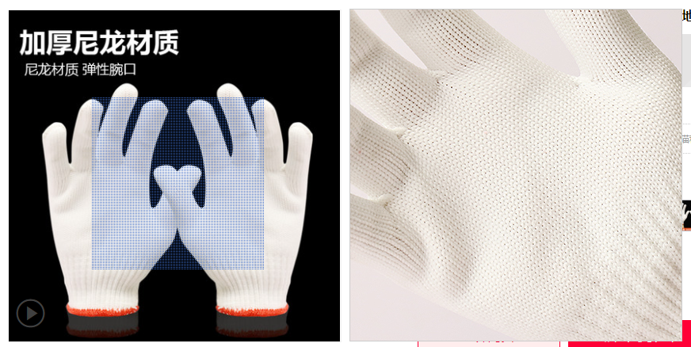

DOM操作都是先获取元素，然后获取元素的属性，要么就是element.style.属性名 来修改样式

1. 仿京东登陆密码框（切换密文和明文显示密码）

	- `input`标签选中后会有框，可以通过`outline:none;`去掉。


```html
<head>
	<style>
		.box {
			position: relative;
			width: 200px;
			margin: 50px auto;
			border-bottom: 1px solid blue;
		}
		.box input {
			width: 170px;
			height: 20px;
			/* 设置输入框的默认边框，如果要去掉，设置border为0，outline为none */
			border: 0;
			outline: none;
		}
		.box img {
			position: absolute;
			top: 2px;
			right: 5px;
			width: 20px;
		}
	</style>
</head>
<body>
	<div class="box">
		<label for="pass"></label>
		<input type="password" name="pass" value="" placeholder="">
		
	</div>
	<script>
		var eye = document.querySelector('img');
		var input = document.querySelector('input');
		// 如果有两种状态来回切换，可以考虑设置一个标志flag来实现
		var flag = 0;
		eye.onclick = function () {
			if (flag == 0) {
				eye.src = './images/open.png';
				input.type = 'text';
				flag = 1;
			} else if (flag == 1) {
				eye.src = './images/close.png';
				input.type = 'password';
				flag = 0;
			}
		}
	</script>
</body>
```


2. 仿淘宝关闭二维码


```html
<body>
	<div>
		
	</div>
	<script>
		var clo = document.getElementById('close');
		// querySelector返回的是匹配到的第一个元素，并且内部如果是class就要加.，如果是id就要加#
		var img = document.querySelector('img');
		clo.onclick = function () {
			// element.style和element.className设置元素的属性和class时不要加分号。如img.style.display='none;';就是错误的
			img.style.display = 'none';
		};
	</script>
</body>
```


3. 数组去重


```javascript
// 目标：把旧数组里面不重复的元素选取出来放到新数组中，重复元素只保留一个 
// 核心算法：遍历旧数组，然后用旧数组中的元素去查询新数组，如果该元素存在于新数组中了，那就不添加，如钩不存在，那就添加
// 而关键的查询旧数组元素是否存在于新数组中，通过 新数组.indexOf('旧数组元素')，返回-1就不存在，否则就已经存在
var arr = ['c', 'a', 'z', 'a', 'x', 'a', 'x', 'c', 'b'];
var newArr = [];
for (var i = 0; i < arr.length; i++) {
	if (newArr.indexOf(arr[i]) == -1) {
		newArr[newArr.length] = arr[i];
		newArr.push(arr[i]);
	}
};
console.log(newArr);
```


4. 统计出现次数最多的字符


```javascript
// 判断一个字符串中出现次数最多的字符，并统计其次数
// 核心算法：遍历该字符串，把每个字符都存储给对象，字符作为对象的键，而该字符出现的次数作为对应的值
// 遍历字符串中的字符时，判断对象中有没有该属性，如果有，属性值就+1，如果没有，那就把属性值设为1
// 核心原理：在对象中，if(obj[key])可以判断出该对象中有没有key这个属性
// 最后遍历该对象，得到最大值和该字符
var str = 'abaasdffggghhjjkkgfddssss3444343c';
var obj = {};
var count = 0;
for (var i = 0; i < str.length; i++) {
	if (!obj[str[i]]) {
		obj[str[i]] = 1;
		count++;
	} else {
		obj[str[i]]++;
	}
}
var max = obj[str[0]];
var char = '';
for (var i = 1; i < count; i++) {
	if (max < obj[str[i]]) {
		max = obj[str[i]];
		char = str[i];
	}
}
console.log(max, char);
```


5. 循环精灵图


```html
<head>
	<style>
		/* 
			1. 设置外层盒子大小
		*/
		div {
			width: 300px;
			margin: 0 auto;
		}
		/* 
			2. 设置精灵盒子大小，全部浮动，引入精灵图，但此时的精灵图都是同一张，没有偏移位置
		*/
		li {
			float: left;
			width: 24px;
			height: 24px;
			background-color: pink;
			margin: 15px;
			list-style: none;
			background: url(./images/jlt.png) no-repeat;
		}
	</style>
</head>
<body>
	<div>
		<ul>
			<li></li>
			<li></li>
			<li></li>
			<li></li>
			<li></li>
			<li></li>
			<li></li>
			<li></li>
			<li></li>
			<li></li>
			<li></li>
			<li></li>
			<li></li>
			<li></li>
			<li></li>
			<li></li>
		</ul>
	</div>
	<script>
		// 核心思路：
		// 仿淘宝精灵图，用循环算法实现。基本思路是：
		// 1. 设置最外边的盒子大小，然后设置每个精灵图盒子的大小，全部浮动排列好
		// 2. 在style中给每个精灵盒子引入精灵图，此时显示的效果都是同一个图片
		// 3. 利用for循环，修改每个精灵盒子中精灵图的背景位置：background-position，注意写法
		// 3. 利用JS中的循环，获取每一个精灵盒子，然后设置背景图片的位置偏移
		var lis = document.querySelectorAll('li');
		for (var i = 0; i < lis.length; i++) {
			var index = i * 44;
			lis[i].style.backgroundPosition = '0 -' + index + 'px';
		}
	</script>
</body>
```


6. 搜索框案例（显示/隐藏文本框内容）


```html
<head>
	<style>
		.box {
			width: 300px;
			height: 40px;
			margin: 0 auto;
			background: blue;
		}
		input {
			width: 205px;
			height: 32px;
			border: 0px;
			outline: none;
			margin: 3px;
		}
		button {
			background: blue;
			border: none;
			font-size: 18px;
			color: white;
			margin-left: 10px;
		}
	</style>
</head>
<body>
	<div class="box">
		<input type="text" id="input" placeholder="手机">
		<button>搜索</button>
	</div>
	<script>
		var input = document.getElementById('input');
		input.onclick = function () {
			this.placeholder = '';
			this.style.color = '#333';
		};
		input.onblur = function () {
			this.placeholder = '手机';
			this.style.color ='#999';  h1team
		}
	</script>
</body>
```


7. 密码框提示


```html
<head>
	<style>
		.message {
			display: inline-block;
			font-size: 12px;
			color: #999;
			background: url('./images/tip.png') no-repeat;
			background-size: 16px;
			padding-left: 20px;
		}
		.right {
			background: url('./images/right.png') no-repeat;
			background-size: 16px;
		}
		.wrong {
			background: url('./images/wrong.png') no-repeat;
			background-size: 16px;
		}
	</style>
</head>
<body>
	<div>
		<input type="password">
		<p class="message">请输入6-16位密码</p>
	</div>
	<script>
		var input = document.querySelector('input');
		var p = document.querySelector('p');
		input.onblur = function () {
			if (input.value.length < 6 || input.value.length > 16) {
				p.innerText = '密码长度错误，请输入6-16位密码';
				p.className = 'message wrong';
			} else {
				p.innerHTML = '长度正确'
				p.className = 'message right';
			}
		}
	</script>
</body>
```


8. 仿世纪佳缘账号密码框


```html
<head>
	<!-- 
		1. 仿世纪佳缘账号密码框
	-->
	<style>
		.sjjy {
			width: 500px;
			height: 23px;
			line-height: 23px;
			color: #aaa;
			margin: 60px auto;
		}
		input {
			display: inline-block;
			outline: none;
			padding-left: 5px;
			border: 1px solid #d9d9d9;
			color: #aaa;
		}
		.input_text_focus {
			border: solid #ffd6db 1px;
			color: #888;
		}
	</style>
</head>
<body>
	<!-- 
		1. 仿世纪佳缘账号密码框
	-->
	<div class="sjjy">
		<input id="sjjyzh" type="text" placeholder="邮箱/ID/手机号">
		<input type="password" id="sjjymm" placeholder="密码">
	</div>
	<script>
		var inputZh = document.querySelector('#sjjyzh');
		var inputMm = document.querySelector('#sjjymm');
		inputZh.onfocus = function () {
			inputZh.placeholder = '';
			this.className = 'input_text_focus';
		}
		inputZh.onblur = function () {
			inputZh.placeholder = '邮箱/ID/手机号';
			this.className = '';
		}
		inputMm.onfocus = function () {
			inputMm.placeholder = '';
			this.className = 'input_text_focus';
		}
		inputMm.onblur = function () {
			inputMm.placeholder = '密码';
			this.className = '';
		}
	</script>
</body>
```


9. 仿京东顶部推广栏关闭


```html
<head>
	<style>
		* {
			margin: 0;
			padding: 0;
		}
		.container {
			background-color: #76D1EC;
		}
		.inner {
			height: 80px;
			width: 1190px;
			background: url("//img10.360buyimg.com/pop/jfs/t1/184107/24/16315/49688/6100c0a7Ea4bdd0f4/e317f3a2e97c0d90.jpg.webp") no-repeat;
			margin: 0 auto;
			position: relative;
		}
		#close {
			display: inline-block;
			width: 15px;
			height: 15px;
			background: url(./images/closeBanner.png) no-repeat;
			background-size: 15px;
			position: absolute;
			top: 10px;
			right: 100px;
		}
	</style>
</head>
<body>
	<div class="container">
		<div class="inner"><div id="close"></div></div>
	</div>
	<script>
		var close = document.querySelector('#close');
		var container = document.querySelector('.container');
		close.onclick = function () {
			container.style.display = 'none';
		}
	</script>
</body>
```


10. **排他思想**：如果有同一组元素，我们想要实现某一个元素在触发事件后的某种样式或状态，需要用到循环的排他思想。

	- 所有元素全部清除样式（排除其它元素的干扰）。
	- 给当前的元素设置样式或者动作（单独实现某个元素的状态）。
	- 注意顺序不能颠倒，首先干掉其它元素，再设置的昂前元素。


```html
<body>
	<button>按钮1</button>
	<button>按钮2</button>
	<button>按钮3</button>
	<button>按钮4</button>
	<button>按钮5</button>
	<script>
		var btns = document.querySelectorAll('button');
		for (var i = 0; i < btns.length; i++) {
			btns[i].onclick = function () {
				for (var j = 0; j < btns.length; j++) {
					btns[j].style.backgroundColor = '';
				}
				this.style.backgroundColor = 'pink';
			}
		}
	</script>
</body>
```


11. **背景切换案例：主要要注意在事件内用`this`，事件外用伪数组。**


```html
<head>
	<style>
		img {
			width: 100px;
			height: 50px;
			margin: 0 auto;
		}
		.outer {
			width: 310px;
			height: 100%;
			background-color: pink;
			margin: 0 auto;
		}
	</style>
</head>
<body>
	<div class="outer">
		
		
		
	</div>
	<script>
		var imgs = document.querySelector('.outer').querySelectorAll('img');
		for (var i = 0; i < imgs.length; i++) {
			// 1. （在事件外部，不要用this，而要用数组。在事件内部，获得伪数组的情况下，尽量用this）
			// 1.2 括号内是之前的笔记，理解是错误的。在事件外部，this没有可指向的事件源，因而会报错，在事件内部，因为作用域的问题，导致循环处定义的i和事件内部的i是不同的变量，所以就是在事件外部用不了this，事件内部用不了i；
			// console.log(imgs[i].src);
			// console.log(this.src);
			// console.log(imgs[i]);
			imgs[i].onclick = function () {
				// 2. （在事件内部，获得伪数组的情况下，尽量用this。在事件外部，不要用this，而要用伪数组）
				// console.log(imgs[i]);
				// console.log(imgs[i].src);
				console.log(this.src);   
				document.body.style.backgroundImage = 'url(' + this.src + ')';
			}
		}
	</script>
</body>
```


12. 股票信息展示栏


```html
<head>
	<style>
		table {
			margin: 0 auto;
			border-collapse: collapse;
			text-align: center;
			font-size: 14px;
		}
		td {
			border-bottom: 1px solid #ccc;
		}
	</style>
</head>
<body>
	<table>
		<thead>
			<tr>
				<th>代码</th>
				<th>名称</th>
				<th>最新公布净值</th>
				<th>累计净值</th>
				<th>前单位净值</th>
				<th>净值增长率</th>
				<th>公布日期</th>
				<th>基金规模</th>
			</tr>
		</thead>
		<tbody>
			<tr>
				<td>003526</td>
				<td>农银金穗3个月定期开放债券</td>
				<td>1.075</td>
				<td>1.079</td>
				<td>1.074</td>
				<td>+0.047%</td>
				<td>2019-01-11</td>
				<td>708.224</td>
			</tr>
			<tr>
				<td>270047</td>
				<td>广发理财30天债券B</td>
				<td>0.903</td>
				<td>3.386</td>
				<td>0.000</td>
				<td>0.000%</td>
				<td>2019-01-16</td>
				<td>535.921</td>
			</tr>
			<tr>
				<td>163417</td>
				<td>兴全合宜混合A</td>
				<td>0.860</td>
				<td>0.860</td>
				<td>0.863</td>
				<td>-0.382%</td>
				<td>2019-01-16</td>
				<td>326.996</td>
			</tr>
			<tr>
				<td>003929</td>
				<td>中银证券安进债券A</td>
				<td>1.034</td>
				<td>1.088</td>
				<td>1.034</td>
				<td>+0.077%</td>
				<td>2019-01-16</td>
				<td>320.634</td>
			</tr>
			<tr>
				<td>360020</td>
				<td>光大添天盈月度理财债券B</td>
				<td>0.950</td>
				<td>3.557</td>
				<td>0.000</td>
				<td>0.000%</td>
				<td>2019-01-16</td>
				<td>305.182</td>
			</tr>
		</tbody>
	</table>
	<script>
		var trs = document.querySelectorAll('tr');
		for (var i = 1; i < trs.length; i++) {
			trs[i].onmouseover = function () {
				this.style.backgroundColor = 'skyblue';
			}
			trs[i].onmouseout = function () {
				this.style.backgroundColor = '';
			}
		}
	</script>
</body>
```


13. **商品全选 / 取消全选案例**


```html
<head>
	<style>
		table {
			width: 300px;
			margin: 0 auto;
			border-collapse: collapse;
			text-align: center;
		}
		thead {
			background-color: skyblue;
		}
	</style>
</head>
<body>
	<table>
		<thead>
			<tr>
				<td><input type="checkbox" id="checkall"></td>
				<td>商品</td>
				<td>价钱</td>
			</tr>
		</thead>
		<tbody>
			<tr>
				<td><input type="checkbox"></td>
				<td>iPhone8</td>
				<td>8000</td>
			</tr>
			<tr>
				<td><input type="checkbox"></td>
				<td>iPad Pro</td>
				<td>5000</td>
			</tr>
			<tr>
				<td><input type="checkbox"></td>
				<td>iPad Air</td>
				<td>2000</td>
			</tr>
			<tr>
				<td><input type="checkbox"></td>
				<td>Apple Watch</td>
				<td>2000</td>
			</tr>
		</tbody>
	</table>
	<script>
		var inputs = document.querySelectorAll('input');
		var checkall = document.getElementById('checkall');
		checkall.onclick = function () {
			// input标签判断checkbox和radio的时候要用true和false，设置的时候要用checked和''(空字符)
			for (var i = 1; i < inputs.length; i++) {
				// 1.1 全选和取消全选的方法：让所有单个复选框元素的checked属性都跟随全选按钮即可
				inputs[i].checked = this.checked;
			}
		}
		// 2. 下面的复选框全部选上，上面的全选才选中
		// 2.1 给所有复选框绑定点击事件，每次点击，都要循环检
		// 2.2 查下面所有的复选框是否有没选中的，如果有一个没选中的，上面的全选就不选中
		// 2.2 最外层的for循环就是给所有元素添加绑定事件的
		for (var i = 1; i < inputs.length; i++) {
			inputs[i].onclick = function () {
				var flag = true;
				// 2.3 只要点击了任意一个元素，就要遍历所有的元素是什么状态
				for (var i = 1; i < inputs.length; i++) {  // 这里因为作用域的问题，下面的i是函数内，和上面的i不冲突
					// 这里不能用this，因为this指向的是调用事件处理函数的那个事件源对象
					// if (!this.checked) {
					if (!inputs[i].checked) {
						flag = false;
						break;
					}
				}
				checkall.checked = flag;
			}
		}
	</script>
</body>
```


14. `tab`栏切换案例


```html
<head>
	<style>
		* {
			margin: 0;
			padding: 0;
		}
		.box {
			width: 800px;
			height: 50px;
			line-height: 50px;
			background-color: rgb(243, 237, 237);
			margin: 30px auto;
		}
		#tbs_head {
			width: 100%;
			height: 100%;
		}
		li {
			width: 110px;
			padding-left: 30px;
			list-style: none;
			float: left;
		}
		.current_click {
			background-color: rgb(216, 7, 7);
			color: #FFF;
		}
		.current_mouseover {
			color: rgb(216, 7, 7);
		}
		#tbs_body > div{
			display: none;
		}
	</style>
</head>
<body>
	<div class="box">
		<div id="tbs_head">
			<ul>
				<li class="current_click">商品介绍</li>
				<li>规格与包装</li>
				<li>售后保障</li>
				<li>商品评价(5000)</li>
				<li>手机社区</li>
			</ul>
		</div>
		<div id="tbs_body">
			<div style="display: block;">商品介绍模块</div>
			<div>规格与包装内容</div>
			<div>售后保障模块</div>
			<div>商品评价(5000)内容</div>
			<div>手机社区模块</div>
		</div>
	</div>
	<!-- 
		基本思路：
		1. Tab栏切换有2个大的模块
		2. 上面的模块选项卡，点击其中一个，当前这一个底色会是红色，其余不变(排他思想)修改类名的方式实现
		3. 下面的模块内容，会跟随上面的选项卡变化。所以下面的模块变化写在上面模块的点击事件里
		4. 规律：下面的模块显示内容和上面的模块选项卡一一对应，相匹配
		5. 核心思路：给上面的tab_list里面的所有小li添加自定义属性，属性值从0开始
		6. 当我们点击上面选项卡里面的某个小li时，让下面显示对应序号的模块内容，其余隐藏(排他思想)
	-->
	<script>
		var lis = document.querySelectorAll('li');
		var divs = document.querySelector('#tbs_body').querySelectorAll('div');
		var index = 0;
		for (var i = 0; i < lis.length; i++) {
			// 给上面的选项卡都设置index属性以及编号
			lis[i].setAttribute('index', i);
			// 点击某个选项卡，背景变色，获取index编号
			lis[i].onclick = function () {
				for (var i = 0; i < lis.length; i++) {
					lis[i].className = '';
				}
				this.className = 'current_click';
				// 利用获取的index以及排他思想隐藏其它选项卡内容，仅展示对应的选项卡
				index = this.getAttribute('index');
				for (var i = 0; i < divs.length; i++) {
					divs[i].style.display = 'none';
				}
				divs[index].style.display = 'block';
			}
		}
		for (var i = 0; i < lis.length; i++) {
			lis[i].onmouseover = function () {
				if (this.className !== 'current_click') {
					this.className = 'current_mouseover';
				}
			}
			lis[i].onmouseout = function () {
				if (this.className !== 'current_click') {
					this.className = '';
				}
			}
		}
	</script>
</body>
```


15. 仿微博下拉菜单：

	- 经验：前端分析布局的时候，每一个子块都用一个`li`包裹。


```html
<head>
	<style>
		* {
			margin: 0;
			padding: 0;
		}
		.nav {
			width: 180px;
			height: 100px;
			margin: 30px auto;
		}
		a {
			text-decoration: none;
			color: black;
			display: inline-block;
			width: 55px;
			height: 25px;
			padding-left: 5px;
		}
		a:hover {
			background-color: rgb(194, 196, 197);
			color: rgb(248, 245, 68);
		}
		li {
			list-style: none;
		}
		.nav > li {
			width: 60px;
			height: 100px;
			float: left;
		}
		.menu > li {
			width: 58px;
			height: 24px;
			border-left: 1px solid orange;
			border-right: 1px solid orange;
			border-bottom: 1px solid orange;
		}
		.menu {
			display: none;
		}
	</style>
</head>
<body>
	<ul class="nav">
		<li>
			<a href="#">微博</a>
			<ul class="menu">
				<li><a href="#">私信</a></li>
				<li><a href="#">评论</a></li>
				<li><a href="#">@我</a></li>
			</ul>
		</li>
		<li>
			<a href="#">微博</a>
			<ul class="menu">
				<li><a href="#">私信</a></li>
				<li><a href="#">评论</a></li>
				<li><a href="#">@我</a></li>
			</ul>
		</li>
		<li>
			<a href="#">微博</a>
			<ul class="menu">
				<li><a href="#">私信</a></li>
				<li><a href="#">评论</a></li>
				<li><a href="#">@我</a></li>
			</ul>
		</li>
	</ul>
	<script>
		let ul = document.querySelector('.nav');
		let lis = ul.children;
		for (let i = 0; i < lis.length; i++) {
			lis[i].onmouseover = function () {
				this.children[1].style.display = 'block';
			}
		}
		for (let i = 0; i < lis.length; i++) {
			lis[i].onmouseout = function () {
				lis[i].children[1].style.display = 'none';
			}
		}
	</script>
</body>
```


16. 简单留言板案例：

	- 核心思路：

		- 留言板分作两块，一块为编辑留言区域，一块为展示留言区域。
		- 编辑好留言后，一点击“发布”，就创建一个元素，插入到展示留言区域，然后把文本域的内容插入到新元素中，最后清空文本域。
		- 删除留言：在创建新元素并展示每条留言的时候，都需要添加一个删除符号，如这里用<a>链接实现。
		- 需要把所有链接获取过来，当我们点击当前链接的时候，删除当前链接所在的元素。
		- **阻止链接跳转需要添加`javascript:void(0);`或者`javascript:;`**


```html
<head>
	<style>
		a {
			float: right;
		}
		p {
			width: 300px;
			height: auto;
		}
	</style>
</head>
<body>
</body>
<div class="box">
	<div class="editor">
		<textarea name="mymsg" id="msg" cols="50" rows="10"></textarea>
		<br>
		<input type="button" value="发布">
	</div>
	<hr>
	<div class="show"></div>
	<script>
		let btn = document.querySelector('input');
		let text = document.querySelector('#msg');
		let show = document.querySelector('.show');
		btn.onclick = function () {
			if (text.value == '') {
				return null;
			} else {
				let p = document.createElement('p');
				// 末尾追加
				// show.appendChild(p);
				// 头部插入
				show.insertBefore(p, show.children[0]);
				p.innerHTML = text.value + '<a href="javascript:;" class="del">删除</a>';
				text.value = '';
				let dels = document.querySelectorAll('.del');
				console.log(dels);
				for (let i = 0; i < dels.length; i++) {
					dels[i].onclick = function () {
						show.removeChild(this.parentNode);
					}
				}
			}
		}
	</script>
</div>
```


17. 动态生成表格案例：


```html
<head>
	<style>
		table {
			width: 400px;
			margin: 30px auto;
			border: 1px solid black;
			border-collapse: collapse;
			text-align: center;
		}
		th, td {
			border: #333 solid 1px;
		}
		thead tr {
			height: 40px;
			background-color: #ccc;
		}
	</style>
</head>
<body>
	<table>
		<thead>
			<tr>
				<th>姓名</th>
				<th>科目</th>
				<th>成绩</th>
				<th>操作</th>
			</tr>
		</thead>
		<tbody></tbody>
	</table>
	<script>
		// 1. 模拟获取学生数据
		let datas = [
			{
				name: '张三',
				subject: 'JavaScript',
				score: '90',
			},
			{
				name: '李四',
				subject: 'Python',
				score: '96',
			},
			{
				name: '王五',
				subject: 'Golang',
				score: '97',
			},
			{
				name: '赵六',
				subject: 'c++',
				score: '99',
			}
		];
		// 2. 根据数据生成单元格的行<tr>元素
		let tbody = document.querySelector('tbody');
		for (let i = 0; i < datas.length; i++) {
			// 3. 有多少行信息，就创建并插入多少各<tr>元素
			console.log('tr');
			let tr = document.createElement('tr');
			tbody.appendChild(tr)
			// 4. 遍历对象，给每一个属性值创建一个<td>并显示
			for (let key in datas[i]) {
				let td = document.createElement('td');
				tr.appendChild(td);
				td.innerHTML = datas[i][key];
			}
			// 5. 给单独的单元格设置<td>并展示
			let td = document.createElement('td');
			tr.appendChild(td);
			td.innerHTML = '<button>删除</button>'
		}
		// 6. 删除操作，一般通过this指向要删除的元素，
		let btns = document.querySelectorAll('button');
		for (let i = 0; i < datas.length; i++) {
			btns[i].onclick = function () {
				// 6.1 动态删除元素的时候，如果在绑定事件内部，不能通过下标的方式删除指定的元素。
				// 6.1 因为在绑定事件内部，i是预解析后固定了的，也就意味着，如果按顺序从最后依次往前删，是唯一不会报错的
				// 6.1 因为每删除一个元素，tbody的子元素就减少一个，如果删除的不是最后一个子元素，而tbody.children[i]可能会下标超界
				// tbody.removeChild(tbody.children[i]);
				tbody.removeChild(this.parentNode.parentNode)
			}
		}
	</script>
</body>
```

18. 图片跟随鼠标案例（结合案例25）

	- 本案例在电商中常用，进入商品展示页，屏幕局部跟随鼠标放大的原理就是这个。





```html
<head>
	<style>
		img {
			width: 15px;
			height: 15px;
			position: absolute;
			/* top: auto; */
		}
	</style>
</head>
<body>
	<!-- 
		1. 鼠标不断地移动，使用鼠标移动事件：mousemove
		2. 在页面中移动，给document注册事件
		3. 图片要移动距离，而且不占位置，我们使用绝对定位即可
		4. 核心原理：每次鼠标移动，我们都会获取最新的鼠标坐标，把这个x和y作为图片的top和left值就可以移动图片。
	-->
	
	<script>
		let img = document.querySelector('img')
		// 1. mousemove只要我们鼠标移动1px就会触发这个事件。注意添加单位
		document.addEventListener('mousemove', function (e) {
			console.log('moved');
			img.style.left = e.pageX + 'px';
			img.style.top = e.pageY + 'px';
		})
	</script>
</body>
```


19. 仿京东搜索框自动获得焦点


```html
<body>
	<input type="text">
	<script>
		// 1. 核心思路：检测用户是否按下了s键，如果按下了s键，就把光标定位到搜索框
		// 2. 使用键盘事件对象里面的keyCode，判断用户是否按下了s键
		// 3. 搜索框获得焦点可以通过focus()函数实现
		let search = document.querySelector('input');
		// 这里最好用keyup，因为keydown按下就触发事件，这样就会输入按下的s键
		document.addEventListener('keyup', function (e) {
			if (e.keyCode === 83) {
				search.focus();
			}
		})
	</script>
</body>
```


20. 仿京东快递单号查询案例


```html
<head>
	<style>
		.box {
			width: 200px;
			height: 200px;
			margin: 100px auto;
		}
		.con {
			visibility: hidden;
			width: 177px;
			height: 50px;
			font-size: 30px;
			background-color: pink;
		}
	</style>
</head>
<body>
	<div class="box">
		<div class="con"></div>
		<input type="text" class="jd" placeholder="请输入快递单号">
	</div>
	<script>
		// 1. 核心思路：快递单号输入内容时，上面的大号字体盒子(con)显示
		// 2. 表单检测用户输入，给表单添加键盘事件
		// 3. 同时把快递单号(input)里面的值(value)获取过来给con盒子(innerText/innerHtml)作为内容
		// 4. 如果快递单号里面内容为空，则隐藏大号字体黑子(con)
		let con = document.querySelector('.con');
		let input = document.querySelector('.jd');
		input.addEventListener('keyup', function (e) {
			if (this.value === '') {
				con.style.visibility = 'hidden';
			} else {
				con.style.visibility = 'visible';
				con.innerHTML = this.value;
			}
		})
		// 5. 输入框失去焦点隐藏大号字体盒子，获得焦点又显示
		input.addEventListener('focus', function () {
			con.style.visibility = 'visible';
		})
		input.addEventListener('blur', function () {
			con.style.visibility = 'hidden';
		})
	</script>
</body>
```


21. 定时自动关闭广告案例：很多`web`打开后有一个几秒钟的广告展示，可以手动立即关闭，也可以等待时间到期自动关闭。


```html
<body>
	
	<script>
		window.setTimeout(function () {
			let img = document.querySelector('img');
			img.style.display = 'none';
		}, 5000)
	</script>
</body>
```


22. 仿京东秒杀倒计时


```html
<head>
	<style>
		.time {
			width: 200px;
			height: 100px;
			margin: 50px auto;
			/* background-color: pink; */
		}
		.hour,
		.minute,
		.second {
			width: 50px;
			height: 50px;
			line-height: 50px;
			font-size: 30px;
			text-align: center;
			display: inline-block;
			background-color: black;
			color: blanchedalmond;
		}
	</style>
</head>
<body>
	<div class="time">
		<div class="hour"></div>
		<div class="minute"></div>
		<div class="second"></div>
	</div>
	<script>
		// 核心思路：
		// 1. 这个倒计时是不断变化的， 因此需要定时器来自动变化
		// 2. 三个盒子分别存放时、分、秒
		// 3. 用户指定一个截至时间，然后用截止时间 - 当前时间，得到剩余时间的秒数，再分别计算出剩余的时分秒
		// 4. 三个黑色盒子利用innerHtml放入计算的时分秒
		// 5. 第一次执行倒计时函数也要间隔指定秒数，因此页面刚刷新后会有空白，应加载一次倒计时函数
		// 6. 最好采用封装函数的方式，这样可以先调用一次这个函数，防止刚开始刷新页面有空白问题
		let hour = document.querySelector('.hour');
		let minute = document.querySelector('.minute');
		let second = document.querySelector('.second');
		// 倒计时的截止时间
		let deadline = +new Date('2021-08-19 22:00:00');
		// 在计时器之前调用一次这个函数，防止第一次加载的时候空白。
		timeCountDown();
		window.setInterval(timeCountDown, 1000);
		function timeCountDown () {
			timeleft = (deadline - (Date.now())) / 1000;
			let h = parseInt(timeleft / 60 / 60);
			h = h > 9 ? h : '0' + h;
			let m = parseInt(timeleft / 60 % 60);
			m = m > 9 ? m : '0' + m;
			let s = parseInt(timeleft % 60);
			s = s > 9 ? s : '0' + s;
			hour.innerText = h;
			minute.innerText = m;
			second.innerText = s;
		}
	</script>
</body>
```


23. 发送验证码60s倒计时案例


```html
<body>
	<input type="text" placeholder="请输入电话/邮箱">
	<button>发送</button>
	<script>
		let btn = document.querySelector('button');
		btn.addEventListener('click', function () {
			let countDown = 3;
			let timer = window.setInterval(function () {
				btn.disabled = true;
				if (countDown >= 0) {
					btn.innerHTML = '还剩' + countDown + '秒再次发送';
					countDown--;
					console.log(btn.innerHtml);
				} else {
					clearInterval(timer);
					btn.disabled = false;
					btn.innerHTML = '发送';
					countDown = 3;
				}
			}, 1000)
		})
	</script>
</body>
```


24. 页面`404`倒计时跳转首页案例


```html
<body>
	<div></div>
	<script>
		let div = document.querySelector('div');
		let countDown = 5;
		window.setInterval(fn, 1000);
		function fn() {
			if (countDown > 0) {
				countDown--;
				div.innerHTML = '您将在' + countDown + '秒后跳转到首页！';
			} else {
				div.innerHTML = '现在立即跳转到首页！'
				window.location.href = 'https://www.baidu.com'
				console.log(countDown);
			}
		}
	</script>
</body>
```


25. 获取鼠标在盒子内的坐标（结合案例18）

	- 在盒子内点击，想要得到鼠标距离盒子左边和上边的距离。

		- 首先得到鼠标在页面中的坐标`(e.pageX、e.pageY)`。
		- 然后得到被点击盒子在页面中的距离`(box.offsetLeft、box.offsetTop)`。
		- 用鼠标距离页面的坐标减去盒子在页面中的距离，得到鼠标在盒子内的坐标。
		- 如果想要移动鼠标就获取最新的坐标，那就监听`mousemove`事件。


```html
<head>
	<meta charset="UTF-8">
	<meta name="viewport" content="width=device-width, initial-scale=1.0">
	<meta http-equiv="X-UA-Compatible" content="ie=edge">
	<link rel="shortcut icon" href="./images/favicon.ico">
	<title>Document</title>
	<style>
		* {
			margin: 0;
			padding: 0;
		}
		div {
			width: 500px;
			height: 300px;
			margin: 20px auto;
			background-color: pink;
		}
	</style>
</head>
<body>
	<div></div>
	<script>
		let div = document.querySelector('div');
		div.addEventListener('mousemove', function (e) {
			let x = e.pageX - div.offsetLeft;
			let y = e.pageY - div.offsetTop;
			div.innerHTML = 'X的坐标是：' + x + ' Y的坐标是：' + y;
		})
	</script>
</body>
```


26. 拖动模态框（视频293-295）

	- 弹出框，我们也称之为模态框
	- 实现步骤：
		- 点击弹出层，会弹出模态框，并且显示灰色半透明的遮挡层。
		- 点击关闭按钮，可以关闭模态框，并且同时关闭灰色半透明的遮挡层。
		- 鼠标放到模态框最上面一层，可以按住鼠标拖拽模态框在页面中移动。
		- 鼠标松开，可以停止拖动模态框。


```html
<head>
	<meta charset="UTF-8">
	<meta name="viewport" content="width=device-width, initial-scale=1.0">
	<meta http-equiv="X-UA-Compatible" content="ie=edge">
	<link rel="shortcut icon" href="./images/favicon.ico">
	<title>Document</title>
	<style>
		* {
			margin: 0;
			padding: 0;
		}
		.cli {
			width: 200px;
			height: 50px;
			background-color: pink;
			line-height: 50px;
			text-align: center;
			margin: 10px auto;
		}
		.cover {
			display: none;
			width: 100%;
			height: 100%;
			background-color: rgba(33, 33, 33,0.3);
			position: fixed;
			top: 0;
			left: 0;
		}
		.login {
			display: none;
			border: 1px solid gray;
			width: 500px;
			height: 260px;
			background-color: #FFFFFF;
			position: fixed;
			top: 30%;
			left: 30%;
			z-index: 9999;
			margin: 0 auto;
			text-align: center;
		}
		.move {
			width: 100%;
			height: 60px;
			font-size: 20px;
			line-height: 60px;
		}
		.accpass {
			width: 100%;
			height: 146px;
			margin: auto;
			font-size: 25px;
			line-height: 73px;
			position: relative;
		}
		.username {
			width: 100%;
			height: 73px;
			/* line-height: 30px; */
		}
		.pass {
			width: 100%;
			height: 73px;
		}
		/* span {
			line-height: 73px;
		} */
		input {
			width: 200px;
			height: 30px;
		}
		.sub {
			width: 100%;
			height: 50px;
			line-height: 50px;
		}
		.close {
			width: 40px;
			height: 40px;
			border-radius: 50%;
			background-color: pink;
			text-align: center;
			line-height: 40px;
			position: absolute;
			top: -20px;
			right: -20px;
		}
	</style>
</head>
<body>
	<div class="cli">点击，弹出登录框</div>
	<div class="cover"></div>
	<div class="login">
		<div class="move">登陆会员</div>
		<hr>
		<div class="accpass">
			<div class="username">
				<span>用户名：</span><input type="text" name="" id="">
			</div>
			<div class="pass">
				<span>密码：</span><input type="password">
			</div>
		</div>
		<hr>
		<div class="sub">登陆会员</div>
		<div class="close">关闭</div>
	</div>
	<script>
		let cli = document.querySelector('.cli');
		let cover = document.querySelector('.cover');
		let login = document.querySelector('.login');
		let close = document.querySelector('.close');
		let move = document.querySelector('.move');
		cli.addEventListener('click', function () {
			cover.style.display = 'block';
			login.style.display = 'block';
		})
		close.addEventListener('click', function () {
			cover.style.display = 'none';
			login.style.display = 'none';
		});
		move.addEventListener('mousedown', function (e) {
			let x = e.pageX - login.offsetLeft;
			let y = e.pageY - login.offsetTop;
			console.log(x, y);
			document.addEventListener('mousemove', mv);
			function mv (e) {
				login.style.left = e.pageX - x + 'px';
				login.style.top = e.pageY - y + 'px';
			};
			document.addEventListener('mouseup', function () {
				document.removeEventListener('mousemove', mv);
			})
		})
	</script>
</body>
```


27. 仿电商购物网站商品页放大镜案例（结合案例18与25，视频296-300）


```html
<head>
	<style>
		* {
			padding: 0;
			margin: 0;
		}
		.box {
			position: relative;
			top: 0;
			left: 0;
			margin-top: 60px;
			margin-left: 50px;
		}
		.oriImage {
			width: 298px;
			height: 298px;
			border: 1px solid gray;
		}
		.mask {
			display: none;
			width: 198px;
			height: 198px;
			position: absolute;
			top: 0;
			left: 0;
			border: 1px solid gray;
			background-color: #FEDE4F;
			opacity: .5;
		}
		.big {
			display: none;
			width: 398px;
			height: 398px;
			border: 1px solid gray;
			position: absolute;
			top: 0;
			left: 320px;
			overflow: hidden;
		}
		.bigImage {
			position: absolute;
			top: 0;
			left: 0;
		}
	</style>
</head>
<body>
	<div class="box">
		<div class="oriImage">
			
			<div class="mask"></div>
		</div>
		<div class="big">
			
		</div>
	</div>
	<script>
		// 1. 通过html、css搭建基本的框架，原图片、放大图片、遮挡层、放大层
		let oriImage = document.querySelector('.oriImage');
		let mask = document.querySelector('.mask');
		let big = document.querySelector('.big');
		let bigImage = document.querySelector('.bigImage');
		let box = document.querySelector('.box');
		// 2. 监听事件，当鼠标进入原图片，就显示遮挡层和放大层，离开则隐藏
		oriImage.addEventListener('mouseover', function () {
			mask.style.display = 'block';
			big.style.display = 'block';
		});
		oriImage.addEventListener('mouseout', function () {
			mask.style.display = 'none';
			big.style.display = 'none';
		});
		// 3. 设置鼠标在原图片上移动时遮挡层的活动范围；
		oriImage.addEventListener('mousemove', function (e) {
			// 3.1 得出鼠标在原图片上的坐标并赋值给遮挡层，使遮挡层随着鼠标移动；
			let mouseOnOriImageX = e.pageX - box.offsetLeft;
			let mouseOnOriImageY = e.pageY - box.offsetTop;
			// console.log(mouseOnOriImageX, mouseOnOriImageY);
			// 3.2 让鼠标在遮挡层中间位置
			mask.style.left = mouseOnOriImageX - mask.offsetWidth / 2 + 'px';
			mask.style.top = mouseOnOriImageY - mask.offsetHeight / 2 + 'px';
			// 3.3 限定遮挡层在原图上活动
			if (mask.offsetLeft < 0) {
				mask.style.left = 0;
			} else if (mask.offsetLeft > oriImage.offsetWidth - mask.offsetWidth) {
				mask.style.left = oriImage.offsetWidth - mask.offsetWidth + 'px';
			}
			if (mask.offsetTop < 0) {
				mask.style.top = 0;
			} else if (mask.offsetTop > oriImage.offsetHeight - mask.offsetHeight) {
				mask.style.top = oriImage.offsetHeight - mask.offsetHeight + 'px';
			}
			// 4. 让大图片随着遮挡层移动显示，大图片的移动距离等于小图片的移动距离*scale，不能用鼠标坐标计算；
			let scale = bigImage.offsetWidth / mask.offsetWidth;
			bigImage.style.left = -mask.offsetLeft * scale + 'px';
			bigImage.style.top = -mask.offsetTop * scale + 'px';
		})
	</script>
</body>
```


28. 仿淘宝固定侧边栏

	- 因为是页面在滚动，所以需要用到页面滚动事件`scroll`，而且事件源是`document`。
	- 滚动到某个位置，就判断页面被卷去的上部值。
	- 整个`html`页面被卷去的头部值，可以用`Window.pageYOffset`获得，如果是被卷去左侧，则用`window.pageXOffset`（注意：如果是元素被卷去则用`element.scrollTop/element.scrollLeft`）。


```html
<head>
	<style>
		* {
			margin: 0;
			padding: 0;
		}
		.header {
			width: 100%;
			height: 150px;
			background-color: pink;
			margin-bottom: 10px;
			}
		.main {
			width: 100%;
			height: 1800px;
			background-color: orange;
			margin-bottom: 10px;
		}
		.footer {
			width: 100%;
			height: 150px;
			background-color: green;
		}
		.aside {
			width: 30px;
			height: 150px;
			/* background-color: blue; */
			position: absolute;
			right: 10px;
			top: 500px;
		}
		.show {
			display: none;
		}
	</style>
</head>
<body>
	<div class="box">
		<div class="header">头部区域</div>
		<div class="main">主题区域</div>
		<div class="footer">尾部区域</div>
	</div>
	<div class="aside">
		<div class="">侧边栏</div>
		<div class="show">新的内容</div>
	</div>
	<script>
		let box = document.querySelector('.box');
		let aside = document.querySelector('.aside');
		let show = document.querySelector('.show');
		// 1. 整个html页面滚动，所以事件源是document，事件是scroll
		document.addEventListener('scroll', function () {
			// 2. 当页面被卷去的头部大于某个值时，侧边栏就改为固定定位，小于这个值就改回绝对定位
			if (window.pageYOffset >= 450) {
				aside.style.position = 'fixed';
				aside.style.top = '50px';
				aside.style.right = '10px';
			} else {
				aside.style.position = 'absolute';
				console.log(window.pageYOffset);
				aside.style.top = '500px';
			}
			// 3. 继续滚动则逐渐显示模块，否则隐藏模块
			if (window.pageYOffset >= 600) {
				show.style.display = 'block';
			} else {
				show.style.display = 'none';
			}
		})
	</script>
</body>
```


1. 用循环给一组同类元素的每一个元素绑定同一事件的时候，浏览器会执行完这个循环，而每个元素都绑定好该事件，等到触发的时候就执行事件处理程序。

2. 兼容性方案原则：首先解决主流的大多数浏览器的需求，再处理特殊浏览器。

3. `e.target`详解：
	- 事件在触发的时候，会从最外层依次传递到最里层元素，这是事件捕获阶段。到达最底层元素之后，又会开始冒泡，一直到最顶层元素，这就是事件冒泡阶段。不同的事件函数可能执行不同的阶段，如果每一层元素都绑定了相应的事件，在捕获阶段和冒泡阶段的执行顺序正好是相反的。而`e.target`意味着：一是发生了事件，这样才能存在事件对象`e`，二是`e.target`可能不是绑定事件的那个元素，而是事件触发事件的元素。比如一个`<ul>`包含多个`<li>`标签且`<ul>`绑定监听事件，如果事件发生在`<ul>`元素上，那么`e.target`就是`<ul>`整个元素包裹起来的全部内容。而如果点击发生在`<ul>`内部的某个`<li>`上，触发事件时，因为`<li>`是在`<ul>`内部的，肯定也会触发绑定在`<ul>`上的事件，但是**`e.target`返回的是事件触发最里层的元素**，也就是触发事件的`<li>`元素。

4. 回调函数：
	- 一般的函数都是按照顺序执行的，而`setTimeout()`、`add Event Listener()`这类函数形参部分的调用函数，就是回调函数。
	- 简单理解：回调，就是回头调用的意思，上一件事干完，再**回**头**调**用这个**函数**。

5. 实际开发中常用**列表布局 + `a`标签**。

