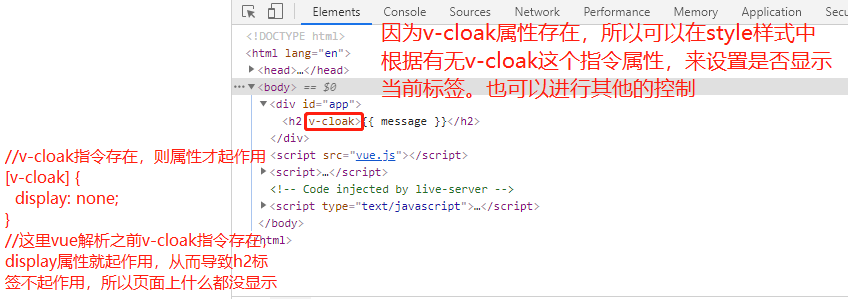
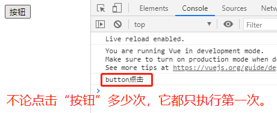

# 一、`Mustache`语法（插值操作）

1. 在`Vue`中`data`要在`View`中显示出来，要用`mustache`语法，也就是插值表达式，用两个花括号将变量包裹起来。

2. `mustache`语法中除了变量，还可以是简单的表达式，比如`{{ counter * 2 }}`  `//counter`为`data`中定义了的变量。

# 二、指令

## 1. `v-once`

1. 一般的`mustache`会随着数据的改变而改变`View`层显示的内容，但是如果在标签上添加了`v-once`语法，就会只在开始展现一次，后面不再随着`data`的变化而变化。
2. 该指令后面不需要跟任何表达式。
3. 该指令表示元素和组件只渲染一次，不会随着数据的改变而改变。
4. 某些特殊情况下会使用到这个指令，大部分情况下不会用到。

```html
<body>
	<div id="app">
		<h2 >{{ message }}</h2>
		<h2 v-once>{{ message }}</h2>
	</div>
	<script src="vue.js"></script>
	<script>
		let app = new Vue({
			el: '#app',
			data: {
				message: 'Hello VueJs'
			}
		})
	</script>
</body>
```

5. 初始显示效果都一致，但是在`console`下修改`app`实例的`message`的值，有`v-once`修饰的不会发生变化：


## 2. `v-html`

1. 如果从服务器请求的数据是`html`或者定义的变量的值是`html`，如果直接通过`mustache`语法，则输出的是文本格式，不能解析`html`代码。

2. `v-html`可以将变量中的`html`代码进行解析，并显示解析后对应的内容。

3. `v-html`指令后面往往会跟上一个`string`类型的变量，它会将这个`string`当作`html`解析出来，并且在`v-html`所作用的标签上进行渲染。

4. 下面就是把`url`当作一个`string`变量进行解析，解析完后再放在`v-html`所作用的标签上渲染。

```html
<body>
	<div id="app">
		<h2>{{ url }}</h2>    //mustache语法不解析html代码
		<h2 v-html="url"></h2>  //v-html先解析html代码，然后再在当前作用的标签即h2上进一步渲染
	</div>
	<script src="vue.js"></script>
	<script>
		let app = new Vue({
			el: '#app',
			data: {
				url: '<a href="https://www.baidu.com">百度一下</a>'
			}
		})
	</script>
</body>
```


## 3. `v-text`

1. `v-text`和`mustache`语法比较相似，都是用于将数据显示在界面中。

2. - `v-text`通常情况下，接收一个`string`类型。

3. - 在开发中用`mustache`语法相对较多，`v-text`用的很少，因为`v-text`不如`mustache`语法灵活。

```html
<body>
	<div id="app">
		<h2>{{ message }},这是第一个Vue程序</h2>  //mustache语法可以拼接其他内容，更灵活
		<h2 v-text="message">,这是第一个Vue程序</h2>  //v-text会覆盖掉所在标签包裹的内容
	</div>
	<script src="vue.js"></script>
	<script>
		let app = new Vue({
			el: '#app',
			data: {
				message: "Hello, World!"
			}
		})
	</script>
</body>
```


## 4. `v-pre`

1. `v-pre`用于跳过这个元素和它子元素的编译过程，用于显示原本的`mustache`语法（原原本本把`mustache`语法显示出来）。

2. - 如`<h2 v-pre>{{message}}</h2>`，即使在`Vue`的实例中有`message`这个变量，这里也不会编译解析这个变量的值，而是输出`{{message}}`本身。

```html
<body>
	<div id="app">
		<h2>{{ message }}</h2>
		<h2 v-pre>{{ message }}</h2>
	</div>
	<script src="vue.js"></script>
	<script>
		let app = new Vue({
			el: '#app',
			data: {
				message: "Hwllo World!"
			}
		})
	</script>
</body>
```


## 5. `v-cloak`

1. 浏览器在解析`html`代码时，先显示的是`mustache`语法（因为此时还未解析到`vue`的代码处），等解析到`vue`的代码处时，才会用`vue`中的变量等替换之前的`mustache`语法，这个过程很短暂（但是如果某些原因导致浏览器界面没有及时响应，显示的就会一直是`mustache`语法，用户体验就不友好）。

2. `v-cloak`指令，在`vue`没有解析到`v-cloak`指令所在的标签时，是作为一个无值的属性存在的。等`vue`解析到`v-cloak`指令所在的标签后，就会删除`v-cloak`指令，并显示解析过`mustache`语法的`html`代码。

3. 利用这一特性，可以使用`v-cloak`指令在`vue`解析它前后存在与否的特点来控制某些需要控制的标签，如是否显示该标签等。例如上面1)中的延迟影响用户体验，那就在vue解析之前不显示mustache语法所在的标签：设置v-cloak指令，vue在没解析该指令所在标签前，v-cloak指令是作为一个无值属性存在的，然后设置style样式中display为none，这样当vue解析完该指令所在标签后，会删除v-cloak指令，然后才显示这个标签；

4. `v-cloak`指令很少使用，**简单理解就是：`vue`没解析`v-cloak`指令所在标签时，`v-cloak`作为当前标签的一个无值属性存在，当`vue`解析过当前标签时，`v-cloak`指令就被删除。**

```html
<body>
	<div id="app">
		<h2>{{ message }}</h2>
	</div>
	<script src="vue.js"></script>
	<script>
		setTimeout(() => {    //setTimeout函数两个参数，延迟第二个参数指定的秒数后，再执行第一个参数指定的函数
			let app = new Vue({
				el: '#app',
				data: {
					message: "Hello world"
				}
			})
		}, 10000);    //设置延迟十秒
	</script>
</body>
```

- 上面的代码，也就是不设置v-vloak就会出现下面的情况：


```html
<body>
	<div id="app" >
		<h2 v-cloak>{{ message }}</h2>  //v-cloak指令作用于h2标签上
	</div>
	<script src="vue.js"></script>
	<script>
		setTimeout(() => {
			let app = new Vue({
				el: '#app',
				data: {
					message: "Hello world"
				}
			})
		}, 5000);    //延迟五秒
	</script>
</body>
```


```html
<head>
	<style>
		[v-cloak] {    //v-cloak指令所作用的标签就受到本样式的影响，实际就是vue解析前后v-cloak指令所在标签的样式不同
			display: none;
		}
	</style>
</head>
<body>
	<div id="app" >
		<h2 v-cloak>{{ message }}</h2>
	</div>
	<script src="vue.js"></script>
	<script>
		setTimeout(() => {
			let app = new Vue({
				el: '#app',
				data: {
					message: "Hello world"
				}
			})
		}, 5000);
	</script>
</body>
```




## 6. `v-bind`

1. 前面学的基本都是把变量插入到`mustache`语法中，但是实际开发中，可能属性也不是固定值，而是需要将变量插入到属性的值中，如动态绑定`<a>`标签中的`href`属性，``标签中的`src`属性。这时候可以用`v-bind`指令动态绑定属性。

```html
<body>
	<div id="app">
		<a :href="url">百度一下</a>
	</div>
	<script src="vue.js"></script>
	<script>
		let app = new Vue({
			el: '#app',
			data: {
				url: 'https://www.baidu.com/'
			}
		})
	</script>
</body>
```


2. 决定属性是否存在：用`v-bind`可以绑定一个对象，如`<div :class="{active:isActive, show:isShow}"></div>`，然后在`vue`的`data`中控制`isActive`和`isShow`的值，如果`isActive`为真，那么`active`这个属性就存在，并和`class`绑定，如果`isActive`为假，那么`active`这个属性就不存在，`show`同理。在实际的开发中，有时候需要某个`class`来控制一些样式，有时候不需要某个`class`，这时候就可以用`v-bind`动态绑定。

3. `v-bind`绑定属性和一个对象时，对象是`{key1:value1, key2:value2}`，这里的`value`是布尔值，如果为真，那么对应的`key`就会作为类名保留下来，并和对应的`class`属性绑定，如果`value`为假，那么对应的`key`就会舍弃。假如和`class`绑定，那么当`value`为假时，对应的`key`就不是`class`的值，也就不能通过操作这个类值来控制这个`DOM`。

```html
<head>
	<style>
		.active {
			background-color: #0f0;
		}
		.show {
			font-size: xx-large;
		}
	</style>
</head>
<body>
	<div id="app">
		<h2 :class="{active: isActive, show: isShow}">hello world</h2>
	</div>
	<script src="vue.js"></script>
	<script>
		let app = new Vue({
			el: '#app',
			data: {
				isActive: true,
				isShow: true
			},
		})
	</script>
</body>
```


4. 这里还可以在标签中继续添加`class`属性（不进行绑定），最终的结果会合并绑定了变量的`class`和没有绑定变量的`class`。即和普通类同时共存`<h2 class="title" :class="{active: isActive}">hello world</h2>`。

```html
<body>
	<div id="app">
		//类名(key)是否为字符串都可以，用引号引起来就是常量，固定为show，没有用引号引起来那就当作一个key使用
		//值如果没用引号引起来那就是变量，会查找data中的变量来确定，用引号引起来就是常量
		<h2 class="title" :class="{active: isActive, 'show': isShow}">Hello World</h2>  
	</div>
	<script src="vue.js"></script>
	<script>
		let app = new Vue({
			el: '#app',
			data: {
				isActive: true,
				isShow: true,
			}
		})
	</script>
</body>
```


5. `v-bind`绑定`class`：

	- 用法一：直接绑定一个普通变量`<h2 :class="active">hello world</h2>`，`class`的值就是`active`的值。

	- 用法二：绑定一个对象，对象中包含一个或多个键值对（`key: value`），值为`Boolean`类型，根据`value`值来确定`key`是否作为类名保留为`<h2 :class="{active: isActive, show:isShow}">hello world</h2>`。

	- 用法三：和普通类同时共存`<h2 class="title" :class="{active: isActive}">hello world</h2>`

	- 用法四：数组语法，也可以和普通类共存`<h2 :class="['active', 'show']">hello world</h2>`，数组语法用得很少，但是对象语法用的很多。


```html
<head>
	<style>
		.active {
			color: rgb(152, 238, 13);
		}
	</style>
</head>
<body>
	<div id="app">
		<ul>
			<!--
				1. v-for作用的标签，会进行遍历，有多少个元素就会创建多
					少个标签，item分别从第一项到最后一项，index从0到n-1；
				2. 具体来说，这里的v-for会创建5个<li>标签，第一个item为
					‘海贼王’，index为0，其余内容每个<li>标签都是保持一致的；
				3. 点击某一个item所在的<li>标签时，可以把对应的index传给一
					个变量change，这样就能使该变量change仅等于当前被点击的
					index，从而可以使得被点击项可以因为变量change和index相
					等、但其他<li>标签上的index和change不相等而仅保留被点击
					项的class，进而通过操作class进行其他操作。
				4. 实际开发中很常用，比如分类中，选中侧边的
					某一类，在右边显示细分的子类。 
			-->
			<li v-for="item, index in movies" 
				@click="toggle(index)" 
				:class="{active: change == index}">{{ item }}</li>
		</ul>
	</div>
	<script src="vue.js"></script>
	<script>
		let app = new Vue({
			el: '#app',
			data: {
				change: 0,
				movies:['海贼王', '天下无贼', '钢铁侠', '大明王朝', '雍正王朝']
			},
			methods: {
				toggle(index){
					this.change = index
				}
			}
		})
	</script>
</body>
```


6. `v-bind`绑定`style`

- 在实际开发中，比如一个导航栏可以做成一个组件，但是在不同的页面，导航栏的样式或多或少有区别(例如京东“首页”和“分类”顶部的导航栏)，这时候可以通过绑定样式来进行控制。

- 属性绑定有两种方式，一是对象语法，二是数组语法。

- 对象语法：`<h2 :style="{color: currentColor, fontSize: fontSize+'px'}">{{ message }}</h2>`，绑定样式的也是键值对，`key`为属性名，可以驼峰式写法如`fontSize`，也可以短横线写法如`font-size`（使用短横线写法报错，可能脚手架中可以），`value`一般为变量，主要是为了不写固定值，而可以根据当前页面传递过来的样式给定的值来确定。这里如`currentColor`一般是从服务器接收来的，由`data`中定义并接收。

- 还可以把一个变量和`style`绑定，而这个变量写成一个计算属性，用一个三目运算符返回一个对象（为真）或者空对象（为假）。这里的思想就是，如果某个绑定的属性较为复杂，就可以替换为一个变量或者方法，然后放在一个`methods`或者`computed`里面。

```html
<body>
	<div id="app">
		<h2 :style="{backgroundColor:currentColor, fontSize:size + 'px'}">Hello World</h2>
	</div>
	<script src="vue.js"></script>
	<script>
		let app = new Vue({
			el: '#app',
			data: {
				currentColor: 'blue',
				size: 50
			}
		})
	</script>
</body>
```


- `v-bind`与`style`绑定，后面可以是对象（上面就是对象写法），也可以是数组，数组中的元素一般也是对象。数组语法很少用，用的多的是对象语法。

```html
<body>
	<div id="app">
		<p :style="[baseStyle, newStyle]">Hello World</p>
	</div>
	<script src="vue.js"></script>
	<script>
		let app = new Vue({
			el: '#app',
			data: {
				baseStyle: {backgroundColor: 'red'},
				newStyle: {fontSize: '60px'},
			}
		})
	</script>
</body>
```


- 组件开发中常用，同一个组件在不同界面显示时其`style`可能略有差别，就是通过`v-bind`与`style`绑定实现。


## 7. `v-on`

1. 前端开发过程中，我们经常需要和用户交互，也就需要监听用户操作发生的事件，比如点击、拖拽、键盘敲击等事件监听指令，`v-on:click="increment"`，语法糖写法`@click="increment"`。

2. `increment`是在`methods`中定义的方法，表示点击`v-on`作用的元素时，触发`increment`函数。

```html
<body>
	<div id="app">
		<div>{{count}}</div>
		<button @click="increment()">+</button>  //事件监听的时候如果方法没有参数，可以省略调用时的小括号
		<button @click="decrement()">-</button>  //其他任何地方(比如mustache语法中)，或者带有参数，小括号都不可以省略
	</div>
	<script src="vue.js"></script>
	<script>
		let app = new Vue({
			el: "#app",
			data: {
				count: 0
			},
			methods: {
				increment(){
					this.count++;
				},
				decrement(){
					this.count--;
				}
			}
		})
	</script>
</body>
```


3. 除了`click`，还有`keyup`关键字表示按键，`dbclick`表示双击，`mouseenter`表示鼠标移入；`.keyup`/`.keydown`表示抬起、按下某个按键触发监听事件方法，`.keyup.enter`表示抬起回车键触发事件。


```html
<body>
	<div id="app">
		<!-- <button @keyup.enter="keyUP()">按钮</button> -->
		<input type="text" @keyup.enter="keyUp()">
	</div>
	<script src="vue.js"></script>
	<script>
		let app = new Vue({
			el: "#app",
			methods: {
				keyUp(){
					console.log("按键抬起！");
				}
			}
		})
	</script>
</body>
```


4. 如果`increment`函数没有参数，则圆括号可以省略，如果有参数，后面必须带圆括号。

5. 如果函数定义有参数，那么正常情况下调用函数的时候应该传入参数，也不应该省略小括号。如果没有传入参数，也没有省略小括号，那么函数执行的时候其中的变量就是`undefined`类型。

```html
<body>
	<div id="app">
		<button @click="show()">按钮</button>
	</div>
	<script src="vue.js"></script>
	<script>
		let app = new Vue({
			el: "#app",
			methods: {
				show(num){
					console.log(num);
				}
			}
		})
	</script>
</body>
```


6. 如果函数定义有形参，而调用的时候既没有传入实参，也省略了小括号，这时候`Vue`会默认将浏览器生成的`event`事件对象作为参数传入到方法中去（`event`对象是用户才操作浏览器，比如进行拖拽、点击等操作时，浏览器会自动生成的一个对象。严格来说，如果函数定义时有多个形参，那这个`event`对象会传递给函数定义中第一个形参）。


```html
<body>
	<div id="app">
		<button @click="showName">点击</button>
	</div>
	<script src="vue.js"></script>
	<script>
		let app = new Vue({
			el: "#app",
			data: {
				name
			},
			methods: {
				showName(name){
					console.log(name);
				}
			}
		})
	</script>
</body>
```


7. 如果既需要其他参数，又需要`event`参数，那么在定义方法的时候，就定义需要的参数和一个`event`参数（习惯性取名，非固定），然后在调用的时候，传递对应的参数，在传递`event`参数时，写成`$event`。

```html
<body>
	<div id="app">
		<button @click="btnClick(123, $event)">按钮</button>  //传递实参的时候要带$符号
	</div>
	<script src="vue.js"></script>
	<script>
		let app = new Vue({
			el: "#app",
			methods: {
				btnClick(num, event){
					// 定义形参的时候不需要带$符号，event也只是习惯命名，非固定
					console.log(num, event);
				}
			}
		})
	</script>
</body>
```


```html
<body>
	<div id="app">
		// $符号是必须的，否则event就是用户定义的变量，先在data中查找，找不到就报错
		<button @click="btnClick($event)">按钮</button>  
	</div>
	<script src="vue.js"></script>
	<script>
		let app = new Vue({
			el: "#app",
			methods: {
				btnClick(num, event){
					console.log(num, event);
				}
			}
		})
	</script>
</body>
```


8. `input`输入的时候可以调用`@input`方法，也可以用`v-bind:value`绑定该值，两个合起来就是`v-model:varlable`。

9. `v-on`常用修饰符：

- `.stop`调用`event.stopPropagation()`，意为阻止事件冒泡。例如`div`中仅仅包裹一个`button`，点击`button`时其实也点击了`div`，因为事件会冒泡，从最内层发生事件的标签一直传递到顶层标签，而`.stop`可以阻止传递。

```html
<body>
	<div id="app">
		<div @click="parentClick()">
			这是父标签div包裹的内容，里面还有一个button按钮<br/>
			<button @click="btnClick()">按钮</button>
		</div>
	</div>
	<script src="vue.js"></script>
	<script>
		let app = new Vue({
			el: "#app",
			methods: {
				parentClick(){
					console.log("点击了div部分");
				},
				btnClick(){
					console.log("点击了button按钮");
				}
			}
		})
	</script>
</body>
```


```html
<body>
	<div id="app">
		<div @click="parentClick()">
			这是父标签div包裹的内容，里面还有一个button按钮<br/>
			<button @click.stop="btnClick()">按钮</button>
		</div>
	</div>
	<script src="vue.js"></script>
	<script>
		let app = new Vue({
			el: "#app",
			methods: {
				parentClick(){
					console.log("点击了div部分");
				},
				btnClick(){
					console.log("点击了button按钮");
				}
			}
		})
	</script>
</body>
```


- `.prevent`调用`event.preventDefault()`，阻止默认事件，比如`form`表单中有一个`input`控件，类型为`submit`，当点击`input`按钮时，默认会提交表单到`form`中的`action`处，如果监听一个事件同时用`.prevent`修饰，这样就会阻止默认事件（即不再提交表单到`action`处），转而只执行监听的事件方法。


```html
<body>
	<div id="app">
		<form action="https://www.baidu.com">
			<input type="submit" value="提交" @click.prevent="btnClick()">
		</form>
	</div>
	<script src="vue.js"></script>
	<script>
		let app = new Vue({
			el: "#app",
			methods: {
				btnClick(){
					console.log("阻止标签的默认行为");
				}
			}
		})
	</script>
</body>
```


- `.native`监听组件根元素的原生事件。

- `.once`只触发一次事件方法。


```html
<body>
	<div id="app">
		<button @click.once="btnClick()">按钮</button>
	</div>
	<script src="vue.js"></script>
	<script>
		let app = new Vue({
			el: "#app",
			methods: {
				btnClick(){
					console.log("button点击");
				}
			}
		})
	</script>
</body>
```




## 8. `v-if`、`v-else-if`、`v-else`

1. `Vue`的指令可以根据表达式的值在`DOM`中渲染或销毁元素或组件，条件为`false`时，对应的元素以及其子元素不会渲染，也就是根本不会有对应的标签出现在`DOM`中。

2. 大量的逻辑判断并不推荐使用`v-if`、`v-else-if`、`v-else`指令，而是直接在`js`代码中实现，再在`html`模板中用`mustache`语法展示。

```html
<body>
	<div id="app">
		// v-if、v-else-if、v-else三个指令不一定要作用于同样的标签，而是要作用于同一级标签
		<h1 v-if="isShow">isShow:{{isShow}}</h1>  
		<h2 v-else>isShow:{{isShow}}</h2>  //h1和h2不是完全一致的标签，但是是兄弟级的同级标签
	</div>
	<script src="vue.js"></script>
	<script>
		let app = new Vue({
			el: "#app",
			data: {
				isShow: true,
			}
		})
	</script>
</body>
```


## 9. `v-show`

1. `v-show`和`v-if`非常类似，也用于决定一个元素是否渲染。

2. `v-show`对比`v-if`：`v-if`的条件为`false`时，包含`v-if`指令的元素，根本就不会存在于`DOM`中，完全不渲染。而`v-show`的条件为`false`时，所在的标签仍然会被渲染在浏览器中，但是`v-show`会给我们的元素添加了一个行内样式：`display：none`，这样只是肉眼不可见而已。

```html
<body>
	<div id="app">
		<h1 >isShow:{{ isShow }}</h1>
		<h1 v-show="isShow">isShow:{{ isShow }}</h1>
	</div>
	<script src="vue.js"></script>
	<script>
		let app = new Vue({
			el: "#app",
			data: {
				isShow: false,
			}
		})
	</script>
</body>
```


3. 当需要在显示和隐藏之间频繁切换时，使用`v-show`，当只需要切换一次时，使用`v-if`。


## 10. `v-for`

1. **遍历数组**，可以只获取`value`，可以同时获取`(value，index)`。

```html
<body>
	<div id="app">
		<h4>v-for循环遍历不使用索引值：</h4>
		<ul>
			<li v-for="item in names">{{item}}</li>
		</ul>
		<h4>v-for循环遍历使用索引值：</h4>
		<ul>
			<li v-for="(item, index) in names"> {{index}}  {{item}} </li>
		</ul>
	</div>
	<script src="vue.js"></script>
	<script>
		let app = new Vue({
			el: "#app",
			data: {
				names: ['James', 'Kobe', 'Sara', 'Mike'],
			}
		})
	</script>
</body>
```


2. **遍历对象**，可以只获取`value`（`value in items`），可以同时获取（`value，key in items`），还可以同时获取（`value，key，index`）。

```html
<body>
	<div id="app">
		<!-- 1.循环遍历对象，只取一个值，则默认遍历对象中元素的值 -->
		<ul>
			<li v-for="value in info">{{ value }}</li>
		</ul>
		<!-- 2.循环遍历对象，取两个值（value, key） -->
		<ul>
			<li v-for="(value, key) in info">key: {{key}} <br> value:{{ value }}</li>
		</ul>
		<!-- 3.循环遍历对象，获取三个值（value, key, index）三个值，但是index很少用 -->
		<ul>
			<li v-for="(value, key, index) in info">key: {{key}} <br> value:{{ value }} <br> index:{{index}}</li>
		</ul>
	</div>
	<script src="vue.js"></script>
	<script>
		let app = new Vue({
			el: "#app",
			data: {
				info: {
					name: "James",
					age: 20,
					height: 1.88,
					gender: "M"
				}
			}
		})
	</script>
</body>
```


3. 官方推荐，我们在使用`v-for`时，给对应的元素或组件添加上一个`:key`属性，这样可以更高效地更新虚拟`DOM`。

4. 当某一层有很多相同的节点时，也就是列表节点时`[A,B,C,D,E]`，我们希望在`B`和`C`之间插入一个新的节点`F`，`Vue`的虚拟`DOM`默认执行`Diff`算法，它会把`C`更新为`F`，`D`更新为`C`，`E`更新为`D`，最后再在末尾插入`E`，这样效率很低。而给每个元素添加上`:key`属性后，相当于对每一个元素做了唯一标识，`Diff`算法就可以正确地识别此节点，直接在`B`和`C`之间插入`F`，效率更高。


```html
<body>
	<div id="app">
		<ul>
			<li v-for="value in letters">{{value}}</li>
		</ul>
	</div>
	<script src="vue.js"></script>
	<script>
		let app = new Vue({
			el: "#app",
			data: {
				letters: ['A', 'B', 'C', 'D', 'E']
			}
		})
	</script>
</body>
```


5. `:key`后面一般绑定`item`而不绑定`index`，因为`item`不变，而`index`在插入新的`F`后会变，没有起到复用的效果。绑定`:key`的时候，`vue`会检查当前行是否发生了变化，绑定的是`item(value)`的时候，不管中间插入多少个元素，`item`或者说`value`的值是不会变的，但是下标是会后移或前移的，而只有这一行（`<li v-for="value in letters" :key="value">{{value}}</li>`）没有变化才会复用，绑定的是`item`的时候，`A`、`B`、`C`、`D`、`E`各行都不变。而每一项的索引值`index`是会变的。


```html
<body>
	<div id="app">
		<ul>
			<li v-for="value in letters" :key="value">{{value}}</li>
		</ul>
	</div>
	<script src="vue.js"></script>
	<script>
		let app = new Vue({
			el: "#app",
			data: {
				letters: ['A', 'B', 'C', 'D', 'E']
			}
		})
	</script>
</body>
``


## 11. `v-model`

1. `v-model`可以实现数据的双向绑定，即把`input`输入的数据和一个变量双向绑定。

2. 可以用`v-bind:value='message'`和`v-on:input="valueChang"`代替`v-model`指令，效果是一致的。`v-on`监听的`input`事件是`input`输入框的事件，在定义方法`valueChange`的地方，用一个形参`event`接收，而值就用`event.target.value`。


​```html
<body>
	<div id="app">
		<input type="text" v-model="message">
		<br/>
		<p>messgae: {{message}}</p>
	</div>
	<script src="vue.js"></script>
	<script>
		let app = new Vue({
			el: "#app",
			data: {
				message: "hello world",
			}
		})
	</script>
</body>
```


- 上面的代码等价于下面的代码，下面是用`v-bind`和`@input`分两步绑定：

```html
<body>
	<div id="app">
		<input type="text" :value="message" @input="setValue">
		<p>message: {{message}}</p>
	</div>
	<script src="vue.js"></script>
	<script>
		let app = new Vue({
			el: "#app",
			data: {
				message: "hello world",
			},
			methods: {
				setValue(event){
					this.message = event.target.value;
				}
			}
		})
	</script>
</body>
```

3. `v-model`和`input`的`radio`类型绑定，`v-model`后面绑定的变量其值是`input`中的`value`，并且`radio`作为单选框，原来需要`name`属性来设置单选框的互斥，这时候可以不写`name`也能保证互斥，因为多个单选框中选一个的情况下，`v-model`后面绑定同一个变量就保证了互斥。反过来`v-model`绑定的变量其值如果等于某个`radio`单选框的`value`的值，那么这个单选框就是选中的。

```html
<body>
	<div id="app">
		<!-- 
			1.在input的radio类型中，有了v-model绑定同一个变量，name属性就可以省略
			2.v-model在input的radio类型中要绑定同一个变量，这样才能保证互斥
			3.v-model绑定的变量的值等于input的value的值时，该input标签就是被选中的
		-->
		<input type="radio" name='gender' value="man" v-model="sex">男
		<input type="radio" name='gender' value="woman" v-model="sex">女
		<br />
		<p>sex: {{sex}}</p>
	</div>
	<script src="vue.js"></script>
	<script>
		let app = new Vue({
			el: "#app",
			data: {
				sex: "woman"
			}
		})
	</script>
</body>
```


4. `v-model`和`input`的`checkbox`绑定，不同的`checkbox`绑定不同的变量（因为是复选框，不需要互斥，多个框都是可以被同时选中的），被选中的`checkbox`其绑定的`v-model`变量值变为`true`，取消选中的其值为`false`。不同的`checkbox`也可以用`v-model`绑定同一个变量，不过这个变量必须是数组，数组中元素是依次选中的`checkbox`的`value`。

- 这里有两种应用场景，一是一个复选框选中同意协议之类的，二是多个复选框选择多个选项中的部分（如交友网站中的兴趣爱好选择）。

```html
<body>
	<div id="app">
		<!-- 
			1.多个复选框，每个复选框用v-model绑定不同的变量
			2.每个复选框所绑定的变量的值为true还是false，和当前复选框是否为选中状态是一一对应的
		-->
		<label for="agreeement">
			<input type="checkbox" id="agreeement" v-model="isAgree">同意协议
		</label>
		<label for="privacy">
			<input type="checkbox" id="privacy" v-model="isPrivacy">已读隐私条款
		</label>
		<p>isAgree: {{isAgree}}</p>
		<p>isPrivacy: {{isPrivacy}}</p>
	</div>
	<script src="vue.js"></script>
	<script>
		let app = new Vue({
			el: "#app",
			data: {
				isAgree: false,
				isPrivacy: true,
			}
		})
	</script>
</body>
```


```html
<body>
	<div id="app">
		<input type="checkbox" value="basketball" v-model="hobbies" @input="select">篮球
		<input type="checkbox" value="volleyball" v-model="hobbies" @input="select">排球
		<input type="checkbox" value="pingpangball" v-model="hobbies" @input="select">乒乓球
		<input type="checkbox" value="soccer" v-model="hobbies" @input="select">足球
		<p>hobbies: {{hobbies}}</p>
	</div>
	<script src="vue.js"></script>
	<script>
		let app = new Vue({
			el: "#app",
			data: {
				hobbies: [],
			},
			methods: {
				select(event){
					console.log(event.target.value);
				}
			}
		})
	</script>
</body>
```


5. `v-model`和`select`绑定，`v-model`作用于`select`上，其子标签`option`中的`value`属性会添加到`v-model`绑定的变量中。如果`select`上有`multiple`属性，那么`v-model`绑定的是一个数组，类似`checkbox`。

```html
<body>
	<div id="app">
		<select name="fruits" id="one" v-model="fruit">
			<option value="香蕉">香蕉</option>
			<option value="苹果">苹果</option>
			<option value="梨子">梨子</option>
			<option value="葡萄">葡萄</option>
		</select>
		<br><br><br><br><br>
		<p>您现在选中的水果是：{{ fruit }}</p>
	</div>
	<script src="vue.js"></script>
	<script>
		let app = new Vue({
			el: "#app",
			data: {
				fruit: "梨子"
			}
		})
	</script>
</body>
```


- `select`中有`multiple`多选属性的时候，用`v-model`绑定一个数组变量接收选中的`option`的`value`属性的值，这些值在`v-model`绑定的数组变量中的顺序只和`option`在`select`中先后顺序有关，和选中的现后顺序无关。

- 而在`checkbox`中，`v-model`绑定一个数组变量接收选中的`value`属性的值，数组变量中的元素的顺序只和选中的先后顺序有关，和`checkbox`的先后顺序无关。

```html
<body>
	<div id="app">
		<select name="fruits" id="one" v-model="fruit" multiple>
			<option value="香蕉">香蕉</option>
			<option value="苹果">苹果</option>
			<option value="梨子">梨子</option>
			<option value="葡萄">葡萄</option>
		</select>
		<br><br><br><br><br>
		<p>您现在选择的水果有：{{fruit}}</p>
	</div>
	<script src="vue.js"></script>
	<script>
		let app = new Vue({
			el: '#app',
			data: {
				fruit: [],
			}
		})
	</script>
</body>
```


6. 值绑定：在实际开发中，`input`或`select`等中的`value`值不会直接写死，而是从服务器获取数据，然后`v-for`遍历该数据，然后`:value="item"`绑定其中的每一项数据。

```html
<body>
	<div id="app">
		<!-- 2.input选项中一般建议给加一个label标签,for和对应的id都是动态绑定遍历得到的数组元素的值 -->
		<label v-for="item in originalHobbies" :for="item">
			<!-- 3.value动态绑定一个值，这个值是把后台获取的数据遍历得到的 -->
			<input type="checkbox" :value="item" :id="item" v-model="hobbies">{{item}}
		</label>
		<p>您的爱好：{{hobbies}}</p>
	</div>
	<script src="vue.js"></script>
	<script>
		let app = new Vue({
			el: '#app',
			data: {
				// 1.每个选项的值都不会是写死的，而是从后台获取的，假设从后台获取了以下值并赋给originalHobbies
				originalHobbies: ['篮球', '足球', '乒乓球', '羽毛球', '台球'],
				hobbies: [],
			}
		})
	</script>
</body>
```


7. `v-model`修饰符：

- `.lazy`懒加载：`v-model`的数据是双向实时绑定，`View`层或`model`层任一改变都将互相影响，这就会导致更新太频繁，没有必要，加上`.lazy`（`v-model.lazy`）后就不会实时更新，而是敲回车或者失去焦点（鼠标点击其他地方）时才会更新。

- `.number`数字化：默认情况下，`input`输入框中不论输入什么，不论`type`后面设置哪种类型，`v-model`绑定的变量都只会获得一个字符串类型的值，但是如果希望保持数字字面量，那么可以写`v-model.number`将后面的变量自动转为数字类型。

- `.trim`去空格：如果输入框中输入的内容有很多空格，可以用这个修饰符去掉首尾的空格。


8. `v-model`是双向绑定。首先对父组件而言，在父组件中、子组件上用`v-model`绑定一个变量`Num`（该变量定义在父组件中），那么该变量`Num`会接收到子组件传递过来的值，可以通过`watch`监听这个`Num`变量的值的变化情况。本质是在父组件中、子组件上添加`v-model`属性时，`Vue`底层会通过`v-bind`把`value`变量和`Num`变量进行绑定，且绑定`@input`监听了`input`事件，而子组件中通过`this.$emit('input', '参数值')`把‘参数值’传递给了`input`事件，`input`事件则把接收到的值传递给了`value`再进一步传递给`Num`变量。在子组件中，则要通过`props`接收父组件传递过来的值。(参考资料：https://www.jianshu.com/p/4147d3ed2e60)

```html
<body>
<div id="app"></div>
<script src="vue.js"></script>
<script>
	Vue.component('my-button',{
		template:`
			<div>
				<button @click="add">点击按钮自增 1</button>
				<button @click="output">点击</button>
			</div>`,
		props: {
			value: Number,
		},
		data(){
			return {
				number: 1,
			}
		},
		methods: {
			add() {
				this.$emit('input', this.value + 1) // 事件名必须是 input
			},
			output(){
				console.log(this.value);
			}
		}
	})
	new Vue({
		el:"#app",
		// template: `<my-button v-model="number"></my-button>`,
		template: `<my-button :value="number" @input="val => {number = val}"></my-button>`,
		data: {
			number: 100,
		},
		watch: {
			number(val){
				console.log(val);
			}
		}
	})
</script>
</body>
```


# 三、计算属性(重要，常用)


1. 在模板中可以直接通过插值语法显示一些`data`中的数据，但是在某些情况下，我们可能需要对数据进行一些转化或操作后再显示最终的结果，比如将多个数据结合起来显示，可以用计算属性`computed`。

2. 计算属性本质上是属性，只是其中的写法是函数写法，但是起名的时候仍按照属性的习惯，比如`totalPrice`而不是`getTotalPrice`。

3. 计算属性调用的时候也不带括号，而函数或方法一般是带括号的。

4. 计算属性有缓存，其中的值如果没有变化，则不会执行代码，即只有当计算属性中的值有变化时才会执行，这在某些情况下能节省性能。


```html
<body>
	<dic id="app">
		<!-- 没用计算属性时的常规写法，要么在一个mustache
			语法中写一个表达式拼接firstName和lastName，要
			么就是两个mustache语法用一个空格隔开 
		-->
		<h2>mustache语法表达式：{{ firstName + ' ' + lastName }}</h2>
		<h2>多个mustache语法结合：{{ firstName }} {{ lastName }}</h2>
		<!-- 上面这种写法有时候极为不便，比如要计算一个很长的
			表达式的时候，在模板中写一个mustache语句计算这个
			表达式理论上是可以，但是代码阅读和后期维护并不友好，
			例如计算多项购物单的总价时，一般是一个长长的表达式。
			尤其是这样的表达式在多个地方出现的时候，此时可以采
			用计算属性计算出表达式的结果，然后在模板中就只要引用
			这个最终的结果。
		-->
		<!-- 计算属性 -->
		<h2>计算属性：{{ fullName }}</h2>
		<!-- 上述也可以用方法实现，只是较为别扭 -->
		<h2>methods方法：{{ getFullName() }}</h2>
	</dic>
	<script src="vue.js"></script>
	<script>
		let app = new Vue({
			el: '#app',
			data: {
				firstName: 'Kobe',
				lastName: 'James'
			},
			computed: {	//这里是计算属性，里面实际是函数，但是函数名
						//一般按照名词性取名，因此为fullName，当作
						//一个属性，这里就不像methods中的函数那样取
						//函数名为getFullName。
				fullName(){
					return this.firstName + ' ' + this.lastName
				}
			},
			methods: {
				getFullName(){
					fullName = this.firstName + ' ' + this.lastName
					return fullName
				}
			}
		})
	</script>
</body>
```


```html
<body>
	<div id="app">
		<h2>总价格：{{ books[0].price + books[1].price + books[2].price + books[3].price }}</h2>
		<h2>总价格：{{ totalPrice }}</h2>
		<h2>总价格：{{ getTotalPrice() }}</h2>
	</div>
	<script src="vue.js"></script>
	<script>
		let app = new Vue({
			el: "#app",
			data: {
				books: [
					{id: 1, name: "Unix编程艺术", price: 110},
					{id: 2, name: "代码大全", price: 120},
					{id: 3, name: "深入理解计算机原理", price: 200},
					{id: 4, name: "现代操作系统", price:150}
				]
			},
			computed: {
				totalPrice(){
				// 计算属性可以直接返回各项相加
				// return this.books[0].price+this.books[1].price+this.books[2].price+this.books[3].price
				// 计算属性之所以为属性，主要体现在：
				// 1.首先在方法名上就体现了，虽然写法是方法的写法，但是取名却是属性取名，没有动词
				// 2.调用的时候调用计算属性名，这个属性名会取得属性定义的函数中return返回的值
				// let sum = 0
				// for(let i = 0; i < this.books.length; i++){
				//     sum += this.books[i].price
				// }
				// return sum  //在计算属性中，最后return返回的值都会赋给计算属性名
				// ES6语法中of就是从数组中遍历取每一项赋值给of之前的变量，
				// 第一次遍历this.books时，book就等于this.books[0]
					let sum = 0
					for( let book of this.books){
						sum += book.price
					}
					return sum
				}
			},
			methods: {
				getTotalPrice(){
					return this.books[0].price+this.books[1].price+this.books[2].price+this.books[3].price
				}
			}
		})
	</script>
</body>
```


5. 计算属性默认使用的是`getter`方法，`setter`不常用，但是每个计算属性都包含一个`getter`和一个`setter`。如果要设置`setter`，这时候：`totalPrce:{get(){},set(args){}}`，计算属性成为一个对象，内部写一个`set`和`get`方法，调用的时候还是写`totalPrice`。

```html
<body>
	<div id="app">
		<h2>{{ fullName }}</h2>
	</div>
	<script src="vue.js"></script>
	<script>
		let app = new Vue({
			el: '#app',
			data: {
				firstName: 'Kobe',
				lastName: 'James'
			},
			computed: {
				// 这其实只是计算属性的简写
				// fullName(){
				//     return firstName + ' ' + lastName
				// }
				// 计算属性完整的写法有两个内部函数，一个是setter方法，一个是getter方法，上面默认的是getter方法
				// fullName作为一个计算属性，也是一个对象
				fullName: {  //计算属性一般只设置只读属性，即只实现get方法，不实现set方法。这样就可以直接简写为上面的写法
					// 1.一般情况下set方法是不需要实现的，因为一般不希望别人随意修改计算属性的值
					// 2.set方法需要传值，set方法内对传递的参数进行操作后，计算属性在执行到上面的mustache语法的时候，又会调用get方法，所以set方法修改后的值就会生效
					set: function(newValue){  
						let names = newValue.split(" ");
						this.firstName = names[0];
						this.lastName = names[1];
					},
					get: function(){
						return this.firstName + " " + this.lastName  
						//get方法会默认返回给计算属性名fullName
					}
				}
			}
		})
	</script>
</body>
```


6. 计算属性`computed`会比`methods`方法更高效，所以遇到遍历计算总价格等复杂操作的时候，多使用`computed`计算属性，而不是`methods`，因为`methods`每调用一次都会执行函数体，遍历多次非常影响性能。而`computed`在属性值没有变化的时候只执行一次，效率更高。

```html
<body>
	<div id="app">
		<!-- 一个或多个mustache语句进行拼接理论上可以，但实际开发中语法过于繁琐，如果有多个mustache语句那么后期维护修改麻烦 -->
		<h2>一个mustache语句表达式：{{firstName + ' ' + lastName}}</h2>
		<h2>多个mustache语句拼接：{{ firstName}} {{ lastName }}</h2>
		<!-- methods方法实现 -->
		<h2>{{ getFullName() }}</h2>
		<h2>{{ getFullName() }}</h2>
		<h2>{{ getFullName() }}</h2>
		<!-- computed计算属性 -->
		<h2>{{ fullName }}</h2>
		<h2>{{ fullName }}</h2>
		<h2>{{ fullName }}</h2>
	</div>
	<script src="vue.js"></script>
	<script>
		let app = new Vue({
			el: '#app',
			data: {
				firstName: "Kobe",
				lastName: 'James',
			},
			methods: {
				getFullName(){
					console.log("调用了函数方法");
					return this.firstName + ' ' + this.lastName
				}
			},
			computed: {
				fullName: {
					set(newValue){
						let names = newValue.split(' ')
						this.firstName = names[0]
						this.lastName = names[1]
					},
					get(){
						console.log("调用了计算属性");
						return this.firstName + ' ' + this.lastName
					}
				}
			}
		})
	</script>
</body>
```


# 四、案例讲解

1. 案例：创建一个输入框和一个按钮，点击按钮切换输入邮箱或者输入用户名。如果在其中一种状态下输入了字符，点击切换到另一种状态时，会发现输入框中的文字没有清零。但是渲染出来的`DOM`是实实在在修改了的。

2. 这是因为`Vue`在进行`DOM`渲染时，会先把`DOM`渲染为虚拟`DOM`存储在内存中，然后再从内存中读取虚拟`VDOM`渲染到浏览器界面。出于性能考虑，`vue`会尽可能的复用已经存在的元素，而不是重新创建新的元素。本案例中，点击按钮切换时，从“用户账号”变为“用户邮箱”，`Vue`内部会发现原来的`input`元素不再使用，但是它会直接作为另一种状态的`input`来使用。对比两次的`input`标签，`vue`不会渲染`input`，但是会修改里面的属性值。

```html
<body>
	<div id="app">
		<span v-if="userOrEmail">
			<label for="username">用户账号：</label>
			<input type="text" id="username" placeholder="用户账户">
		</span>
		<span v-else>
			<label for="email">用户邮箱：</label>
			<input type="text" id="email" placeholder="用户邮箱">
		</span>
		<button @click="changeType()">按钮</button>
	</div>
	<script src="vue.js"></script>
	<script>
		let app = new Vue({
			el: "#app",
			data: {
				userOrEmail: true,
			},
			methods: {
				changeType(){
					this.userOrEmail = !this.userOrEmail;
				}
			}
		})
	</script>
</body>
```


3. 如果我们不希望`Vue`出现类似重复利用的问题，可以给对应的`input`添加`key`，并且保证不希望复用的`input`的`key`的值各不相同。

```html
<body>
	<div id="app">
		<span v-if="userOrEmail">
			<label for="username">用户账号：</label>
			// key决定是否复用，key的值相同的标签会复用，不同则不复用
			<input type="text" id="username" placeholder="用户账户" key="user">
		</span>
		<span v-else>
			<label for="email">用户邮箱：</label>
			<input type="text" id="email" placeholder="用户邮箱" key="email">
		</span>
		<button @click="changeType()">按钮</button>
	</div>
	<script src="vue.js"></script>
	<script>
		let app = new Vue({
			el: "#app",
			data: {
				userOrEmail: true,
			},
			methods: {
				changeType(){
					this.userOrEmail = !this.userOrEmail;
				}
			}
		})
	</script>
</body>
```


4. 如果`3`中的代码`key`值都设置为一样的，例如设置为“`user`”，那么`input`被复用，也就不会被重新渲染，而只会把其中的`input`标签中的属性值修改。

```html
<body>
	<div id="app">
		<span v-if="userOrEmail">
			<label for="username">用户账号：</label>
			<input type="text" id="username" placeholder="用户账户" key="user">
		</span>
		<span v-else>
			<label for="email">用户邮箱：</label>
			<input type="text" id="email" placeholder="用户邮箱" key="user">
		</span>
		<button @click="changeType()">按钮</button>
	</div>
	<script src="vue.js"></script>
	<script>
		let app = new Vue({
			el: "#app",
			data: {
				userOrEmail: true,
			},
			methods: {
				changeType(){
					this.userOrEmail = !this.userOrEmail;
				}
			}
		})
	</script>
</body>
```


# 五、响应式

1. 响应式的意思就是数据发生改变的时候，`View`也能同步发生变化。

2. 不是所有的变化都是响应式的，`push()`在末尾添加一个或多个元素、`pop()`删除数组中的最后一个元素、`shift()`删除数组中的第一个元素、`unshift()`在数组的最前面添加元素、`splice()`删除/替换/插入元素、`sort()`排序、`reverse()`反转。这几个函数都是响应式的。

3. `splice`元素有三个参数，第一个参数是`start`，表示开始操作的下标处，第二个元素表示要删除的元素个数，从第二个参数往后都是第三个参数。`splice`函数从`start`处开始删除第二个参数指定个数的元素，然后把第三个参数的元素都追加到数组`start`后面。如果没有第二、三个参数，则默认删除`start`后的全部元素，如果第二个参数为`0`，则不删除元素，并且把第三个参数的值插入到`start`后面，第三个参数可以是多个值。

4. 通过索引值直接修改元素，就不是响应式的，比如数组`items[0] = 'newValue'`这样的修改元素方式，变化不会反映到`View`层面上，因为`Vue`没有监听到通过下标改变元素值的事件，所以不会刷新`View`界面。

```html
<body>
	<div id="app">
		<!-- 1.通过下标修改数组，不是响应式的 -->
		<ul>
			<li v-for="item in items">{{item}}</li>
		</ul>
		<button @click="btnClick()">按钮</button>
	</div>
	<script src="vue.js"></script>
	<script>
		let app = new Vue({
			el: "#app",
			data: {
				items: ['A', 'B', 'C', 'D', 'E'],
			},
			methods: {
				btnClick(){
					this.items[0] = 'F';
					console.log(this.items);
				}
			}
		})
	</script>
</body>
```


