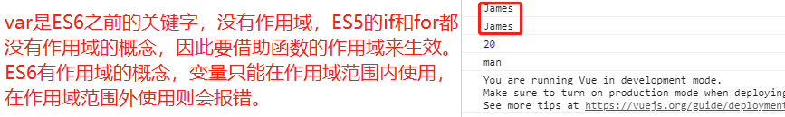
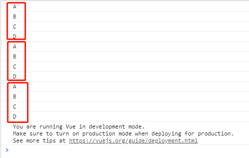

# 一、`var`与`let`、`const`

1. 事实上`var`可以看作`JavaScript`的设计缺陷，但是这种错误多半不能修复和移除，因为需要向后兼容。

2. `Brendan Eich`（`JavaScript`作者）决定修复这个问题，于是添加了关键字`let`。

3. 可以将`let`看作更完美的`var`。

4. `let`声明变量，`const`声明常量。

5. `var`没有作用域一说，在代码块内部可以使用，在外部也可以使用，即没有块级作用域。`let`有块级作用域。

6. `const`定义的是常量，不能修改。

7. 在使用`const`定义常量时，必须直接赋值。

8. 常量的含义是指向的对象不能修改，但可以改变对象内部的属性。

```html
<body>
	<div id="app"></div>
	<script src="vue.js"></script>
	<script>
		// 1. 变量作用域，其实就是变量在什么范围内是可用的
		// 2. var没有变量作用域的概念，所以var声明的变量可以在作用域内使用，也可以在作用域外使用
		{
			var name = "James"
			console.log(name);
		}
		console.log(name);
		// 3. let声明的变量是有作用域的，只能在作用域内使用，在作用域外使用报错。const也是同理
		{
			let age = 20
			console.log(age);
			const gender = 'man'
			console.log(gender);
		}
		// 4. 在作用域外使用let声明的变量会报错，const同理
		// console.log(age);
		// console.log(gender);
	</script>
</body>
```




# 二、`ES6`的增强写法

## （一）属性的增强写法

1. `ES5`的写法
```javascript
const name = 'feng';
const age = 18;
const height = 1.88
	
const obj = {
	name: name,
	age: age,
	height: height
}
```

2. `ES6`的写法

```javascript
const name = 'feng';
const age = 18;
const height = 1.88

Const obj = {
	name,  //等价于ES5的name: name，下面同理
	age,
	height
}
```

## （二）函数的增强写法

1. `ES5`的写法

```javascript
eat: function(){};
```

2. `ES6`的写法

```javascript
eat(){};
```

# 三、保留小数

1. `num.toFixed(2)`表示`num`这个数保留两位小数。

# 四、过滤器`Filter`

1. 比如`05`案例中价格显示前面要加`￥`符号，后面要保留两位小数，有三种方法做到，一是在`mustache`语法中直接写`{{'￥' + totalPrice.toFixed()}}`，二是写一个函数返回特定格式的结果，然后再`mustache`语法中调用该函数，三是过滤器。

2. 过滤器类似`linux`中的管道，`{{item.price | showPrice}}`，它会把前面参数的`price`属性当作参数传给后面的`showPrice`过滤器，`showPrice`写在`Vue`的`filters:{showPrice(price){return '￥' + totalPrice.toFixed();}}`中，`filters`表示过滤器，`showPrice`必须有形参。


# 五、遍历

1. `for(let i = 0; i < items.count; i++){};`

2. `for(let i in items){};`

3. `for(let i of items){};`

4. 第`1`是遍历循环，第`2`用关键词`in`可以给`i`获取下标，第`3`用`of`直接获取`items`的每一项。

```html
<body>
	<div id="app">
		{{showLettersFor()}}
		{{showLettersIn()}}
		{{showLettersOf()}}
	</div>
	<script src="vue.js"></script>
	<script>
		let app = new Vue({
			el: "#app",
			data: {
				letters: ['A', 'B', 'C', 'D'],
			},
			methods: {
				// 1.最基本的for循环
				showLettersFor(){
					for (let index = 0; index < this.letters.length; index++) {
						console.log(this.letters[index]);
					}
				},
				// 2.for(const i in array)循环，用for...in循环取出数组的下标
				showLettersIn(){
					for(const i in this.letters){
						console.log(this.letters[i]);
					}
				},
				// 3.for(const item of items)取出数组的每一项
				showLettersOf(){
					for(const item of this.letters){
						console.log(item);
					}
				}
			}
		})
	</script>
</body>
```



# 六、字符串写法

1. `ES5`写法：在`ES5`中，字符串可以用单引号包裹，也可以用双引号包裹，但是不论是单引号还是双引号，都不能换行，如果要换行，就要用`'zifuchuan'+'zifuchuan'`，即在第一行末尾处用加号连接。

2. `ES6`可以用双点号引用字符串，可以直接换行。

44视频可以再看


