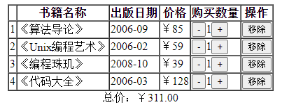
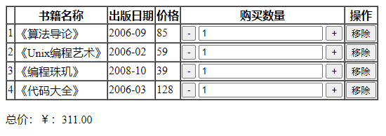

```html
<!DOCTYPE html>
<html lang="en">
	<head>
		<meta charset="UTF-8">
		<title>购物车案例</title>
	</head>

	<body>
		<div id="app">
			<table border="1" cellspacing="0" align="center" v-if="isEmpty">
				<thead>
					<tr>
						<th></th>
						<th>书籍名称</th>
						<th>出版日期</th>
						<th>价格</th>
						<th>购买数量</th>
						<th>操作</th>
					</tr>
				</thead>
				<tbody>
					<tr v-for="(item, index) in items">
						<td>{{item.id}}</td>
						<td>{{item.name}}</td>
						<td>{{item.date}}</td>
						<td>￥{{item.price}}</td>
						<td><button @click="decrement(item)"> - </button>{{item.purchaseNum}}<button @click="increment(item)"> + </button></td>
						<td><button @click="del(index)">移除</button></td>
					</tr>
				</tbody>
			</table>
			<div align="center" v-if="isEmpty">总价：￥{{totalPrice}}.00</div>
			<div v-if="!isEmpty">{{empty}}</div>
		</div>
		<script src="../js/vue.js"></script>

        <script>
            let vm = new Vue({
                el: "#app",
                data:{
                    items: [
                        {id: 1, name: "《算法导论》", date: '2006-09', price: 85.00, purchaseNum: 1},
                        {id: 2, name: "《Unix编程艺术》", date: '2006-02', price: 59.00, purchaseNum: 1},
                        {id: 3, name: "《编程珠玑》", date: '2008-10', price: 39.00, purchaseNum: 1},
                        {id: 4, name: "《代码大全》", date: '2006-03', price: 128.00, purchaseNum: 1},
                    ],
                    deleteIndex: -1,
                    isEmpty: true,
                    empty: '',
                },
                computed:{
                    totalPrice(){
                        sum = 0;
                        for(let i = 0; i < this.items.length; i++){
                            let tmp = this.items[i].price * this.items[i].purchaseNum;
                            sum += tmp;
                        }
                        return sum;
                    }
                },
                methods: {
                    del (index) {
                        this.items.splice(index, 1);
                        if (this.items.length <= 0) {
                            this.isEmpty = false;
                            this.empty = "购物车为空";
                        }
                    },
                    increment (item) {
                        item.purchaseNum++;
                    },
                    decrement (item) {
                        if (item.purchaseNum > 0) {
                            item.purchaseNum--;
                        }
                    }
                }
            })
        </script>
	</body>
</html>
```

- 以上代码实现效果：




```html
<body>
	<div id="app">
		<p v-if="isEmpty">购物车为空</p>
		<table border="1px" cellspacing="0px" v-else>
			<tr>
				<th></th>
				<th>书籍名称</th>
				<th>出版日期</th>
				<th>价格</th>
				<th>购买数量</th>
				<th>操作</th>
			</tr>
			<tr v-for="(item, index) in items">
				<td>{{ item.id }}</td>
				<td>{{ item.name }}</td>
				<td>{{ item.pressDate }}</td>
				<td>{{ item.price }}</td>
				<td>
					<button @click="subNum(item, index)">-</button>
					<input type="text" :value=item.number>
					<button @click="addNum(item, index)">+</button>
				</td>
				<td>
					<button @click="remove(index)">移除</button>
				</td>
			</tr>
		</table>
		<p>总价：￥：{{ getTotalPrice() }}.00</p>
	</div>
	<script src="vue.js"></script>
	<script>
		let app = new Vue({
			el: "#app",
			data: {
				items:[
					{id:1, name: "《算法导论》", pressDate: "2006-09", number:1, price: 85.00},
					{id:2, name: "《Unix编程艺术》", pressDate: "2006-02", number:1, price: 59.00},
					{id:3, name: "《编程珠玑》", pressDate: "2008-10", number:1, price: 39.00},
					{id:4, name: "《代码大全》", pressDate: "2006-03", number:1, price: 128.00},
				],
				totalPrice: 0,
				isEmpty: false
			},
			methods: {
				subNum(item, index){
					if (this.items[index].number > 0){
						this.items[index].number = item.number - 1
					}
				},
				addNum(item, index){
					this.items[index].number = item.number + 1
				},
				remove(index){
					if(this.items.length > 1){
						this.items.splice(index, 1)
					}
					else if(this.items.length = 1){
						this.items.splice(index, 1)
						this.isEmpty = true
					}
				},
				getTotalPrice(){
					let sum = 0
					for (let i = 0; i < this.items.length; i++){
						sum = sum + this.items[i].number * this.items[i].price
					}
					return sum
				}
			}
		})
	</script>
</body>
```



