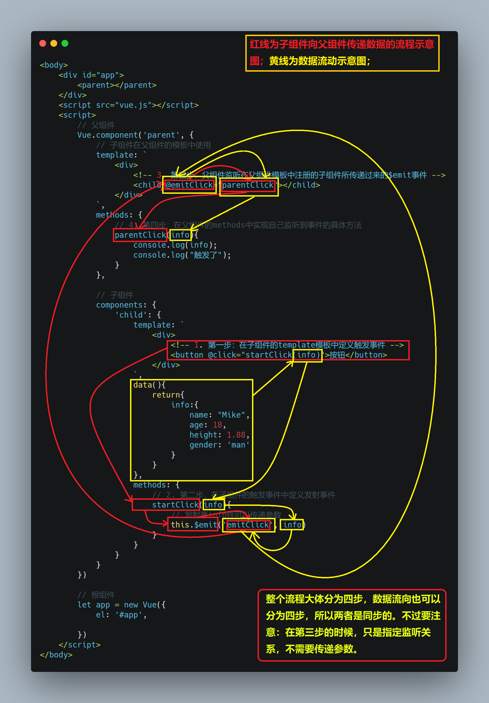

# 一、概述

1. 组件化开发思想：在开发过程中，一个页面中所有的处理逻辑全部放在一起，处理起来就会变得非常复杂，而且不利于后期的管理、扩展和维护。

2. 组件化开发思想就是将一个页面拆分成一个个小的功能块，每个功能块完成属于自己部分的独立功能，这样就使得整个页面的管理、扩展和维护很容易了。

3. 组件化是`Vue.js`中的重要思想，它提供了一种抽象，让我们可以开发出一个个独立可复用的小组件来构造我们的应用。

4. 在`Vue`中，任何的应用都会被抽象成一棵组件树。


5. 在`Vue`的实际开发中，尽可能将页面拆分成一个个小的、可复用的组件，这样我们的代码就更加方便组织和管理，并且扩展性也更强。

6. 注意区分组件化和模块化开发。


# 二、注册组件的基本步骤

1. 创建组件的构造器：

- 调用`Vue.extend()`创建的是一个组件构造器。
- 通常在创建组件构造器时，会传入`template`代表我们自定义组件的模板。这个模板就是在使用到组件的地方，要显示的`html`代码。
- 事实上，这种写法在`Vue2.x`的文档中几乎看不到了，它会直接使用语法糖写法。

2. 注册组件：

- 调用`Vue.component()`是将刚才的组件构造器注册为一个组件，并且给他起一个组件的标签名称。
- 需要传递两个参数，第一个是注册组件的标签名，第二个是组件构造器；

3. 使用组件：

- 组件必须挂载在某个`Vue`实例下，否则它不会生效。

```html
<body>
	<div id="app">
		<!-- 3.使用组件 -->
		<my-cpn></my-cpn>
	</div>
	<script src="vue.js"></script>
	<script>
		// 1.调用Vue.extend()创建一个组件构造器
		const cpn = Vue.extend({
			template:`
				<div>这是组件的html代码内容</div>
			`
		})
		// 2.调用Vue.component()注册组件
		Vue.component('my-cpn', cpn)
		let app = new Vue({
			el: '#app',
			data:{
			}
		})
	</script>
</body>
```


- 一个组件有三步：一是构造组件，二是注册组件，三是调用组件。

	- 构造组件有两种方法：一是`Vue.extend()`，二是构造和注册用语法糖而不用`Vue.extend()`。
	- `Vue.extend()`构造组件的时候，里面可以写模板`template`、子组件`components`、方法`methods`等各种合法的内容，构成一个完整的组件，其中子组件`components`、`methods`等东西都要在模板`template`中使用（`vue`解析模板`template`中的自定义组件、方法等都会先在当前`components`子组件中寻找，然后再去全局组件里面找）。然后调用`Vue.component()`注册该组件。
	- 用语法糖一步构造并调用组件的时候，直接使用`Vue.component('组件名'，{vue.extend()的花括号部分})`。
	- 子组件写法：子组件必须使用`components`写在一个组件中或者直接写在`vue`实例中，子组件都是局部组件，格式为：

```vue
// components表明这是一个子组件，component表明这是在注册组件
// 结构为components-->子组件标签名-->vue.extend()构建的组件(extend构建的组件可以预先构
// 建赋给一个变量，也可以用花括号直接写)，子组件里面还可以继续写子组件
components: {
	myCpnName: {
		template: `
			<div>
			这是在组件中构造并注册的子组件，或者是直接在Vue实例中构造并注册的子组件
			</div>
		`
	}
}
```

# 三、全局组件和局部组件

1. 通过`Vue.component()`注册组件时，组件的注册是全局的，这意味着该组件可以在任何`Vue`实例下使用。

2. 如果我们注册的组件是挂载在某个实例中，通过`components`定义的，那么该组件就是局部组件，且只能在该实例作用的标签中使用。

```html
<body>
	<div id="app1">
		<!-- 2.全局组件可以在所有Vue实例中调用 -->
		<my-cpn1></my-cpn1>
		<!-- 3.局部组件只能在各自的Vue实例中使用 -->
		<my-cpn2></my-cpn2>
		<my-cpn3></my-cpn3>
	</div>
	<div id="app2">
		<!-- 2.全局组件可以再所有Vue实例中调用 -->
		<my-cpn1></my-cpn1>
		<!-- 3.局部组件只能在各自的Vue实例中使用 -->
		<my-cpn2></my-cpn2>
		<my-cpn3></my-cpn3>
	</div>
	<script src="vue.js"></script>
	<script>
		Vue.component('my-cpn1', {
			template:`
				<div>
					这是全局组件
					<my-cpn4></my-cpn4>
				</div>
			`,
			// 这个组件在components中注册，那就要在其template中使用，
			components: {
				myCpn4: {
					template:`
						<div>
							这是在components中注册的组件，也是局部组件
						</div>
					`
				}
			}
		})
		// 1.声明两个不同的vue实例
		let app1 = new Vue({
			el: '#app1',
			components: {
				myCpn2: {
					template: `
						<div>
							这是在第一个Vue实例中注册的局部组件
						</div>
					`
				}
			}
		})
		let app2 = new Vue({
			el: '#app2',
			components: {
				myCpn3: {
					template: `
						<div>
							这是在第二个Vue实例中注册的局部组件
						</div>
					`
				}
			}
		})
	</script>
</body>
```


- 一般真实的开发中一个文件只有一个`vue`实例。


# 四、注册组件的语法糖

1. 之前注册组件的方式相对较繁琐，`Vue`为了简化这个过程，提供了注册的语法糖。

2. 主要是省去了调用`Vue.extend()`的步骤，直接使用一个对象来代替。

3. 其实就是在`Vue.component`中写`Vue.extend`，合并之前的两步写法。


# 五、模板的分离写法

1. 时候可以考虑将`template`中的模板代码分离出来，然后再把这个代码挂载到`template`下，这样结构就非常清晰。

2. `Vue`提供了两种方式来定义`html`模板内容，一是使用`<script type="text/x-template" id="xxx"></script>`这样的方式定义模板，二是使用`<template id="xxx"></template>`的方式定义模板，然后再在注册模板的`template`下写`template:'#xxx'`，调用`id`表示把之前独立写好的模板挂载到当前的`template`下。

3. 第二种用`template`的方式更常用。


# 六、组件不能直接访问`Vue`实例的数据

1. 组件不能直接访问`Vue`实例中定义的`data`的数据，所以组件应该有自己保存数据的地方。

2. 组件是一个单独功能模块的封装，这个模块有属于自己的`html`模板，也应该有属于自己的数据。

3. 结论：组件应该有一个保存数据的地方，但是`data`必须是一个函数，这个`data`函数返回一个对象。

4. 为什么组件中的`data`必须是一个函数：假设在组件中把数据也定义为一个`data`对象，这样的一个组件在多个地方调用的时候，就会创建多个组件实例，但是数据却是共享一个`data`中所定义的（因为数据是一个对象，这个对象都是指向同一个栈区的实际对象的，堆区只是保存对象名），这样操作任何一个定义的组件实例都会影响其他组件实例。而如果把数据定义为一个函数，然后让函数返回一个对象，这样创建多个组件时，都是调用各自的`data`函数，返回的实例的数据就是不同的，这样各个组件实例之间就不会相互影响了。

5. 组件中的数据`data`、监听的事件`methods`都是在组建自身内部定义的，是独立于`Vue`实例的。


# 七、组件通信

## 1. 父组件 --> 子组件通信

1. 一般在`Vue`中，不会让每一个子组件都发送网络请求来获取服务端的数据，而是通过最外层的组件来发送网络请求，获得服务器端的数据，然后把数据传递给一个个小组件，也就是子组件。数据一般都是通过小的子组件来展示的。

2. 子组件是不能直接访问父组件或者`Vue`实例的数据的，但是在实际开发中，一些数据又确实需要从上层传递到下层，最大的组件从服务器请求到数据，然后交由一个个小组件来展示。

3. 父组件 --> 子组件通信，就是把父组件或者`Vue`实例中的数据传递给子组件，让子组件能访问到父组件中的数据，可以用`props`关键字。`props`的值有两种方式：方式一是字符串数组，数组中的字符串就是传递时的名称；方式二是对象，对象可以设置传递时的类型，也可以设置默认值等。


```html
<body>
	<div id="app">
		<!-- 在子组件上进行绑定步骤 -->
		<child :cmovies='movies' :cgreeting="greeting" nobind="just string!"></child>
	</div>
	<script src="vue.js"></script>
	<script>
		Vue.component('child', {
			props: ['cmovies', 'cgreeting', 'nobind'],  //必须用引号引起来，否则报错
			template: `
				<div>
					在子组件中展示父组件传递过来的参数：{{cmovies}}
					<br/>
					greetings: {{cgreeting}}
					<br/>
					nobind是没有用v-bind指令绑定的，所以后面双引号中的内容不是变量，而是一个普通字符串赋值给nobind：{{nobind}}
				</div>
			`
		})
		let app = new Vue({
			el:'#app',
			data:{
				movies: ['霸王别姬', '英雄本色', '三国演义'],
				greeting: "Hello, this is the first hello!"
			}
		})
	</script>
</body>
```


```html
<body>
	<div id="app">
		<child :cinfo="info"></child>
	</div>
	<script src="vue.js"></script>
	<template id='child'>
		<div>
			{{cinfo}}
		</div>
	</template>
	<script>
		Vue.component('child', {
			props: {
				cinfo: {
					type: Object,
				}
			},
			template: `#child`,
			data(){
				return {}
			}
		})
		let app = new Vue({
			el: "#app",
			data: {
				info: {
					name: "Mike",
					age: 18,
					gender: 'man',
					height: 1.88
				}
			}
		})
	</script>
</body>
```


4. `props`可以用数组声明父组件要传递值给哪个子组件，是最简单的方式，`props:['a']`，表示父组件把一个值传递给子组件的变量`a`。还有更复杂的声明，`props`作为一个对象，对其变量进行`type(类型)`、`default(默认值)`、`required(必传值)`进行约束，如果类型是数组或对象，那么`default`就必须是一个函数。

5. `type`可以验证的数据类型有：`String`、`Number`、`Boolean`、`Array`、`Object`、`Date`、`Function`、`Symbol`。

```vue
Vue.component('my-cpm', {
	props:{
		//基础的类型检查(null可以匹配任何类型)
		propsA: String,
		//多个可能的类型
		propsB: ['String', 'Number']
		//必填字符串
		propsC: {
			type: String,
			required: true
		},
		//带有默认值的数字
		propsD:{
			type: Number,
			default: 100
		},
		//带有默认值的对象
		propsE: {
			type: Object,
			//对象或数组(type为object或array)默认值必须从一个工厂函数获取
			default(){
				return{
					name: 'feng'
				}
			}
		},
		//自定义验证函数
		propsF: {
			validData(value){
				//这个值必须匹配到下列字符串中的一个
				return ['one', 'two', 'three'].indexOf(value) !== -1
			}
		}
	}
})
```

6. 当我们有自定义构造函数时，验证也支持自定义的类型：

```javascript
function Person(firstName, lastName){
	this.firstName = firstName
	this.lastName = lastName
}

Vue.component('my-cpn', {
	props: {
		author: Person
	}
})
```


## 2. 子组件 --> 父组件通信

1. 子组件产生一些数据，可能需要传递到父组件甚至一步一步传递到服务端。实际开发中更多的是子组件中产生一些事件，希望父组件知道。

2. 子组件向父组件通信要通过事件，子组件传递参数到事件，父组件监听该事件。

3. 在子组件中，通过`$emit()`来触发事件，在父组件中，通过`v-on`来监听事件（`v-on: A = 'B'`，就是监听A事件，执行B事件）。

4. 监听是在父组件中，子组件上，监听子组件传递过来的事件，然后执行父组件中的响应事件。

5. 子组件负责触发`$emit()`函数，然后子组件要在父组件中注册，父组件负责监听，并实现响应事件。


```html
<body>
	<div id="app">
		<parent></parent>
	</div>
	<script src="vue.js"></script>
	<script>
		// 父组件
		Vue.component('parent', {
			// 子组件在父组件的模板中使用
			template: `
				<div>
					<!-- 3. 第三步：父组件监听在父组件模板中注册的子组件所传递过来的$emit事件 -->
					<child @emitClick="parentClick"></child>
				</div>
			`,
			methods: {
				// 4. 第四步：在父组件的methods中实现自己监听到事件的具体方法
				parentClick(info){
					console.log(info); 
					console.log("触发了");
				}
			},
			// 子组件
			components: {
				'child': {
					template: `
						<div>
							<!-- 1. 第一步：在子组件的template模板中定义触发事件 -->
							<button @click="startClick(info)">按钮</button>
						</div>
					`,
					data(){
						return{
							info:{
								name: "Mike",
								age: 18,
								height: 1.88,
								gender: 'man'
							}
						}
					},
					methods: {
						// 2. 第二步，在子组件的触发事件中定义发射事件
						startClick(info){
							// 发射事info件可以传递参数
							this.$emit('emitClick', info)
						}
					}
				}
			}
		})
		// 根组件
		let app = new Vue({
			el: '#app',
		})
	</script>
</body>
```





## 3. `watch`

1. `watch`，监听属性的改变，`watch`和`data`、`methods`、`props`等是平行的，`watch`中以监听的属性名为函数名进行监听，一旦该属性发生了改变，就会执行其中的代码。比如监听`number`是否发生变化，则：

```vue
watch:{
	number(newValue, oldValue){
		// 一般只用newValue，oldValue用的很少
		代码；//newValue是新值，可以在代码中使用；
	}
}；
```


```html
<body>
	<div id="app">
		<parent></parent>
	</div>
	<script src="vue.js"></script>
	<script>
		Vue.component('parent', {
			template: `
				<div>
					<child 
					:number1="num1" 
					:number2="num2"
					@number1Change="number1Change"
					@number2Change="number2Change"
					></child>
					<br/>
					num1: {{num1}}
					<br/>
					num2: {{num2}}
					<br/>
				</div>
			`,
			data(){
				return {
					num1: 0,
					num2: 1
				}
			},
			methods: {
				number1Change(value){
					this.num1 = value
				},
				number2Change(value){
					this.num2 = value
				}
			},
			components: {
				child: {
					props: ['number1', 'number2'],
					template: `
						<div>
							number1: {{number1}}
							<br/>
							<!-- 1. 输入框和新变量绑定，一旦输入内容就会引发新变量发生变化 -->
							<input type="text" v-model="newNumber1">
							<br/>
							number2: {{number2}}
							<br/>
							<input type="text" v-model="newNumber2">
							<br/>
						</div>
					`,
					// 仍然不要直接改变子组件接收的数据，而是要在data方法中新声明变量进行修改
					data(){
						return {
							newNumber1: this.number1,
							newNumber2: this.number2
						}
					},
					// data方法中的变量在watch中监听，一旦变量发生变化，就会执行对应的函数体
					// 特别注意watch中监听的函数名必须和对应的data方法中要监听的属性保持一致
					// 2. 新变量发生变化就会被watch对应的函数监听到，执行$emit发射函数
					watch: {
						newNumber1(newValue){
							this.$emit("number1Change", newValue)
						},
						newNumber2(value){
							this.$emit("number2Change", value)
						}
					}
				}
			}
		})
		let app = new Vue({
			el: "#app",
		})
	</script>
</body>
```


## 4. 驼峰写法

1. 组件中如果有属性的写法是驼峰式命名，那么在标签上就必须写成短横线形式，否则报错。

```html
<body>
	<div id="app">
		<!-- 1.在子标签上，字母大小写不敏感，所以驼峰式命名的变量必须写成短横线 -->
		<child :c-info="info" :cmessage="message"></child>
	</div>
	<script src="vue.js"></script>
	<script>
		Vue.component('child', {
			props:['cInfo', 'cmessage'],
			template: `
				<div>
					cInfo: {{cInfo}},<br/>
					cmessage: {{cmessage}}
				</div>
			`
		})
		let app = new Vue({
			el: "#app",
			data: {
				info: "这是数据info的内容",
				message: "这是message的内容"
			}
		})
	</script>
</body>
```


# 八、父子组件的访问

1. 有时候我们需要父组件直接访问子组件，或者子组件直接访问父组件，或者是子组件直接访问根组件；例如可能在父组件中需要直接调用子组件这个对象的方法、属性等，而不想通过传参的方式进行，或者不能通过传参进行。这时候可以直接调用子组件这个对象，再通过这个对象调用其中的方法。

2. 同理，子组件可能也想访问父组件，或者访问根组件。

3. 父组件访问子组件，使用`$children`或`$refs`，子组件访问父组件，使用`$parent`。

```html
<body>
	<div id="app">
		<parent></parent>
	</div>
	<script src="vue.js"></script>
	<script>
		Vue.component('parent', {
			template: `
				<div>
					<!-- 调用了三次子组件，this.$children就会生成一个三个元素的对象数组 -->  
					<child></child>
					<child></child>
					<child></child>
					<button @click="output">按钮</button>
				</div>
			`,
			methods: {
				output(){
					console.log(this.$children);
				}
			},
			components: {
				child: {
					template:`
						<div>
							This is the child;
						</div>
					`,
					data(){
						return {
							message: "this is message."
						}
					},
					methods: {
						showMessage(){
							console.log("this is the showMessage cunftion.");
						}
					}
				}
			}
		})
		let app = new Vue({
			el: "#app",
		})
	</script>
</body>
```


4. `this.$children`是一个数组类型，它包含所有子组件对象，访问子组件就必须通过索引值，这就造成一个问题：当子组件过多，我们需要拿到其中一个时，往往不能确定它的索引值，甚至在我们插入新组件的时候，想要取的组件的索引值还可能会发生变化（在上面的例子中，调用了三次子组件，如果要在第二个子组件后插入一个组件，那么原来第三个子组件的下标就是`3`了，再通过下标`thi.$children[0]`访问到的是刚刚增加的新子组件）。

5. 有时候，我们想明确获取其中一个特定的组件，此时可以用`$refs`，`$refs`和`ref`指令通常是一起使用的，首先通过`ref`给某一个子组件绑定一个特定的`ID`，其次，通过`this.$refs.ID`就可以访问到该组件了。比如`<cpn ref="aaa"></cpn>`定义一个组件，然后通过`this.$refs.aaa`调用这个组件；（绝大部分情况下，都是用`$refs`方式来获取某个组件，而不是用`$children`来获取某个组件，只有在需要取出全部组件的时候才用`$children`）。


```html
<body>
	<div id="app">
		<parent></parent>
	</div>
	<script src="vue.js"></script>
	<script>
		Vue.component('parent', {
			template: `
				<div>
					<child ref="first"></child>
					<child ref="second"></child>
					<child ref="third"></child>
					<button @click="btnClick">按钮</button>
				</div>
			`,
			methods: {
				btnClick(){
					// 1. this.$refs获取的是全部ref引用的组件对象
					// 2. this.$refs.refName，通过refName指定的名称可以获取具体的变量
					// 3. this.$refs.refName.propertyName,可以获取特定组件的属性名或变量名
					console.log(this.$refs);
				}
			},
			data(){
				return {}
			},
			components: {
				child: {
					template:`
						<div>
							{{message}}
						</div>
					`,
					data(){
						return {
							message: "我是子组件"
						}
					}
				}
			}
		})
		let app = new Vue({
			el: '#app',
		})
	</script>
</body>
```


- **如果没有用`ref`指定组件，那么用`$refs`就获取不到子组件数组，这时候就只能用`$children`来获取子组件了。**


6. 子组件访问父组件的对象，用`$parent`或者`$root`，`$parent`是获得上一级父组件的对象，而`$root`则是获得根组件的对象。

```html
<body>
	<div id="app">
		<parent></parent>
	</div>
	<script src="vue.js"></script>
	<script>
		Vue.component('parent', {
			template: `
				<div>
					<child></child>
				</div>
			`,
			data(){
				return {
					message: '我是父组件'
				}
			},
			components: {
				child: {
					template:`
						<div>
							<div>{{message}}</div>
							<br/>
							<button @click="btnClick">按钮</button>
						</div>
					`,
					data(){
						return {
							message: '我是子组件!',
						}
					},
					methods: {
						btnClick(){
							console.log(this.$parent.message);
							console.log(this.$root.message);
						}
					}
				}
			}
		})
		let app = new Vue({
			el: '#app',
			data: {
				message: '我是root组件'
			}
		})
	</script>
</body>
```


7. 父组件访问子组件的对象，用的多的是`ref`配合`$refs`使用，很少使用`$children`。而子组件访问父组件的对象在实际开发中就用得很少了，也不建议从子组件中直接访问父组件。


- **在父组件中用`$children`访问调用的子组件数组，或者用`$refs`调用指定的子组件。在子组件中。**


# 九、父子组件写法

1. //子组件先声明

```vue
const son = {
	template:'#cpn'
}
//在父组件地components中注册子组件
components:{
	Son
}
```

2. 从子组件向父组件传递参数的时候，监听语句可以不用写参数，即：`<cmp @send-data="show-data"></cmp>`，这里就算没有写参数，也不会传递`$event`事件。

3. 组件及其中属性、函数等的定义是一回事，调用又是一回事；在定义的时候，其中的变量、函数要在自身的`template`模板中触发调用；而组件本身的调用要在根组件或者父组件中的`template`中进行。


# 十、组件构造

1. 构造组件有两种方式，其一是通过`Vue.extend()`，其二是按照下面的方式，但是两种方式都只是构造了一个组件，还并不能直接调用，此时还要通过`Vue.conponent()`把这些组件注册为全局组件，或者通过`components`把这些组件注册为子组件。

```vue
const App = {
	template: `
		<div>
			<span>{{message}}</span>
		</div>
	`,
	data(){
		return {
			message: 'Hello World'
		}
	}
}
```


2. 以上只是构建了一个组件，这个组件可以在父组件的`components`中使用，也可以在路由规则的`component`中使用。


3. 组件写法：

```vue
// 这是一个组件
const cpn = {
	template: `<div>{{message}}</div>`,
	data(){
		message: "我是组件";
	}
}

new Vue({
	el:"#app",
	components: {  //这里只是注册组件
		cpn
	},
	template:`<div><cpn/></div>`  //这里是调用组件，组件可以抽离出来单独写，也可以把cpn的template的内容写在这里
})
```

- **自己的数据要在自己的模板中用，子组件要在父组件中用，数据传递、事件监听要在父组件中、子组件上。**


- **组件上的数据都来组件自身内部定义的数据，不会跨组件调用。**


----------------------------------------------------
# 父子组件

## 一、区分

1. 子组件是不能直接访问父组件的数据的，父组件也不能直接访问子组件的数据。

2. 在`Vue`实例中，即使在作为`root`的`Vue`实例中定义的子组件，也不能直接访问其中的`data`属性。

## 二、`props`深入

1. 父组件通过`props`传递参数给子组件，子组件接收后，并不能直接修改这个`props`接收的数据，而是要通过`data`方法重新返回一个对象来修改（这里修改绑定不管是`v-model`还是`v-bind`，都要绑定`data`函数中的数。`v-model`只是双向绑定`dnumber`，双向绑定`num`要用`v-bind:value`和`@input`来实现）。


```vue
//子组件    
components: {
	cpn: {
		props: {
			number1: Number,
			number2: Number
		},
		template: `
			<div>
			<h2>{{ dnumber1 }}</h2>
			//这里在输入框中修改的时候，只能修改dnumber的值，并不能修改父组件中num，因为这里是根据父组件中num的值来初始化number，number再赋值给dnumber，反过来不能传值给父组件
			<input type="text" v-model="dnumber1">
			<h2>{{ dnumber2 }}</h2>
			<input type="text" v-model="dnumber2">
			</div>
		`,
		data(){
			return{
				dnumber1: this.number1,
				dnumber2: this.number2
			}
		}
	}
}

//父组件调用
<div id="app">
	<cpn :number1="num1" :number2="num2"></cpn>
</div>
```


2. 要是想在子组件的`template`中通过`input`实现`props`接收的参数和父组件的参数双向绑定，就要使用`v-bind:value`和`@input`来实现

- 主要是`@input`监听，然后在子组件的`methods`中定义监听函数，接收`event`参数，`dnumber=event.target.value`修改`dnumber`的值，使它等于`input`中输入的值，`this.$emit('numchange', dnumber)`传递输入的值给父组件，父组件再监听这个`numchange`事件，最终赋值给父组件中的`num`属性。

第63、64节视频

