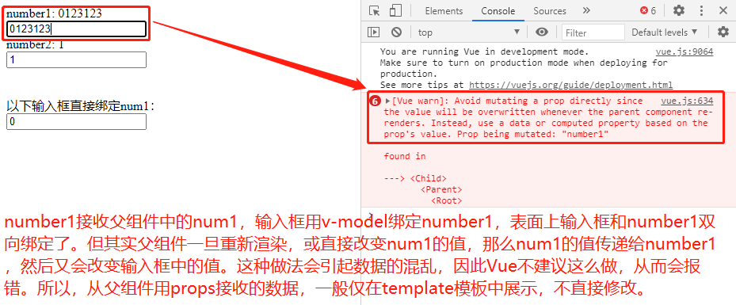
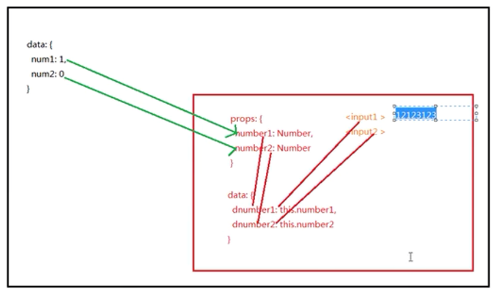

# 一、项目演示

1. 实际开发中，所有的组件都是封装成一个`.vue`文件，其中又分为三大部分，一是`template`，二是`script`（`js`代码），三是`style`样式表。

2. 只有是外部引入的组件才需要在`.vue`文件中导入，并且是在`<script>`标签下进行导入，且还要再通过`export default{components：{导入的组件名}}`这样注册一下，才能正常渲染。自己在`<template>`中写的不需要注册等额外处理。


# 二、项目中的思考点

1. `props`接收的参数，一般只在`template`中展示，如果要修改接收到的值，需要另写一个`data`函数，然后在里面把`props`接收的参数重新赋给新数值。**其实就是如果要改变组件自己内部`props`接收的值，那么就要在子组件内部用`data`函数来新声明一个变量接收`props`传递的变量并`return`返回，然后修改和展示的都是修改过的`newNumber`变量；但是这时候并没有改变`number`或者`num`的值，而是新声明了一个变量`newNumber`，展示和修改的是`newNumber`，因为`num`和`number`不是根据`newNumber`来初始化自身的值的。**


- 仅展示，一切正常

```html
<body>
	<div id="app">
		<parent></parent>
	</div>
	<script src="vue.js"></script>
	<script>
		Vue.component('parent', {
			template:`
				<div>
					<child :number1='num1' :number2='num2'></child>
				</div>
			`,
			data(){
				return {
					num1: 0,
					num2: 1
				}
			},
			components: {
				'child': {
					template: `
						<div>
							<p>number1: {{number1}}</p>
							<p>number2: {{number2}}</p>
						</div>
					`,
					props: ['number1', 'number2'],
				}
			}
		})
		let app = new Vue({
			el: '#app',
		})
	</script>
</body>
```


- 尝试修改，报错

```html
<body>
	<script>
		Vue.component('parent', {
			template:`
				<div>
					<child :number1='num1' :number2='num2'></child>
					<br><br>
					以下输入框直接绑定num1：<br>
					<input type="text" v-model="num1">
				</div>
			`,
			data(){
				return {
					num1: 0,
					num2: 1
				}
			},
			components: {
				'child': {
					template: `
						<div>
							<span>number1: {{number1}}</span> <br/>
							<input type="text" v-model="number1"> <br />
							<span>number2: {{number2}}</span>  <br/>
							<input type="text" v-model="number2">
						</div>
					`,
					props: ['number1', 'number2'],
				}
			}
		})
		let app = new Vue({
			el: '#app',
		})
	</script>
</body>
```




- 用新数据接收后，修改新数据


```html
<body>
	<div id="app">
		<parent></parent>
	</div>
	<script src="vue.js"></script>
	<script>
		Vue.component('parent', {
			template:`
				<div>
					<child :number1='num1' :number2='num2'></child>
					<br><br>
					以下输入框直接绑定num1：<br>
					<input type="text" v-model="num1">
				</div>
			`,
			data(){
				return {
					num1: 0,
					num2: 1
				}
			},
			components: {
				'child': {
					template: `
						<div>
							<span>number1: {{number1}}</span> <br/>
							<span>newNumber1: {{newNumber1}}</span> <br/>
							<input type="text" v-model="newNumber1"> <br />
							<span>number2: {{number2}}</span>  <br/>
							<span>newNumber2: {{newNumber2}}</span>  <br/>
							<input type="text" v-model="newNumber2">
						</div>
					`,
					props: ['number1', 'number2'],
					data(){
						return {
							newNumber1: this.number1,
							newNumber2: this.number2
						}
					}
				}
			}
		})
		let app = new Vue({
			el: '#app',
		})
	</script>
</body>
```


- **结论：假设`num`作为父组件中的数据，通过`props`传递给子组件中的`number`，不要直接修改`number`，而是要在子组件中写一个`data`方法，把`number`赋值给`newNumber`，然后对`newNumber`进行修改。

2. 如果要改变父组件里的值`num`或者`number`，那就要监听数值变化，且只要改变`num`即可，因为`number`是从`num`接收的，随之变化。这时候要通过`$emit`函数把当前需要传递的值发送给父组件，父组件在子组件上监听，然后通过事件函数修改`num`的值。

3. 通过`$emit`传递当前参数的时候，可以用`input`本身输入数字的时候会触发的函数`@input`来触发一个函数`1`，在函数`1`中通过`event.target.value`获取当前输入框的值，然后把这个函数`1`和值传递到正在子组件上监听的父组件函数`2`，最后在父组件中将接收到的值赋值给`num`即可。





- 演示项目完整版代码：
	- 父组件传递数据给子组件，子组件接收数据，可以进行展示，但不要直接修改，而是要用`data`方法声明新的变量接收，然后对新的变量进行修改。如果要修改父组件和子组件接收的数据，就要用`$emit`函数发射事件修改父组件中的数据，子组件的数据来自父组件，会自动跟随着发生变化。


```html
<body>
	<div id="app">
		<parent></parent>
	</div>
	<script src="vue.js"></script>
	<script>
		Vue.component('parent', {
			template: `
				<div>
					<child 
					:number1="num1" 
					:number2="num2"
					@number1change="number1Change"
					@number2change="number2Change"
					></child>
					<br/>
					num1: {{num1}}
					<br/>
					num2: {{num2}}
				</div>
			`,
			data(){
				return {
					num1: 0,
					num2: 1,
				}
			},
			methods: {
				number1Change(value){
					this.num1 = value
				},
				number2Change(value){
					this.num2 = value
				}
			},
			components: {
				child: {
					template: `
					<div>
						number1: {{number1}}
						<br/>
						newNumber1: {{newNumber1}}
						<br/>
						<input type="text" v-model="newNumber1" @input="number1Input">
						<br/>
						number2: {{number2}}
						<br/>
						newNumber2: {{newNumber2}}
						<br/>
						<input type="text" v-model="newNumber2" @input="number2Input">
					</div>
					`,
					props: ['number1', 'number2'],
					data(){
						return {
							newNumber1: this.number1,
							newNumber2: this.number2
						}
					},
					methods: {
						number1Input(){
							this.$emit("number1change", event.target.value)
						},
						number2Input(){
							this.$emit("number2change", event.target.value)
						}
					}
				}
			}
		})
		let app = new Vue({
			el: "#app"
		})
	</script>
</body>
```
