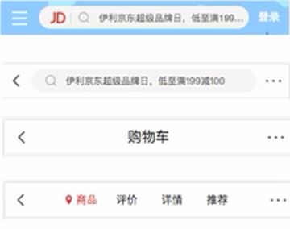
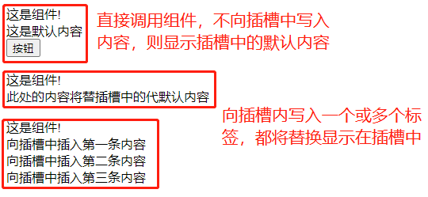
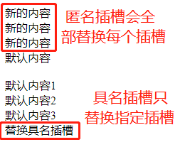
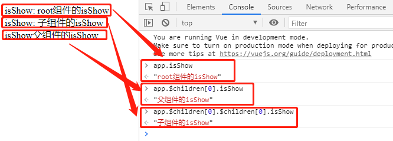
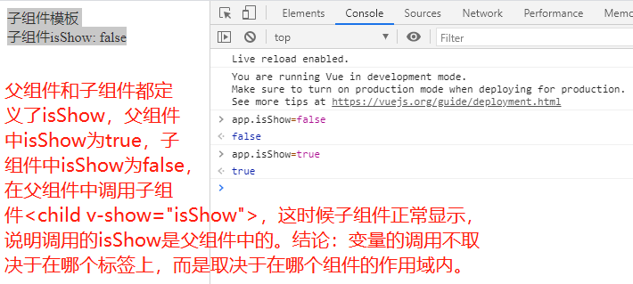
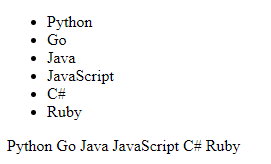
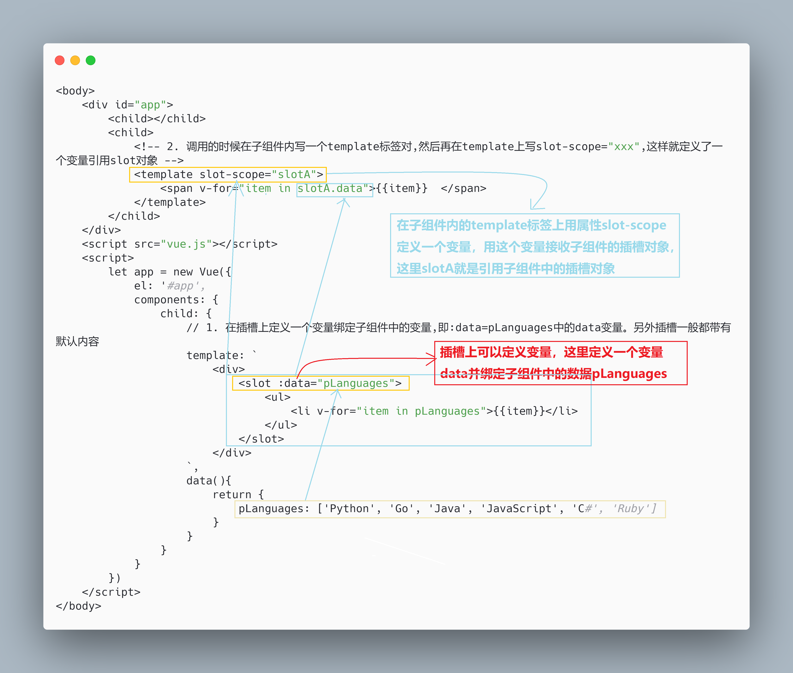

# 一、插槽的用处

1. 一些重复的地方可以封装成组件，但是组件都是大同小异，并不是完全一致的。

2. 把组件相同的部分抽离出来，封装成一个组件。

3. 在组件中写一个插槽，各个具体的组件不同的部分各自实现差异之处。

4. 组件的插槽也是为了让我们封装的组件更加具有扩展性，让使用者可以决定组件内部的一些内容到底展示什么。

5. 例如京东导航栏，在多个页面中，顶部都有一个导航栏，但是导航栏的左中右三部分各不相同。因此，导航栏可以抽离成一个组件，但是组件的各个部分不是写死的，而是用三个插槽来定义，在不同页面具体实现的时候根据需要再写相应的代码。



6. 组件封装原则：抽取共性，保留不同。将组件在各个页面中展示的相同部分保留在组件中，将组件在不同地方展现不同功能的部分暴露为插槽，然后封装成一个独立的组件。这样一个封装好的组件，相同的部分都保留在组件中，不同的部分都预留了插槽，可以让使用者根据自己的需求，决定插槽中插入什么内容，比如是搜索框、文字、菜单，都由调用者自己来决定。


# 二、插槽的写法

1. 插槽就是在组件的`template`中写一个`<slot></slot>`，然后在调用的时候在自定义标签中写入对应的`html`代码，这些`html`代码就会插入`slot`插槽中。

2. `slot`插槽可以带默认值，如果调用自定义标签的时候没有写入代码插入插槽中，那么就会显示默认的插槽；如果写了新的代码，那么就不会显示默认值。

3. 调用组件的时候，多个`html`标签都会插入到同一个`slot`插槽中。


```html
<body>
	<div id="app">
		<!-- 1. 直接调用组件,不向插槽写入任何内容,则插槽会显示默认内容 -->
		<cpn></cpn>
		<br>
		<!-- 2. 插槽的基本使用 -->
		<cpn><span>此处的内容将替插槽中的代默认内容</span></cpn>
		<br>
		<!-- 3. 一次向插槽中写入多个标签 -->
		<cpn>
			<span>向插槽中插入第一条内容</span><br>
			<span>向插槽中插入第二条内容</span><br>
			<span>向插槽中插入第三条内容</span>
		</cpn>
	</div>
	<script src="vue.js"></script>
	<template id='cpn'>
		<div>
			{{message}}
			<br>
			<slot>
				<span>这是默认内容</span>
				<br>
				<button>按钮</button>
			</slot>
		</div>
	</template>
	<script>
		Vue.component('cpn', {
			template: `#cpn`,
			data(){
				return {
					message: "这是组件!"
				}
			},
		})
		let app = new Vue({
			el: '#app',
		})
	</script>
</body>
```



- **插槽预留于子组件内，在父组件中、子组件标签对中间调用。**


# 三、具名插槽

1. 上面的内容都是匿名插槽，就是`<slot>`标签上没有用`name`属性标定。在一个组件中，如果有多个匿名插槽（即多个没有`name`属性的`<slot>`标签对），那么在父组件中调用子组件并替换子组件中的插槽时，新的内容会替一一换掉每个匿名插槽中默认内容。

2. 具名插槽在子组件中定义时，要显式指定`name`属性，在调用时，在包裹要替换默认内容的新内容的标签上用`slot`属性指明作用于哪个具名插槽。

```html
<body>
	<div id="app">
		<!-- 1. 直接插入的内容会覆盖所有匿名插槽 -->
		<cpn><span>新的内容</span></cpn>
		<br>
		<!-- 2. 具名插槽指定替换,注意slot写在新的要替代默认内容的那个标签上 -->
		<cpn><span slot="slotname">替换具名插槽</span></cpn>
	</div>
	<script src="vue.js"></script>
	<template id="cpn">
		<div>
			<slot><span>默认内容1</span></slot><br>        
			<slot><span>默认内容2</span></slot><br>
			<slot><span>默认内容3</span></slot><br>
			<slot name="slotname"><span>默认内容</span></slot> 
		</div>
	</template>
	<script>
		Vue.component('cpn', {
			template:'#cpn',
			data(){
				return {
					message: '这是组件'
				}
			}
		})
		let app = new Vue({
			el: '#app',
		})
	</script>
</body>
```




# 四、作用域插槽

1. 父组件模板的所有东西都会在父级作用域内编译；子组件模板的所有东西都会在子级作用域内编译；（即组件的数据、模板、方法、计算属性等任何东西，都是调用组件自身内部的）

```html
<body>
	<div id="app">
		isShow: {{isShow}}
		<br>
		<parent></parent>
	</div>
	<script src="vue.js"></script>
	<script>
		Vue.component('parent', {
			template:`
				<div>
					<child></child>
					<span>isShow{{isShow}}</span>
				</div>
			`,
			data(){
				return {
					isShow: "父组件的isShow",
				}
			},
			components: {
				child: {
					template: `
						<div>
							isShow: {{isShow}}
							<br>
						</div>
					`,
					data(){
						return {
							isShow: "子组件的isShow",
						}
					}
				}
			}
		})
		let app = new Vue({
			el: '#app',
			data: {
				isShow: "root组件的isShow",
			},
		})
	</script>
</body>
```



```html
<body>
	<div id="app">
		<!-- 在父组件中,子组件上,变量也是取决于父组件,因为这是父组件的作用域 -->
		<child v-show="isShow"></child>
	</div>
	<script src="vue.js"></script>
	<script>
		let app = new Vue({
			el: '#app',
			data: {
				isShow: true,
			},
			components: {
				child: {
					template:`
						<div>
							子组件模板<br>
							子组件isShow: {{isShow}}
						</div>
					`,
					data(){
						return {
							isShow: false,
						}
					}
				}
			}
		})
	</script>
</body>
```




2. 数据是子组件提供的，但是显示样式或者风格希望由父组件决定，此时用作用域插槽。比如一个数组`pLanguages=["Python", "C++", "C#", "Go", "Swift"]`等，父组件调用多次的时候，有的希望以列表形式展示，有的希望横着展示等。

- // 第一步：在`template`中用一个变量绑定子组件中的数据，即在子组件中的`template`中写一个`slot`插槽，其中`data`绑定需要展示的子组件中的数据，`data`取名由程序员自定义；

```vue
<slot :data="pLanguages"></slot>
```

- // 第二步：在子组件中用`template`标签和`slot-scope`属性接收数据，即在父组件中调用，首先紧挨组件`cpn`写一个`root`标签，以前规定是必须写`template`，后来随意，为了兼容性，可以写`template`；然后在`template`上写`slot-scope="slot"`，引号中的`slot`可以自定义取名，然后就可以通过`slot.data`来调用子组件中的数据了。

```vue
<cpn>
	<template slot-scope="slot">
		<span>{{slot.data.join('*')}}</span>
	</template>
</cpn>
```

```vue
<body>
	<div id="app">
		<child></child>
		<child>
			<!-- 2. 调用的时候在子组件内写一个template标签对,然后再在template上写slot-scope="xxx",这样就定义了一个变量引用slot对象 -->
			<template slot-scope="slotA">
				<span v-for="item in slotA.data">{{item}}  </span>
			</template>
		</child>
	</div>
	<script src="vue.js"></script>
	<script>
		let app = new Vue({
			el: '#app',
			components: {
				child: {
					// 1. 在插槽上定义一个变量绑定子组件中的变量,即:data=pLanguages中的data变量。另外插槽一般都带有默认内容
					template: `
						<div>
							<slot :data="pLanguages">
								<ul>
									<li v-for="item in pLanguages">{{item}}</li>
								</ul>
							</slot>
						</div>
					`,
					data(){
						return {
							pLanguages: ['Python', 'Go', 'Java', 'JavaScript', 'C#', 'Ruby']
						}
					}
				}
			}
		})
	</script>
</body>
```







- **重点理解**：理解作用域的概念。假设在多个组件中都有一个同名的变量，在调用这个变量的时候，怎么确定调用的这个变量到底是哪个？就是要确定这个变量的作用域是什么，一点就可以确定：**无论在什么标签上、或标签对内，组件直接调用的变量只能是组件自身内部的变量。**所以，子组件一般调用的是子组件中的变量，父组件一般调用的是父组件中的变量，根组件调用的是根`data`中的变量。


