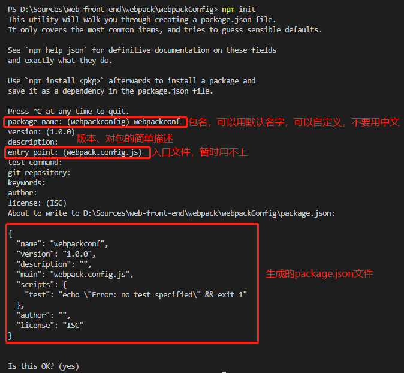

# 一、概述

1. 从本质上来说，`webpack`是一个现代`js`应用的静态模块化打包工具。

2. 在`ES6`之前，必须要借助于其他的工具提供底层的支持，才能进行模块化开发。`ES6`之后，`CMD`、`AMD`、`CommonJS`等前端模块化开发方案也要借助其他工具提供底层支持，只有`ES6`不需要（浏览器本身就支持`ES6`语法），其他规范的源代码浏览器可能是无法直接运行的；并且在通过模块化开发完成了项目之后，还需要处理模块间的各种依赖（如模块之间的各种导出导入），并且将其进行整合打包。

3. 在开发的时候，写的一些`CommonJS`、`CMD`、`AMD`模块化语法需要第三方工具打包处理，然后上传到服务器，这样浏览器请求到的数据才能正常解析，否则浏览器可能无法解释其中一些语法或者文件，或者无法处理文件之间的依赖。

4. `webpack`的核心之一就是可以进行模块化开发，并且会帮我们处理模块之间的依赖关系，不仅仅是`js`文件，像`CSS`、图片、`json`文件等在`webpack`中都可以当作模块来使用。

5. `webpack`还可以对各种资源进行打包合并成一个或者多个包（`Bundle`），并且在打包的过程中，还可以对资源进行处理，比如压缩图片，将`scss`转换为`css`文件，将`ES6`语法转为`ES5`语法，将`TypeScript`转为`JavaScript`等。

6. 选择问题，打包工具像`grunt`/`gulp`等都可以帮助用户打包，但是`webpack`是前端使用得最多得一个打包工具，各种`AMD`、`CMD`、`CommonJS`模块化都支持。

- **总结**：`webpack`是使用最多的一个打包工具，把原始的代码打包处理成浏览器能运行的最终代码。


# 二、webpack安装

1. `webpack`本身的正常运行依赖`node`环境，`node`环境为了可以正常执行很多代码，必须包含各种依赖的包，手动管理这些包很麻烦，所以在安装`node`的时候会自动安装`npm`工具。`npm`工具是管理`node`环境下各种包的一个软件。

2. 安装`webpack`首先需要安装`Node.js`，`Node.js`自带了软件包管理工具`npm`。

3. 查看当前安装版本，终端下输入：`node -v`。

4. 全局安装`webpack`：`npm install webpack@3.6.0 -g`  //局部安装（`-g`换成`--save-dev`，`--save`是运行时依赖，`-dev`表示开发时依赖，项目打包后不再需要继续使用的。）；（这里指定`webpack3.6.0`版本，因为`vue cli2`依赖该版本，在`vue cli2`里面才能看到`webpack`的各种配置，到`vue cli3`的时候`webpack`的配置都是隐藏起来的）。

5. 为什么全局安装了还需要局部安装呢：全局安装后，在任何终端直接执行`webpack`命令，使用的都是全局安装的`webpack`命令。但是当在配置文件`package.json`中定义了`scripts`脚本命令，并且其中包含了`webpack`命令时，那么使用的是局部`webpack`。

6. 查看`webpack`版本：`webpack --version`。

7. `webpack`安装参考资料：https://www.cnblogs.com/yiyi111/p/12436796.html

- **注意：项目目录下的`node_modules`是本地安装（局部安装）`webpack`后出现的一个目录，里面存放的是`webpack`这个打包工具，还有一些项目需要用到的关于`node`的环境，另外还有如`vue`等模块都在这里面。**


# 三、`webpack`起步

1. 一般在开发的项目文件夹中会包含两个文件夹，一个是`src`，开发的源码一般都是放在`src`目录中，一个是`dist`，`src`开发的源码经过打包后，放在`dist`目录下，`dist`全称是`distribution`。


2. 在`src`中新建一个`main.js`文件，习惯上以这个文件作为整个程序的入口。

3. `src`目录下还存在其他`js`文件，可能使用`AMD`、`CMD`、`CommomJS`、`ES6`的模块化语法写的代码，通过导出和导入的方式把其他的`js`模块都导入到`main.js`文件中，然后`webpack`打包，即终端执行：`webpack ./src/main.js ./dist/bundle.js`，表示把`main.js`文件打包成`bundle.js`文件。

4. 打包过后，在`index.html`中引入`dist`中打包好的文件`bundle.js`。如果对`src`中的文件做了修改，那就要重新打包，否则`index.html`不会见到效果。


# 四、案例演示

1. 用模块化的开发方式，在`mathUtils.js`文件中写一些数学函数导出，在`main.js`中导入这些数学函数并调用，然后打包，在`index.html`中引入生效。

2. 编写`mathUtils.js`和`main.js`的源代码。

```javascript
// mathUtils.js
function add (num1, num2) {
	return num1 + num2
}
function mul (num1, num2) {
	return num1 * num2;
}
module.exports = {
	add,
	mul,
}
```

```javascript
// main.js
let {add, mul} = require('./mathUtils.js')
console.log(add(20, 30));
console.log(mul(10, 20));
```

3. 在终端进入文件所在目录，然后输入命令进行打包：`webpack.cmd .\src\main.js .\dist\bundle.js`，一是要进入所在目录，二是只需要打包`main.js`这个入口文件，其余`js`文件都通过导出导入在`main.js`中引入，`webpack`会根据代码自动处理导入导出的依赖关系，并引入和打包相关的依赖文件。这样也可以避免真实项目中有大量的`js`文件时一一引用产生的管理不方便问题；（这里是全局打包命令）。


4. 正常打包成功后，会在`./dist/`目录下有一个`bundle.js`的打包文件，把这个文件引入到`index.html`文件中即可。一定要打包后再引入打包过的`js`文件，因为不经过`webpack`打包处理的`js`文件中的模块化代码并不能直接被浏览器解析执行。

```html
// index.html
<body>
	<script src="./dist/bundle.js"></script>
</body>
```

5. 打开浏览器，代码正常执行。


6. 如果src下源代码有修改，那就要重新打包。比如新增info.js文件就要重新打包。


# 五、`webpack`配置

1. 上面用`webpack`命令进行打包时，都是显式指明了入口和出口文件，这样在打包时相对麻烦，可以在`src`和`dist`的同级目录中创建一个配置文件，命名为`webpack.config.js`：

```javascript
// webpack.config.js
// 导入一个path模块，这是node包里面的一个模块，依赖这个模块要在终端先输入:npm init初始化，来安装相关的node包
const path = require('path')
// webpack的配置文件通过CommonJS的方式导出一个对象，在里面配置相关信息，
// 主要是入口和出口文件，在打包文件的时候就会自动找到入口文件(即可能是
// 默认的main.js)和出口文件(即可能是默认的bundle.js)，这样打包的时候就
// 只要写一个webpack命令即可，不需要后面再跟上具体的打包文件(main.js)和
// 生成的目标文件(bundle.js)
module.exports = {
	// webpack ./src/main.js ./dist/bundle.js，第一个参数就是入口文件(被打包的文件)，第二个参数就是出口文件(打包后生成的文件)
	// entry为执行webpack命令进行打包时的入口文件，写成下面这样的相对路径就必须从主目录执行webpack命令
	// 入口：可以是字符串/数组/对象，这里我们只有一个入口，所以写一个字符串即可；
	entry: './src/main.js',
	// output为执行webpack命令进行打包时的出口文件，通常是一个对象，里面至少包含两个重要属性，path和filename；
	output: {
		// path参数必须为绝对路径，否则报错：configuration.output.path: The provided value "./dist" is not an absolute path!
		// 但是绝对路径又会把配置文件写死，改动和维护都不方便，所以要动态获取路径。
		// path是上面第一行导入的一个模块，这个模块里面有一个resolve函数，它可以把两个路径拼接到一起，
		// __dirname(前面是双下划线)是一个node自带的全局变量，可以获取当前文件所在路径的全局变量，
		// 后面拼接dist就是目标文件的最终路径了，拼接两者得到出口文件的绝对路径
		path: path.resolve(__dirname, 'dist'),    // 目标文件的路径，__dirname可以获取当前文件所在的绝对路径，resolve函数可以拼接路径和目录
		filename: 'bundle.js',    // 目标文件的文件名
	},
}
```

2. 终端输入`npm init`：如果项目中需要用到`node`的一些包，就可以直接初始化，就是终端执行这条命令。后面一直是回车即可，只有最开始的`package name`需要注意不写中文。还有`entry point:(webpack.config.js)`这里要注意写`index.js`，因为上面配置文件写了`webpack.config.js`，不要重复了。剩下的一路回车即可，最终会在当前目录下生成一个`package.json`文件（任何项目，如果依赖一些`node`的环境的话，比如上面引入了`path`模块等，一般情况下都会通过`npm init`命令生成一个`package.json`配置文件）：




```vue
{
	//任何项目，如果想单独依赖node环境的话，
	"name":"exam",    //项目的名字
	"version":"1.0.0",    //项目版本号
	"description":"",    //描述信息
	"main":"index.js",    //
	"scripts":{    //脚本
		"test": "echo\"Error:notestspecified\"&&exit1",
		"build": "webpack"
	},
	"author":"",    //作者
	"license":"ISC"    //开源协议，不开源可以不需要，直接删除没影响
}
```


# 六、案例演示

1. 配置一个样例，只需在终端输入`webpack`命令就可以打包项目。


2. 目录结构如上图所示，`main.js`作为`js`的入口文件，`mathAndInfo.js`作为导出数据文件；`webpack.config.js`文件的配置信息如上面“五”中`1`中所示，在终端输入`npm init`生成`package.json`的过程如上面“五”中`2`所示。

- `b.main.js`和`mathAndInfo.js`源码如下所示：

```javascript
// main.js
import {name, age, height, add, mul} from './mathAndInfo.js'
console.log(name);
console.log(age);
console.log(height);
console.log(add(30, 40));
console.log(mul(20, 30));
```

```javascript
// mathAndInfo.js
let name = "Kobe";
let age = 22;
let height = 2.12;
function add (num1, num2) {
	return num1 + num2;
}
function mul (num1, num2) {
	return num1 * num2;
}
export {
	name,
	age,
	height,
	add,
	mul,
}
```

```html
<body>
	<script src="./dist/bundle.js"></script>
</body>
```

3. **这个示例里面没有依赖，如果这个`package.json`里面还有依赖其他一些包，比如在`scripts`中还有引入其他脚本资源，那么就要在终端输入`npm install`解决包依赖关系，`npm`就会在当前文件夹里面安装一些东西；还会生产一个`package-local.json`的文件。**

4. 在终端输入`webpack`，就会自动根据`webpack.config.js`文件的配置，把当前目录下的`./src/main.js`及其依赖的相关文件打包成`./dist/bundle.js`文件。

- **总结：`webpack.config.js`是`webpack`的配置文件，在终端执行单独的`webpack`命令（不带出入口参数）是根据这个文件中配置的入口和出口文件执行命令的，而其中的出口配置项`output`又必须是绝对路径，绝对路径的获取依赖`node`的`path`包，因此需要安装终端执行`npm init`安装相关包，而执行`npm init`会生成一个`packa.json`配置文件，如果这个配置文件里面又新添加了一些依赖，那么就要再执行`npm install`来安装这些依赖。**

5. 最终目录结构


6. `scripts`执行命令的原理：`package.json`中的`scripts`，即脚本，在终端执行`npm run test`的时候，`npm`工具会在该文件中寻找`scripts`中的`test`，然后执行后面对应的语句，这里的`test`只是一个默认命令，还可以手动修改一些配置，当`npm run other_command`的时候就会执行该文件中的`scripts`中的对应语句。如果在这里面加一句`"build": "webpack"`，那么在终端执行`npm run build`的时候，就会找到`package.json`中的`scripts`，然后找到`build`对应的这一行，然后执行后面的`webpack`，所以因为新增的这一条配置，`npm run build`就等价于`webpack`，但是这样写`webpack`需要预先配置好`webpack.config.js`，否则要指明出入口文件。

7. `scripts`执行命令的顺序：虽然`npm run build`最终执行的是`webpack`命令，但是它和直接在终端敲`webpack`命令还是有差别的。`npm run build`会优先找本地命令，也就是一些本地安装的命令。因为不同的项目可能需要不同版本的命令，比如当前项目可能依赖的是`3.6.0`版本的`webpack`，其他项目可能依赖的是其他版本，而具体项目都会本地安装自身所需要的包或者命令，所以这里的`scripts`会优先寻找本地命令来执行，而不是直接执行全局的`webpack`命令或其他相关命令。而直接在终端执行`webpack`等命令用的就是全局的，而不是本地命令。所以为了项目不出问题，具体项目都会安装相关的本地包，然后在配置文件中写好`scripts`命令配置，然后执行本地命令。

8. 本地安装：`npm install webpack@3.6.0 --save-dev`，就是进入项目所在文件，然后在原来全局的命令后面加一个`--save-dev(开发时依赖)`，安装完成后`package.json`会多出一个配置项，即开发时依赖，就是开发程序的时候依赖的包，项目打包后就不再需要继续使用。还会多出一个`node_modules`目录，展开该目录会发现一大堆东西，都是默认安装的一些包，其中还会有一个`webpack`的子目录，里面就是`webpack`的包。

```vue
"devDependencies": {    //开发时依赖
	"webpack": "^3.6.0"
},
```

- **注意：国内连接`npm`服务器速度可能较慢，导致很多东西无法正常下载安装，可以使用代理服务器，在终端输入：npm config set registry https://registry.npm.taobao.org**

9. 运行时依赖：就是程序运行时依赖的包，和开发时依赖类似的，只是作用的时间不同。比如`Vue`开发完打包后上传到服务器运行时还需要依赖的包，就放在运行时依赖配置项里面。

10. 全局安装后还需要局部安装，因为只要是在终端直接执行的`webpack`命令，使用的都是全局安装的`webpack`。但是在`package.json`中定义了`scripts`时，如果其中包含了`webpack`命令，再执行`npm run build`之类的`npm run`命令，那使用的是局部的`webpack`命令；严格来说，在任何终端中执行任何命令都是执行全局命令，只有在`scipts`中配置了脚本后，`npm run CommandName`才会找到并执行对应的本地命令。

11. 即使安装了本地`webpack`或者其他命令后，但只要是在终端直接敲`webpack`或相关命令，运行的都是全局命令。而不同的程序可能需要的命令版本不同，我们往往需要执行本地命令，那么就要在`package.json`的`scripts`中配置，然后执行`npm run 对应的本地命令名`。或者是进入`node_modules/.bin/webpack`以命令的绝对路径的方式执行，其实如果配置了`package.json`中的`scripts`，执行`npm run CommandName`时，`node`会自己先在`node_modules/.bin/`目录下寻找，没找到才执行全局命令。

- **`webpack`打包的时候，从入口文件出发开发打包，只打包在入口文件中引入了的文件，没有引入到入口文件的其他文件不会被打包，也就不会运行生效。**


# 七、`Loader`

1. `loader`也是`webpack`的一个核心概念。`webpack`主要来打包和处理`js`代码以及`js`之间相关的依赖，但是实际开发中不仅有`js`代码要处理，还需要加载`css`、图片等，以及将`ES6`转成`ES5`，`TypeScript`转为`ES5`，将`scss`、`less`转成`css`，将`.jsx`、`.vue`转为`js`文件等，本身`webpack`是不支持这些转化的，需要`loader`来处理。不同类型的文件处理会用到不同的`loader`，大部分`loader`及其文档都可以在`webpack`的官网中找到。

2. `loader`的基本使用：https://www.webpackjs.com/loaders/

- 安装：通过`npm`安装需要使用的`loader`。
- 配置：在`webpack.config.js`中的`module.exports = {}`中增加相应的配置，具体配置参考上述`webpack`的官网。

3. 案例演示：安装使用css的loader

- 项目开发过程中，我们肯定需要用到很多样式，而样式往往是写到一个个单独的文件中的，因此也可以当作一个个模块来使用。此时可以这样规划目录结构，在当前项目的`src`中创建一个`css`目录和一个`js`目录，功能性的`js`代码和全部`css`代码都放到这两个目录中，`main.js`和`css`目录及`js`目录平级作为入口文件，其余配置和上面的配置一样。


- 编写相关`js`文件的代码，然后在`main.js`中引入`css`代码，即在`main.js`中写一条语句：`require("./css/normal.css")`，这其实就是`CommonJS`的写法引入`css`依赖，不同的是它不需要其他变量来接收，只需要引入依赖就行，因为有了依赖在打包`main.js`的时候就会打包相关依赖的`css`代码。

```javascript
// main.js
import {name, age, height, add, mul} from './js/content.js'
console.log(name);
console.log(age);
console.log(height);
console.log(add(20, 30));
console.log(mul(20, 10));
// 引入css文件，只需要引入就可以了，不需要用变量接收，因为css文件中没有导出什么变量需要在入口文件中调用的
require('./css/normal.css')
```

```javascript
// content.js
let name = "Kobe";
let age = 32;
let height = 2.12;
function add (num1, num2) {
	return num1 + num2;
}
function mul (num1, num2) {
	return num1 * num2;
}
export {
	name,
	age,
	height,
	add,
	mul,
}
```

```css
body {
	background-color: brown;
}
```

```html
<body>
	<script src="./dist/bundle.js"></script>
</body>
```

- 安装并配置好`css-loader`工具：执行完上一步后，直接`npm run build`会报错，因为只在`main.js`中引入`css`文件，但是没有相应`loader`来处理`css`文件。所以要先在终端安装`loader`，然后配置好`loader`。（不同类型的文件依赖不同的`loader`来处理，具体参见`loader`官网：https://www.webpackjs.com/loaders ）
	- 安装：`npm install --save-dev css-loader`
	- 安装完成后，在`package.json`中的`devDependencies`中会多出一项配置：
	```vue
	"devDependencies": {
		"css-loader": "^5.0.1",
	}
	```
	- 配置loader使之生效：
	```vue
	module:{
		rules:[  // 配置loader的使用规则
			{
			// 正则表达式，点在正则表达式中有特殊的含义，所以要转义才能匹配真正的点，$表示结尾，^表示开始
			// 这个正则表达式就是匹配以.css结尾的文件，匹配成功的文件就会应用use定义的规则
			test: /\.css$/,
			//css-loader只负责将css文件加载，并不能把css代码嵌入到文档流并解析使之生效
			//style-loader负责解析css代码，但需要css-loader先加载
			//webpack在使用多个loader的时候，是从右向左读取的，注意顺序，最好不要弄反了，可能报错或不起作用
			//此处简写，完整写法是use:[{loader:"style-loader"},{loader:"css-loader"}]
			use:[ 'style-loader', 'css-loader' ]            
			}
		]
	}
	```

- 在终端中执行`npm run build`命令打包（先删掉上面`module`下的`use`中的`style-loader`，因为还没安装这个`loader`，否则报错），这时候就可以打包`css`代码了。但是把打包后的`bundle.js`文件引入`index.html`后运行，发现并不能使`css`生效。这是因为还只安装了`css-loader`这个`loader`，只负责加载`css`，还需要`style-loader`来解析`css`。

- 在终端输入`npm install style-loader --save-dev`，然后配置好配置文件如上面第三步骤中的那样，这时在`package.json`中的`devDependencies`中会多出如下一项配置。然后再进行`npm run build`打包，再在`index.html`中引入`bundle.js`文件，用浏览器运行`index.html`，成功生效。

	```vue
	"devDependencies": {
		"style-loader": "^5.0.1",
	}
	```

**注意：`css-loader`安装的时候可能版本过高会报错，可以指定安装版本号，比如安装`3.6.0`可以终端输入`npm install css-loader@3.6.0 --save-dev`即可。**

## 模块化思路：

**1. 先开发好对应的`js`、`css`、`less`、`scss`等各种代码；**
**2. 在`main.js`中引入依赖这些文件（还可以调用这些文件导出的变量、函数、类等），好让	`webpack`在打包的时候能够打包这些文件；**
**3. 如果缺少`loader`那就安装对应的`loader`，然后在`package.json`中配置`loader`的使用规则；**
**4. 最后`npm run build`打包再引入到`index.html`中；**


# 八、less文件处理

1. 如果希望在项目中使用`less`、`scss`、`stylus`来写样式，整体方法和上面是一致的。

2. 安装`less-loader`的时候，官方给出的命令是：`npm install less-loader less --save-dev`，后面这个`less`表示安装一个`less`的包，他会把`less`的代码转化为`css`代码。

3. 配置的时候在`rules:[]`里面增加一个规则就可以。

	```javascript
	// webpack.config.js
	const path = require('path')
	module.exports = {
		entry: './src/main.js',
		output: {
			path: path.resolve(__dirname, 'dist'),
			filename: 'bundle.js'
		},
		module: {
			rules: [
			{
				test: /\.css$/,
				use: [ 'style-loader', 'css-loader' ]
			},
			{
				test: /\.less$/,
				use: [{
					loader: "style-loader" // creates style nodes from JS strings
				}, {
					loader: "css-loader" // translates CSS into CommonJS
				}, {
					loader: "less-loader" // compiles Less to CSS
				}]
			}
			]
		}
	}
   ```


	```javascript
	// main.js
	import {name, age, height, add, mul} from './js/content.js'
	console.log(name);
	console.log(age);
	console.log(height);
	console.log(add(20, 30));
	console.log(mul(20, 10));
	// 引入css文件，只需要引入就可以了，不需要用变量接收，因为css文件中没有导出什么变量需要在入口文件中调用的
	require('./css/normal.css')
	// 引入less文件的依赖
	require('./css/special.less')
	```
	
	```less
	@fontSize: 50px;
	@fontColor: orange;
	body {
		font-size: @fontSize;
		color: @fontColor;
	}
	```

- 最终的目录结构


**注意：可能因为less-loader的版本原因会导致报错，可以指定版本安装解决：npm install less-loader@4.1.0 less@3.9.0 --save-dev**

4. 终端运行`npm run build`打包项目，然后运行即可。


# 七、图片文件处理

1. 在`css`等代码中引入图片，比如`background：url(tmp.jpg)`，`webpack`本身也是不能处理打包的，需要`loader`来处理，安装`url-loader`并配置`webpack.config.js`即可。（可能因为版本问题报错，可以安装：`npm install url-loader@1.1.2 --save-dev`）

2. `options`：在`webpack.config.js`中配置`url-loader`的使用规则时，其中`options`选项后面有一个`limit：数值`，当加载的图片小于`limit`时，会将图片编译成`base64`字符串形式，如果图片大于`limit`，那么在`npm run build`打包时报错，需要安装`file-loader`来处理，`file-loader`只需要`npm install file-loader --save-dev`安装即可。

- 版本可以安装`3.0.1`：`npm install file-loader@3.0.1 --save-dev`。


3. `base64`是把图片编译为字符串格式，不需要任何其他工具进一步处理。而大于`limit`设定的数值的图片，是作为一个模块需要打包的，打包图片模块的脚本是`file-loader`，打包后会在`dist`目录下生成一个`hash`随机生成的字符串为名字（防止重复）的图片。此时`npm run build`打包发现图片仍然无法正常加载，因为没有在`webpack.config.js`中进行图片模块的路径配置，导致打包后的图片在引用时路径不对，无法正确引用。

	- `file-loader`打包图片模块
	
	

	- `npm run build`打包后的图片无法正常加载
	
	

	- 配置`webpack.config.js`
	
	```javascript
	const path = require('path')
	module.exports = {
		entry: './src/main.js',
		output: {
			path: path.resolve(__dirname, 'dist'),
			filename: 'bundle.js',
			// publicPath配置后，以后但凡涉及到url的东西都会在打包后的模块的路径前加上指定的东西
			publicPath: 'dist/'
		},
		module: {
			rules: [
			{
				test: /\.css$/,
				use: [ 'style-loader', 'css-loader' ]
			},
			{
				test: /\.less$/,
				use: [{
				loader: "style-loader" // creates style nodes from JS strings
				}, {
					loader: "css-loader" // translates CSS into CommonJS
				}, {
				loader: "less-loader" // compiles Less to CSS
				}]
			},
			{
				test: /\.(png|jpg|gif)$/,
				use: [
				{
					loader: 'url-loader',
					options: {
					limit: 8190
					}
				}
				]
			},
			]
		}
	}
	```

	- `npm run build`打包后正常加载图片模块
	
	


4. `url-loader`加载的图片是`base64`格式的字符串，可以直接显示。但是当图片大于`limit`的时候，`file-loader`加载的图片是打包到`dist`目录中的，而图片的名称是`hash`值自动生成的，且没有加上`dist`路径，直接加载的图片是一个`xxx.jpg`的图片（`xxx`是一个随机的`32`位`hash`值，防止名字重复），所以还需要配置一下才能正常解析引用。在`webpack.config.js`中的`output`中加一行：`publicPath： 'dist/'`，这时候以后涉及到任何`url`的东西都会在前面添加一个`dist/`的路径，引用的时候就正确了。

	- 注意：实际开发中，`index.html`可能也会放在`dist`目录中和打包后的文件一起发布，这时候就不需要添加这个`dist`目录了，所以`webpack.config.js`中的`publicPath`在实际中不一定非要配置，而是根据具体情况而定。
	
5. 在真实的开发中，我们可能对打包的图片名字有一定要求，比图将所有的图片放在一个目录中，跟上图片原来的名称，同时防止图片名重复。所以，在配置文件中，在`webpack.config.js`的`options`里面还可以添加一条配置：**`name: 'img/[name].[hash:8].[ext]'`**，这条语句会在打包的时候，在`dist`目录下生成一个`img`目录，然后保留原来图片本来的名字，为了避免重复，还会截取`8`位`hash`值，并且保留图片原来的扩展名，第`4`步 + 第`5`步中的`dist`扩展，就会生成一个能正确解析和引用的打包图片。

> 1. img：文件要打包到的文件夹
> 2. name：获取图片原来的名字，放在该位置
> 3. hash:8：为了防止图片名称冲突，依然使用hash，但是我们只保留8位
> 4. ext：使用图片原来的扩展名


```javascript
// webpack.config.js
const path = require('path')
module.exports = {
	entry: './src/main.js',
	output: {
		path: path.resolve(__dirname, 'dist'),
		filename: 'bundle.js',
		publicPath: 'dist/'
	},
	module: {
		rules: [
		{
			test: /\.css$/,
			use: [ 'style-loader', 'css-loader' ]
		},
		{
			test: /\.less$/,
			use: [{
				loader: "style-loader" // creates style nodes from JS strings
			}, {
				loader: "css-loader" // translates CSS into CommonJS
			}, {
				loader: "less-loader" // compiles Less to CSS
			}]
		},
		{
			test: /\.(png|jpg|gif)$/,
			use: [
			{
				loader: 'url-loader',
				options: {
					limit: 8190,
					// 把打包后的图片模块都集中放置在一个目录下，并设置文件名
					name: 'img/[name].[hash:8].[ext]'
				}
			}
			]
		},
		]
	}
}
```

- `npm run build`打包后的图片


# 八、ES6语法处理

1. `webpack`打包的`js`文件并没有将`ES6`语法转换为`ES5`，这就可能导致一些不支持`ES6`的浏览器没有办法很好地运行我们的代码。如果需要将`ES6`的语法转换为`ES5`的语法，需要使用`babel`。在`webpack`中，我们直接使用`babel`对应的`loader`就可以。

2. 安装：`npm install --save-dev babel-loader@7 babel-core babel-preset-es2015`

```vue
+ babel-loader@7.1.5
+ babel-core@6.26.3
+ babel-preset-es2015@6.24.1
```

3. 配置`webpack.config.js`文件，在`rules`里面添加以下配置，然后`npm run build`打包即可。

```javascript
// webpack.config.js
const path = require('path')
module.exports = {
	entry: './src/main.js',
	output: {
		path: path.resolve(__dirname, 'dist'),
		filename: 'bundle.js',
		publicPath: 'dist/'
	},
	module: {
		rules: [
		{
			test: /\.css$/,
			use: [ 'style-loader', 'css-loader' ]
		},
		{
			test: /\.less$/,
			use: [{
				loader: "style-loader" // creates style nodes from JS strings
			}, {
				loader: "css-loader" // translates CSS into CommonJS
			}, {
				loader: "less-loader" // compiles Less to CSS
			}]
		},
		{
			test: /\.(png|jpg|gif)$/,
			use: [
			{
				loader: 'url-loader',
				options: {
					limit: 8190,
					// 把打包后的图片模块都集中放置在一个目录下，并设置文件名
					name: 'img/[name].[hash:8].[ext]'
				}
			}
			]
		},
		{
			test: /\.js$/,
			// exclude选项表示在对ES6语法进行转换的时候，不转换以下目录中的内容，因为一般
			// 这些目录是不打包的，而只打包src目录下用户自己开发的代码。因此，下面这句话实
			// 际上就是只要求转换src中用户自己开发的源代码。
			exclude: /(node_modules | bower_components)/,
			use: {
				loader: 'babel-loader',
				options: {
					presets: ['es2015']
				}
			}
		}
		]
	}
}
```


4. 重新打包即可，bundle.js中的语法就成了ES5的语法了；
	

**`UnhandledPromiseRejectionWarning: TypeError: this.getResolve is not a function`，这个错误一般是安装`loader`或者`node`的包时发生的错误。可以在官网查找软件的版本信息：https://www.npmjs.com/package/；如：https://www.npmjs.com/package/css-loader **

**`Cannot assign to read only property 'exports' of object '#<Object>'`，这个错误一般是`export`和`module.exports`在同一个文件中使用引起的混乱错误，所以最好在一个文件中要么只使用`module.exports`和`require`，要么只使用`export`和`import`。**

