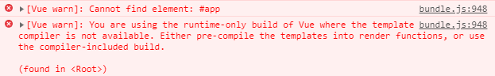
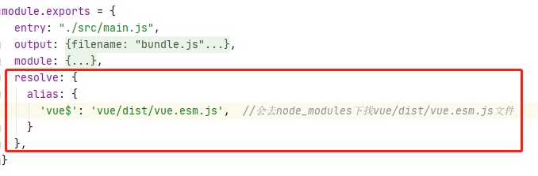

# 一、通过`npm`安装引入`Vue.js`

1. 后续的学习和开发项目，必然要用到`Vue.js`，而且会以特殊的文件来组织`vue`的组件。既然在实际项目中会用到`vue`，那么就一定会对`Vue.js`产生依赖。之前学的都是直接把`vue.js`下载到本地然后用`script`标签引用，但这不是模块化开发和管理`vue`文件。`webpack`本身又支持模块化开发，所以先学习在`webpack`中使用`Vue`时的配置方法。

2. 安装：`npm install vue --save`  // 在`webpack`中安装对`Vue`的相关依赖，这里不需要`-dev`，因为`-dev`表示开发时依赖，而`vue`是运行时依赖。安装完成后在`package.json`中会有一个`dependencies`的配置项，表示这是运行时依赖的模块，与之对应的是`devDependencies`（开发时依赖）。

```vue
"dependencies":{
	// ^表示版本号的最后一位是可变的，如果是~符号，则表示版本号的后两位都是可变的；
	"vue":"^2.6.11",
}
// 项目中安装的是vue@2.5.21
```

3. 通过`npm`安装的`vue`会被安装在项目目录下的`node_modules`下，安装完`vue`后就可以把`vue`当成一个模块来使用。在需要用到`vue`模块的文件中写一行代码即可：`import Vue from 'vue'`，这里没有写`vue`文件的完整路径，那么`webpack`就会去`node_modules`中找对应的`vue`模块，如果`node_modules`有对应的模块，那么就会被引入当前文件。从引入`vue`的写法中就可以看出，在`vue`的源文件中肯定有一条`export default Vue`语句。

4. 重新打包没有错误，但是运行程序浏览器报错，且不会出现预期效果。这是因为`vue`在构建的时候会有两个版本，`runtime-only`和`runtime-compiler`，在`runtime-only`版本中，代码不可以有任何`template`，而在`runtime-compiler`版本中，代码可以有`template`，因为有`compiler`可以用于编译`template`（后面详解）。而`vue`又会把挂载元素当作`template`，所以报错。

	- 至于第一条报错`Cannot find element： #app`，只需要在`index.html`文件中把引入的`bundle.js`文件放在靠近`</body>`处引用即可，否则`bundle.js`都引入了，可能挂载`#app`的标签还没有解析出现，就报这个错。



5. 在`webpack.config.js`中加入一项配置，这项配置的意思是当在代码中进行`import Vue from 'vue'`的时候，`webpack`会查看要导入资源的`vue`文件有没有指向某个具体的文件，这里`vue`指向了`vue/dist/vue.esm.js`这个文件，在同一目录下，有多个`vue`的构建版本，默认是`vue.runtiem.js`这个版本。



6. 默认情况下使用的是`vue/dist/vue.runtime.js`模块，即`runtime-only`，配置后的`vue/dist/vue.esm.js`包括了`runtime compiler`。再进行`npm run build`打包，正常渲染。

- 思路：
	- `npm install`安装`vue`；
	- 在项目文件需要的地方导入`vue`：`import Vue from 'vue'`，并开发`vue`的相关代码；
	- 在`index.html`文件中挂载文件；
	- 在`webpack.config.js`中配置别名，指定构建版本为`runtime-compiler`；
	- 打包文件，正常渲染访问；


二. `el`与`template`

1. `SPA`单页面应用：`single page web application`。`vue`可以做多页面应用的东西，但是我们后面用`vue`做得比较多的是单页面富应用。
	
2. 在单页面富应用中一般只有一个`html`文件，在多个页面之间就通过路由跳转。所以在真实的开发中，这个唯一的`html`文件一般是不轻易改动的，里面只进行挂载，即只挂载各个文件中开发的`vue`组件（即`index.html`文件中只写`<div id="app"></div>`，而组件则通过其自身的`el`属性指定当前组件挂载在`html`文件中的位置），至于组件中想要显示的内容都通过在其内部的`template`标签来展示。

```javascript
 <script>
	let app = new Vue({
		template: `
			<div>
				<span>{{message}}</span>
			</div>
		`,
		el: "#app",
		data: {
			message: 'Hello World',
		}
	})
</script>
```

3. `vue`在解析代码的时候，实际操作是把`template`模板中的东西，完整地替换到`el`属性指定的在`html`文件中的挂载点。即把上面`template`中定义的模板替换掉`html`文件中的`<div id="app"></div>`。


# 三、模块化开发

- 以下开发方案中，都是各种`js`、`css`、`img`各自实现各自的功能或效果，然后统一导入到`main.js`，以`main.js`作为入口文件，最后又把`main.js`中的`vue`代码挂载到`index.html`中，在浏览器中打开`index.html`文件浏览。

## 1. 初级写法：（即上面二中的写法）

1. 通过`npm`安装`vue`，然后在`main.js`中引入`Vue`（`import Vue from 'vue'`），接着在`main.js`中开发`vue`的代码，在和`el`平级之处写一个`template`选项，在`template`里面写组件要展示在浏览器上的`html`模板代码。

```vue
let app = new Vue({
	template: `
		<div>
			<span>{{message}}</span>
		</div>
	`,
	el: "#app",
	data: {
		message: 'Hello World',
	}
})
```

2. 在`template`下开发代码，先写一个`div`作为`root`标签，然后开发组件`template`模板：
```html
`<div>组件代码</div>`
```

3. 在`new Vue({})`中还是按照原来的写法，`data`还是对象。

4. 挂载到`index.html`中，就是在`index.html`中写一个`root`性质的标签，然后指定`el`挂载的`id`即可（即`<div id="app"></div>`）。以后改动组件的时候，并不修改`index.html`文件，而是修改`main.js`中的代码，这样打包好以后，`index.html`中自动更新为最新代码的效果。

```html
<body>
	<div id="app"></div>
</body>
```

5. 打包的时候，`Vue`框架会把`main.js`中`template`下的代码（根标签`div`及其包裹的所有代码）复制到`el`属性指定的在`index.html`中挂载的元素处。


## 	2. 高级写法

1. 在上面的写法中，如果`vue`实例中的`template`模板越来越庞大，那么也不方便维护，一种更好的做法是把`template`抽取出来，单独搞成一个组件，可以写：

```vue
const App = {
	template: `
		<div>组件代码</div>
	`,
	// 注意，这里因为是组件内部，data要用函数写法；
	data(){},
	methods:{方法}
}
```

2. 其实就是把原来在`new Vue`实例中写的`template`、`data`、`methods`等都写在抽离出来的新组件中，而`vue`实例仅仅作为一个根组件，不写入太多庞杂的代码。

3. 在原来的`vue`实例这个根组件中写：`new Vue({el: '#app', template: `<App/>`, components:{App}})`，即在原来的`Vue`实例中注册一个`App`组件，然后在`template`中用一下该组件。

```vue
// 1. 这里就是声明一个组件，只是这个组件没有注册，通过Vue.component就是直接声明并注册
const App = {
	template: `
		<div>
			<span>{{message}}</span>
		</div>
	`,
	data(){
		return {
			message: 'Hello World'
		}
	}
}
let app = new Vue({
	// 3. 在vue实例的模板中调用子组件
	template: `<App/>`,
	el: "#app",
	// 2. 这里等于把上面声明的组件注册为vue实例的子组件
	components: {
		App
	}
})
```

4. 最后把这个`vue`实例根据`el`属性挂载到`index.html`的挂载处。`vue`解析代码的时候，会把挂载到`index.html`中的实例的`template`模板复制替换过去，此时发现仍然是一个`<App />`组件，`vue`会继续查找子组件或者全局组件，把`<App />`这个组件最终渲染到`index.html`中的挂载点上。


## 3. 模块化写法

1. 在`src`目录下新建一个`vue`的目录，然后新建一个`app.js`文件，其中写**export default {template: \`<div>组件代码</div>\`, data(){}, methods:{}}**，就是把原来`const App`这个组件单独写到`app.js`这个文件中，而在这个文件里就直接把组件`export`导出来。

```javascript
// app.js
export default {
	template: `
		<div>
			<span>{{message}}</span>
		</div>
	`,
	data(){
		return {
			message: 'Hello World',
		}
	}
}
```

2. 在`main.js`中导入`app.js`中的组件，即通过`import App from './vue/app.js'`导入，其余按照高级写法中的第三步继续写。

```vue
// 1. 引入vue模块，并引入用户开发的app.js文件
import Vue from 'vue'
import App from './vue/app.js'

let app = new Vue({
	// 3. 在vue实例的模板中调用子组件
	template: `<App/>`,
	el: "#app",
	// 2. 把用户在app.js中开发的、且已经引入当前文件中的组件在vue实例中注册为子组件
	components: {
		App
	}
})
```

3. 以后修改代码就在`app.js`中进行，但是这时候`template`模板、`data`数据、`methods`方法等都是在一个对象中，并没有实现分离。


## 4. 深化写法

1. 上面的“模块化写法”中，虽然已经实现组件代码单独成为一个文件，极大提高了组件的可维护性，但是在这个实现组件的文件中，仍然可以看到，组件的模板、数据、样式等全部代码都是混合在一起的，没有进行彻底的分离。另外如果有样式也无法写在当前的`js`文件中。

2. 在上面的“模块化写法”的基础上，在`vue`目录下再新建一个`Vue Component`文件，取名`App`，生成一个`Vue`文件，该文件中有三部分，一是`<template>`模板，二是`<script>`脚本，三是`<style>`样式。

3. 把原来的`template`模板写到`Vue`文件中的`<template>`标签下，把控制`<template>`模板中的样式的代码写在`<style>`标签中。

4. 把`data`、`methods`等其他东西都放到`<script>`标签下的`export default{name: 'App', data(){}, methods: {}}`中。

```vue
<template>
	<div>
		<span>{{message}}</span>
		<button @click="btnClick">按钮</button>
	</div>
</template>
<script>
	export default {
		name: "App",
		data(){
			return {
				message: "Hello world",
			}
		},
		methods: {
			btnClick(){
				console.log("点击了按钮");
			}
		}
	}
</script>
<style scoped>
	span {
		color: aliceblue;
	}
</style>
```

5. 在`main.js`中引入这个`Vue`文件中的组件`App`，即在`main.js`中加一句：`import App from './vue/App.vue'`，然后`new Vue({el:"#app",components:{App},template:"<App/>"})`。但此时还不能加载和编译运行这个`App.vue`文件，因为还需要一个`loader`和`vue-template-compiler`来处理`vue`文件，`vue-loader`是加载`vue`文件的，`vue-template-compiler`是对`vue`文件进行编译的（主要针对`vue`文件中的`template`模板）。

```vue
// main.js
// 1. 引入vue模块，并引入用户开发的App.vue组件
import Vue from 'vue'
import App from './vue/App.vue'
let app = new Vue({
	// 3. 在vue实例的模板中调用子组件
	template: `<App/>`,
	el: "#app",
	// 2. 把用户在App.vue中开发的、且已经引入当前文件中的组件在vue实例中注册为子组件
	components: {
		App
	}
})
```
- 这些代码写在`main.js`中，同时`main.js`中也引入了`vue`，并且`vue`实例通过`el`属性和`index.html`中`id`为`app`的标签挂钩了。因此，`vue`在解析这些代码的时候，就会先找到`App.vue`文件中的`template`下的模板作为`<App/>`，在当前`main.js`文件中的`components`下注册为子组件，再在`main.js`的`template`下面调用，最后才用`mian.js`中`template`的模板组件全部替换掉在`index.html`中`id`为`app`的标签。

6. 安装处理`vue`文件的依赖：`npm install vue-loader vue-template-compiler --save-dev (vue)`。
	
7. 修改`webpack.config.js`配置文件，即在`module`下的`rules`中添加一项配置：

```vue
{
	test:/\.vue$/,
	use:['vue-loader']
}
```

8. 再次终端执行`npm run build`打包文件，仍然报错：`vue-loader was used without the corresponding plugin. Make sure to include VueLoaderPlugin in your webpack config`。此时在`package.json`中查看`vue-loader`的版本，会发现`vue-loader`的版本高于`14`，而`vue-loader`从`14`版本开始，如果要正确使用该`loader`，还需要安装一个插件`plugin`，否则报错。

- 处理办法有两个:
	- 在`package.json`中修改`"vue-loader": "^13.0.0"`(^表示大于等于)，即把版本号降低到`14`版本以下，这样就不需要`plugin`了。对`package.json`做了任何修改后，都需要在终端执行`npm install`命令，这条命令会根据`package.json`中指定的版本和其他参数重新安装`node_modules`中的模块。比如这里原先的`vue-loader`版本高于`14`，在`package.json`中手动指定为`"^13.0.0"`后，再在终端敲入`npm install`这个命令就会让`webpack`根据这个文件重新安装特定版本的模块；（修改完并重新安装低版本的`vue-loader`后，就可以`npm run build`打包文件了）。

	- 处理好`plugin`问题后，再次打包后即可。

9. 如果要在一个`vue`文件中引入另一个`vue`组件，那么就在要引入的`vue`文件的`<script>`标签下写一条`import`语句进行导入。比如从`Cpn.vue`文件中导入`Cpn`组件到`App.vue`中，可以在`App.vue`文件中紧贴`<script>`标签写`import Cpn from './Cpn.vue'`，然后在当前文件的`export default{}`里面注册导入`vue`文件的组件，即加一条`components:{Cpn}`，使用引入的组件`Cpn`则要在`App.vue`文件的`template`标签内。

```vue
// Cpn.vue
<template>
	<div>
		<h3>这里是Cpn组件的模板</h3>
		<span>{{message}}</span>
		<button @click="btnClick">按钮</button>
	</div>
</template>
<script>
	export default {
		name: 'Cpn',
		data() {
			return {
				message: "Hello World",
			}
		}
	}
</script>
<style scoped>
	/* style样式没有就可以不写 */
</style>
```


```vue
// App.vue
<template>
	<div>
		<span>{{message}}</span>
		<button @click="btnClick">按钮</button>
		<!-- 
			3. 在当前文件中调用注册好的子组件
			这里标签大小写都是可以的，单双标签也都是可以的
		-->
		<Cpn/>
	</div>
</template>
<script>
	// 1. 在当前vue文件中引入另一个vue文件中的组件
	import Cpn from './Cpn.vue'
	export default {
		name: "App",
		// 2. 注册导入的组件到当前vue文件中，必须先注册然后才能调用，这里实际注册为子组件了
		components: {
			Cpn
		},
		data(){
			return {
				message: "Hello world",
			}
		},
		methods: {
			btnClick(){
				console.log("点击了按钮");
			}
		}
	}
</script>
<style scoped>
	span {
		color: aliceblue;
	}
</style>
```

10. `import`导入模块时，如果要省略后缀`.vue`，可以在`webpack.config.js`中的`resolve`中添加一项配置：`extensions: ['.js','.vue','.css']`，这样在`import`导入文件的时候就可以省略`js`、`vue`、`css`等文件的后缀了。

## 5. 总结

1. 实际项目都是按照第`4`步的“深化写法”开发的，整个应用程序就是一个组件树，比如根组件就是`App.vue`，然后被下一级的子组件引用，子组件又被孙一级的组件引用，如此引用下去，形成完整的组件树。而每个组件都是一个独立的`vue`文件。


# 四、plugin

1. `plugin`是插件，通常是用于对某个现有的架构进行扩展。`webpack`中的插件就是对`webpack`现有功能的各种扩展，比如打包优化、文件压缩等。

2. `loader`和`plugin`的区别：

- `loader`主要用于加载某些类型的文件，或转换某些类型的模块，它是一个加载器或转换器。
- `plugin`是插件，它是对`webpack`本身的扩展，是一个扩展器。

3. `plugin`的使用过程：

- 安装：用`npm`安装所需要的`plugin`，某些`webpack`已经内置的插件不需要安装。
- 配置：在`webpack.config.js`中的`plugins`中配置插件。

4. 示例：在源码文件中添加一个版权声明，该插件叫`BannerPlugin`，属于`webpack`自带的插件，所以在文件开头要导入`webpack`。然后再在配置文件`webpack.config.js`中按照下面的样子配置之后（导入`webpack`和添加`plugins`选项），最后进行`npm run build`打包，就可以在打包后的文件`bundle.js`的头部中看到`/*! 最终版权归xxx所有*/`之类的信息。

```vue
// 导入webpack才能使用它自带的BannerPlugin
const webpack = require('webpack')
module.exports = {
	…
	plugins: [
		new webpack.BannerPlugin('最终版权归xxx所有……')
	]
}
```

5. 打包`html`的`plugin`

- 目前，我们的`index.html`文件是放在项目的根目录下的，但是在真实发布项目的时候，发布的是`dist`文件夹中的内容，但是`index.html`文件是不会打包进`dist`目录的。而`dist`目录中如果没有`index.html`文件，那么打包的`js`文件也就没有意义了。所以，我们需要将`index.html`文件打包到`dist`文件夹中，这个时候就可以使用`HtmlWebpackPlugin`插件。该插件可以自动生成一个`index.html`文件（可以指定模板来生成），将打包的`js`文件，自动通过`script`标签插入到打包后的`index.html`文件的`body`中。

- 安装：`npm install html-webpack-plugin --save-dev`  //（如果打包时报错，可以考虑安装`3.2.0`版本`html-webpack-plugin@3.2.0`）

- 配置：在`webpack.config.js`中配置插件，`plugins`下增加配置（先导入`html-webpack-plugin`）：

```vue
// 导入html-webpack-plugin这个插件
const HtmlWebpackPlugin = require('html-webpack-plugin')
module.exports = {
	……    //其他配置项
	plugins: [
		……  //其他配置选项，与html-webpack-plugin并列但无关
		//这样是只生成一个index.html文件，不指定参考模板，和下面的配置二选一即可
		new htmlWebpackPlugin(),

		//这样会在当前配置文件所在目录中寻找一个index.html的文件，以此为模板生成dist中的index.html，
		//注意，模板文件中不再需要写script标签引入bundle.js文件了，因为本插件会自动插入；
		new htmlWebpackPlugin({
			template:`index.html`
		}),
	]
}
```

- 使用`html-webpack-plugin`打包`index.html`后，会在`dist`目录下，产生打包后的`bundle.js`文件、`index.html`入口文件，以及其他必要的资源文件，所以在`webpack.config.js`中的`publicPath`就不需要设置了，否则在`index.html`文件中引用图片等资源时，在其路径前加上一个`dist`反而会找不到对应的资源（具体参考第`10`章中的第七部分[图片文件处理]的第四步中的注意）

- 在打包生成的`index.html`中，如果没有指定参照模板，那么该文件中包含除了`html`文档的骨架外，仅仅只有一个`<script>`标签来引用打包后的`bundle.js`。这时候要么要手动在打包后的`index.html`文件中插入`<div id="app"></div>`来绑定`vue`实例，要么就要在配置文件`webpack.config.js`中写一个`template`来指定参考模板，而作为参考模板的`index.html`中只需要写`html`文件的骨架和`<div id="app"></div>`，不需要写`<script>`标签，因为`<script>`标签会自动生成并引用打包后的`bundle.js`且直接插入到打包后的`index.html`文件中。

6. `js`压缩插件：在项目发布之前，我们必然要对`js`文件进行压缩处理，使用的插件是`uglifyjs-webpack-plugin`，版本号可以指定为`1.1.1`，和`CLI2`保持一致。

- 安装：`npm install uglifyjs-webpack-plugin@1.1.1 --save-dev`。

- 配置：在`webpack.config.js`文件中导入`const UglifyJsWebpackPlugin = require('uglifyjs-webpack-plugin')`，然后配置`plugins`选项，即`new uglifyJsPlugin()`即可。

```vue
const UglifyJsWebpackPlugin = require('uglifyjs-webpack-plugin')  //导入uglifyjs-webpack-plugin这个插件
module.exports = {
	……    //其他配置项
	plugins: [
		……  //其他配置选项，与gulifyjs-webpack-plugin并列但无关
		newUglifyJslWebpackPlugin(),
	]
}
```

- 之后正常执行打包操作，打包后的`bundle.js`文件会被压缩。

- 开发阶段不建议进行丑化压缩。


# 五、搭建本地服务器

1. 按照之前的开发方式，每次作出修改，想要看到渲染后的结果，都要`npm run build`进行打包，极为不便。`webpack`提供一个可选的本地开发服务器，这个本地服务器基于`node.js`搭建，内部使用`express`框架，这个框架可以指定用于服务于某一个目录，然后这个框架就会实时监听整个项目的源代码文件的改变，如果发生了改变，它就会重新进行编译，也就可以实现浏览器自动刷新显示代码修改后的结果。但是新编译的文件都是存在内存中的，可以实现更快速的访问速度。等到真正需要发布的时候，仍然要`npm run build`打包，但是只需要打包一次了，执行该命令就会把当前内存中的文件输出到磁盘中，然后发布`dist`目录下的文件即可。整体上使得开发更加便捷了。

2. 安装和配置`devserver`：

- 安装：`npm install --save-dev webpack-dev-server@2.9.3`  //这里指定了版本号为2.9.3

- 配置：在`webpack.config.js`中进行配置

```vue
module.exports = {
	……  //其他诸如entry、output、plugins等选项
	devServer: {  //和plugins、entry、output等同级，而不是plugins的子选项
		//为哪一个文件夹提供本地服务(即监听哪一个目录)，默认是根文件夹，这里指定dist目录；
		contentBase: './dist',
		//页面是否实时刷新，即监听的目录中的文件发生变化就立刻重新编译并渲染；
		inline: true,
		//指定本地服务器运行的端口，可以不配置本项(整行全部删除)，默认端口为8080；
		port: 6688,
		//在SPA(single page applicatinos单页面多应用)页面中，依赖HTML5的history模式；
		//historyApiFallback
	}
}
```

3. 配置好服务器后，就可以把服务跑起来了，有两种方式：

- 在终端以绝对路径的方式执行`webpack`的`server`：`./node_modules/.bin/webpack-dev-server`。

- 在`package.json`中的`script`下添加一项脚本配置：`"dev": "webpack-dev-server"`，然后在终端输入`npm run dev`就可跑起本地服务了。

- 本地服务默认跑在http://localhost:8080 下，这样以后对代码进行修改，服务器会实时刷新。等项目开发完毕后，再执行一次`npm run build`打包代码上传服务器；如果上一步中配置成`"dev": "webpack-dev-server --open"`，则会在执行`npm run dev`开跑本地服务的时候，自动打开浏览器。

4. 尽量配置上面的`html-webpack-plugin`插件，这样就不需要配置`publicPath`了，因为`html-webpack-plugin`会把`index.html`也打包进`dist`目录中，引用各种资源的时候不需要在路径中加上`dist`了。如果配置了`publicPath`反而麻烦，因为`webpack-dev-server`也是根据这个设置在各种资源的路径上加上`dist`的，而`index.html`往往是作为打包后的入口文件放在`dist`目录下的，发布时只要把`dist`目录下的文件全部发布就行，因为`publicPath`会导致反而找不到需要的资源。**总之就是配置`html-webpack-plugin`而不要配置`publicPath`。** https://segmentfault.com/a/1190000006670084

5. 与丑化`js`代码相反，打包项目的时候，本地服务器的配置项是不需要的，可以注释掉。而`uglifyJs`则是开发阶段不需要的，只有最后打包项目了才用。于是产生一个问题，就是`webpack.config.js`配置文件中的配置项，有的是在开发阶段需要的，到打包项目的时候就不需要了，而有些是在打包项目时才需要的，开发阶段不需要，基于此，就可以对这个配置文件进行抽离。


# 六、`webpack`配置的分离

1. 把`webpack.config.js`文件中的配置进行抽离，开发时依赖的配置放到一个文件，发布时依赖配置放到另一个文件，开发时和发布时都依赖的配置就放在一个公共的文件中。

2. 新建一个目录`build`，在`build`目录中新建一个`base.config.js`，开发时依赖且运行时也依赖的配置放在该文件中。

3. 在`build`目录中新建一个`prod.config.js`文件，运行时依赖的配置放在该文件中。

4. 在`build`目录中新建一个`dev.config.js`文件，开发时依赖的配置放在该文件中。

5. 例如，`webpack-dev-server`是开发时依赖，其配置放在`dev.config.js`文件中，而`uglifyjs-webpack-plugin`是发布时才用的，所以放在`prod.config.js`文件中。其余开发时需要、发布时（运行时）也需要的配置都放在`base.config.js`文件中。这里出现一个问题，发布时需要的是`prod.config.js`文件，而开发时需要的是`dev.config.js`配置文件，而`base.config.js`文件是两者都需要的，这时候就需要合并`prod.config.js`文件和`base.config.js`文件构成发布时需要的完整的配置文件，同时也要合并`dev.config.js`文件和`base.config.js`文件构成开发时需要的完整的配置文件。

6. 合并文件需要用到插件，先安装：`npm install webpack-merge --save-dev`，示例中为`webpack-merge@4.1.5`。安装完毕后，在`prod.config.js`中进行配置，合并`prod.config.js`和`base.config.js`文件：

```vue
// prod.config.js
//原来需要的js丑化压缩插件UglifyjsWebpackPlugin在prod.config.js中是依赖的，所以仍然需要需要导入
const UglifyjsWebpackPlugin = require('Uglifyjs-webpack-plugin')

//导入webpack-merge插件用于合并prod.config.js和base.config.js文件
const webpackMerge = require('webpack-merge')
//导入base.config.js文件，baseConfig就是接收到的base.config.js文件
const baseConfig = require('./base.config.js')  

//webpackMerge文件就是合并的意思，baseConfig表示base.config.js文件，而后面的花
//括号中写的就是发布时需要依赖的配置选项，写法和原来在webpack.config.js中的一样，
//原来是module.exports={配置项}导出，现在是和base.config.js合并后再导出
module.exports = webpackMerge(baseConfig, {
	plugins: [
		new UglifyjsWebpackPlugin()
	]
})
```

7. 在`dev.config.js`中也进行同样的合并，在`dev.config.js`中用到的插件、`loader`之类的，也需要进行导入，然后进行配置，再用上面黄色部分进行合并作为一个整体的配置文件导出。

8. 这样的分离，把一个文件分成了三个文件，看似增加了文件个数，显得更为麻烦，但是实际上在开发复杂项目的时候，合理区分配置文件有利于开发。

9. 抽离不同的配置文件后，原来的`webpack.config.js`文件就可以删除了。删除`webpack.config.js`后在终端输入：`npm run build`进行打包，会报错，提示在当前文件夹中需要一个名为`webpack.config.js`的配置文件。这时候需要在`package.json`中的`scripts`配置项下面的`build`选项中增加配置：`"build": "webpack --config ./build/prod.config.js"`, `"dev": "webpack-dev-server --open --config ./build/dev.config.js"`，这两条脚本配置分别手动指定了发布时的配置文件和开发时的配置文件。

10. 此时打包编译的话，打包生成的文件是在`/build/dist`下，因为`base.config.js`中的`output`配置项配置的路径是`path: path.resolve(__dirname, 'dist')`，可以修改为`path: path.resolve(__dirname, '../dist')`这样就在主目录下生成了`dist`打包目录。

11. 此时再`npm run dev`可以直接本地开启服务器（前提是在当前项目中安装了本地服务器）。


