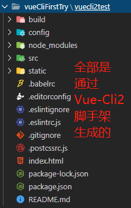
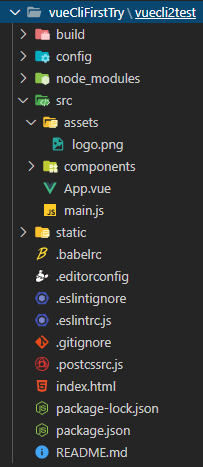
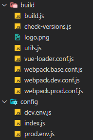
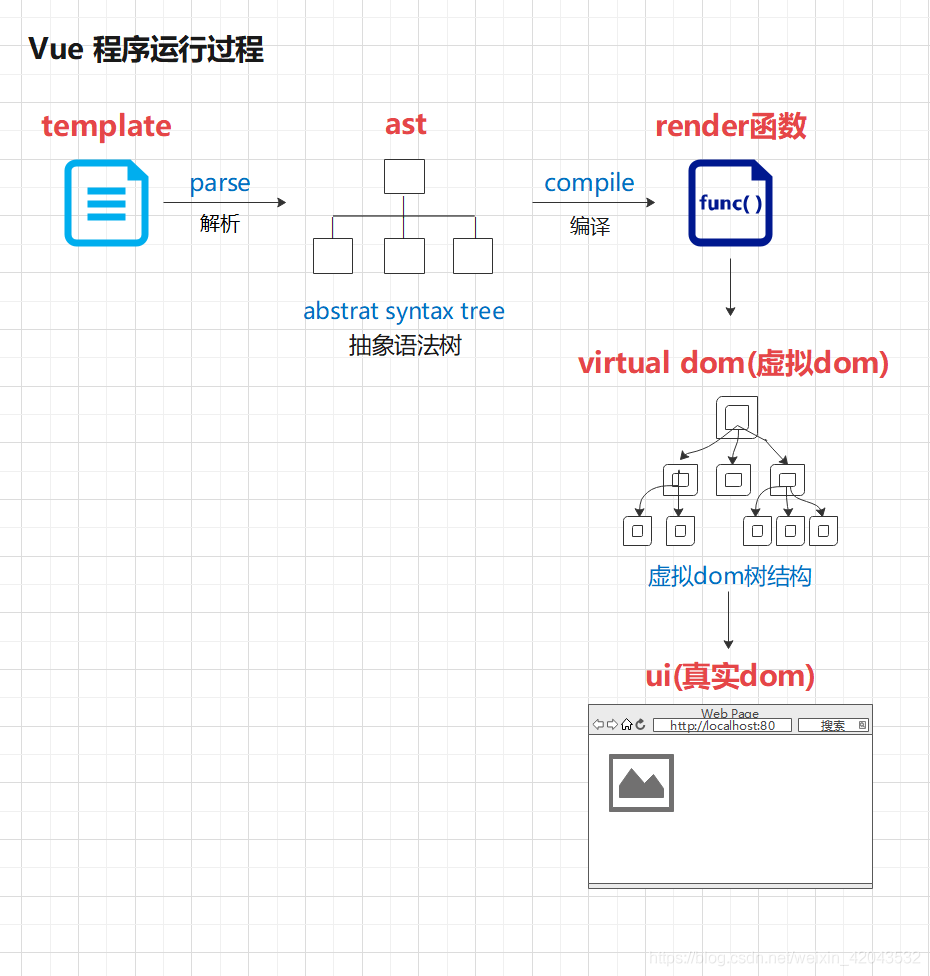
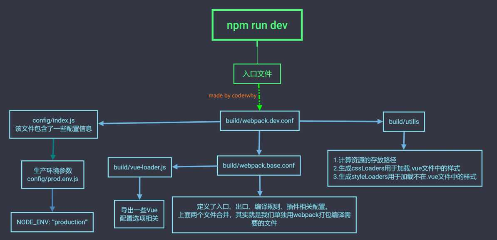
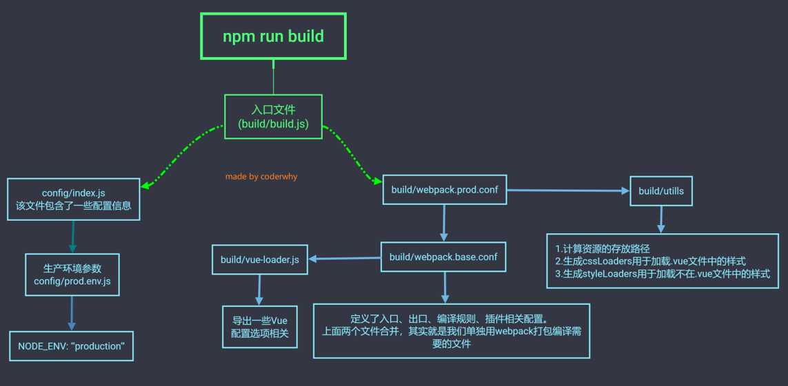
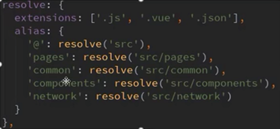

# 一、概述

1. 在实际的开发中，我们一般不会从头到尾全部写`webpack`的配置，而是通过脚手架工具自动生成`webpack`的配置，`vue`和`react`开发都是有对应的脚手架的。

2. 如果只是简单写几个`Demo`程序，根本用不上脚手架。但是如果开发大型项目，那么肯定会用到脚手架。使用`Vue.js`开发大型应用时，我们需要考虑代码目录结构、项目结构和部署、热加载（类似浏览器自动刷新）、代码单元测试等事情。每次手动配置效率很低，还不一定完全正确，所以实际项目中通常使用脚手架完成配置。

3. `CLI`是`Command-Lind Interface`，翻译为命令行接口，俗称脚手架。`Vue CLI`是一个官方发布的`vue.js`项目脚手架，使用`vue-cli`可以快速搭建一个`vue`开发环境以及对应的`webpack`配置（主要点）。

# 二、脚手架的准备

1. `Vue CLI`使用的前提，就是依赖`Node`：http://nodejs.cn/download/ ，去官网下载安装即可。此外还依赖`webpack`，因为`Vue`的脚手架工具使用了`webpack`模板，对所有的资源进行压缩等优化操作，以及在开发过程中提供了一套完整的功能，能够使得我们开发过程更加高效。`webpack`按照下面第`5`步全局安装即可。

2. 默认情况下会安装`Node`和`NPM`，`Node`环境要求`8.9`以上或者更高版本，通过`node -v`可以查看`node`环境。`npm`是`Node Package Manager`的简称，是一个`NodeJs`包管理和分发工具，已经成为了非官方的发布`Node`模块（包）的标准。对于`NPM`虽然没有版本要求，但是也可以通过`npm -v`查看版本信息。

3. `cnpm`安装：国内使用`npm`的官方镜像是很慢的，可以使用淘宝的`npm`镜像（下面二选一在终端执行即可）：

- `npm install -g cnpm --registry=https://registry.npm.taobao.org`
- `npm config set registry https://registry.npm.taobao.org`

4. 安装了`cnpm`后就可以使用它来安装模块了：`cnpm install [modules_name]`。

5. `webpack`全局安装：`npm install webpack -g`。


# 三、安装脚手架

1. 安装`vue`脚手架：`npm install -g @vue/cli`，这样安装的是脚手架版本`3`（例如`npm install -g @vue/cli@3.2.1`），脚手架全局安装即可，不需要本地安装。原来的脚手架`cli2`是直接`npm install -g vue`（比如`npm install -g vue@2.5.9`)。但是在脚手架版本`3`的基础上可以调用一个模块，进而使用脚手架`2`，所以只安装脚手架版本`3`即可。安装完成后终端输入：`vue --version`或者`vue -V`即可查看`vue`的版本。如果安装`vue`报错，可以尝试清空或删除`C:\Users\91616\AppData\Roaming\npm-cache`目录，然后在终端以管理员身份运行`npm cache clean --force`，再重新安装。
	
2. 安装脚手架`3`后，如果要使用脚手架`3`创建项目，默认情况下也只能使用脚手架`3`，在终端输入`vue create [My_Project_Name]`即可。

3. 由于上述安装是默认安装脚手架`3`，而脚手架`3`和`2`使用的是相同的命令，所以`vue-cli2`的命令都是被`3`覆盖了的。如果要使用脚手架`2`进行初始化项目（即终端输入`vue init webpack [My_Project_Name]`），需要拉取脚手架的`2.x`模板，在终端全局安装一个桥接工具：`npm install -g @vue/cli-init`（如果指定版本：`npm install -g @vue/cli-init@3.2.0`），然后执行`vue init webpack [My_Project_Name]`，这时候调用的是`vue-cli2`的命令。


# 四、`vue-cli2`详解

1. 在终端输入`vue init webpack [My_Project_Name]`初始化项目的时候，会自动生成一些模板（其实是自动从官方指定的某个服务器上下载模板），并让开发者输入相应的信息进行配置。假设在终端输入`vue init webpack myproject`，那么`vue`会根据这个`myproject`创建一个目录，作为存放整个项目的总目录。在配置项目的时候也可以把该名称作为默认的项目名称，**但是不能包含大写字母**。然后`vue-cli2`会要求配置如下信息：

| // 在执行`vue init webpack myproject`后会创建一个名为`myproject`的目录，作为项目的总目录。   <br />// 同时默认以`myproject`作为项目的名称，也可以给项目另外命名，还可在`package.json`中手动修改，   <br />// 这里不输入信息则项目名字和目录名字保持一致，一般直接回车； <br />**? Project name (myproject)** |
| ------------------------------------------------------------ |
| // 对这个项目的描述信息，默认信息是括号中的`A Vue.js project`；   <br />// 可以自己输入对项目的描述信息，会自动覆盖默认的描述信息；    <br /> **? Project   description (A Vue.js project)** |
| // 作者信息，如果在`gitconfig`中配置了全局的信息，就会读取为这里的默认作者，也可以自己修改     <br />**? Author** |
| // 构建项目的时候选择用哪种方式构建，一是`Runtime` + `Compiler`，二是`Runtime-only`，通过键盘上下箭头选择一种；   <br/>// 开始建议用第一种`Runtime` + `Compiler`，实际开发中用的更多的是第二种，第二种更加轻型且效率更高；     <br>**? Vue build   (Use arrow keys)     <br />> Runtime + Compiler: recommended for most users**       <br/>   **Runtime-only: about 6KB lighter min+gzip, but templates (or any   Vue-specific HTML) are ONLY allowed in .vue files - render functions are   required elsewhere** |
| // 是否安装路由，大型项目可能会用到`vue`的全家桶，即`VueCore` + `vue-router` + `vuex`，要用到路由就必须安装；     <br />**? Install   vue-router? (Y/n)** n |
| // 使用`ESLint`严格规范`js`代码，选择`Y`则要求项目中的`js`代码缩进等风格严谨，实际开发中可能选择`n`。  <br /> // 如果开启了`ESLint`但是想关闭，在项目的`config`目录下的`index.js`文件中，把`useEslint`变量设置为`false`即可关闭，   <br />// 但是关闭后还要重新运行`npm run dev`才生效；   <br />**? Use ESLint to lint your code? (Y/n)** y |
| //上一步选择`Y`则当前步骤要求选择一种`ESLint`的规范，可以选择标准版，也可以选择`Airbnb`，也可以自己规定风格；     <br />**? Pick an   ESLint preset**   <br />**> Standard (**[**https://github.com/standard/standard**](https://github.com/standard/standard)**)**      <br />   **Airbnb (**[**https://github.com/airbnb/javascript**](https://github.com/airbnb/javascript)**)**          <br />   **none (configure it yourself)** |
| // 在当前项目中进行单元测试，国内八九成的公司都不会对项目进行单元测试；     <br />**? Set up   unit tests (Y/n)** n |
| // 是否用`Nightwatch`进行端到端（`e2e`）测试，`Nightwatch`一般会结合`selenium/webdriver/phantomjs`进行自动化测试；   <br />// 大公司可能用得到，小公司较少用；     <br />**? Setup e2e   tests with Nightwatch? (Y/n)** n |
| // 以后管理项目的时候，用`npm`还是`yarn`。   <br />// `npm`是官方的项目管理工具，但是最开始的时候`npm`并不好用，谷歌等一些公司就联合推出了`yarn`这个管理工具；   <br />// 但后来`npm`升级后变得好用了，所以一般选择第一个；     <br />**? Should we   run `npm install` for you after the project has been created? (recommended)   (Use arrow keys)**   <br />**> Yes, use NPM**     <br />   **Yes, use   Yarn**     <br />   **No, I   will handle that myself** |
| // 完整配置信息如下一览，蓝色信息为用户输入或者选择的内容   <br />// 以下配置信息都会保存在`package.json`中；   <br />**? Project name** vuecli2test   <br />**? Project description** A Vue.js   project   <br />**? Author** feng   <br />**? Vue build** standalone         <br />**? Install vue-router?** No   <br />**? Use ESLint to lint your code?** Yes   <br />**? Pick an ESLint preset** none   <br />**? Set up unit tests** No   <br />**? Setup e2e tests with Nightwatch?** No   <br />**? Should we run `npm install` for you after the project has been   created? (recommended)** npm |




# 五、目录详细介绍

1. 在完成第四步中的配置之后，会自动生成完整的项目和目录。



2. 其中`build`和`config`目录都是关于`webpack`的配置目录，里面存放的都是`webpack`的配置文件：



3. 从`package.json`入手看配置文件，其中的脚本`scripts`有四条命令：

```vue
"scripts": {
	"dev": "webpack-dev-server --inline --progress --config build/webpack.dev.conf.js",
	//执行的是项目目录下build目录下的build.js文件
	"build": "node build/build.js",
	// 实际执行的还是npm run dev
	"start": "npm run dev",
	//ES代码规范，可在config/index.js中设置useEslint: true来开启或关闭
	"lint": "eslint --ext .js,.vue src"
},
```

4. `build`目录下的文件详解

- **第一条主线：**从`package.json`中的`scripts`脚本下的`npm run build`出发，可以串联起`build/build.js`、`webpack.prod.conf.js`、`webpack.base.conf.js`等文件作为生产发布时的配置文件。

```javascript
// build/build.js
// 在package.json文件的scripts配置中，可以看到执行npm run build的时候执行的是node build/build.js，其实就是执行build目录下的build.js文件，是通过node命令直接指定nuild.js文件作为打包脚本。node有直接解析js文件的功能（node其实是为js的执行提供了一个环境，原来的js只能在浏览器中执行，服务端就根本无法执行js代码，node出现后，给js的运行提供了环境，在node中可以直接执行js代码，Node本身是使用c++开发的框架，使用谷歌的V8引擎，直接把js代码翻译成二进制代码，不经过中间的字节码阶段，速度更快。因为有了这个底层支撑，所以js才可以开发服务器端），甚至可以写一个js文件，然后直接在终端输入“node js文件名”执行该js文件；

// 头部引入一些依赖，省略号表示省略一些引入的依赖，具体参考build.js文件
...
const rm = require('rimraf')
const path = require('path')
……
const webpack = require('webpack')
const config = require('../config')
// 4. webpackConfig就是当前目录下的webpack.prod.conf，这是发布时用的配置文件
const webpackConfig = require('./webpack.prod.conf')
……

// 1. 如果是第二次执行npm run build打包项目，rm会把原来的dist目录完全清空
rm(path.join(config.build.assetsRoot, config.build.assetsSubDirectory), err => {
	// 2. 执行上面的清空操作是否有异常，有异常就抛出异常，没有就执行第3步
	if (err) throw err
	// 3. 通过webpack拿到webpackConfig的配置信息，这里的webpackConfig已经是合并基础配置文件和生产配置文件后的完整配置文件，进行npm run build的时候就是真正打包
	webpack(webpackConfig, (err, stats) => {
		…  // 通过webpack执行webpackConfig的相关配置
	)
	…  // webpack执行的时候一些提示输出信息
})
```

```javascript
// webpack.prod.conf
'use strict'
const path = require('path')
const utils = require('./utils')
const webpack = require('webpack')
const config = require('../config')
// merge工具导入
const merge = require('webpack-merge')
// 基础配置导入，webpack.base.conf是打包和开发阶段都要用的配置文件；
const baseWebpackConfig = require('./webpack.base.conf')
…  // 各种plugin插件的依赖文件导入
const UglifyJsPlugin = require('uglifyjs-webpack-plugin')
const env = require('../config/prod.env')

// webpackConfig就是合并基础配置文件和打包配置文件后的完整配置文件；
// 通过merge这个工具合并baseWebpackConfig这个基础配置文件，而打包独需的配置文件全部写在后面的对象中；
const webpackConfig = merge(baseWebpackConfig, {
	module: {
		rules: utils.styleLoaders({
			…  // rules的相关配置
		})
	},
	devtool: config.build.productionSourceMap ? config.build.devtool : false,
	output: {
		path: config.build.assetsRoot,
		filename: utils.assetsPath('js/[name].[chunkhash].js'),
		chunkFilename: utils.assetsPath('js/[id].[chunkhash].js')
	},
	plugins: [
		// 各种webpack的plugins插件
		new UglifyJsPlugin({
			uglifyOptions: {
				compress: {
					warnings: false
				}
			},
			sourceMap: config.build.productionSourceMap,
			parallel: true
		}),
	]
})

// 其他配置项，都是打包项目时单独需要的，所以都抽离到当前文件中
……

// 导出的webpackConfig是合并基础配置文件和生产配置文件后的完整配置文件
module.exports = webpackConfig
```

```javascript
// webpack.base.conf
// 基础配置文件，这个文件中的配置是在开发阶段和打包阶段都需要用的配置，单独抽离出来保存
'use strict'
const path = require('path')
const utils = require('./utils')
const config = require('../config')
const vueLoaderConfig = require('./vue-loader.conf')

// 导出基础配置
module.exports = {
	context: path.resolve(__dirname, '../'),
	entry: {
		app: './src/main.js'
	},
	output: {
		path: config.build.assetsRoot,
		filename: '[name].js',
		publicPath: process.env.NODE_ENV === 'production' ? config.build.assetsPublicPath : config.dev.assetsPublicPath
	},
	resolve: {
		extensions: ['.js', '.vue', '.json'],
		alias: {
			'vue$': 'vue/dist/vue.esm.js',
			'@': resolve('src'),
		}
	},
	module: {
		rules: [
			...(config.dev.useEslint ? [createLintingRule()] : []),
			//各种loader的配置信息
			……
			{
				test: /\.vue$/,
				loader: 'vue-loader',
				options: vueLoaderConfig
			},
		]
	},
	node: {
		// node的相关配置
	}
}
```


- **第二条主线：**从`package.json`中的`scripts`脚本下的`npm run dev`出发，`webpack`执行的实际是下面这条语句，`webpack`会根据`--config`这个参数指定的配置文件，来启动一个`webpack-dev-server`的本地服务器。

```vue
"dev": "webpack-dev-server --inline --progress --config build/webpack.dev.conf.js"
```

```javascript
// build/webpack.dev.conf.js
'use strict'
const utils = require('./utils')
const webpack = require('webpack')
const config = require('../config')
const merge = require('webpack-merge')
const path = require('path')
// 导入基础配置文件，这是开发时和发布时都依赖的配置文件
const baseWebpackConfig = require('./webpack.base.conf')
//各种插件的依赖导入
……
const portfinder = require('portfinder')
const HOST = process.env.HOST
const PORT = process.env.PORT && Number(process.env.PORT)
// 合并基础配置文件baseWebpackConfig和开发时需要的配置文件
const devWebpackConfig = merge(baseWebpackConfig, {
	module: {
		rules: utils.styleLoaders({ sourceMap: config.dev.cssSourceMap, usePostCSS: true })
	},
	// cheap-module-eval-source-map is faster for development
	devtool: config.dev.devtool,
	// these devServer options should be customized in /config/index.js
	// 上面的英文就是devServer这个本地服务器的配置信息可以在/config/index.js中进行设置
	devServer: {
		clientLogLevel: 'warning',
		historyApiFallback: {
			rewrites: [
				{ from: /.*/, to: path.posix.join(config.dev.assetsPublicPath, 'index.html') },
			],
		},
		hot: true,
		contentBase: false, // since we use CopyWebpackPlugin.
		compress: true,
		host: HOST || config.dev.host,
		port: PORT || config.dev.port,
		open: config.dev.autoOpenBrowser,
		overlay: config.dev.errorOverlay ? { warnings: false, errors: true } : false,
		publicPath: config.dev.assetsPublicPath,
		proxy: config.dev.proxyTable,
		quiet: true, // necessary for FriendlyErrorsPlugin
		watchOptions: {
			poll: config.dev.poll,
		}
	},
	plugins: [
		//各种插件的配置信息
	]
})
module.exports = new Promise((resolve, reject) => {
	portfinder.basePort = process.env.PORT || config.dev.port
	portfinder.getPort((err, port) => {
        if (err) {
            reject(err)
        } else {
            // publish the new Port, necessary for e2e tests
            process.env.PORT = port
            // add port to devServer config
            devWebpackConfig.devServer.port = port
            // Add FriendlyErrorsPlugin
            devWebpackConfig.plugins.push(new FriendlyErrorsPlugin({
                compilationSuccessInfo: {
                    messages: [`Your application is running here: http://${devWebpackConfig.devServer.host}:${port}`],
                },
                onErrors: config.dev.notifyOnErrors ? utils.createNotifierCallback() : undefined
            }))
            resolve(devWebpackConfig)
        }
	})
})
```

- 其他文件：在`build`目录下的其他文件诸如`check-versions.js`、`utils.js`、`vue-loader.conf.js`这三个文件都是为配置做服务的，在上面的配置文件中都有引入并使用其中一些内容。

5. `config`目录下的文件详解：

- `index.js`中主要声明的是一些变量，这些变量主要分为两大类，一是`dev`用到的，一是`build`用到的。这里的变量控制着诸如是否自动打开浏览器、主机、端口等。

- `dev.env.js`是开发时的一些配置，`prod.env.js`是发布时的一些配置。

6. `node_modules`目录是当前项目依赖的一些`Node`模块，在`package.json`中可以查看`dependencies`和`devDependencies`两项来具体确定有哪些`Node`模块。

7. `src`目录是所有程序员开发的代码存放的目录。

8. `static`目录下存放的是静态资源。在`src`目录下`assets`中的图片等资源，会根据`webpack.base.conf.js`中的`limit`决定是直接拷贝到打包后生成的`dist`目录还是编译成`base64`格式，并且还会对其中的资源进行重命名。而`static`下的资源在打包的时候会原封不动地打包到`dist`目录下。其中`gitkeep`是不论`static`目录是否为空都把`git`相关的信息上传到服务器，没有`gitkeep`且`static`目录为空时，`git`相关的信息不会上传到服务器。

9. `.babelrc`：`ES6`代码转化为`ES5`的时候需要读取的一个配置文件。`babel`之前是在`webpack.config.js`中的`module`下的`rules`中配置，在`options`配置项中写一条`presets：['es2015']`，依赖的是`babel-preset-es2015`（具体参考第`10`章`WebPack`详解的第八部分`ES6`语法处理）。但是当`package.json`中安装的`babel`依赖是`babel-preset-env`，那么就要单独写一个配置文件，在里面写相关的配置（了解即可，一般很少手动修改）。

```vue
{
	"presets": [
		["env", {
			"modules": false,
			"targets": {
				// 重点理解这里，ES6转ES5只有在市场份额>1%、浏览器的版本为最新的两版、ie>8等情况下才转；
				"browsers": ["> 1%", "last 2 versions", "not ie <= 8"]
			}
		}],
		// 在package.json中查看devDependencies配置项，安装的是"babel-preset-stage-2": "^6.22.0",
		"stage-2"
	],
	// 依赖的插件
	"plugins": ["transform-vue-jsx", "transform-runtime"]
}
```

10. `.editorconfig`：项目文本相关配置，即对代码风格等做一个统一。

```conf
# ES转化的时候会查找.editorconfig文件，如果root=true才会解析后面的设置
root = true
[*]
# 字符集编码为utf-8
charset = utf-8
# 缩进的风格使用空格
indent_style = space
# 缩进2个空格
indent_size = 2
# 换行符为lf
end_of_line = lf
# 检查文件末尾是否有一个空行，如果没有空行，那么文件保存的时候就会自动添加一个空白行
insert_final_newline = true
# 清除多余的空格，比如一行代码后面多余一些空格就会自动清理
trim_trailing_whitespace = true
```

11. `.eslintignore`：`es`代码相关配置，该文件指定的目录或文件不进行`es`代码风格的约束。有时候开发代码的时候，风格如缩进、空格等不一定严格按照`eslint`设置的要求，而`.eslintignore`文件下设置的目录或文件夹就不需要遵守风格约束。不在这个配置文件中指定的目录或文件，代码风格如果不规范，`npm run build`打包的时候是不会通过的。

```vue
/build/
/config/
/dist/
/*.js
```

12. `.eslintrc.js`：`es`代码相关配置，如果在通过`vue create [My_Project_Name]`或`vue init webpack [My_project_Name]`初始化创建项目的时候，在`? Use ESLint to lint your code? No`这一步设置为`no`，那么就不会有`.eslintignore`和`.eslintrc.js`这两个关于`es`代码风格的配置文件。

13. `.gitignore`：`Git`仓库忽略的目录配置，该文件中指定的文件或目录不进行上传到服务器。

```conf
.DS_Store
node_modules/
/dist/
npm-debug.log*
yarn-debug.log*
yarn-error.log*
# Editor directories and files
# webStorm创建的项目会产生的文件
.idea
# vscode创建的项目会产生的文件
.vscode
*.suo
*.ntvs*
*.njsproj
*.sln
```

14. `postcssrc.js`：`CSS`相关转化的配置，一般不需要手动修改。

```javascript
// https://github.com/michael-ciniawsky/postcss-load-config
module.exports = {
	"plugins": {
		"postcss-import": {},
		"postcss-url": {},
		// to edit target browsers: use "browserslist" field in package.json
		"autoprefixer": {}
	}
}
```

15. `index.html`：是一个模板，在`build/webpack.dev.conf.js`这个配置文件中，有一个`HtmlWebpackPlugin`插件，这个插件有一个`template`参数，这个参数指定了执行`npm run build`打包的时候，会根据这个文件打包一个入口文件`index.html`到`dist`目录下（具体参考第`11`章`webpack`使用`Vue`的配置教程第四部分`plugin`之第`5`小节打包`html`的`plugin`）。

16. `package.json`：管理`Node`包的配置文件，在其中`dependencies`和`devDependencies`下配置的包都可以在`node_modules`中找到。

17. `package-lock.json`，在第11章中配置`webpack`的时候，第一节第`2`点指出了`^`和`~`对版本号的影响，这会产生一个后果，就是实际安装的版本号，不一定和`package.json`中指定的版本号一致（一般会较新一些，也就是版本号大一些），比如下面这个`package.json`中的配置，实际安装的版本可能是`2.6.12`。

```conf
// 在package.json中指定的版本是2.6.12，这是确切的版本
"dependencies":{
	// ^表示版本号的最后一位是可变的，版本是2.6.x，x大于等于11；
	// ~符号则表示版本号的后两位都是可变的，2.x.y，x大于等于6，y大于等于11；
	"vue":"^2.6.11",  
}
```

```vue
// package-lock.json配置文件中记录的就是node_modules中真实安装的版本
"vue": {
	"version": "2.6.12",
	"resolved": "…//vue的一个下载链接",
	"integrity": "sha1-9evU+mvShpQD4pqJau1JBEVskSM="
},
```


# 六、`Vue`程序运行过程

1. 在开发`vue`程序的时候，`html`代码都是在`main.js`入口文件中写成`template`模板的，当`vue`在执行`vue`文件的时候，会先把模板`template`传递给`vue`中的`options`进行保存，然后`vue`进一步把这个模板解析为`ast`（抽象语法树，`abstract syntax tree`），`ast`进一步被编译为`render`函数，`render`函数又进一步被渲染成为虚拟`dom`（`virtual DOM`），虚拟`DOM`刷新成`UI`界面，就是我们真正看到的真实的`DOM`。




# 七、`runtime + compiler`和`runtime-only`

1. 在用脚手架创建项目的时候，选择`runtime + compiler`还是`runtime-only`，区别只在`main.js`文件中。

```javascript
// Runtime-compiler的main.js
// template-->ast-->render-->vDom-->UI
import Vue from 'vue'
import App from './App'
Vue.config.productionTip = false

new Vue({
	el: '#app',
	components: { App },
	template: '<App/>'
})
```

```javascript
// Runtime-only的main.js
// render-->vDom-->UI
import Vue from 'vue'
import App from './App'
Vue.config.productionTip = false

new Vue({
	el: '#app',
	render: h => h(App)
})
```

- `Runtime-only`比`Runtime-compiler`的构建版本：
	- 代码量更少
	- 性能更高

2. 使用`runtime + compiler`的项目，在`main.js`中导入`Vue`文件后，就会在`main.js`文件中的`components`中注册一下，再到`main.js`文件中的`template`中使用，最后把`index.html`中的`id`为`el`指定`id`的标签全部用`template`指定的模板替换掉。在这里`vue`会把`template`模板保存到当前实例的`options`中，然后把实例中`options`保存的`template`模板解析为`ast`，再把`ast`编译为`render`函数，再把`render`函数渲染为虚拟`DOM`，最后虚拟`DOM`更新为真实的`UI`。

	- 原理：`runtime + compiler`就是`运行时 + 编译器`，也就是打包时仅对所有文件中的`template`进行解析生成`ast`（抽象语法树），然后把打包的代码在客户端运行时再进行编译成`render`函数，所以需要`vue-template-compiler`这个编译器。有了这个编译器，就能编译文件中的`ast`（抽象语法树）为`render`函数，然后浏览器就能执行`render`函数。

3. 使用`runtime-only`的项目，在`main.js`中导入`Vue`文件中的`App`组件后，`new Vue`的实例中只有`el`挂载相应的`id`，并没有注册组件并在`main.js`中使用（即`new Vue({})`中并没有`components`和`template`部分），而是仅使用一个`render`的箭头函数`render: h => h(App)`，相当于`render: function(h){return h(App)}`，其中`h`相当于一个缩写，内部是`createElement`，内部把这个函数传给了`h`。在这里，并没有`template`模板，而是通过`render`函数直接把引入的组件`App`变成虚拟`DOM`（`render`函数可以把传过来的`template`模板或组件直接编译成虚拟`dom`），再更新为`UI`。

	- 原理：`runtime-only`就是运行时版本，在打包项目的时候，就通过`webpack`的`vue-loader`和`vue-template-compiler`把`vue`文件中的`template`模板预编译为`js`代码（`render`函数），`runtime-only`也只能识别`render`函数，所以最终打包好的项目中都是可以直接在浏览器中执行的。但是注意这里只是预编译了`vue`文件中的模板，如果其他`js`文件中有模板，是不会进行预编译的，而`runtime-only`版本又因为在运行时没有`vue-template-compiler`，所以在开发时不能在非`vue`文件中写`template`，否则报错。如果在非`vue`文件中还要写`template`模板，那就要使用`runtime-compiler`模式。

4. 在`runtime-compiler`中，其实也可以不写`components`和`template`，而是直接写`render`函数，和`runtime-only`写法一样`render: function(createElement){return createElement('h2', {class:'box'}, ['hello vue'])}`，`createElement`函数会创建完整的`html`代码，三个参数意思为：第一个表示创建的标签名，第二个表示标签的属性和属性值，是一个对象，第三个表示标签包裹的内容，是一个数组，只有第一个参数是必须的，其余的都可以视情况省略。`createElement`函数也可以传一个组件作为参数，在`main.js`中定义一个组件**const cpn = {template:\`<div>{{message}}</div>\`,data(){return{message:'我是组件'}}}**，然后直接`render: function(createElement){return createElement(cpn)}`，直接把组件传过来用`render`函数来进行渲染。传组件的效果和`runtime-compiler`类似，但是效率更高，因为传过来的虽然是组件，但是执行步骤和`runtime-only`一样，没有`template`需要编译，这样就省略了前几步，而`render`函数是可以在浏览器中直接执行的。其实就可以在`main.js`中`import`相应的`Vue`文件中的`App`组件，然后把`App`组件传给`createElement(App)`函数，效果和`runtime-conpiler`一致，效率和`runtime-only`一致。

- 只要经过`render`函数渲染过的，在客户端就不再需要`compiler`编译了，可以直接交由浏览器执行。
	
- 替换掉`index.html`中`el`属性的挂载点的`html`内容有两种方式，一是`main.js`等文件中创建的`vue`实例的`template`模板会替换掉它，二是`createElement`等`render`函数创建或渲染的`html`内容，会自动替换掉`el`属性挂载点的`html`代码。

5. 在`runtime-only`中，没有经过`template->ast->render`函数的步骤，实际处理过程是：在配置项目的时候，如果选择了`runtime-only`方式，那么`vue-cli`会安装`vue-template-compiler`，而`vue`中的`template`模板则会被`vue-template-compiler`在打包时直接预编译成一个普通的对象，在`main.js`中从`vue`文件`import`引入`App`时，引入的不是整个`vue`文件或`template`模板，而是解析之后的`App`对象。在这个普通的对象中，已经将`template`全部渲染成`render`函数了，此时如果`console.log(App)`输出一下`App`，会发现`App`完全成了一个对象，里面有一个`render`函数。所以，在实际开发项目的时候，没必要使用`runtime-compiler`模式，因为不论是`runtime-only`还是`runtime-comliler`模式，`vue-cli`都是会安装`vue-template-compiler`的。不同的是`runtime-only`是直接把`vue`文件预编译为`render`函数，该函数能直接在浏览器中执行，不需要`vue-template-compiler`编译器，速度快体积小，但是也不能在`vue`之外的文件中写`template`。而`runtime-compiler`则把所有文件中的`template`都解析成`ast`，然后在浏览器端才编译为`render`函数再继续执行，这样会导致项目体积变大，性能降低。

6. `runtime-only`性能更高，且`runtime-only`版本的`vue`更轻量。

7. 总结：在以后的开发中，如果依然在非`vue`文件中使用`template`进行开发，就是在一个`js`文件里的`new Vue({})`中写`components`注册组件，然后写`template`调用组件，这样因为在`runtime-only`模式下，只有`vue`中的`template`是预编译的，其他地方的`template`不是预编译的，而浏览器端没有`vue-template-compiler`进行编译，所以必须要用`runtime-compiler`版本；如果在`vue`文件之外不写`template`模板，那就建议使用`runtime-only`，更高效且体积更小。

8. 在非`vue`文件中有`template`模板就必须用`runtime-compiler`模式。如果没有使用`template`那就建议使用`runtime-only`。

9. 在`runtime-compiler`中，可以在`main.js`中写`template`模板，正常解析；在`runtime-only`中，不可以在`main.js`中写`template`模板，不能解析，因为只有`.vue`中的`template`会被`webpack`的`vue-loader`和`vue-template-compiler`预编译为`js`代码（`render`函数），打包时不再需要编译器。而其他地方的`template`代码则需要进行`vue-template-compiler`在运行时进行编译。


# 八、开启本地服务器

1. 开启本地服务器其实就是开发时的配置，执行的也是开发时的配置文件。




# 九、打包

1. 在终端执行`npm run build`进行项目打包时，其流程大致如下：



2. 执行`npm run build`后会在`package.json`中找到`scripts`下的`build`，执行对应的命令：`node build/build.js`，`build.js`作为入口文件，会读取`config/index.js`文件，里面有一些配置信息，比如服务器地址、端口、是否自动打开浏览器等。因为打包后就是发布，所以还要读取生产环境的参数，即读取`config/prod.env.js`文件。

3. 读取了相关的参数配置和参数后，就开始执行发布时依赖的配置文件，即`build/webpack.prod.conf`文件，然后加载`build/utils.js`文件，里面有一些资源喝`loader`。

4. 配置文件都是进行了抽离的，所以发布的时候还要合并`webpack.prod.conf`和`webpack.base.conf`两个配置文件。


# 十、起别名

在项目中必须配置的部分，后面讲




