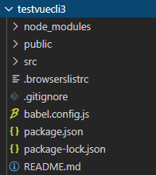
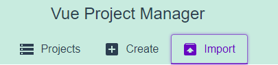
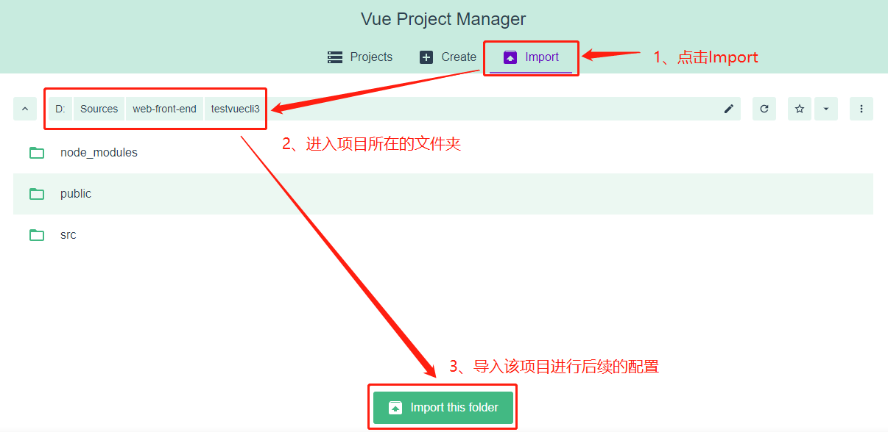
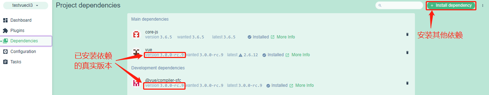

# 一、认识`Vue-cli3`

1. `3`与`2`的区别：

	- `3`基于`webpack4`打造，`2`基于`webpack3`打造。

	- `3`的设计原则是`0配置`，`2`中有大量的配置文件，但是`3`直接移除了项目文件夹下的`build`和`config`两个配置文件的目录。

	- `3`提供了`vue cli`命令，提供了可视化配置，更加人性化。

	- 移除了`static`文件夹，新增了`public`文件夹（等价于`static`文件夹），并且`index.html`移动到`public`中。


# 二、用`vue-cli3`创建项目

1. 终端输入`vue create myproject`，创建一个名为`myproject`的`vue`项目。之后会陆续出现以下提示信息和要求进行相关配置。

| // 是否更换为淘宝的`cnpm`     <br />**?  Your connection to the default npm   registry seems to be slow.**    <br />   **Use** [**https://registry.npm.taobao.org**](https://registry.npm.taobao.org) **for faster installation? (Y/n)** |
| ------------------------------------------------------------ |
| // 选择一个预设的配置，选择`Manually select feature`     <br />**? Please pick a preset: (Use arrow keys)**     <br />**> Default ([Vue 2] babel, eslint)**     <br />   **Default (Vue 3 Preview) ([Vue   3] babel, eslint)**   <br />   **Manually select features** |
| **? Check the features needed for your project: (Press <space> to   select, <a> to toggle all, <i> to invert selection)**<br />**>(\*) Choose Vue version** //选择一个`Vue`的版本，键盘上下箭头移动，空格键表示选中和取消选中；<br />  **(\*) Babel**  <br />  **( ) TypeScript**         //选中可以使用`TypeScript`的语法，相当于`ES`的一个超集    <br />  **( ) Progressive Web   App (PWA) Support**  //先进的`web app`，比以前的`web app`增加了很多功能，如推送通知等；用得少  <br />  **( ) Router**    **( ) Vuex**    **( ) CSS   Pre-processors**             //`CSS`预处理器   <br />  **(\*) Linter /   Formatter**               //`Linter`就是`ESLinter`，对代码风格进行管理，建议取消 <br />  **( ) Unit Testing**                   //单元测试  <br />  **( ) E2E Testing**                    //端到端测试 |
| **? Choose a version of Vue.js that you want to start the project with   (Use arrow keys)** <br />**> 2.x**  <br />   **3.x (Preview)** |
| **? Where do you prefer placing config for Babel, ESLint, etc.? (Use   arrow keys)**       <br />**> In dedicated config files**       //把相关的配置放到一个独立的配置文件中，选这个即可  <br />   **In package.json**                 //把配置都放到`package.json`中 |
| // 要不要把刚才选择的配置保存下来，保存了则下次在`create`新项目的时候，   <br />// 第一步`Please pick a preset`时就会多一个选项，就是保存的这个`preset`；      <br />**? Save this as a preset   for future projects? (y/N)** |
| // 上一步选择了保存的话，这里给保存的`preset`取名     <br />// 在这个`C:\Users\91616`目录下的`.vuerc`可以删除预设配置      <br />**? Save preset as:**   <br />// 如果是`vue-cli4`，那么接下来就自动创建项目了，如果是`vue-vli3`，那么接下来就还会询问使用`npm`还是`yarn`； |


# 三、`vue-cli3`项目目录详解




1. `node-modules`是`vue`项目依赖的一些`node`模块。

2. `public`相当于原来`vue-cli2`中的`static`目录，里面的资源都会被原封不动地打包到`dist`目录中。

3. `src`仍然是程序员开发源代码的主要目录。

```javascript
// main.js
import Vue from 'vue'
import App from './App.vue'
// 一般发布时设置为true，会输出一些提示信息，比如一些安装的进度之类的
Vue.config.productionTip = false
// 内部有el属性，实质也是执行$mount()函数
new Vue({
	render: h => h(App),
}).$mount('#app')
```

4. `.browserslistrc`：浏览器配置相关，如市场份额大于`1%`的浏览器，只适配最新的两个版本，`ie`版本大于等于`8.0`；

5. `.gitignore`：里面的文件将被忽略不上传服务器，如`node_modules`等，因为在终端执行`npm install`就会根据`package.json`自动安装相关需要的模块，而不必把`node_modules`上传服务器。如果需要忽略某些文件不上传到服务器，就在`.gitignore`里面添加文件或目录。

6. `babel.config.js`是对`babel`进行配置的文件，`babel`主要是对`ES`语法进行兼容性转换的。

7. `package.json`还是配置文件，但是里面少了很多配置，因为它安装了一个工具`@vue/cli-service`，这个工具间接地管理很多依赖的包，这就是脚手架`3`及以上版本的`0配置`原则。查看`package.json`发现，`scripts`脚本下的`serve`、`build`都是通过`vue-cli-service`这个工具来管理的。

8. `package-lock.json`是真实对应的软件版本，在`package.json`中指定的各个依赖软件、模块的版本都是`^`和`~`指定的，不是严格对应的，但在`package-lock.json`中是严格对应的。其实最准确的就是在`vue ui`里面看，或者在`node_modlues`中查看。

9. `postcss.config.js`是关于`css`转换的配置文件，需要转换一些特别的`css`的话，可以在这里配置。

10. `src`目录详解：

- `main.js`中，`Vue.config.productionTip = false;`就是在执行`npm run build`打包项目的时候，会给出的提示信息。如果想看到相关的提示信息可以改为`true`，用处不是很大。

- `el: "#app"`是挂载`vue`到对应的`html`中，但是`vue`内部执行的时候还是执行的`$mount()`这个函数，所以写`el`只不过是内部多了一层判断，最终都要执行`$mount()`来进行挂载。
```vue
new Vue({
	render: h => h(App),
}).$mount("#app")
```


# 四、配置文件

1. 因为`vue-cli3`和`vue-cli4`都是遵循`0配置`原则，那么配置信息去哪了？在`vue-cli3`和`vue-cli4`中可以通过三种方式修改配置文件。

2. 第一种方式为通过`UI`配置：启动配置服务器`vue UI`，在通过`npm install @vue/cli -g`安装`vue`的脚手架时，`vue`的脚手架里面会包含一个`vue ui`的程序，在终端执行`vue ui`即可启动该服务。它会在浏览器中打开一个图形化的界面。



- 在这里可以点击`Create`新建一个项目，也可以导入。如果要配置已经存在的项目，就点击`Import`，然后进入到项目文件夹，再点击`Import this folder`。



- 进入后可以管理和配置该项目



- 在左边栏的Configuration中就可以进行其他的配置；


3. 第二种方式就是找到配置文件的隐藏处：`vue-cli3`及以上的`0配置`并不是真正的删除了配置文件，而是放在了别的地方隐藏了，比如`webpack.config.js`文件，就可以在`node_modules-->@vue-->cli-service-->webpack.config.js`中找到配置文件，在`webpack.config.js`中，有一句`const Service = require('./lib/Service')`，表示引入了`lib`下的`Service`，`Service`又引入了大量其他的配置文件，诸如在`lib`目录下，有`config`、`util`、`webpack`等目录，都是放的配置文件。

4. 第三种方式就是：如果确实有某些配置需要修改，那么就需要在当前项目的目录下创建一个文件，名字固定为`vue.config.js`，然后在里面写`module.exports = {这里写想要导出的配置项}`。打包的时候`vue`会把`vue.config.js`中导出的配置项和上面第3部分的配置文件进行合并，合并也就意味着当前写的配置也是整体配置的一部分了。


# 五、箭头函数

1. 箭头函数的基本使用：正常定义函数有多中方式，一是`const func = function(){}`通过`function`定义，二是在字面量中定义函数，如`const obj = {func1(){},func2:function(){}}`。在`ES6`中，还有一种定义函数的方式，即箭头函数，`const func = (参数列表) => {函数体}`。

```javascript
// 定义函数的方式
// 1. 普通定义方法
function func1(){
	console.log('直接定义的函数');
}
func1()
// 2. 赋值给变量的函数
const func2 = function(){
	console.log("赋值给一个变量的函数");
}
func2()
// 3. 在对象字面量中定义的函数
const obj = {
	objFunc1: function(){
		console.log("在对象字面量中定义的函数1！");
	},
	objFunc2(){
		console.log("在对象字面量中定义的函数2！");
	}
}
obj.objFunc1()
obj.objFunc2()
// 4. 箭头函数
const func3 = () => {
	console.log("箭头函数基本使用");
}
func3()
```

2. 甚至在只有一个参数的时候，小括号都是可以省略的，如果函数体只有一行代码时，可以省略花括号和`return`关键字。

```javascript
// 1. 箭头函数带两个或两个以上参数的基本使用
const func1 = (num1, num2) => {
	return num1 * num2;
}
console.log(func1(2, 3));
// 2. 带一个参数，可以省略小括号
const func2 = num => {
	return num * num
}
console.log(func2(3));
// 3. 函数体只有一条语句，可以省略花括号并省略return关键字，系统会执行函数体并返回最终结果
const func3 = (num1, num2) => num1 * num2
console.log(func3(20, 10));
```

```javascript
// 经典案例

// vue3中的写法
new Vue({
	render: h => h(App),
}).$mount('#app')
// render函数本质
new Vue({
	// 1. render是一个对象的属性，其值是一个函数(箭头函数)
	// 2. h本质是createElement()函数
	render: (h) => {
		return h(App)
	}
}).$mount('#app')
```

3. 箭头函数使用场景：一般把一个函数作为参数传给另一个函数的时候，箭头函数使用最多。

4. 箭头函数中this的使用：箭头函数中的this是如何查找的？答：向外层作用域中一层层查找`this`，直到有`this`的定义。

5. 98节后半部分还不理解。


```

```