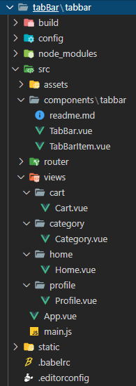

# 一、`TabBar`要求

1. 在很多`app`前端里，下面一般分为四栏，“首页”、“分类”、“购物车”、“我的”等，点击不同的分类，就会在`tabBar`上面渲染对应的组件。


# 二、`TabBar`实现思路

1. 自定义`TabBar`组件，在`app`中使用。让`TabBar`处于底部，并且设置相关样式。

2. `TabBar`中显示的内容由外界决定，可以定义插槽，`flex`布局平分`TabBar`。

3. 自定义`TabBarItem`，并且定义两个插槽：可以传入图片和文字。给两个插槽外层包装`div`，用于设置样式。填充插槽，实现底部`TabBar`的效果。


# 三、细节

1. 在实际的项目中，一般把功能性的组件抽离出来进行封装，每个组件中只留下一些插槽，这样就可以灵活定制。

2. 针对大的页面或组件，如“首页”、“分类”、“我的”等，一般单独建立一个`views`或`pages`目录，在其中再单独为每一个大页面建立对应的目录，如`home`、`profile`、`cart`等，再在每个子目录中创建对应的`vue`文件。

3、`components`目录下一般只放公共的东西，比如在`home`、`profile`等中都需要用到的组件等。

- `vue`文件本身就是一个个组件，在通过`import`导入到其它`vue`组件的时候，`vue`的文件名可以当作自定义标签使用的。监听事件、属性绑定等都是在定义组件的`vue`文件中，而传递数据则是在调用子组件的父组件对应的`vue`文件中。

- 文件引用的路径问题：在`webpack.base.config.js`中，`resolve`中有个`alias`的别名属性，其中`@`就是后面指定目录的别名（`'@': resolve('src')`表示`@`代表`src`这个目录）。在项目开发中就可以用`@`表示从某个目录开始查找对应的资源。还可以起多个别名，比如`'assets'：resolve('@/assets')`，以后在调用`assets`时就表示从`/src/assets`目录下查找资源。但是要特别注意，这样只适合`import`导入资源时寻找路径，如果在`html`标签中直接写别名是无法查找到对应的资源的，要在路径前加波浪符号`~`。


# 四、代码

1. 整体的目录结构




2. 代码

```vue
// TabBar.vue
<template>
	<div id="app">
		<div id="tab-bar">
			<slot>
				<tab-bar-item path="/home">
					
					
					<div slot="item-text">首页</div>
				</tab-bar-item>
				<tab-bar-item path="/category">
					
					
					<div slot="item-text">分类</div>
				</tab-bar-item>
				<tab-bar-item path="/cart">
					
					
					<div slot="item-text">购物车</div>
				</tab-bar-item>
				<tab-bar-item path="/profile">
					
					
					<div slot="item-text">我的</div>
				</tab-bar-item>
			</slot>
		</div>
		<router-view></router-view>
	</div>
</template>
<script>
import TabBarItem from "./TabBarItem";
export default {
	name: "TabBar",
	components: {
		TabBarItem,
	}
}
</script>
<style>
/* 在这可以具体写样式，也可以动态引入外部资源文件 */
@import "../../assets/css/base.css";
/* 水平分布 */
#tab-bar {
	display: flex;
	background-color: #f6f6f6;
	/* 定位，使tabbar居于底部 */
	position: fixed;
	left: 0;
	right: 0;
	bottom: 0;
	/* 阴影效果 */
	box-shadow: 0px -10px 10px rgba(100, 100, 100, 0.05);
}
/* 分布均匀化 */
</style>
```


```vue
// TarBarItem.vue
<template>
<div class="tab-bar-item" @click="itemClick">
	<div v-if="!active"><slot name="item-icon"></slot></div>
	<div v-else><slot name="item-icon-active"></slot></div>
	<div :class="{isActive: active}"><slot name="item-text"></slot></div>
</div>
</template>
<script>
export default {
	name: 'TabBarItem',
	props: {
		path: String
	},
	data(){
		return {
			// active:true,
		}
	},
	computed: {
		active(){
			return this.$route.path.indexOf(this.path) != -1
		}
	},
	methods: {
		itemClick() {
			this.$router.replace(this.path)
		}
	}
}
</script>
<style>
.tab-bar-item {
	flex: 1;
	text-align: center;
	height: 49px;
}
.tab-bar-item img{
	width: 24px;
	height: 24px;
	margin-top: 3px;
	vertical-align: middle;
}
.isActive {
	color: #FF5777;
}
</style>
```


```javascript
// 路由index.js
import Vue from 'vue'
import Router from 'vue-router'
// const TabBar = () => import('../components/tabbar/TabBar')
// 1.安装插件
Vue.use(Router)
const Home = () => import('../views/home/Home')
const Cart = () => import('../views/cart/Cart')
const Category = () => import('../views/category/Category')
const Profile = () => import('../views/profile/Profile')
// 4.第2和第3步可以合并为一步
export default new Router({
	mode: 'history',
	routes: [
		{
			path: '',
			redirect: '/home'
		},
		{
			path: '/home',
			component: Home
		},
		{
			path: '/category',
			component: Category
		},
		{
			path: '/cart',
			component: Cart
		},
		{
			path: '/profile',
			component: Profile
		}
	]
})
```


```vue
// Cart.vue
<template>
	<div>购物车</div>
</template>
<script>
export default {
	name: "Cart"
}
</script>
<style scoped>
</style>
```


```vue
// Category.vue
<template>
	<div>分类</div>
</template>
<script>
export default {
	name: "Category"
}
</script>
<style scoped>
</style>
```

```vue
// Home.vue
<template>
	<div>首页</div>
</template>
<script>
export default {
	name: "Home"
}
</script>
<style scoped>
</style>
```


```vue
// Profile.vue
<template>
	<div>我的</div>
</template>
<script>
export default {
	name: "Profile"
}
</script>
<style scoped>
</style>
```


```vue
// App.vue
<template>
	<div>
		<tab-bar></tab-bar>
		<!-- <router-view></router-view> -->
	</div>
</template>
<script>
import TabBar from "./components/tabbar/TabBar";
import TabBarItem from "./components/tabbar/TabBarItem";
export default {
	name: 'App',
	components: {
		TabBar
	}
}
</script>
<style>
</style>
```


