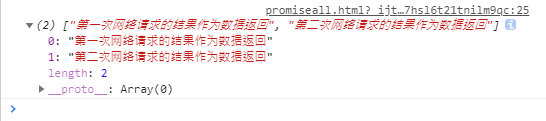

# 一、简介

1. `Promise`是`ES6`中一个非常好用的特性，它是异步编程的一种解决方案。

2. 封装一个网络请求的时候，因为不能立即拿到结果，所以往往会传入另一个函数，在数据请求成功时，将数据通过传入的函数回调出去。如果只是一个简单的网络请求，那么这种方案不会给开发者带来很大麻烦。但是如果网络请求非常复杂时，就会出现回调地狱。

3. 什么时候用到`Promise`：存在异步操作的时候调用`Promise`对异步操作进行封装。


# 二、`Promise`的基本使用

1. 回调地狱

```javascript
//Promise是一个类，在创建的时候就需要传入一个函数，一般传入一个箭头函数；
//箭头函数包括两个参数，一个是resolve，一个是reject，而resolve和reject本身又是函数；
new Promise((resolve, reject) => {
//异步操作的具体代码，这里的setTimeout函数就是一个异步操作，在等待1s后执行前面的箭头函数
	setTimeout(() => {
		console.log("异步操作1");
		console.log("异步操作1");
		console.log("异步操作1");
		console.log("异步操作1");
		//再调用回调函数setTimeout
		setTimeout(() => {
			console.log("异步操作2");
			console.log("异步操作2");
			console.log("异步操作2");
			console.log("异步操作2");
			//再调用异步操作的回调函数
			setTimeout(() => {
				console.log("异步操作3");
				console.log("异步操作3");
				console.log("异步操作3");
				console.log("异步操作3");
			}, 1000)
		}, 1000)
	}, 1000)
})
```


2. `Promise`

```javascript
// Promise是一个类，在创建的时候就需要传入一个函数，一般传入一个箭头函数；
// 箭头函数包括两个参数，一个是resolve，一个是reject，而resolve和reject本身又是函数；
new Promise((resolve, reject) => {
	// 异步操作的具体代码，这里的setTimeout函数就是一个异步操作，在等待1s后执行前面的箭头函数
	// 1.相当于第一次网络请求
	setTimeout(()=>{
		// 调用resolve函数,会跳到then()函数处执行
		resolve()
	},1000)
	// resolve()函数会跳到then处执行箭头函数，then()也是一个箭头函数
}).then(()=>{
	// 2.第一次网络请求的处理代码
	console.log("异步操作1");
	console.log("异步操作1");
	console.log("异步操作1");
	console.log("异步操作1");
	// 返回一个Promise，进行更多的异步操作
	return new Promise((resolve, reject) => {
		// 把setTimeout这个回调函数当作一次网络请求
		// Promise就是只在回调函数中执行resolve函数，然后跳到then()处执行真正要
		//操作的函数体，如果还有回调函数，那就returnnewPromise继续下去，链式编程
		// 3.第二次网络请求
		setTimeout(()=>{
			resolve()
		},1000)
	})
}).then(()=>{
	// 4.第二次网络请求的代码
	console.log("异步操作2");
	console.log("异步操作2");
	console.log("异步操作2");
	console.log("异步操作2");
	return new Promise((resolve, reject) => {
		// 5.第三次网络请求的代码
		setTimeout(() => {
			resolve()
		},1000)
	})
}).then(()=>{
	//6.第三次网络请求的处理代码
	console.log("异步操作3");
	console.log("异步操作3");
	console.log("异步操作3");
	console.log("异步操作3");
})
```


3. **总结：**网络请求的相关代码都是放在一个`Promise`对象中，网络请求成功后在`Promise`对象中调用一下`resolve()`函数，跳转到`then()`函数执行网络请求的处理代码处理请求得到的数据，如果请求失败，那就执行`catch(err => {失败时执行的函数体})`。如果处理完当前的请求还有新的网络请求，`return new Promise`继续嵌套。


# 三、`Promise`的三种状态

1. 当开发过程中存在异步操作时，就可以给异步操作包装一个`Promise`，异步操作之后会有三种状态。

2. 三种状态：

- `pending`：等待状态，比如正在进行网络请求，或者定时器没有到时间。

- `fulfill`：满足状态，当我们主动回调了`resolve`时，就处于该状态，并且会回调`.then()`。

- `reject`：拒绝状态，当我们主动回调了`reject`时，就处于该状态，并且会回调`.catch()`。

3. **可以用`return`返回一个`Promise`对象或者返回数据，返回对象那么就会调用下一个`then`方法，返回数据那么就可以给`then`方法调用（本质是对返回的数据进行了一层`Promise`包装）。**

4. **如果没有`return`，那么调用完`then`和`catch`后都会返回一个`Promise`，只是所处的状态各自不同。**

5. 执行`resolve()`函数就会跳过后面紧邻的全部`catch()`函数，转而执行第一个紧邻的`then`函数，同理，执行`reject()`函数就会跳过后面紧邻的全部`then()`函数，转而执行第一个紧邻的`catch()`函数。

6. 执行`resolve()`必须在一个`new Promise()`中定义，而执行一个`reject()`可以在`new Promise()`中，也可以`throw new Error('error的提示内容')`。

7. `Promise`中只进行网络请求，请求的结果传递给`resolve()`函数再给`then()`处理。

8. 抛出错误可以用`throw new Error("错误提示信息")`，而不调用`reject()`函数。

9. 三种等效的异步操作：

```javascript
// 1.可以只传一个参数
new Promise((resolve) => {
	setTimeout(()=>{
		resolve('传递的参数')
	},1000)
}).then(res => {
	console.log(res);
	// 返回一个Promise对象
	return new Promise(resolve => {
		// 2.可以直接使用res参数接收的值
		resolve(res + '，拼接的部分参数')
	})
}).then(res => {
	console.log(res);
	return new Promise(resolve => {
		resolve(res + "，最后的拼接")
	})
}).then(res => {
	console.log(res);
})
```

```javascript
// 1.可以只传一个参数
new Promise((resolve) => {
	setTimeout(()=>{
		resolve('传递的参数')
	},1000)
}).then(res => {
	console.log(res);
	// 返回一个Promise对象，并直接调用resolve()函数
	return Promise.resolve(res + '，拼接的部分参数')
}).then(res => {
	console.log(res);
	return Promise.resolve(res+"，最后的拼接")
}).then(res => {
	console.log(res);
})
```


```javascript
// 1.可以只传一个参数
new Promise((resolve) => {
	setTimeout(()=>{
		resolve('传递的参数')
	},1000)
}).then(res => {
	console.log(res);
	// 返回一个数据，会自动对该数据进行Promise包装并返回
	return res + '，拼接的部分参数'
}).then(res => {
	console.log(res);
	return res+"，最后的拼接"
}).then(res => {
	console.log(res);
})
```


# 四、两种写法


```javascript
new Promise((resolve,reject) => {
	setTimeout(() => {
		resolve("resolve execute!")
		reject("reject execute!")
	},1000)
// 格式：.then().catch()
// 可以任意省略一个
}).then((data) => {
	console.log(data);
}).catch((err) => {
	console.log(err);
})
```


```javascript
new Promise((resolve,reject) => {
	setTimeout(() => {
		resolve("resolveexecute!")
		reject("rejectexecute!")
	},1000)
// 格式：.then(() => {then的函数体},() => {catch的函数体})
// 可以省略catch部分，但是不能省略then部分，如果then不需要就写null或者空箭头函数
}).then(
	(data)=>{console.log(data);},
	(data)=>{console.log(err);}
)
```


# 五、`Promise`的`all`方法

1. 在`ajax`中，如果某次网络请求有两个，且需要两个请求都正确返回结果才能操作下一步，那么就需要做两次请求，并且用一个处理函数判断两次请求的结果都为真，然后才调用处理的回调函数。

2. 在`Promise`中，可以在`Promis.all([多次网络请求])`方法中进行多次网络请求，所有的结果都用`resolve()`或`reject()`函数返回，然后再调用`then()`或`catch()`方法，多次网络请求的结果作为数据传递给`then()`或`catch()`方法的时候，是根据定义的顺序作为一个数组来接收的（数组下标从`0`开始）。

3. `Promise.all([])`方法

```javascript
//返回的是一个可迭代数组(可遍历)对象iterator，
Promise.all([
	// 1.模拟第一次网络请求
	new Promise(resolve => {
		setTimeout(() => {
			resolve("第一次网络请求的结果作为数据返回")
		},1000)
	}),
	// 2.模拟第二次网络请求
	new Promise(resolve => {
		setTimeout(() => {
			resolve("第二次网络请求的结果作为数据返回")
		},2000)
	})
]).then(res => {
	// 当两次网络请求的结果都正确返回后，调用then方法，传递的结果分别为res[0]和res[1]，多个网络请求以此类推
	console.log(res);
})
```




