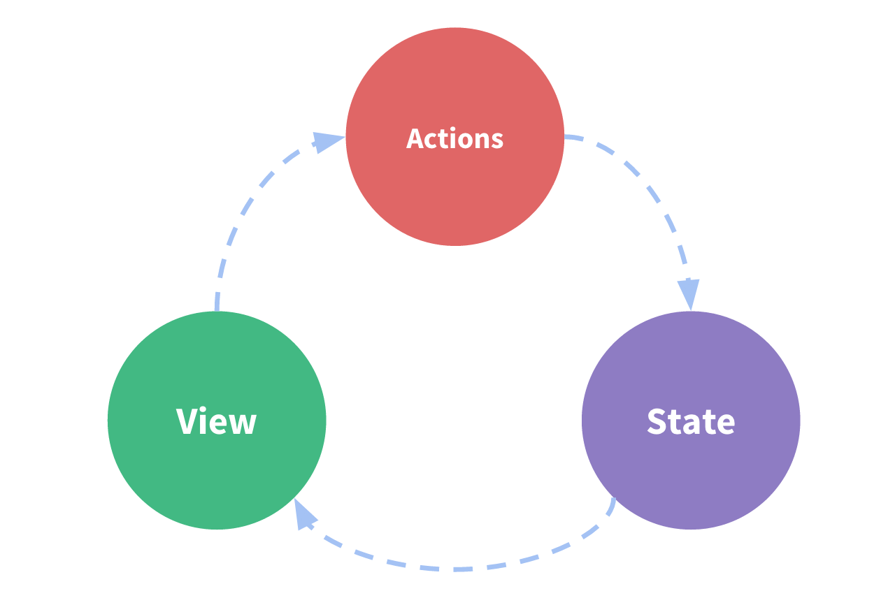
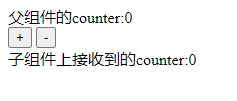
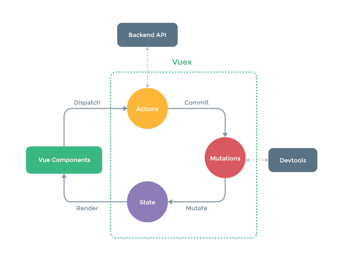

# 一、简介

1. 官方解释：`Vuex`是一个转为`vuejs`应用程序开发的状态管理模式。它采用集中式存储管理应用的所有组件的状态，并以相应的规则保证状态以一种可预测的方式发生变化。`Vuex`也集成到`vue`的官方调试工具`devtools extension`，提供了诸如零配置的`time-travel`调试、状态快照导入导出等高级调试功能。

2. 状态管理是什么：可以简单理解为，把多个组件需要共享的变量全部存储到一个对象里面，然后，将这个对象放在顶层的`Vue`实例中，让其他组件可以使用。因此，多个组件就可以共享这个对象中的所有变量属性了。

3. 模拟一个`Vuex`，其实就是模拟出一个共享变量

```html
<body>
<div id="app">
	<cmp></cmp>
</div>
<script src="./vue.js"></script>
<script>
	// 定义相关的组件
	Vue.component('cmp', {
		// component的code
		// 因为所有的组件都继承自Vue的原型，所以组件中有shareObj属性
		template: `<div><button @click="btnClick">按钮</button></div>`,
		methods: {
			btnClick(){
				console.log(this.shareObj.name)
			}
		}
	})
	//设置一个变量，用作共享变量
	const shareObj = {
		// 设置需要的共享变量属性
		name: "Kobe",
	}
	//所有的组件都继承自Vue的原型，所以可以把变量传递给原型新增加的原型属性，这样所有的组件中都自带有这个变量，就相当于模拟了一个Vuex
	Vue.prototype.shareObj = shareObj
	new Vue({
		el:"#app",
	})
</script>
</body>
```

4. 上述代码只是简单模拟`Vuex`，但还不是完整的实现`Vuex`的功能。因为上面的`shareObj`虽然可以共享，但还不是响应式的，某个组件把自己的`this.shareObj.name = "Mike"`修改了，其它组件不会响应式地变化。在`Vue`中，组件中`data`中定义的变量是加入到一个响应式系统中了的，但是上面原型中的属性并没有加入响应式系统。所以还不是真正的`Vuex`。

5. 自己封装的一个共享变量，添加到`Vue`的原型中，只是做到了共享，但还不是响应式的，虽然可以再继续通过代码来实现响应式，但是比较麻烦。所以`Vuex`就诞生了，`Vuex`提供一个在多个组件之间共享状态的插件，是响应式的。

6. 什么东西放入`Vuex`中进行管理？多个组件之间需要共享，而且相隔的层级又多，不方便直接进行传参的变量，就用`Vuex`进行状态管理。例如，在大型项目中，有多个状态在多个界面之间需要共享，比如用户登录状态、用户名称、头像、地理位置信息、商品的收藏、购物车中的物品等等，这些状态信息，都可以放在统一的地方，对它们进行保存和管理，而且它们还是响应式的。


# 二、单页面状态管理

1. 如下图，`state`是状态管理，可以简单理解为`data`中的变量；`View`是视图，可以针对`state`的变化，显示不同的信息，可以简单理解为展示`state`（即`data`）的`Dom`；`Action`是用户的各种操作行为，如点击、输入等，会导致状态变化，可以简单理解为控制`data`变化的函数。



2. 单页面状态管理就是之前学的，因为变量本身就是响应式的。

```vue
// 示例代码
<template>
	<div id="app">
		<div>{{ counter }}</div>
		<button @click="counter++">+</button>
		<button @click="counter--">-</button>
		<router-view/>
	</div>
</template>
<script>
export default {
	name: 'App',
	data(){
		return {
			counter: 0,
		}
	}
}
</script>
<style>
</style>
```


# 三、多页面状态管理(一)

1. `Vue`本身已经做到了单页面状态管理，而在多页面的状态管理中，多个视图都依赖同一个状态（一个状态改变，多个界面需要同步进行更新），且不同界面的`Actions`都想修改同一个状态。

2. `Vuex`就好比一个大管家，把多个视图都想修改的页面（即共享变量）抽离出来，交给`Vuex`这个大管家，统一进行管理。之后，每个视图都按照规定好的规则进行访问和修改等操作。这就是Vuex的基本思想。

3. 父子组件传值：在父子组件之间进行数据传递，这只适用于父子组件之间，层级少，只有父子组件共享数据，在父子组件之间反而推荐直接传递数据。但是如果在组件树上相隔的层级多，那就不方便了。

```vue
// HelloVuex.vue
<template>
	<div>子组件上接收到的counter:{{counter}}</div>
</template>
<script>
export default {
	name:"HelloVuex",
	props: {
		counter: Number,
	},
	data(){
		return {
			counter: 0,
		}
	}
}
</script>
<style>
</style>
```


```vue
// App.vue
<template>
	<div id="app">
		<div>父组件的counter:{{ counter }}</div>
		<button @click="counter++">+</button>
		<button @click="counter--">-</button>
		<!-- 父子组件传值，在父组件中、子组件上进行变量监听 -->
		<hello-vuex :counter="counter" ></hello-vuex>
	</div>
</template>
<script>
import HelloVuex from "./components/HelloVuex"
export default {
	name: 'App',
	data(){
		return {
			counter: 0,
		}
	},
	components: {
		HelloVuex
	}
}
</script>
<style>
</style>
```




# 四、`Vuex`多页面状态管理(二)

1. `Vuex`是一个插件，所以在原生的`Vue`中是没有`Vuex`的，所以先要安装：`npm install vuex --save`。

2. 注册`vuex`，在`main.js`中导入并注册`vuex`：

```javascript
// main.js
import Vuex from 'vuex'
Vue.use(vuex)
```

3. 上面在`main.js`中导入`vuex`的操作不常用，如果各种包都导入到`main.js`中，会导致`main.js`越来越大，难以维护。实际项目开发中，会在`src`目录下创建`store`目录，在`store`目录下创建`index.js`文件。

```javascript
// src/store/index.js
import Vue from 'vue'
import Vuex from 'vuex'
// 1.安装插件，Vue.use()方法底层会调用
Vue.use(Vuex)
// 2.创建对象
const store = new Vuex.Store({
	// 4.store中主要放以下options
	// 4.1在state中存放的是状态信息，即需要共享的变量
	state: {
		counter: 100,
	},
	mutations: {
	},
	actions: {
	},
	getters: {
	},
	modules: {
	}
})
// 3.导出store对象
export default store
```

4. 在`main.js`中导入并注册`store`。

```javascript
// main.js
import Vue from 'vue'
import App from './App'
import router from './router'
// 1.导入store
import store from "./store";
Vue.config.productionTip = false
/* eslint-disable no-new */
new Vue({
	el: '#app',
	// 2.注册store
	store,
	router,
	render: h => h(App)
})
```


5. 本质上就是给`Vue`的原型添加了一个`$store`属性，相当于在`main.js`中添加了一句：`Vue.prototype.$store = store`，而组件又是继承自`Vue`的原型，所以全部的组件就都有一个`store`对象了。这样在所有的组件中都可以通过`$store.state.PropotyName`来获取共享的状态变量。在父组件`App.vue`和子组件`HelloVuex.vue`中都是共享`$stroe.state`中的变量。

6. 下面代码中，在`App.vue`中直接通过`$store.state`修改状态，这在功能上可以实现，但是并不推荐这么做。因为`Vuex`的思想就是要按照一定的规则访问、修改状态，否则在后续的调试过程中可能会出错（参考第五节第`2`部分`Devtools`解析）。

```vue
// 在App.vue中使用vuex中的state
<template>
	<div id="app">
		<div>父组件中通过Vuex拿到的Store中的counter:{{ $store.state.counter }}</div>
		<!-- 这样修改$store.state中的状态在功能上是能够做到的，但是官
			方并不推荐这么做。而是要按照规定的规则在Actions中修改state
		-->
		<button @click="$store.state.counter++">+</button>
		<button @click="$store.state.counter--">-</button>
		<hello-vuex></hello-vuex>
	</div>
</template>
<script>
import HelloVuex from "./components/HelloVuex"
export default {
	name: 'App',
	components: {
		HelloVuex
	}
}
</script>
<style>
</style>
```


```vue
// 在HelloVuex.vue中使用Vuex中的state
<template>
	<div>子组件中通过Vuex.Store拿到的共享状态：counter:{{$store.state.counter}}<br/></div>
</template>
<script>
export default {
	name:"HelloVuex",
}
</script>
<style>
</style>
```


# 五、`Vuex`状态管理详解

1. 下图中，`State`是共享状态，在`Vue components`中渲染（`render`）展示，在上面的`App.vue`代码中直接通过`$store.state`修改共享状态，与`Vuex`的设计初衷不符。按照下图所示，应该在`Vue Components`上定义分发`Actions`，简单理解就是方法（即函数），定义用户的操作行为。然后`Actions`再把这个操作提交给`Mutations`，最后由`Mutations`改变`State`的状态。



2. `Devtools`是一个浏览器插件，该插件不仅可以用于`Vue`的开发，还可以用于`Vuex`的开发。它会记录每次修改的`state`状态。这也是为什么不推荐直接在`Vue Components`上修改`State`状态，因为这种操作直接跳过了`Vue Components-->Actions-->Mutations-->State`这个流程，进而导致`Devtools`无法在`Mutations`这一步监测`State`每次的变化，后续调试排错难度大大增加，无法确定共享的状态是在哪一步被错误修改了。

3. 上面不推荐直接在`Vue Components`上通过方法来直接修改`State`的状态（但访问是合法的），但是也不是每一步都是必须的。例如可以省略`Actions`这一步，在`Vue Components`中直接操作`Mutations`。

4. `Actions`主要用于异步操作，而`Mutations`中主要用于同步操作。而`Devtools`也只能跟踪到同步的操作。所以常常在`Actinos`中进行异步操作，然后提交到`Mutations`中进行同步操作，这样`Devtools`就能检测到所有的`State`状态变化。

5. 仔细看上图，在`Actions`中进行的异步操作，主要是网络请求，所以`Actions`向上指向了`Backend API`（后端`API`），一般向后端接口请求数据并进行处理，这就是典型的异步操作。这一步操作完成之后，再把结果传给`Mutations`，这里面全部都是同步操作，正好可以用`Devtools`监听同步操作。


# 六、`Vuex`核心概念详解

1. `State`：单一状态树，`Single Source of Truth`，也可以翻译为单一数据源。在应用开发中，如果状态信息保存到多个`store`对象中，那么之后的管理和维护都会变得特别困难。所以`Vuex`也使用了一种单一状态树来管理应用层级的全部状态。单一状态树能够让开发者以最直接的方式找到某个状态的片段，而且在之后的维护和调试过程中，也可以非常方便地管理和维护。

- **简单理解就是：一个项目里只要建一个`Vuex`的`store`对象。**

2. `getters`的基本使用：类似计算属性，对`state`中的状态，如果要进行某些变换后再传递给其它组件的某些地方使用，此时可以在`getters`中定义方法。`getters`中的方法的参数默认有一个`state`，另外还可以有一个`getters`作为参数，如果是外界的参数传进去，那么要返回一个函数，这个被返回的函数可以接收参数。

3. `mutation`：主要包括两部分，一个是字符串的事件类型（`type`）（如上面的`decrement`/`increment`，可以理解为函数名），一个是回调函数（`handler`），该回调函数的第一个参数就是`state`。更新`mutation`要通过`commit()`方法。在通过`mutation`更新数据的时候，有可能我们希望携带一些额外的参数，参数被称为是`mutation`的载荷（`Payload`）。如果参数不是一个，我们通常选择以对象的形式传递，也就是`payload`是一个对象。

- `mutation`提交风格有两种，一种是通过`commit`在`methods`中调用`mutation`中的方法，可以传递参数。`Vue`还提供了另一种风格，它是一个包含`type`属性的对象。

- `mutation`响应规则：`Vuex`的`store`中的`state`是响应式的，当`state`中的数据发生变化时，`Vue`组件会自动更新。这要求我们必须遵守一些`Vuex`对应的规则：提前在`store`中初始化好所需的属性（没有在初始化中定义的属性，在后续可以通过`store.state['PropName']='PropValue'`的方式添加，但是这个新添加的属性只存在状态中，并不是一个响应式的状态）；当给`state`中的对象添加新属性时，使用以下方式确保新属性是响应式的：方式一：使用`Vue.set(obj, 'newProp', Value)`给对象添加新属性，使用`Vue.delete(objName，PropName)`删除对象中的某个属性，方式二：用新对象给旧对象重新赋值。

- `Vuex`中的状态是响应式的，因为在我们创建`store`对象的时候，`store`中的状态都会被加入到`Vuex`的响应式系统中，所以`Vue`就会通过一个`Dep`（观察者模式）监测每一个状态的变化，每一个属性都对应着一个`watcher`，只要任何属性有变化，那就会立即响应式展现出来。

- 137 mutation的类型常量粗看一遍，可以细看

- `mutation`同步函数：通常情况下，`Vuex`要求我们`mutation`中的方法必须是同步方法，主要的原因是当我们使用`devtools`时，可以用`devtools`帮助我们捕捉`mutation`的快照。但如果是异步操作，那么`devtools`将不能很好地追踪这个操作是什么时候完成的。（`devtools`无法捕捉异步操作，但是异步操作是响应式的。表现就是在页面上数据发生更新了，但是`devtools`中的变量没有变化）

4. `Action`：不能在`mutation`中进行异步操作，但某些情况下，我们确实需要在`Vuex`中进行一些异步操作，比如网络请求，必然是异步的，这时候就需要在`action`中进行处理了。`Action`类似于`Mutation`，但是是用来代替`Mutation`进行异步操作的。

- 异步操作一定是在`action`中进行的，调用异步操作的方法就是通过`$store.dispatch()`调用`action`中定义的方法，而在`action`中的异步操作又需要调用`mutation`中定义的同步操作。

- 如果异步操作中存在需要回调功能，那就可以通过`return new Promise()`的方式返回一个`Promise`对象，然后在调用异步操作的代码处就会接收到这个返回值`Promise`对象，再通过这个对象操作`.then()`方法（参考`App.vue`中的异步操作处的代码）。

5. `module`：`Module`是模块的意思，因为`Vuex`使用的是单一状态树，也就意味着很多状态都会交给`Vuex`来管理。当应用变得非常复杂时，`store`对象就有可能变得相当臃肿。为了解决这个问题，`Vuex`允许我们将`store`分割成模块（`module`），每个模块都拥有自己的`state`、`mutations`、`actions`、`getters`等。

- 在子模块中，`mutations`、`actions`、`getters`中定义的方法所取的名字都是唯一的，也就是整个`store`对象中，所有的`mutations`、`actions`、`getters`中的方法名都是唯一的，这就意味着在调用某个方法时，不论是否为子模块，都是用同样的方法调用。比如`mutations`就是通过`$store.commit()`方法调用，`actions`就是通过`$store.dispatch()`方法调用，`getters`就是通过`$state.getters.FunctionName`方式调用。

- `module`中的`actions`的写法还可以解构。

```javascript
// index.js
import Vue from 'vue'
import Vuex from 'vuex'
// 1.安装插件，Vue.use()方法底层会调用
Vue.use(Vuex)
// 5.2moduleSecond的模块定义
const moduleSecond = {
	state: {
		name: "ZhangSan",
	},
	mutations: {},
	actions: {},
	getters: {},
	// 模块中定义子模块就很少使用了
	// modules: {}
}
// 2.创建对象
const store = new Vuex.Store({
	// 4.store中主要放以下options
	// 4.1在state中存放的是状态信息，即需要共享的变量
	state: {
		counter: 100,
		students: [
			{id: 100, name: "Kobe", age: 18},
			{id: 101, name: "Mike", age: 22},
			{id: 102, name: "Curry", age: 42},
			{id: 103, name: "Jack", age: 38}
		],
		info: {
			id: 104,
			name: "Chomsky",
			age: 29
		}
	},
	// 4.2在mutations中定义方法，在所有定义的方法中，都有一个默认定义的参数state，就是4.1中的state对象，注意调用state不需要this关键字。
	mutations: {
		increment(state){
			state.counter++
		},
		decrement(state){
			state.counter--
		},
		// 4.2.1mutation的普通提交方式
		incrementCount(state, count){
			state.counter += count
		},
		// 4.2.2mutation的type属性提交方式,payload接收一个对象
		incrementCounter(state, payload){
			state.counter += payload.count;
		},
		// 4.3在mutation中不能进行异步操作
		updateInfo(state){
			// 4.3.1对已经初始化在state状态中的变量可以进行操作,这是响应式的
			state.info.name = "Susan";
			// 4.3.2错误代码,不能在mutation中进行异步操作,所有的异步操作都要在Action中进行
			// setTimeout(() => {
			//   state.info.name = "Susan"
			// }, 1000)
		}
	},
	actions: {
		// 4.4在mutation和getters中都有一个默认属性state,在action中有一个默认属性context
		// context在不同的情况下有不同的意义,在action中可以理解为store对象,注意:是store而不是state
		// 也可以传递参数,payload接收
		updateInfo(context, payload){
			// 4.4.1.3在action中通过Promise使用回调函数
			return new Promise((resolve, reject) => {
				// 4.4.1模拟网络请求产生的异步操作
				setTimeout(() => {
					// 4.4.1.1虽然context可以看作store对象,但是不能像下面注释的第一行这么操作直接修
					// 改state,因为任何对state状态的修改都要通过mutation来操作,下面注释的第一行直接
					// 修改state中的状态就是跳过了mutation这一步的操作
					// context.state.info.name = "Monkey";
					// 4.4.1.2在异步操作中,通过context.commit()调用mutation的同步操作中的方法
					context.commit("updateInfo")
					console.log(payload)
					// 4.4.1.4调用resolve()函数,但是.then()函数在调用updateInfo()函数的地方再调用
					resolve("传递给then部分的参数")
				}, 1000)
			})
		}
	},
	// 4.3在getters中,主要设置state中状态的变化,然后返回给需要的地方调用
	getters: {
		powerCounter(state){
			return state.counter * state.counter
		},
		// 4.3.1查找年龄超过20岁的学生,可以用过滤器filter,参数s为前面调用filter
		// 的state.students,后面为一个箭头函数,如果结果为真,就会返回该调用
		// filter的项,否则舍弃,所以本语句会过滤留下年龄大于20的学生项
		olderThan20YearsOld(state){
			return state.students.filter(s => s.age >= 20)
		},
		// 4.3.2查找年龄超过20的学生个数,可以把getters当作参数传递给具体的方法;
		// 可以把getters当作参数传给getters中的其它方法,然后可以
		// 直接在当前方法中通过getters调用另外的方法
		olderThan20YearsOldNum(state, getters){
			return getters.olderThan20YearsOld.length
		},
		// 4.3.3查找年龄超过某个值的学生的个数,但是这个值不是固定的,而是由外界
		// 传递进来进行比较的,此时getters中的方法要返回一个函数,在函数中接收参
		// 数,即在getters中接收外界的参数必须通过一个返回函数来接收
		olderThanNum(state){
			// 4.3.3.1在getters方法中,返回一个函数,函数接收参数
			return function (age){
				return state.students.filter(s => s.age >= age)
			}
		}
	},
	// 5.模块
	modules: {
		// 5.1定义一个模块
		moduleFirst: {
			state: {
				name: "ModuleFirst"
			},
			mutations: {
				// 5.1.2模块中的mutation定义方法照旧,但是调用的时候仍然是commit()调用.所有mutations中的调用都是commit()调用;
				updateName(state, payload){
					state.name += payload
				}
			},
			actions: {
				// 5.1.4context不再是$store对象,而是子模块自身内部的mutations中的方法
				aUpdateName(context){
					setTimeout(() => {
						context.commit("updateName", "，异步操作拼接的内容")
					},1000)
				}
			},
			getters: {
				// 5.1.3子模块中的getters中的方法也是和正常getters中的方法一致调用
				fullName(state){
					return state.name + ' fullName返回新增的内容';
				},
				fullName2(state, getters){
					return getters.fullName + "fullName2中拼接的部分"
				},
				// 5.1.3.1rootState对应的时根状态中的属性
				fullName3(state, getters, rootState){
					return getters.fullName2 + rootState.counter
				}
			},
			// 5.1.1模块中还可以有子模块,但是很少这么使用,嵌套过多反而不好
			modules: {}
		},
		// 5.2定义第二个模块,还可以依次向后定义多个模块
		moduleSecond: moduleSecond,
	}
})
// 3.导出store对象
export default store
```


```vue
// App.vue
<template>
	<div id="app">
		<h2>----------------State中的内容---------------</h2>
		<div>父组件中通过Vuex拿到的Store中的counter:{{ $store.state.counter }}</div>
		<!--  1. 不再直接操作state,而是通过函数调用store中的mutations中自定义的方法-->
		<h2>----------------Mutation中的内容------------</h2>
		<button @click="addition">+</button>
		<button @click="subtraction">-</button>
		<!--  1.1 传参的mutation-->
		<button @click="incrementAdd(5)">+5</button>
		<!--  2.调用Vuex中的getters,直接当成一个属性使用,不需要小括号-->
		<h2>----------------getters中的内容--------------</h2>
		<div>{{$store.getters.powerCounter}}</div>
		<div>{{$store.getters.olderThan20YearsOld}}</div>
		<div>{{$store.getters.olderThan20YearsOld.length}}</div>
		<div>{{$store.getters.olderThanNum(26)}}</div>
		<!--  3.调用actions中的异步操作定义的方法-->
		<h2>---------------Actions中的内容----------------</h2>
		<div>{{$store.state.info}}</div>
		<button @click="updateInfo()">更新info状态</button>
		<!--  4.modules中的内容-->
		<h2>----------------modules中的内容-----------------</h2>
		<div>模块二中的调用:{{$store.state.moduleSecond.name}}</div>
		<h2>---------------子模块中的mutation调用--------------</h2>
		<div >{{$store.state.moduleFirst.name}}</div>
		<button @click="updateModuleFirst()">修改模块一中的姓名</button>
		<h2>---------------子模块中的getters的调用--------------</h2>
		<div>子模块中getters的基本调用:{{$store.getters.fullName}}</div>
		<div>子模块中getters的双参数调用:{{$store.getters.fullName2}}</div>
		<div>子模块中getters的三参数调用:{{$store.getters.fullName3}}</div>
		<h2>-------------子模块中的actions的调用------------------</h2>
		<div>{{$store.state.moduleFirst.name}}</div>
		<button @click="asynUpdateName">异步修改名字</button>
		<h2>----------------HelloVuex中的内容-------------</h2>
		<hello-vuex></hello-vuex>
	</div>
</template>
<script>
import HelloVuex from "./components/HelloVuex"
export default {
	name: 'App',
	components: {
		HelloVuex
	},
	methods: {
		// --------------------同步操作---------------------------
		// 2.调用Mutations中自定义的方法通过this.$store.commit函数来调用("自定义函数名")
		addition(){
			this.$store.commit("increment")
		},
		subtraction(){
			this.$store.commit("decrement")
		},
		incrementAdd(count){
			// mutation的两种提交方式,上一种是普通的,第二种是通过type和一个对象提交的
			this.$store.commit("incrementCount", count);
			this.$store.commit({
				type: "incrementCounter",
				count,
			})
		},
		// -------------------异步操作------------------------
		// 通过$store.dispatch()调用异步操作中定义的方法,而在异步操作action
		// 中定义的方法又是调用了mutation中的同步方法的
		updateInfo(){
			// $store.dispatch调用的就是在action中定义的异步操作方法名
			this.$store.dispatch("updateInfo", "这是传递的参数")
			// 这里这么使用.then()方法,其实是因为在action的异步操作
			// 中,return new Promise()返回了一个Promise对象,所以
			// 这里就等于返回的Promise对象直接调用.then()方法
			.then(res => {
				console.log("在Action异步操作中定义的回调函数Promise,.then()部分在这里才调用")
				console.log("从/store/index.js的resolve处接收到的参数")
			})
		},
		//------------子模块中的mutation被调用---------------
		updateModuleFirst(){
			this.$store.commit("updateName", "传给子模块的参数")
		},
		//------------子模块中的actions被调用----------------
		asynUpdateName(){
			this.$store.dispatch("aUpdateName")
		}
	}
}
</script>
<style>
</style>
```


# 七、`store`对象的目录组织

1. 在实际项目开发的时候，随着项目越来越复杂，如果把所有的数据全部写在`index.js`中，会导致这个文件越来越臃肿，不利于管理和维护。`Vuex`官方推荐分离这个文件。

2. 根的`state`还是写在`index.js`中，而`mutations`、`actions`、`getters`、`modules`都单独建立一个文件并导出，然后在`index.js`中导入即可。但是对于`modules`又建议单独建立一个目录，因为可能存在多个模块，而在新建立的`modules`目录中，每一个子模块都单独建立一个文件，并导出每一个模块，最后在`index.js`中进行导入。

