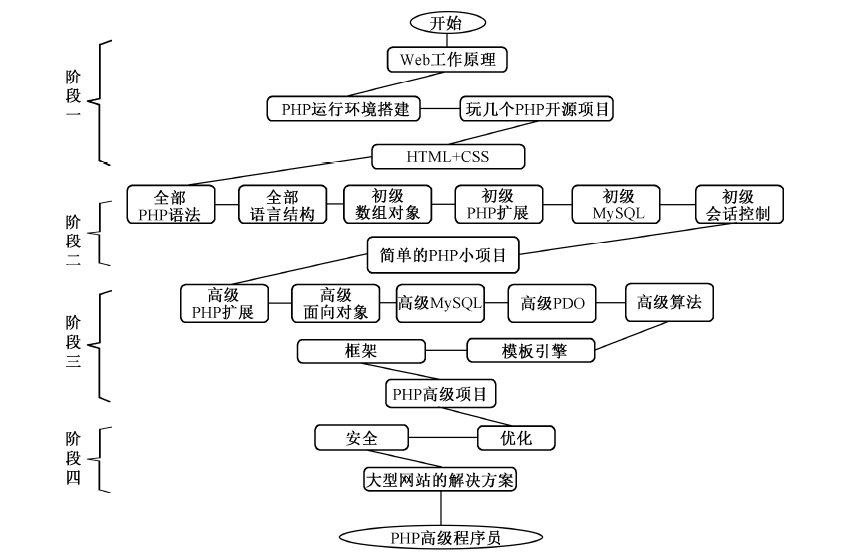

# 一、PHP学习路线

## 阶段一：入门

- 这是刚接触`PHP`时的入门阶段，先要了解`PHP`的开发能力，并多接触一些用`PHP`开发过的开源项目，网上有很多开源的`PHP`项目可以下载，先学习一下简单的功能操作即可，主要是能产生对`PHP`的学习兴趣，从中了解`PHP`的开发需求和`PHP`的开发特点等。前面我们介绍了`Web`开发所需的构件，所以只孤立地学习`PHP`肯定是不行的，先学`PHP`也不行。如果刚开始接触`Web`开发就直接学习`PHP`会力不从心，因为`PHP`是服务器端脚本，至少要在`PHP`的运行环境去解析它。另外，`PHP`是嵌入到`HTML`中的脚本语言，还要了解一些常见的`HTML`标记等。在开始学习`PHP`之前先做一点准备是非常有必要的。

## 阶段二：打基础

- 这个阶段是学习的重点，但方法很重要，像`PHP`的基本语法和语言结构（流程控制、函数、字符串等）这部分内容能学多细就学多细，每个知识点都会在开发中使用到。而像数组、对象、文件处理、图像处理、`MySQL`数据库的操作、`PHP`操作数据库等内容，先学习一些常用的部分，掌握一些基本的应用，这样可以大大提高学习的进度。大多数新人在这个阶段的学习中都会出现两个常见的问题：
	- 第一，可能当天学习的内容，下次在学习新内容时，上次学的忘得差不多了，总是记不住。当然，这个大可不必担心，不要停下来，一定要继续往下学习，因为基础的语法都是后面知识中会用到的技术，用多了自然就记住了。而像高级的部分也不用担心记不住，都是类库或函数库，只要记住系统已经提供了哪些功能就好，使用时通过查询手册即可，能记住常用的当然更好。
	- 第二，就是书上讲的内容，能看懂也都能理解，就是自己一动手时，不知从何下手，没有思路。所以说对这个阶段的知识点有所了解以后，一定要想尽办法做出一个小项目（例如，模拟写个小型商城、论坛或聊天室等），暂时不用去管安全、优化及代码质量，只要能实现功能就行。这个项目的目的就是将基础部分的零散知识点贯穿在一起，在实际项目中去应用实践，能更好地对其理解和掌握。

## 阶段三：加强

- 有了阶段二的项目开发的练习后，积累了一些开发思路，需要再回过头深度学习每部分的知识点，如数组、对象、正则表达式、数据库操作、数据结构和算法等，这些内容是`PHP`开发中最常用的技术，这个阶段的学习可以更全面、更透彻，更容易掌握。当然还要学习一些新的内容，像模板引擎和`PHP`框架，然后再做一个项目。这个阶段的项目就不能像阶段二时的项目，只是实现基本功能就行了，不仅要求代码质量要好，业务逻辑要清晰，项目的结构也要基于目前最流利的开发模式，使用框架和模板引擎，并采用面向对象的思想和`MVC`模式的设计要求，还要学习项目的开发流程和规范，尽量让这个项目达到真实上线的项目标准。

## 阶段四：提高

- 这个阶段建议在工作中去学习， 因为这个阶段的内容没有统一的标准，需要根据实际项目去设计解决方案。当然多收集和学习一些这方面的理论，或模拟场景做一些有关的实验是很有必要的。以上四个阶段，看似简单，却也需要我们全身心投入，持之以恒才行。

