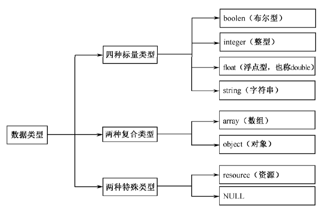

# 一、标记风格

1. 除非有必要，否则所有`PHP`脚本全部要使用完整的、标准的、`PHP`定界标签`<?php ?>`作为`PHP`开始和结束标记。还建议对于只包含`PHP`代码的文件，结束标志最好不要存在，因为`PHP`自身不需要，这样做可以防止它的末尾被意外地注入空白符号，而脚本中此时并无输出的意图。在早期`PHP`版本中，这些无意图的输出会导致当使用`header()`、`setCookie()`、`session_start()`等设置头信息的函数时发生错误。另外，在`PHP 5.2`和之前的版本中，解释器不允许一个文件的全部内容就是一个开始标记`<?php`。自`PHP 5.3`开始则允许此种文件，但要在开始标记后有一个或更多白空格符。

2. 总之在`PHP`文件中，用`<?php ?>`风格就可以了。

3. 每条指令用分号`;`隔开，一段`PHP`代码中的结束标记隐含表示一个分号，所以在一个`PHP`代码段中的最后一行可以不用分号结束。


# 二、注释

1. /*多行注释*/

2. // 单行注释

3. #单行注释

4. 在使用行注释符号`#`或`//`之后到行结束之前，或`PHP`结束标记`?>`之前的所有内容都是注释内容。这意味着在同一行`// ?>`之后的`HTML`代码将被显示出来，因为`?>`跳出了`PHP`模式并返回了`HTML`模式。

5. 在`PHP`脚本中使用以`/* *`开始和以`*/`结束的多行文档注释（`PHPDocumentor`），这也是推荐使用的注释方法。`PHPDocumentor`是一个用`PHP`脚本编写的工具，对于有规范注释的`PHP`程序，它能够快速生成具有相互参照、索引等功能的`API`文档。在`PHPDocumentor`中，注释分为文档性注释和非文档性注释。所谓文档性注释，是指那些放在特定关键字前面的多行注释，特定关键字是指能够被`PHPDocumentor`分析的关键字，例如`class`、`var`等。那些没有在关键字前面或者不规范的注释就称为非文档性注释，这些注释将不会被`PHPDocumentor`所分析，也不会出现在产生的`API`文档中。


# 三、空格与空行

1. 下列情况应该总是使用两个空行

- 一个源文件的两个代码片段之间。
- 两个类的声明之间。

2. 下列情况应该总是使用一个空行

- 两个函数声明之间。
- 函数内的局部变量和函数的第一条语句之间。
- 块注释或单行注释之前。
- 一个函数内的两个逻辑代码段之间，用来提高可读性。

3. 空格的应用规则是可以通过代码的缩进来提高可读性

- 空格一般应用于关键字与括号之间。不过需要注意的是，函数名称与左括号之间不应该用空格分开。
- 一般在函数的参数列表中的逗号后面插入空格。
- 数学算式的操作数与运算符之间应该添加空格（二进制运算与一元运算除外）。
- `for`语句中的表达式应该用逗号分开，后面添加空格。
- 强制类型转换语句中的强制类型的右括号与表达式之间应该用逗号隔开，并添加空格。


# 四、变量

1. `PHP`的变量声明后有一定的使用范围，变量的范围是它定义的上下文背景（也就是它的生效范围）。大部分的`PHP`变量如果不是在函数里面声明的，则只能在声明处到文件结束的一个单独的范围内使用。这个单独的范围跨度，不仅是在开始标记处到结束标记处使用，也可以在一个页面的所有开启的`PHP`模式下使用，包含了`include`和`require`引入的文件。如果使用`Cookie`或`Session`，还可以在多个页面中应用。

2. 在变量的使用范围内，我们可以借助`unset()`函数释放指定的变量，使用`isset()`函数检测变量是否设置，使用`empty()`函数检查一个变量是否为空。

3. **`0`、`0.0`、`""`、`"0"`、`NULL`、`FALSE`、`array()`、`$var`及没有任何属性的对象都将被认为是空的**，如果`empty()`的参数为空，则返回`TRUE`。

4. 如果函数`isset()`的参数存在，则返回`TRUE`，否则返回`FALSE`。若使用`isset()`测试一个被设置成`NULL`的变量或使用`unset()`释放了一个变量，将返回`FALSE`。同时要注意的是，一个`NULL`字节（`\0`）并不等同于`PHP`的`NULL`常数。这里**推荐使用`!empty($var)`方法来判断一个变量存在且不能为空。**

5. 可变变量：`$hi="hello";$$hi="world";`那么`$hello`就等于`$$hi`，也等于`${$hi}`。

6. 引用赋值，通过`&`符号，但是`PHP`的引用不像`C`语言中的地址指针，两个变量在内存上并不同体，只是把各自的值相关联起来。也就是说改变其中一个变量的值，另一个变量的值也同样变化，但是`unset()`其中一个变量的值，不会导致所有引用变量消失。


# 五、`PHP`中的数据类型

1. `PHP`中有`8`种原始类型，还有`3`种伪类型：`mixed`、`number`、`callback`。



2. 可以使用`var_dump($var)`查看`$var`变量的数据类型。

3. 布尔型（`boolean`）：**`FALSE`、`0`、`0.0`、`""`、`"0"`、`array()`、`空对象(4.0版本)`、`NULL`为假**

- 布尔值`FALSE`。
- 整型值`0`（零）为假，`-1`和其他非零值（不论正负）一样，被认为是`TRUE`。
- 浮点型值`0.0`（零）。
- 空白字符串和字符串`"0"`。
- 没有成员变量的数组。
- 没有单元的对象（仅适用于`PHP 4`）。
- 特殊类型`NULL`（包括尚未设定的变量）。

4. 整型（`integer`）

- 八进制数据以`0`开头，**无效的八进制数字（包含大于`7`的数字）会报编译错误，老版本的`PHP`会把无效的数字忽略。**
- 十六进制数据以`0X`开头。
- 二进制数据以`0b`开头。
- 整型数值有最大的使用范围。整型数的字长和平台及`PHP`的版本有关，对于`32`位的操作系统而言，最大值整数为`20`多亿，具体为`2147483647`。整型的最小值为`2147483648`。如果给定的一个数超出了`Integer`这个范围，将会被解释为`float`。同样，如果执行的运算结果超出了`Integer`这个范围，也会返回`Float`。
- 整型值在`64`位平台下的最大值通常是大约`9E18`，除了`Windows`下`PHP 7`以前的版本，总是`32`位的。
- `PHP`不支持无符号整数，所以不能像其他语言那样将整数都变成正数，也就不能将最大值翻一番。
- `Integer`值的字长可以用常量**`PHP_INT_SIZE`**来表示，自`PHP 4.4.0`和`PHP 5.0.5`后，最大值可以用常量**`PHP_INT_MAX`**来表示，最小值可以在`PHP 7.0.0`及以后的版本中用常量**`PHP_INT_MIN`**表示。

5. 浮点型（`float`或`double`）

- 实际上`double`和`float`是相同的，由于一些历史原因，这两个名称同时存在。
- 浮点数的字长也是和平台相关的，允许表示的范围为`1.7E-38`～`1.7E+38`，精确到小数点后`15`位。
- 浮点数只是一种近似的数值，所以永远不要相信浮点数结果精确到了最后一位，也永远不要比较两个浮点数是否相等。如果确实需要更高的精度，应该使用任意精度数学函数或者`gmp()`函数。

6. 字符串（`string`）

- `PHP`没有给字符串的大小强加实现范围，所以完全不用担心字符串的长度（`PHP 7`支持存储大于`2GB`的字符串）。
- 字符串可以使用单引号、双引号、定界符三种字面上的方法定义。
- 单引号
	- 单引号内部的`\`不需要转义，如果有两个连续的`\\`则会自动转义为一个`\`。
	- 结尾处的`\`必须通过两个`\\`转义，否则把单引号转义导致没有结束的单引号报错。
	- **单引号内部只能转义单引号和`\\`**，其余的（变量、双引号`\"`）都是原样输出。
	- 定义简单字符串时，单引号效率更高，因为`PHP`解析时不会花费一些处理字符转义和解析变量上的开销，因此，如果没有特别需求，应该使用单引号转义字符串。


- 双引号

	- 双引号中变量、数组值、对象属性会被解析，解析变量时，如果有变量`$var`，可以通过`{$var}`或`${var}`解析变量，也可以直接解析`$var`，但是不能不加花括号直接解析`$vars`，即双引号解析变量是把`$`后整个字符串作为变量解析，如果不存在以整个字符串为变量名的变量，则报错。

| 转义字符             | 含义                                                      |
| -------------------- | --------------------------------------------------------- |
| `\n`                 | 换行符（`LF`或`ASCII`字符`0x0A(10)`）                     |
| `\r`                 | 回车符（`CR`或`ASCII`字符`0x0D(13)`）                     |
| `\t`                 | 水平制表符（`HT`或`ASCII`字符`0x09(9)`）                  |
| `\\`                 | 反斜线                                                    |
| `\$`                 | 美元符号                                                  |
| `\"`                 | 双引号                                                    |
| `\[0-7]{1,3}`        | 此正则表达式序列匹配一个用八进制符号表示的字符            |
| `\x[0-9A-Fa-f]{1,2}` | 此正则表达式序列匹配一个用十六进制符号表示的字符          |
| `\u{xxxxx}`          | 支持使用`\u{xxxxx}`来声明`Unicode`字符（`PHP 7`开始引入） |


- 定界符语法（`<<<`）
	- 应该在`<<<`之后提供一个标识符开始，然后是包含的字符串，最后是同样的标识符结束字符串。结束标识符必须从行的第一列开始，并且后面除了分号不能包含任何其他的字符，空格及空白制表符都不可以。
	- 在定界符中，可以使用任意转义字符，直接使用双引号、单引号，解析其中的变量。在`PHP 5.3.0`以后，也可以用来初始化静态变量和类的属性和常量，但不能初始化类成员。
	- 使用定界符定义较长的字符串，通常用于从文件或者数据库中大段地输出文档。
	- 从`PHP 5.3.0`以后，可以给开始边界字符串名称两边加上单引号或双引号，功能类似于双引号（默认）或单引号字符串，其中单引号适合于嵌入`PHP`代码或其它大段文本而无须对其中的特殊字符进行转义。双引号则会解析。
	- 从`PHP 7`开始，可以在双引号字符串或定界符字符串中，支持使用`\u{xxxxx}`来解析`unicode`字符。

7. 数组

- 数组其实是一个有序图，可以把它当成真正的数组或列表（矢量）、散列表（图的一种实现）、字典、集合、栈、队列来使用，以及更多可能性。
- 数组形式为`$arr = array("key1"=>value1, 1=>"value2");`，`key`可以是字符串或数字，而`value`可以是任意类型。

8. 对象

- 一个对象类型的变量，是由一组属性值和一组方法构成的。其中属性表明对象的一种状态，方法通常用来表明对象的功能。

```php
class Person{
	var $name;
	function say(){
		echo "Doing something!";
	}
}
$p = new Person;
$p->name = "Tom";
$p->say();
```

9. 资源

- 资源是一种特殊类型的变量，保存了到外部资源的一个引用。资源是通过专门的函数来建立和使用的。使用资源类型变量包含：**打开的文件、数据库连接、图形画布区域等的特殊句柄，并由程序员创建、使用和释放。**任何资源在不需要时都应该被及时释放，如果程序员忘记了释放资源，系统将自动启用垃圾回收机制，以避免内存的消耗殆尽。因此，很少需要使用某些`free-result`函数来手工释放内存。在下面的实例中，使用相应的函数创建不同的资源变量。如果创建成功，则返回资源引用赋给变量；如果创建失败，会返回布尔型`false`，所以很容易判断资源是否创建成功。

- 用户虽然无法获知某个资源的细节，但某些函数必须引用相应的资源才能工作，如果需要获取`MySQL`数据库管理系统的信息、选择数据库，以及执行`SQL`语句等操作，所使用的函数都必须对此资源进行引用。

10. `NULL`类型

- 特殊的`NULL`值表示一个变量没有值，**`NULL`类型唯一可能的值就是`NULL`。`NULL`不表示空格，也不表示零，也不是空字符串，而是表示一个变量的值为空。`NULL`不区分大小写。**

- 下列情况下一个变量被认为是`NULL`：
	- **声明的变量尚未被赋值。**
	- **将变量直接赋值为`NULL`。**
	- **被`unset()`函数销毁的变量。**

11. 伪类型

- 伪类型并不是`PHP`语言中的基本数据类型，只是因为`PHP`是弱类型语言，所以在一些函数中，一个参数可以接受多种类型的数据，还可以接受其他函数作为回调函数使用。

- `mixed`：说明一个参数可以接受多种不同的（但并不必须是所有的）类型。例如，`gettype()`可以接受所有的`PHP`类型，`str_replace()`可以接受字符串和数组。

- `number`：说明一个参数可以是`integer`或者`float`。

- `callback`：有些诸如`call_user_function()`或`usort()`函数接受用户自定义的函数作为一个参数。`callback`函数不仅可以是一个简单的函数，还可以是一个对象的方法，包括静态类的方法。一个`PHP`函数用函数名字符串来传递。可以传递任何内置的或者用户自定义的函数，除了`array()`、`echo()`、`empty()`、`eval()`、`exit()`、`isset()`、`list()`、`print()`和`unset()`。


# 六、类型转换

1. **除`settype()`函数外，类型转换并没有改变这些运算数本身的类型**，而是通过转换将得到的新类型的数据赋给新的变量，原变量的类型和值不变，改变的只是这些运算数如何被求值。

2. 在混合运算时，自动转换要遵循转换按数据长度增加的方向进行，以保证精度不降低。

3. 强制类型转换，可以在要转换的变量之前加上用括号括起来的目标类型，也可以使用具体的转换函数，即**`intval()`、`floatval()`和`strval()`等，或是使用`settype()`函数转换类型。**

- **（`int`），（`integer`）：转换成整型。**
- **（`bool`），（`boolean`）：转换成布尔型。**
- **（`float`），（`double`），（`real`）：转换成浮点型。**
- **（`string`）：转换成字符串。**
- **（`array`）：转换成数组。**
- **（`object`）：转换成对象。**

4. `intval()`函数用于获取变量的整数值；`floatval()`函数用于获取变量的浮点值； `strval()`函数用于获取变量的字符串值。

5. 自`PHP 5`起，如果试图将对象转换为浮点数，将会发出一条`E_NOTICE`错误。

6. 转换细节

- 整数转换为浮点型，由于浮点型的精度范围远大于整型，所以转换后的精度不会改变。**浮点型转换为整型，将自动舍弃小数部分，只保留整数部分。如果一个浮点数超过整型数字的有效范围，其结果将是不确定的。**
- **`NULL`值转换为字符串，为空字符`“”`。**
- **在`PHP 7`以后的版本中，`16`进制的字符串转换被废除了。**

```php
echo "0xA" + 3;  //PHP7版本，输出3，因为16进制的字符串转换被废除了
echo "0xA" + 3;  //PHP7以前的版本，输出13，16进制的字符串会被转换为数值
echo 0xA + 3;  //0xA是16进制，但不是字符串，可以转换
```

7. 变量类型的测试函数

- 如果只是想得到一个用于调试且易读懂的类型的表达方式，可以使用**`gettype()`**函数，但必须先给这个函数传递一个变量，它将确定变量的类型并且返回一个包含名称的字符串。如果变量的类型不是前面所讲的8种标准类型之一，该函数就会返回`unknown type`。

- 具体类型测试不要用`gettype()`函数：
	- **`is_bool()`：判断是否是布尔型。**
	- **`is_int()`、`is_integer()`和`is_long()`：判断是否是整型。**
	- **`is_float()`、`is_double()`和`is_real()`：判断是否是浮点数。**
	- **`is_string()`：判断是否是字符串。**
	- **`is_array()`：判断是否是数组。**
	- **`is_object()`：判断是否是对象。**
	- **`is_resource()`：判断是否是资源类型。**
	- **`is_null()`：判断是否为`null`。**
	- **`is_scalar()`：判断是否是标量，也就是一个整数、浮点数、布尔型或字符串。**
	- **`is_numeric()`：判断是否是任何类型的数字或数字字符串。**
	- **`is_callable()`：判断是否是有效的函数名。**

- **`HTML`表单并不传递整数、浮点数或者布尔值，它们只传递字符串。要想检测一个字符串是不是数字，可以使用`is_numeric()`函数。**


# 七、常量

1. 在脚本执行期间一个常量一旦被定义，就不能再改变或者取消定义。常量的作用域是全局的，可以在脚本的任何地方声明和访问到常量。

2. 虽然常量和变量都是`PHP`的存储单元，但**常量声明的类型只能是标量数据**（`boolean`、`integer`、`float`和`string`）。其实对于整型这种简单的数据类型常量来说，要比声明变量效率高一点，也节约空间。如果是复杂数据类型，例如字符串，就差不多了。

3. 常量通过`define()`函数定义，默认大小写敏感。**`boolean define (string name, mixed value [, bool case_insensitive]);`，通常大写，如果第三个参数设置为`TRUE`，则大小写不敏感。**

4. 声明常量不需要加`$`符号。

5. 如果使用一个没有声明的常量，则常量名称会被解析为一个普通字符串，但会比直接使用字符串慢近`8`倍，所以在声明字符串时一定要加上单引号或双引号。

6. **可以用`get_defined_contstants()`获得所有已定义的常量列表。**

7. **动态常量名：**

- 如果常量名是动态的，可以用函数`constant()`来获取常量的值。

```php
define("YDMACN", "test constant");`
echo YDMACN;  //直接用常量名获取常量的值
echo constant("YDMACN");  //通过字符串常量名获取常量的值
$str = "CN";
echo constant("YDMA".$str);  //通过函数constant()动态获取常量的值
echo "<pre>";  //原格式输出，下面的代码会有上千个常量输出
print_r(get_define_constants());  //获取本脚本中所有可以访问到的常量
```

8. 常量和变量都是`PHP`的存储单元，但名称、作用域及声明方式都有所不同。以下是常量和变量的不同点。

- 常量前面没有美元符号（`$`）。
- 常量只能用`define()`函数定义，而不能通过赋值语句定义（早期版本）。
- 常量可以不用理会变量范围的规则而在任何地方定义和访问。
- 常量一旦定义就不能被重新定义或者取消定义，直到脚本运行结束自动释放。
- 常量的值只能是标量`boolean`、`integer`、`float`和`string`这`4`种类型之一（早期版本），也可以定义`resource`常量，但应尽量避免，因为会造成不可预料的结果。

9. 在`PHP 5.3.0`以后，可以使用`const`关键字在类的外部定义常量，先前版本`const`关键字只能在类中使用：

```php
define("ONE", 1);
const TWO = ONE * 2;
```

10. **`PHP 7`以后的版本可以使用`define()`函数定义`array`的常量，在`PHP 5.6`中仅能通过`const`定义。而以前的版本中则不能将数组声明为常量。**

```php
const ARR = ['a', 'b'];  //在PHP5.6中通过const定义数组常量
define("BRR", ['a', 'b']);  //在PHP7中通过define定义数组常量
```

11. `define()`和`const`的区别：

- `const`在编译时要比`define()`快很多。
- 当`PHP 5`开始支持面向对象时，**`define()`函数是不可以用于类的成员变量声明**，所以就引入`const`关键字仅用于在类中使用，声明成员常量。当然在现在的新版本中，`const`也可以在类外用于全局常量的声明了。
- **`const`不能在条件语句中定义常量。**
- **通过`const`关键字定义常量时大小写敏感**，而用`define()`函数可以通过第三个参数（为`true`表示大小写不敏感）来指定大小写是否敏感。
- **`define()`函数声明常量时，常量名用的是一个字符串类型，可以动态拼接组合。所以`define`可以采用表达式作为名称，`const`只能用普通的常量名称。**

```php
const FOO = 'ARR';  //普通常量名
for ($i = 0; $i < 32; $i++) {
	//通过循环32次，拼接32个常量名
	define("YDMA_".$i, $i + 1);
}
```


12. `PHP`中常见的预定义常量

| 常量名                | 常量值            | 说明                                     |
| --------------------- | ----------------- | ---------------------------------------- |
| `PHP_OS`              | `UNIX`或`WINNT`等 | 执行`PHP`解析的操作系统名称              |
| `PHP_VERSION`         | `7.1.9`等         | 当前`PHP`服务器的版本                    |
| `TRUE`                | `TRUE`            | 代表布尔值，真                           |
| `FALSE`               | `FALSE`           | 代表布尔值，假                           |
| `NULL`                | `NULL`            | 代表空值                                 |
| `DIRECTORY_SEPARATOR` | `\`或`/`          | 根据操作系统决定目录的分隔符             |
| `PATH_SEPARATOR`      | `;`或`:`          | 根据操作系统决定环境变量的目录列表分隔符 |
| `E_ERROR`             | `1`               | 错误，导致`PHP`脚本运行终止              |
| `E_WARNING`           | `2`               | 警告，不会导致`PHP`脚本运行终止          |
| `E_PARSE`             | `4`               | 解析错误，由程序解析器报告               |
| `E_NOTICE`            | `8`               | 非关键错误，例如变量未初始化             |
| `M_PI`                | `3.1415926535898` | 数学中的`π`                              |


13. PHP中的魔术变量

| 常量名         | 常量值           | 说明                                     |
| -------------- | ---------------- | ---------------------------------------- |
| `__FILE__`     | 当前的文件名     | 在哪个文件中使用就代表哪个文件名称       |
| `__LINE__`     | 当前的行数       | 在代码的哪行使用就代表哪行的行号         |
| `__FUNCTION__` | 当前的函数名     | 在哪个函数中使用就代表哪个函数名         |
| `__CLASS__`    | 当前的类名       | 在哪个类中使用就代表哪个类的类名         |
| `__METHOD__`   | 当前对象的方法名 | 在对象中的哪个方法中使用就代表这个方法名 |

# 八、运算符

1. **`%`可以让输入的数不超过某个数的范围。**如对`10`取余就可以把结果限定在`10`以内，如果限定在`1000`-`1100`之间，那就先限定在`100`之间（对`100`取余），然后加上`1000`。

2. **在处理字符变量的算术运算时，`PHP`沿袭了`Perl`的习惯，而非`C`的。**例如，在`Perl`中`'Z'` + `1`将得到`'AA'`；而在`C`中，`'Z'` + `1`将得到`[`（因为`ord('Z') == 90`，`ord('[') == 91`）。

3. 注意字符变量只能递增，不能递减，并且只支持纯字母（`a～z` 和 `A～Z`）。

4. 递增/递减运算符不影响布尔值。**递减`NULL`值也没有效果，但是递增`NULL`的结果是`1`。**

5. 比较运算符：

| 运算符     | 描述                 | 说明                                                         |
| ---------- | -------------------- | ------------------------------------------------------------ |
| `===`      | 全等于               | 左右操作数的值相等，且类型一致，返回`TRUE`，否则返回`FALSE`  |
| `<>`或`!=` | 不相等               | 左边操作数的值不等于右边操作数的值，返回`TRUE`，否则返回`FALSE` |
| `!==`      | 非全等               | 左边操作数的值不等于右边操作数的值，或者类型不相等，返回`TRUE`，否则返回`FALSE` |
| `<=>`      | **太空船运算符**     | 组合比较符，当左边小于、等于、大于右边时，分别返回一个`-1`、`0`、`1`，`PHP 7`生效 |
| `??`       | **`NULL`合并操作符** | 从左往右第一个存在且不为`NULL`的操作数，如果都没有定义，则返回`NULL`，`PHP 7`开始生效 |


6. 比较运算符`==`和`===`的区别在于，当使用`==`运算符比较其两边的操作数时，它只关心参与比较的两个操作数的“值”是否相等，而无论类型是否相同。实际上`==`运算符是先将两个操作数自动转换为相同类型，然后再进行比较，这是非常有效而且简便的方式。如果不仅要比较两个操作数的内容，还要比较两个操作数的类型，这时就可以使用`PHP`中提供的全等比较运算符`===`。

7. 由于日常开发中存在大量同时使用三元运算符（`?:`）和`isset()`的情况，新提供的`null` 合并运算符（`??`）很好地解决了这个问题。如果变量存在且值不为`NULL`，它就会返回自身的值，否则返回它的第二个操作数。其实就是三元运算符的改造，减少代码量。

```php
//常规通过isset()函数和三元运算符获取变量的值
$username = isset($_GET['user']) ? $_GET('user') : 'Nobody';
//通过合并运算符简化操作
$username = $_GET['user'] ?? 'Nobody';
//以此判断多个值
$username = $_GET['user'] ?? $_POST['user'] ?? 'Nobody';
```

8. 逻辑运算符

| 运算符  | 描述   | 说明                                            |
| ------- | ------ | ----------------------------------------------- |
| `and`或`&&` | 逻辑与 | 左右两边操作数全为`TRUE`则返回`TRUE`，否则返回`FALSE` |
| `or`或`||` | 逻辑或 | 左右两边全为`FALSE`则返回`FALSE`，否则返回`TRUE` |
| `not`或`!` | 逻辑非 | 操作数为`TRUE`则返回`FALSE`，操作数为`TRUE`则返回`FALSE` |
| **`xor`** | **逻辑异或** | 左右操作数一个为`TRUE`且另一个为`FALSE`则返回`TRUE`，否则返回`FALSE` |


9. 位运算符

| 运算符 | 描述     | 说明                                                         |
| ------ | -------- | ------------------------------------------------------------ |
| `&`    | 按位与   | 只有参与运算的两位都为`1`，运算的结果才为`1`，否则为`0`      |
| `|`    | 按位或   | 只有参与运算的两位都为`0`，运算的结果才为`0`，否则为`1`      |
| `~`    | 按位非   | 将用二进制表示的操作数中的`1`变`0`，`0`变`1`                 |
| `^`    | 按位异或 | 只有参与运算的两位不同，结果才为`1`，否则为`0`               |
| `<<`   | 左移     | 将左边的操作数在内存中的二进制数据左移右边操作数指定的位数，右边移空的部分补`0` |
| `>>`   | 右移     | 将左边的操作数在内存中的二进制数据右移右边操作数指定的位数，左边移空的部分补`0` |


- 位运算时的数据类型为`string`/`integer`，分析时要转换为二进制形式，但在程序中书写及输出结果时仍为`string`/`integer`类型。

10. 逻辑运算符中的逻辑与`&&`和逻辑或`||`存在短路的问题。位运算符中的按位与`&`和按位或`｜`作为逻辑判断时则不存在短路的问题。它们不会判断其前面的表达式是`TRUE`还是`FALSE`，两边的表达式都会执行。

11. 逻辑运算符短路情况常用到的技巧：

```php
// 如果逻辑或or前面的数据库连接不成功，才执行die输出错误信息并退出程序，or同||一样
$link = mysql_connect("localhost", "root", "123456" ) or die("数据库连接失败");
// 如果逻辑或||前面的文件打开不成功，才执行die输出错误信息并退出程序，||同or一样
$file = fopen("http://www.baidu.com/index.php", "r") || die("文件打开失败");
```

12. 其他运算符

| 运算符           | 描述                                                         |
| ---------------- | ------------------------------------------------------------ |
| `?:`             | 三元运算符，可提供简单的逻辑判断                             |
| **\`\`**         | **反引号(\`\`)是执行运算符，`PHP`将尝试将反引号中的内容作为外壳命令来执行，并将其输出信息返回，如`ls -al`** |
| `@`              | 错误控制运算符，当将其放置在一个`PHP`表达式之前时，该表达式可能产生的任何错误信息都将被忽略 |
| `=>`             | 数组下标指定符号，通过此符号指定数组的键与值                 |
| `->`             | 对象成员访问符号，访问对象中的成员属性或成员方法             |
| **`instanceof`** | **类型运算符，用来测定一个给定的对象是否来自指定的对象类，对象`instanceof`类名** |


- 使用反引号运算符（\`）的效果与函数`shell_exec()`相同。`PHP`会把反引号中的内容当作服务器操作系统的命令执行。

- 使用执行运算符（\`\`）或是一些函数执行操作系统命令时，所执行的命令是根据操作系统决定的，不同的操作系统命令有所不同。为了保证程序可以跨平台和系统安全，在开发时能使用`PHP`函数完成的功能就不要去调用操作系统命令来完成。

- **当将`@`放置在一个`PHP`表达式之前时，该表达式可能产生的任何警告信息都将被忽略。使用错误控制运算符时要注意，它只对表达式有效。对新手来说，一个简单的规则就是：如果能从某处得到值，就能在它前面加上`@`运算符。例如，可以把它放在变量、函数调用及常量等之前。不能把它放在函数或类的定义之前，也不能用于条件结构，如`if`和`foreach`等。**

13. 在没有定义变量`$x`时，诸如`if ($x)`的用法会导致一个`E_NOTICE`级别的错误。所以，可以考虑用`empty()`或者`isset()`函数来初始化变量。


