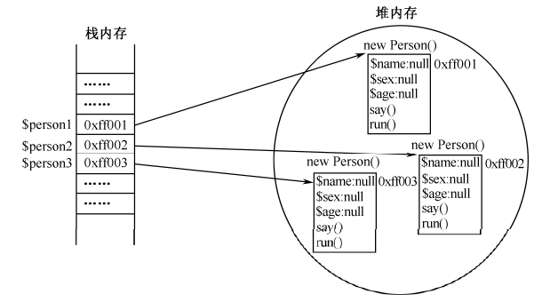

1. `PHP 5`以后的版本中最大的特点就是引入了面向对象的全部机制。

2. 面向对象程序设计（`Object Oriented Programming`，`OOP`）。

3. `OOP`达到了软件工程的三个目标：重用性、灵活性和扩展性，使其编程的代码更简洁、更易于维护，并且具有更强的可重用性。建议读者在学习`PHP`面向对象程序设计时，分以下两个方向去学习：

- 面向对象技术的语法。
- 面向对象编程思想。


# 一、对象类型在内存中的分配

1. 内存在逻辑上大体分为`4`块：栈空间段、堆空间段、初始化数据段和代码段

- **栈空间段**：空间小、访问快。是一个临时数据寄存、交换的内存区，可存放临时变量。先进后出的特点适合于保存和恢复调用现场。常存储占用空间长度不变且占用空间小的数据类，如`int`、`float`、`double`、`boolean`等。

- **堆空间段**：堆用于存放进程运行中被动态分配的内存段，它的大小并不固定，可以动态扩张或缩减，用于存储数据长度可变或占用内存比较大的数据。如字符串、数组、对象。

- **初始化数据段**：初始化数据段用来存放可执行文件中已初始化的全局变量，换句话说就是存放程序静态分配的变量。

- **代码段**：代码段用来存放可执行文件的操作指令，也就是说它是可执行程序在内存中的镜像。代码段需要防止在运行时被非法修改，所以只允许读取操作，而不允许写入（修改）操作。如函数。

2. 对象存储：对象在内存中，引用名是位于栈内存中的，可以直接访问，对象的成员在堆内存中，不能直接访问，且所占空间不固定。可以通过栈内存中的对象引用名访问堆内存中对象的成员。




# 二、对象的访问

1. 访问对象中的成员，不论是通过对象名还是`$this`，都要用`->`调用。

2. `$this`：访问对象的成员，必须使用对象的`引用名->成员`，但是在对象内部，对象的引用名是访问不到的，而如果新`new`一个对象出来，则又是另一个对象，此时要用`$this`在对象内部代表当前调用该成员的对象。

3. 对象一旦被创建，在对象中的每个成员方法里都会存在一个特殊的对象引用`$this`。成员方法属于哪个对象，`$this`引用就代表哪个对象，专门用来完成对象内部成员之间的访问。


# 三、构造方法与析构方法

1. 构造方法是对象创建完成后第一个被对象自动调用的方法，常用来进行一些初始化工作。而析构方法则是对象销毁前最后一个被对象自动调用的方法，常用来做一些清理工作。

2. 构造方法：`PHP 5`以前的版本中，构造方法和类名相同，`PHP 5`中仍然可用但是使用较少了，而以后的版本中则使用`__construct()`这个构造方法了，类名发生变化时，也不需要修改构造方法。每次创建对象时就自动调用构造方法，如果不存在`__construct()`，则搜索和类名相同的构造方法。

3. `PHP`中只能有一个构造函数，可以使用默认参数。

4. 析构方法：在`PHP 5`中开始提供。当对象的引用被赋予其它的值或是在页面运行结束时，对象都会失去引用而不能再被访问，成为垃圾对象。此时`PHP`自动启动垃圾回收机制，收回垃圾对象所占的内存空间，析构方法在此前一步调用。

5. 析构方法名称固定为`__destruct()`，不能有任何参数。

6. 对象回收时，因为引用是在栈空间保存，先进后出，所以页面运行结束时，先声明的变量后释放。


# 四、封装性

1. 封装性是面向对象编程的三大特性之一。

- 独立单位：把对象的成员独立成一个不可分割的独立单位。
- 信息隐蔽：对外开放有限接口，隐藏内部细节。

2. 封装的原则就是要求对象以外的部分不能随意存取对象的内部数据（成员属性和成员方法），从而有效地避免了外部错误对它的“交叉感染”，使软件错误能够局部化，大大减小查错和排错的难度。

3. 成员没有任何修饰词的时候，默认为`public`，即为公有成员。

4. 访问私有属性：设置公有方法，在方法内对私有属性进行赋值或取值操作。一般是设置公有权限的`set`/`get`方法

5. `__set()`、`__get()`、`__isset()`、`__unset()`：

- 使用这些魔术方法时，具体操作需要用户根据自己的需求编写，但不需要直接调用，而是在特定的情况下自动调用。
- `__set($propertyName, $propertyValue)`：在类中显式声明，进行赋值操作时自动调用。
- `__get($propertyName)`：在类中显式声明，进行取值操作时自动调用。
- `__isset($propertyName)`：在类中显式声明，在对象外部可以直接通过`isset()`函数测试私有属性是否存在，系统自动调用类中的`__isset()`函数。
- `__unset($propertyName)`：在类中显式声明，在对象外部可以直接通过`unset()`函数删除对象中的私有属性，可以设置一些条件防止删除重要的私有属性。


```php
<?php
	class Person {
		private $name;
		private $age;
		private $sex;
		function __construct($name="", $age=18, $sex="男"){
			$this->name = $name;
			$this->age = $age;
			$this->sex = $sex;
		}
		function __destruct() {
			echo "对象释放了.<br>";
		}
		// 1.__set()方法在类内部显式声明，但无需调用，赋值时自动调用
		function __set($propertyName, $propertyValue) {
			// 3.分别判断每个属性名，并单独设置程序处理
			if ($propertyName == 'name') {
				if ($propertyValue == '') {
					return;
				}
			}
			if ($propertyName == 'age') {
				if ($propertyValue > 130 || $propertyValue < 0) {
					return;
				}
			}
			if ($propertyName == 'sex') {
				if ($propertyValue != '男' && $propertyValue != '女') {
					return;
				}
			}
			// 2.直接把属性值赋给对应的属性
			$this->$propertyName = $propertyValue;
		}
		// 1.__get()方法在类中显式声明，不需要显式调用
		function __get($propertyName) {
			// 2.判断属性名，并设置条件处理后返回属性值
			if ($propertyName == 'name') {
				return "保密";
			}
			if ($propertyName == "age") {
				if ($this->age > 40) {
					return $this->age - 10;
				}else {
					return $this->age;
				}
			}
			if ($propertyName == 'sex') {
				return $this->sex;
			}
		}
		// __isset()魔术方法，可以在外部直接调用isset()测试私有变量是否存在，并设置一些过滤条件
		function __isset($propertyName) {
			if ($propertyName == 'name') {
				return false;
			}
			return isset($this->$propertyName);
		}
		// __unset()魔术方法，可以在外部直接调用unset()删除私有变量，并设置一些过滤条件
		function __unset($propertyName) {
			if ($propertyName == 'name') {
				return;
			}
			unset($this->$propertyName);
		}
	}
	$person1 = new Person();
	$person1->name = "张三";
	$person1->age = 150;
	$person1->sex = '女';
	echo $person1->name."<br>";
	echo $person1->age."<br>";
	echo $person1->sex."<br>";
	var_dump(isset($person1->name));
	var_dump(isset($person1->age));
	var_dump(isset($person1->sex));
	unset($person1->name);
	unset($person1->age);
	unset($person1->sex);
?>
```


# 五、继承性

1. `PHP`只有单继承，亦即一个子类只能从一个父类中继承属性和方法。每个子类只有一个父类，但是每个父类可以有多个子类。

2. 访问控制修饰符

|                | **private** | **protected** | **public(默认)** |
| -------------- | ----------- | ------------- | ---------------- |
| 同一个类中     | √           | √             | √                |
| 类的子类中     |             | √             | √                |
| 所有的外部成员 |             |               | √                |


3. 重载：在`PHP`中同一个类里面不能有重名的函数，但是在子类中可以通过覆盖父类中的函数来实现重载，改写父类中的函数功能。比如`Person`类中的`__construct()`方法只有`$name`和`$age`，但是在`Student extends Person`类中就可以再写一个`__construct()`方法重载构造方法，可以赋更多初始值。

4. 在子类中调用父类中被子类所重载覆盖的方法：`parent::__construct()`，这就可以调用父类中被子类重载覆盖了的构造方法。

5. 子类中重载父类中的方法时，子类中的方法其权限一定不能低于父类中方法的权限。


# 六、常见关键字和魔术方法

1. `final`可以用在类或类中的方法前，但不能修饰成员属性：

- 使用`final`标识的类，不能被继承（即不能有子类）。
- 在类中使用`final`标识的成员方法，在子类中不能被覆盖（即不能被重载）。

2. `static`修饰的成员属性或者成员方法是属于类的，在所有通过该类实例化出来的对象之间共享。类似于函数的全局变量。

3. 在类外部可以用`类名::$静态成员属性名或方法名()`的形式访问静态成员，也可以使用`对象引用名::$静态成员属性名或方法名()`的方式访问静态成员，一般使用第一种。在类内部可以用`类名::$静态成员属性名或方法名()`的方式访问静态成员，也可以使用`self::$静态成员属性名或方法名()`的方式访问静态成员，一般使用第二种。

4. 在使用静态方法时需要注意，在静态方法中只能访问静态成员。因为非静态的成员必须通过对象的引用才能访问，通常是使用`$this`完成的。而静态的方法在对象不存在的情况下也可以直接使用类名来访问，没有对象也就没有`$this`引用，没有了`$this`引用就不能访问类中的非静态成员，但是可以使用类名或`self`在非静态方法中访问静态成员。

5. `const`关键字：

- 在`PHP`中定义常量通常用`define()`函数完成，但是在类中需要用`const`关键字声明常量（在类的外部也可以用`const`关键字声明常量，实际较少用）。
- `const`在类中声明的常量，其访问方式和静态成员一样，通过`类名::常量名`（类外还可以用`对象名::常量`）或者`self::常量名`的方式访问。
- 常量声明时要赋初始值，名字前不要`$`符号，通常大写。

6. `instanceof`：判断一个对象是否为某个类的实例、类的子类，还是实现了某个特定接口。

- `$man instanceof Person`：类名不要修饰符。
- 比较失败则脚本退出运行。

7. `clone`：`$person2 = clone $person1;`克隆对象的副本，副本对象和原对象完全一致，且相互独立，即栈空间的对象引用名和堆空间的对象实例都完全独立。如果通过`$person2 = $person1`的方式赋值，只是产生了同一个对象的多个引用名，即栈空间的对象引用名不相同，但是都指向同一个堆空间的对象实例。

- 如果需要对克隆后的副本对象在克隆时重新为成员属性赋初值，则可以在类中声明一个魔术方法`__clone()`。该方法是在对象克隆时自动调用的，所以就可以通过此方法对克隆后的副本重新初始化。
- `__clone()`方法不需要任何参数，该方法中自动包含`$this`对象的引用，`$this`是副本对象的引用。
- `clone`关键后面的对象属于哪个类，那么就会自动调用该类中的`__clone()`魔术方法，而在`__clone()`魔术方法中就可以对副本对象属性进行新的初始化赋值。

8. `__toString()`：如果`$p = new Person()`，然后直接输出`$p`会报错，因为`$p`相当于一个指针，保存的是一个地址。此时如果在类中声明一个`__toString()`方法，在其中经过按需处理后返回一个字符串，再`echo $p`是不会报错的。

- 在类中定义了`__toString()`方法，然后输出`echo $p`时，会自动调用该魔术方法。
- `__toString()`方法一般返回的字符串是对象中多个属性值连接而成的。

9. `__debugInfo()`：结合`var_dump()`使用

- 直接使用`var_dump()`输出对象时，会输出对象中默认的属性和值。
- 如果在类中定义了`__debugInfo()`魔术方法，一般会在其中处理后返回一个数组。

10. `__call()`：对象调用类中不存在的方法时，自动调用该魔术方法，需要显式声明。

- 有两个参数，第一个接收不存在的方法名，第一个把参数列表作为数组接收。
- 在`PHP`的新版中新增加了`__callStatic()`方法，只用于静态类方法，当尝试调用类中不存在的静态方法时，`__callStatic()`魔术方法将被自动调用，和`__call()`方法的用法相似。
- `__call()`方法在实际调用中，一是进行提示调用的方法名不存在，二是进行另外的处理，如组合`$sql`语句等。
- 所以凡是用到`__call()`方法的位置都会返回调用该方法的对象，这样就可以继续调用该对象中的其他成员，形成连贯操作。

```php
<?php
	// 声明一个DB类(数据库操作类)的简单操作模型
	class DB {
		// 声明一个私有成员属性数组，主要是通过下标来定义可以参加连贯操作的全部方法名称
		private $sql = array(
			"field" => "",
			"where" => "",
			"order" => "",
			"limit" => "",
			"group" => "",
			"having" => ""
		);
		// 连贯操作调用field()、where()、order()、limit()、group()、having()方法，组合sql语句
		function __call($methodName, $args) {
			// 将第一个参数(代表不存在方法的名字)全部转为小写，获取方法名
			$methodName = strtolower($methodName);
			// 如果调用的方法名和成员属性数组$sql下标相对应，则将第二个参数赋给数组中下标对应的元素
			if (array_key_exists($methodName, $this->sql)) {
				$this->sql[$methodName] = $args[0];
			}else {
				echo "调用类".__CLASS__.'中的方法'.$methodName."()不存在。<br>";
			}
			// 返回自己的对象，则可以继续调用本对象中的方法，形成连贯操作
			return $this;
		}
		// 简单应用，没有实际意义，只是输出连贯操作后组合的一条SQL语句，是连贯操作最后调用的一个方法
		function select() {
			echo "select from {$this->sql['field']} user {$this->sql['where']} {$this->sql['order']} {$this->sql['limit']} {$this->sql['group']} {$this->sql['having']}";
		}
	}
	$db = new DB();
	// 连贯操作，也可以分为多行连续调用多个方法
	$db -> field('sex, count(sex)')
		-> where('where sex in ("男", "女")')
		-> group('group by sex')
		-> having('having avg(age) > 25')
		-> select();
	// 如果调用方法不存在，也会有提示，下面演示的就是调用一个不存在的方法query()
	$db->query();
?>
```


# 七、单态设计模式

1. 单态设计模式是为了保证在面向对象编程设计中，一个类只能有一个实例化对象存在。

2. `PHP`作为脚本语言，每次访问都是一次独立执行的过程，比如建立目录、连接数据库等，而在这个过程中一个类有一个实例化对象就足够了。

3. 在实际开发中，连接数据库执行多条`sql`语句，通过单态设计模式，只需要实例化一次对象，既可以提高效率，也因为限制了实例化对象的个数而可以节约内存。

4. 要编写单态设计模式，就必须让一个类只能实例化一个对象；而要想让一个类只能实例化一个对象，就先要让一个类在外部不能实例化对象。

```php
<?php
	/**
	* 声明一个单态类，用于演示单态模式的使用
	* */ 
	class DB {
		// 3. 在声明一个成员属性接收实例化的对象，因为在静态成员方法中只能访问静态成员属性，所以该属性要是static的
		// 3.1 同时不想被外部直接访问，需要声明为私有成员属性
		private static $obj = null;
		// 1. 给构造方法添加private关键字，使得在类的外部不能对该类实例化对象
		private function __construct() {
			// 在这个方法中完成一些数据库的连接操作
			echo "数据库连接成功！";
		}
		/**
		* 2. 在类的内部方法中实现唯一一个实例化对象
		* 2.1 首先声明一个成员方法，在该成员方法中实现本类的实例化
		* 2.2 在类的外部由于缺少实例化的对象，就只能通过类名::方法名()的方式调用本方法
		* 2.3 所以本方法也必须是静态方法，需要static修饰
		*/
		static function getInstance() {
			// 实现单态模式的关键步骤，先判断是否存在实例化对象，是就返回，否则
			// 就创建一个返回，保证了无论调用多少次本方法都只创建一个实例化对象
			if (is_null(self::$obj)) {
				self::$obj = new self();
			}
			return self::$obj;
		}
		// 4. 执行$sql操作
		function query($sql) {
			echo $sql;
		}
	}
	// 5. 只能使用静态方法getInstance()去获取DB类的对象
	$db = DB::getInstance();
	// 6. 访问对象中的成员方法
	$db->query("select * from user");
?>
```


# 八、自动加载类

1. 实际开发中，每个类一般都是在一个单独的文件中。如果使用当前文件中未定义的类创建对象时，要先加载该类所在的文件：

- 通过`include()`包含该类所在的源文件，往往会导致在本文件开头含有多个`include()`函数，繁琐且易出错。
- `PHP`提供了类的自动加载功能，当使用一个`PHP`没有组织到的类时，它会寻找一个名为`__autoload()`的全局函数（不是在类中声明的函数）。如果存在这个函数，`PHP`会用一个参数来调用它，参数即类的名称。
- 更多时候通过`spl_autoload_register()`函数加载。
- `https://learnku.com/articles/4681/analysis-of-the-principle-of-php-automatic-loading-function#e36732`

```php
<?php
	function __autoload($className) {
		require_once(strtolower($className).".class.php");
	}
	// User类不存在则自动调用__autoload方法，并将类名User作为参数传入
	$obj = new User();
	function spl_autoload_register(function ($className) {
		require_once(strtolower($className).".class.php");
	})
	// 不存在User类时，自动调用spl_autoload_register()方法，把类名User作为参数传入
	$user = new User();
?>
```


# 九、对象串行化

1. 类实例化后的对象是有生命周期的，有时候需要保存这个对象，就可以对其进行串行化。对象通过写出描述自己状态的数值来记录自己，这个过程称为对象的串行化（`Serialization`），这会把整个对象转换为二进制字符串。逆过程为反串行化。

2. 在两种情况下必须进行对象的串行化：

- 对象需要在网络中传输时，将对象串行化成二进制字符串后在网络中传输。
- 对象需要持久保存时，将对象串行化后写入文件或数据库中。

3. 串行化调用`serialize()`方法，反串行化调用`unserialize()`方法。

```php
// person.class.php
<?php
	class Person {
		var $name;
		var $age;
		var $sex;
		function __construct($name, $age, $sex) {
			$this->name = $name;
			$this->age = $age;
			$this->sex = $sex;
		}
		function say() {
			echo $this->name."<br>".$this->age."<br>".$this->sex."<br>";
		}
	}
?>
```


```php
// serialize.php
<?php
	include "person.class.php";
	$person = new Person("张三", 20, '男');
	// 先把$person对象串行化
	$person_string = serialize($person);
	// 再将串行化后的对象保存到文件中
	file_put_contents('file.txt', $person_string);
?>
```

```php
// unserialize.php
<?php
	require "person.class.php";
	// 从文件中读取串行化后的数据
	$person_string = file_get_contents('file.txt');
	// 对串行化后的数据进行反串行化，得到的结果就是类实例化出来的对象
	$person = unserialize($person_string);
	// 该对象和直接new实例化出来的对象完全一致
	$person->say();
?>
```

4. `__sleep()`和`__wakeup()`：

- 串行化对象时`serialize()`函数会自动调用类中的`__sleep()`函数，`__sleep()`方法不需要接受任何参数，但需要返回一个数组，在数组中包含需要串行化的属性。未被包含在数组中的属性将在串行化时被忽略。如果没有在类中声明`__sleep()`方法，对象中的所有属性都将被串行化。
- 在调用`unserialize()`函数反串行化对象时，则会自动调用对象中的`__wakeup()`方法，用来在二进制串重新组成一个对象时，为新对象中的成员属性重新初始化。

```php
<?php
	class Person {
		var $name;
		var $age;
		var $sex;
		function __construct($name, $age, $sex) {
			$this->name = $name;
			$this->age = $age;
			$this->sex = $sex;
		}
		function say() {
			echo $this->name."<br>".$this->age."<br>".$this->sex."<br>";
		}
		// 使用serialize()函数将对象串行化的时候自动调用，返回一个数组，对其中指定的变量串行化
		function __sleep() {
			$arr = array("name", "age");
			return $arr;
		}
		// 使用unserialize()将串行化后的对象反串行化时自动调用，可以为对象的属性重新赋值
		function __wakeup() {
			$this->name = '李四';
			$this->age = 30;
		}
	}
	$person = new Person('张三', 18, '女');
	// 将对象串行化时自动调用__sleep()魔术方法
	$person_string = serialize($person);
	file_put_contents('file1.txt', $person_string);
	// 将对象反串行化时自动调用__wakeup()魔术方法
	$person_string1 = file_get_contents("file1.txt");
	$person1 = unserialize($person_string1);
	$person1->say();
?>
```

5. 可以给`unserialize()`指定第二个参数来过滤不可靠的数据。`allowed_classes`是一个二维数组。

```php
// 把allowed_classes指定为false则不接收任何对象反序列化
$person1 = unserialize($person_string1, ['allowed_classes'=>false]);
// 把allowed_classes指定为true则等于省略第二个参数，可以接受任何对象数据反序列化
$person1 = unserialize($person_string1,['allowed_classes'=>true]);
// 把allowed_classes指定为Person1则只允许来自Person1类的对象反序列化
$person1 = unserialize($person_string1, ['allowed_classes'=>['Person1']]);
```


# 十、抽象类和接口

1. 抽象类

- 抽象类是一种特殊的类，接口是一种特殊的抽象类。

- 抽象方法：`abstract function funcName();`这样就是声明一个抽象方法，没有花括号和函数体。所以抽象类可以有参数，但没有返回值。

- 有抽象方法的类就是抽象类，抽象类也要用`abstract`修饰。抽象类中可以有不是抽象的成员属性和方法，但是访问权限不能用`private`关键字修饰为私有的，只能是默认的`public`或`protected`。

- 抽象类中包含有未实现的抽象方法，所以不能被实例化，即无法创建对象。但因为继承的关系，相当于为所有的子类或子类的子类都定义了一个公共接口，将其中的操作都交给子类去实现。

- 抽象类更像是一个模板，给子类定义一种规范，要求子类去遵守。

- 当子类继承抽象类以后，就必须把抽象类中的抽象方法按照子类自己的需要去实现。子类必须把父类中的抽象方法全部实现，否则子类中还存在抽象方法，所以还是抽象类，也不能实例化对象。

- 如果子类只实现抽象父类的部分抽象方法，则子类也要声明为`abstract class`，否则就要全部实现抽象父类中的全部抽象方法。如果实现了全部抽象方法，则子类不需要用`abstract`修饰。

2. 接口技术：

- 接口中声明的方法必须都是抽象方法，另外不能在接口中声明变量，只能使用`const`关键字声明为常量的成员属性，而且接口中的所有成员都必须有`public`的访问权限。

- 接口中所有的方法都要求是抽象方法，所以就不需要在方法前使用`abstract`关键字标识了。在接口中也不需要显式地使用`public`访问权限进行修饰，因为默认权限就是`public`的，也只能是`public`的。

- 接口和抽象类一样，不能实例化对象。需要通过子类来实现。但可以直接使用接口名称在接口外面去获取常量成员的值。

- 可以使用`extends`关键字让一个接口去继承另一个接口，实现接口之间的扩展。

- 一个接口继承另一个接口只能用`extends`，一个抽象类或者类实现一个接口那就要用`implements`，一个类如果实现接口中的全部抽象方法，那这个类就用`class`，如果只是部分实现这个接口，那就必然还要继承部分抽象方法，则为抽象类，必须要用`abstract class`。

- `PHP`是单继承的，一个类只能有一父类，但是一个类可以实现多个接口。将要实现的多个接口之间使用逗号分隔开，在子类中要将所有接口中的抽象方法全部实现才可以创建对象。

- 实现多个接口使用`implements`关键字，同时还可以使用`extends`关键字继承一个类，即在继承一个类的同时实现多个接口。但一定要先使用`extends`继承一个类，再使用`implements`实现多个接口。

3. 接口技术的使用，对于某些已经开发好的系统，重新进行结构上的大调整不太现实，这时可以通过定义一些接口并追加相应的实现来完成功能结构的扩展。

4. 通过类不论是继承抽象类，还是实现接口，只要还有抽象方法未实现，那就必须把该类声明为`abstract`类。


# 十一、多态性

1. `PHP`中的多态性就是指方法的重写，重写方法可以通过继承父类中的方法进行子类重写，也可以通过定义抽象类或者接口实现。

2. 对一个接口或者抽象类，可以在不同的子类中多态性实现，调用的时候可以分别单独的调用，也可以通过一个第三方类调用。如下：

```php
// 接口在多个子类中多态性实现，通过同一个类调用
<?php
	interface Usb {
		function run();
	}
	//传入不同子类的对象，调用的是接口中声明的抽象方法，即子类中具体实现的方法
	class Computer {
		function useUsb($usb) {
			$usb -> run();
			var_dump($usb);
		}
	}
	class Ukey implements Usb {
		function run() {
			echo "运行USB键盘设备<br>";
		}
	}
	class Umouse implements Usb {
		function run() {
			echo "运行USB鼠标设备<br>";
		}
	}
	class Ustore implements Usb {
		function run() {
			echo "运行USB存储设备<br>";
		}
	}
	$computer = new Computer();
	$computer->useUsb(new Ukey());
	$computer->useUsb(new Umouse());
	$computer->useUsb(new Ustore());
?>
```


# 十二、`Trait`特性

1. `trait`和类的使用基本一致，但无法实例化，只能通过`use`在类中或者其它`trait`中混入使用`trait`。

2. `use trait`在类中或者其它`trait`中，相当于把`trait`中的代码复制到当前位置。多个`trait`之间用逗号隔开即可。

3. 多个`trait`之间难免会产生冲突，可以用`insteadOf`指定使用某个`trait`中的方法。

4. `trait`中可以声明抽象方法，但使用它的类不需要声明为抽象类，不过必须实现其中的全部抽象方法才能实例化对象。

5. 引入多个`trait`时，`trait`、父类、子类的属性不能重复，如果方法重复，通过`insteadOf`指定使用某个`trait`中的方法。

6. `Trait`会覆盖调用子类继承的父类方法，子类自身定义的方法会覆盖`Trait`中的方法。

7. `Trait`无法像类一样使用`new`实例化，因为`Trait`就是用来混入类中使用的，不能单独使用。

8. `Trait`支持修饰词，例如`final`、`static`、`abstract`。


```php
<?php
	trait Demo1 {
		var $name = '张三';
		function say() {
			echo $this->name."<br>";
		}
	}
	trait Demo2 {
		var $age = 20;
		function say() {
			echo $this->age."<br>";
		}
	}
	trait Demo3 {
		var $sex = '男';
		// trait、父类、子类中的成员属性都不能重复
		// var $name = '李四';
		function say() {
			echo $this->sex."<br>".$this->name."<br>";
		}
	}
	class Demo {
		// trait、父类、子类中的成员属性都不能重复
		// var $name = '赵六';
		use Demo1, Demo2, Demo3 {
			// trait、父类、子类中的方法可以重复，通过下面的方式指定使用某个trait中的方法
			Demo3::say insteadOf Demo1, Demo2;
			Demo3::say as cool;
		}
	}
	class Parents {
		function say() {
			echo "hello";
		}
	}
	trait DemoTest {
		function say() {
			echo "World";
		}
	}
	class Son extends Parents {
		use DemoTest;
		// 如果没有下面的say，则执行上面use DemoTest中的say
		// trait会覆盖父类中的方法，本类中的方法会覆盖trait中的方法
		function say() {
			echo "Son";
		}
	}
	$obj = new Demo();
	$obj->say();
	$demo = new Son();
	$demo->say();
?>
```


# 十三、匿名类

1. 匿名类就是通过`$p = new class{};`直接创建的类，是一个赋值语句，所以最后要加一个分号。

2. 要传值进去就只能通过在`class`后面加括号，在里面直接传参，匿名类里面的`__construct()`构造方法会接收这些参数，可以在构造方法里面把实参传给成员属性。

3. 匿名类也可以扩展`extends`其他类，实现`implements`其它接口，以及使用`trait`。

4. 在一个类的内部声明匿名类，那么匿名类无法访问外部类的`private`、`protected`方法或属性，为了访问外部类`protected`属性或方法，匿名类可以继承此外部类。为了使用外部类的`private`属性，必须通过构造器传进来。

5. 应用：某个类只需要使用一次，“用后即焚”，就是用匿名类。通常用在一个方法需要接收一个对象参数时，这时可以直接在参数中创建匿名类对象传入。


